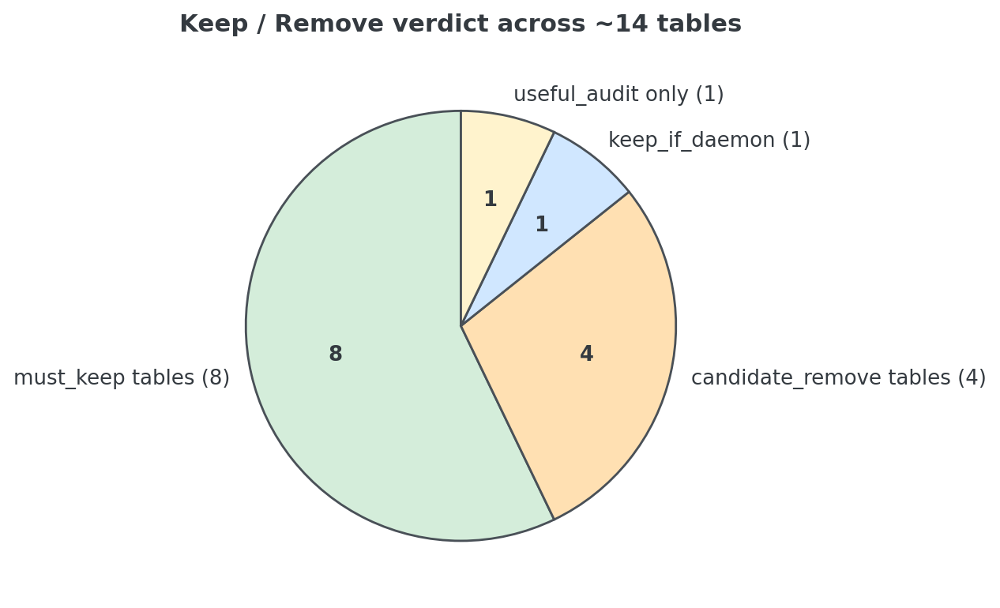
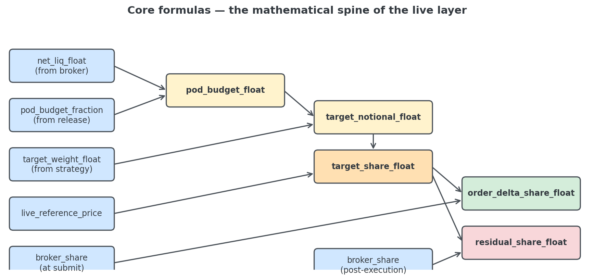
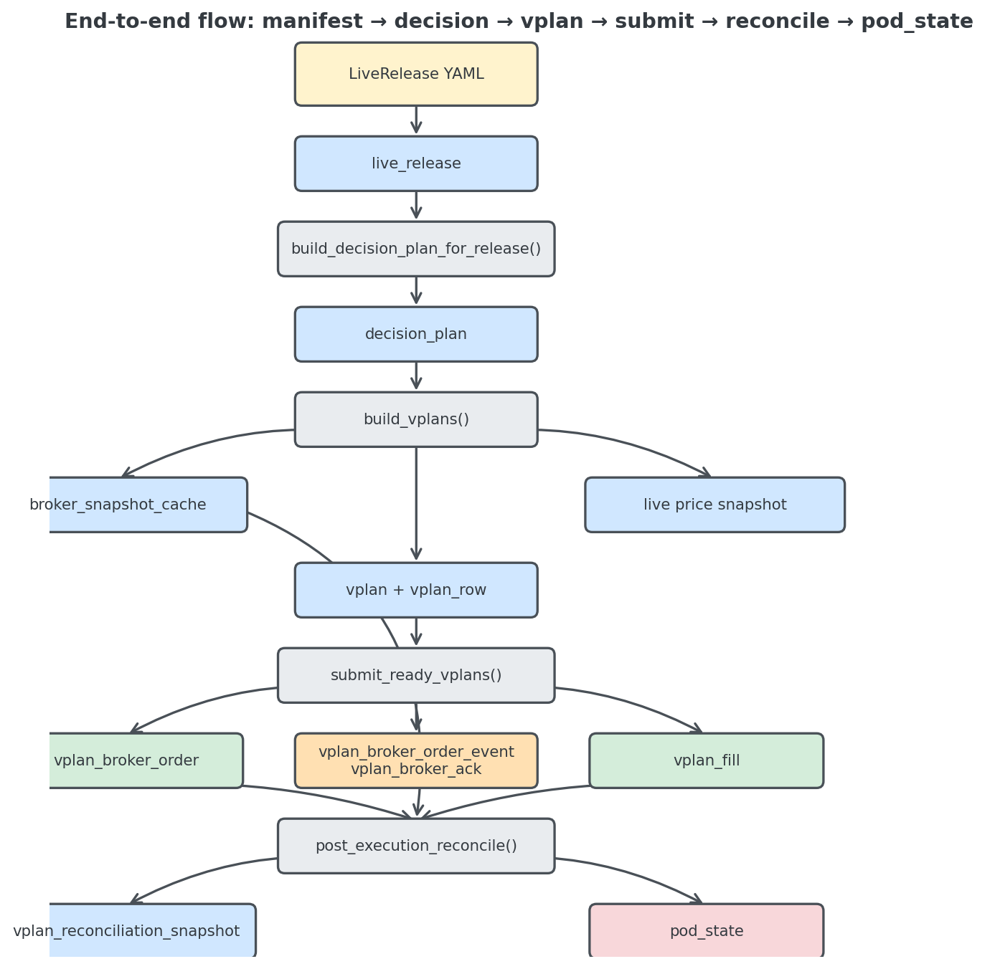
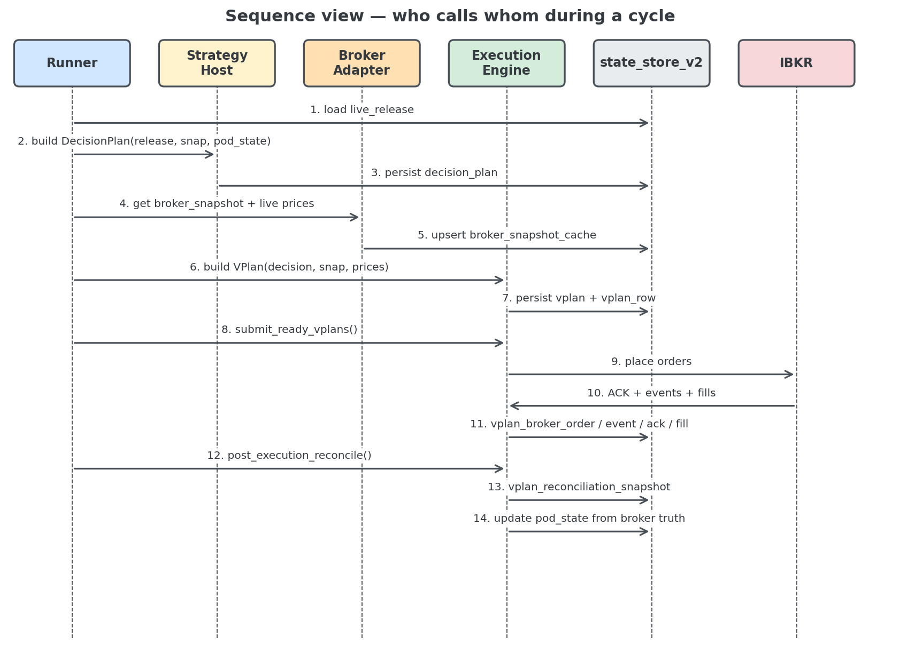
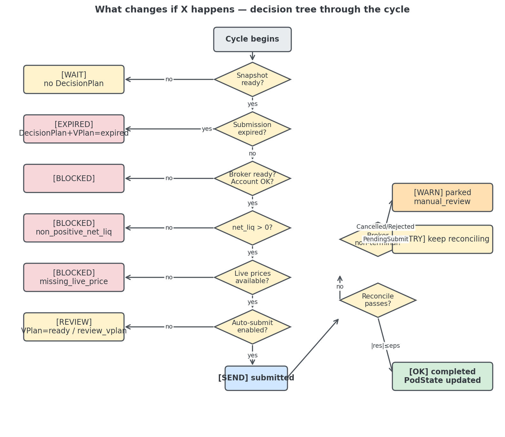
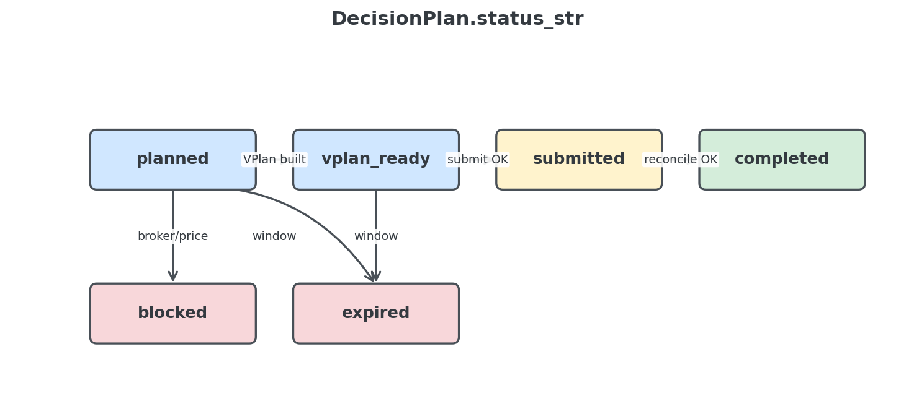
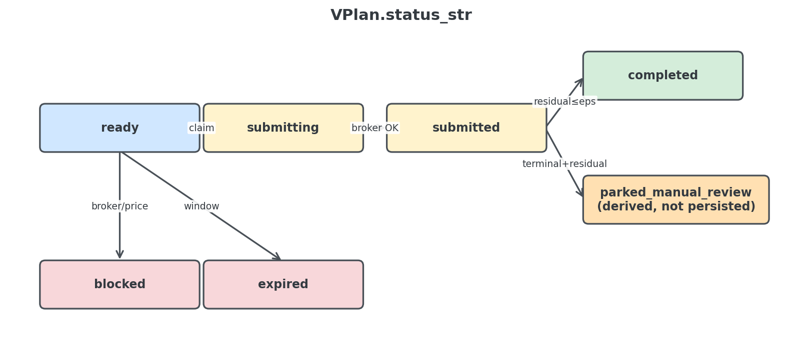
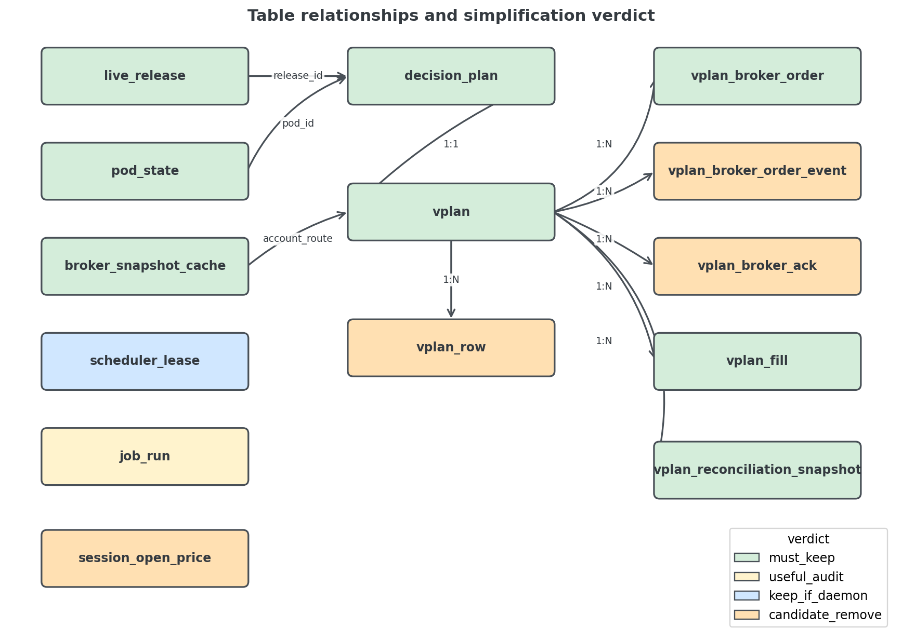
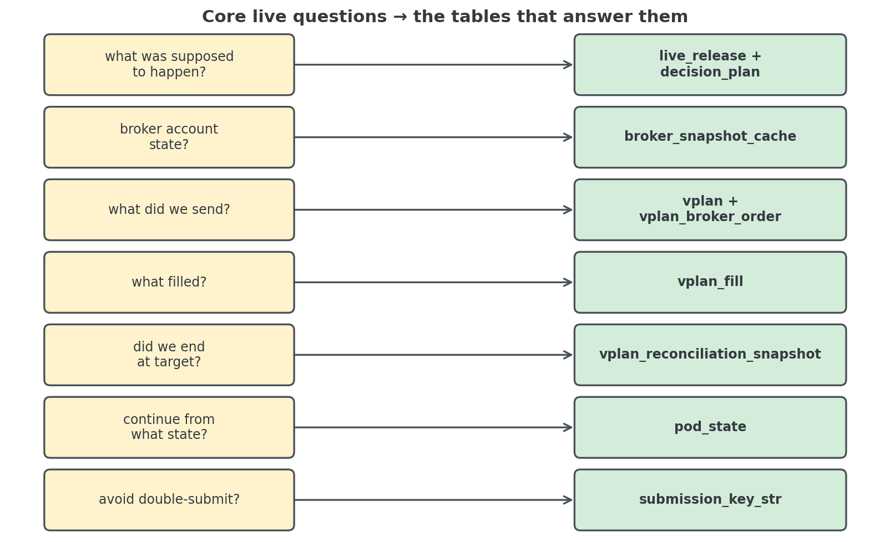
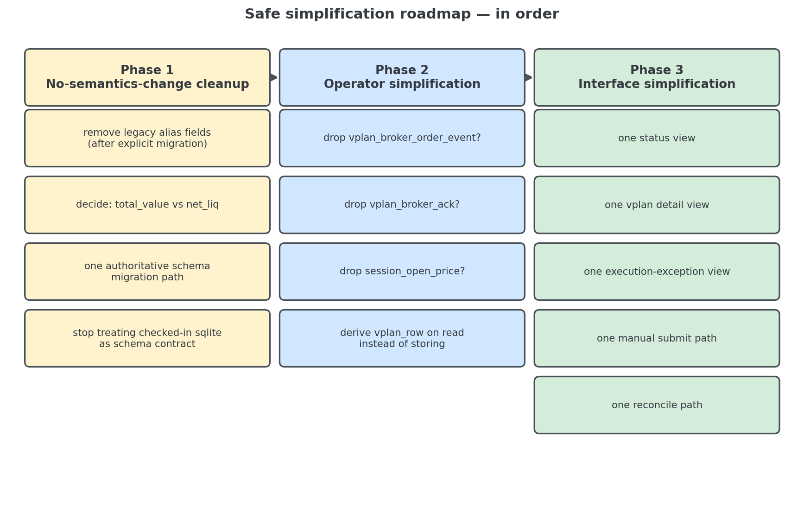

# Live Flow & SQL Simplification Review

> **Reviewer's bottom line:** the live layer is **not nonsense**, but it is also **not yet optimized for a single human operator**.
>
> - ✅ Core trading semantics → mostly correct
> - ⚠️ Audit shell + persistence shell → somewhat too heavy

---

## 📋 TL;DR Card

| Question | Answer |
|---|---|
| Is the architecture correct? | **Yes** — DecisionPlan / VPlan / Reconcile / PodState split is sound |
| Where is the weight? | Too many audit surfaces, duplicated JSON-vs-row persistence, schema drift |
| Can we simplify? | **Yes**, but in the right order (see roadmap) |
| What must never be simplified? | Broker-truth sizing, timing semantics, post-trade reconcile |



---

## 🎯 Core Formulas — Do Not Break These

These five formulas are the *mathematical spine* of the live layer. Any simplification must preserve them bit-for-bit.

```text
pod_budget_float              = net_liq_float * pod_budget_fraction_float
target_notional_float(asset)  = target_weight_float(asset) * pod_budget_float
target_share_float(asset)     = floor(target_notional_float(asset) / live_reference_price_float(asset))
order_delta_share_float(asset)= target_share_float(asset)     - broker_share_float_submit(asset)
residual_share_float(asset)   = target_share_float(asset)     - broker_share_float_post_execution(asset)
```



---

## 🧭 Document Purpose

```text
understand what exists now
decide what is essential
identify what is likely simplifiable
without damaging live-trading correctness
```

---

## 💭 Honest Opinion

The current live system is **not already optimized for a person like you**. But the core concepts are correct and worth protecting.

### ✅ Keep these concepts

| Concept | Why it matters |
|---|---|
| `LiveRelease` | Frozen manifest truth the live layer runs from |
| `DecisionPlan` | What the strategy wanted, before broker reality |
| `VPlan` | What we should actually send given current broker truth |
| Broker-truth sizing | Protects against mis-sizing vs strategy's memory |
| Post-trade reconciliation | Only way to *know* execution actually finished |
| Persisted `PodState` | Enables restart safety |
| Duplicate-submit protection | Prevents double-firing the same cycle |

### ⚠️ Excess weight lives here

- Too many audit surfaces for one operator
- Row-level history that may be more forensic than practical
- Duplicated JSON-vs-row persistence
- Schema drift / migration complexity

### 🧠 Mental model

```text
do NOT simplify by collapsing important concepts
DO   simplify by removing duplicated audit machinery and stale compatibility layers
```

---

## 🔒 Non-Negotiable Assumptions

> These five guarantees must survive any simplification pass.

### 1. Decision semantics must stay separate from execution semantics

```text
DecisionPlan_obj = what the strategy wanted
VPlan_obj        = what we should send given current broker truth
```

If you collapse these into one object, you lose the ability to answer:

> *Did the strategy decide wrong — or did the broker/account state change after the decision?*

### 2. Live sizing must start from broker truth

```text
order_delta_share_float(asset) = target_share_float(asset) - broker_share_float_submit(asset)
```

**Not optional.**

### 3. Post-execution reconciliation must remain broker-truth-based

```text
residual_share_float(asset) = target_share_float(asset) - broker_share_float_post_execution(asset)
```

Without this, we stop knowing whether execution actually finished.

### 4. Timing semantics must remain explicit

At minimum, these timestamps must remain explicit:

- `signal_timestamp_ts`
- `submission_timestamp_ts`
- `target_execution_timestamp_ts`

### 5. Simplification must not weaken live-vs-backtest meaning

The strategy meaning must still be:

```text
decision   at approved snapshot
execution  from current broker/account truth
reconcile  after broker outcome
```

---

## 🔄 End-to-End Flow

### High-level path

```text
LiveRelease → DecisionPlan → BrokerSnapshot + LivePriceSnapshot
            → VPlan        → BrokerOrderRequest
            → BrokerOrder/Fill truth
            → Reconcile    → PodState
```

### Detailed flow



### Sequence view (who calls whom)



### Stage by stage

| # | Stage | Inputs | Outputs | Formula |
|---|---|---|---|---|
| 1 | **Release load** | manifest YAML | `live_release` row | tells the live layer what to run, when, and how |
| 2 | **Decision build** | `LiveRelease`, approved snapshot, `PodState` | frozen `DecisionPlan` | `DecisionPlan = f(LiveRelease, signal_ts, PodState)` |
| 3 | **VPlan build** | `DecisionPlan`, broker snapshot, live prices | executable `VPlan` | `VPlan = f(DecisionPlan, BrokerSnapshot_submit, LivePriceSnapshot_submit)` |
| 4 | **Submit** | `VPlan` | broker order + event + ACK + fills | `BrokerOrderRequest_list = f(VPlan)` |
| 5 | **Reconcile** | target shares, broker positions post-execution | `ReconciliationResult` | `Reconcile = f(target_share_map, broker_position_map_post_execution)` |
| 6 | **PodState update** | broker snapshot post-execution, strategy state | `PodState_next` | `PodState_next = f(BrokerSnapshot_post, strategy_state)` |

#### Stage 1 — Release load

The manifest tells the live layer:

- which pod to run
- on which account
- on which exchange calendar
- when it may **decide**
- when it may **execute**
- whether it **auto-submits** or waits for you

#### Stage 2 — Decision build

Writes a **frozen strategy decision**. Does *not yet* know current broker net liq or current broker shares at submit time.

#### Stage 3 — VPlan build

The **crucial bridge** from strategy intent to executable shares. At this point:

```text
target_share_float(asset)      is finalized
order_delta_share_float(asset) is finalized
```

#### Stage 4 — Submit

The system:
- claims the `VPlan` for submission
- writes broker order records
- writes broker order events
- writes broker ACK evidence
- may already write fills if some are known immediately

#### Stage 5 — Reconcile

Decides one of:
- ✅ execution completed
- ⏳ execution still in progress
- 🚨 execution exception → parked for manual review

#### Stage 6 — PodState update

Enables the strategy to continue from **live reality** after restart.

---

## 🚨 What Changes If X Happens



### Reference — condition → result table

| Condition | Result | Operator effect |
|---|---|---|
| snapshot not ready | no DecisionPlan build | wait |
| submission window expired | `DecisionPlan.status = expired`, `VPlan.status = expired` | no trading for stale cycle |
| broker not ready / session mismatch | `DecisionPlan.status = blocked` | no VPlan, no submit |
| `net_liq_float <= 0` | `reason_code = non_positive_net_liq`, blocked | no trading |
| missing live price | `reason_code = missing_live_price`, blocked | no trading |
| auto-submit disabled | `VPlan.status = ready`, `next_action = review_vplan` | operator reviews + submits |
| submit succeeds | `VPlan: ready → submitting → submitted`, `DecisionPlan → submitted` | normal path |
| reconcile passes | `VPlan → completed`, `DecisionPlan → completed`, `PodState` updated | done |
| reconcile fails, broker non-terminal | keep retrying `post_execution_reconcile` | wait |
| reconcile fails, broker terminal | parked for manual review | investigate |

### Park rule (the recent paper-account fix)

```text
terminal_unresolved_bool =
    any(
        abs(residual_share_float(asset)) > eps_float
        AND latest_broker_order_status_str(asset) in {
            "Cancelled", "ApiCancelled", "Rejected", "Expired", "Inactive"
        }
    )
```

When this is true:

```text
VPlan.status_str                 stays 'submitted'
derived next_action_str      →   manual_review
derived reason_code_str      →   execution_exception_parked
scheduler                    →   stops hot-loop reconcile revisits
```

---

## 🎚️ State Machines

### `DecisionPlan.status_str`



### `VPlan.status_str`



---

## ⚠️ Schema Authority Note

As of `2026-04-21`, there is an important distinction:

```text
✅ authoritative current schema   = code in alpha/live/state_store_v2.py
⚠️ checked-in live_state.sqlite3  = may lag that schema
```

Observed drift in the checked-in snapshot:

- `vplan_broker_ack` → not present in checked-in DB snapshot
- `vplan` table → lags newer ACK-related columns
- `vplan_broker_order` + `vplan_broker_order_event` → lag some newer correlation columns

**Recommendation:**

```text
treat state_store_v2.py as the live schema contract
do NOT treat the checked-in sqlite file as the schema contract
```

---

## 🏷️ Simplification Legend

| Label | Meaning | Emoji |
|---|---|---|
| `must_keep` | Removing this breaks live semantics or restart safety | 🟢 |
| `useful_audit` | Not core semantics, but useful for debugging / operator trust | 🟡 |
| `keep_if_daemon` | Useful only if you keep the long-running scheduler/lease model | 🔵 |
| `candidate_remove` | Realistic simplification target | 🟠 |
| `legacy_alias` | Duplicated historical field, strong cleanup candidate | 🔴 |

---

## 🗄️ SQL Overview

### Table relationships (ER diagram)



### All current tables

**Shared core**
- 🟢 `live_release`
- 🟢 `pod_state`
- 🟡 `job_run`
- 🔵 `scheduler_lease`

**Live v2 execution**
- 🟢 `decision_plan`
- 🟢 `vplan`
- 🟠 `vplan_row`
- 🟢 `broker_snapshot_cache`
- 🟢 `vplan_reconciliation_snapshot`
- 🟢 `vplan_broker_order`
- 🟠 `vplan_broker_order_event`
- 🟠 `vplan_broker_ack`
- 🟢 `vplan_fill`
- 🟠 `session_open_price`

> Code still knows legacy v1 execution names, but the v2 flow above is the current reality.

---

## 📖 Field-By-Field SQL Guide

### 🟢 `live_release`

> **Purpose:** persist the manifest truth the live layer should run.
> **Verdict:** keep.

| Field | Type | Meaning | Source | Verdict |
|---|---|---|---|---|
| `release_id_str` | `TEXT` | stable release identifier | manifest | 🟢 must_keep |
| `pod_id_str` | `TEXT` | stable pod / sleeve identifier | manifest | 🟢 must_keep |
| `user_id_str` | `TEXT` | logical owner | manifest | 🟡 useful_audit |
| `account_route_str` | `TEXT` | broker account route | manifest | 🟢 must_keep |
| `source_path_str` | `TEXT` | manifest file path | manifest | 🟡 useful_audit |
| `strategy_import_str` | `TEXT` | strategy adapter import path | manifest | 🟢 must_keep |
| `mode_str` | `TEXT` | `paper` or `live` | manifest | 🟢 must_keep |
| `session_calendar_id_str` | `TEXT` | exchange calendar id | manifest | 🟢 must_keep |
| `signal_clock_str` | `TEXT` | signal timing policy | manifest | 🟢 must_keep |
| `execution_policy_str` | `TEXT` | execution timing policy | manifest | 🟢 must_keep |
| `data_profile_str` | `TEXT` | data contract id | manifest | 🟢 must_keep |
| `risk_profile_str` | `TEXT` | risk label | manifest | 🟡 useful_audit |
| `enabled_bool` | `INTEGER` | release kill switch | manifest | 🟢 must_keep |
| `params_json_str` | `TEXT` | strategy parameters | manifest | 🟢 must_keep |
| `pod_budget_fraction_float` | `REAL` | share of broker net liq reserved for pod | manifest | 🟢 must_keep |
| `auto_submit_enabled_bool` | `INTEGER` | auto-submit vs manual review path | manifest | 🟢 must_keep |
| `updated_timestamp_str` | `TEXT` | last upsert time | runner | 🟡 useful_audit |

### 🟢 `pod_state`

> **Purpose:** persist the pod's live memory across runs and restarts.
> **Verdict:** keep.

| Field | Type | Meaning | Source | Verdict |
|---|---|---|---|---|
| `pod_id_str` | `TEXT` | pod primary key | runner | 🟢 must_keep |
| `user_id_str` | `TEXT` | owner id | runner | 🟡 useful_audit |
| `account_route_str` | `TEXT` | broker account used for this state | runner | 🟢 must_keep |
| `position_json_str` | `TEXT` | latest broker-backed position map | broker / reconcile | 🟢 must_keep |
| `cash_float` | `REAL` | latest broker-backed cash | broker / reconcile | 🟢 must_keep |
| `total_value_float` | `REAL` | latest broker-backed total value / net liq proxy | broker / reconcile | 🟢 must_keep |
| `strategy_state_json_str` | `TEXT` | persisted strategy memory | strategy host / reconcile | 🟢 must_keep |
| `updated_timestamp_str` | `TEXT` | last state write time | runner | 🟡 useful_audit |

### 🟡 `job_run`

> **Purpose:** record CLI command runs and outcomes.
> **Verdict:** useful, but optional for a very lean setup.

| Field | Type | Meaning | Source | Verdict |
|---|---|---|---|---|
| `job_run_id_int` | `INTEGER` | run primary key | state store | 🟡 useful_audit |
| `command_name_str` | `TEXT` | command that was executed | CLI | 🟡 useful_audit |
| `started_timestamp_str` | `TEXT` | run start time | CLI | 🟡 useful_audit |
| `completed_timestamp_str` | `TEXT` | run finish time | CLI | 🟡 useful_audit |
| `status_str` | `TEXT` | `running/succeeded/failed` | CLI | 🟡 useful_audit |
| `detail_json_str` | `TEXT` | structured result payload | CLI | 🟠 candidate_remove |

### 🔵 `scheduler_lease`

> **Purpose:** prevent two scheduler loops from mutating the same live DB at once.
> **Verdict:** keep only if you keep the long-running scheduler daemon.

| Field | Type | Meaning | Source | Verdict |
|---|---|---|---|---|
| `lease_name_str` | `TEXT` | lease key | scheduler | 🔵 keep_if_daemon |
| `owner_token_str` | `TEXT` | current lease owner token | scheduler | 🔵 keep_if_daemon |
| `acquired_timestamp_str` | `TEXT` | lease acquire time | scheduler | 🔵 keep_if_daemon |
| `expires_timestamp_str` | `TEXT` | lease expiry time | scheduler | 🔵 keep_if_daemon |

### 🟢 `decision_plan`

> **Purpose:** store the frozen strategy decision before broker-truth sizing.
> **Uniqueness:** `UNIQUE(pod_id_str, signal_timestamp_str, execution_policy_str)`
> **Verdict:** keep the table; clean up alias fields later.

| Field | Type | Meaning | Source | Verdict |
|---|---|---|---|---|
| `decision_plan_id_int` | `INTEGER` | plan primary key | state store | 🟢 must_keep |
| `release_id_str` | `TEXT` | release snapshot id | release + strategy host | 🟢 must_keep |
| `user_id_str` | `TEXT` | owner id | release + strategy host | 🟡 useful_audit |
| `pod_id_str` | `TEXT` | pod id | release + strategy host | 🟢 must_keep |
| `account_route_str` | `TEXT` | broker account route snapshot | release + strategy host | 🟢 must_keep |
| `signal_timestamp_str` | `TEXT` | approved signal timestamp | scheduler utils + strategy host | 🟢 must_keep |
| `submission_timestamp_str` | `TEXT` | earliest valid submit time | scheduler utils | 🟢 must_keep |
| `target_execution_timestamp_str` | `TEXT` | expected execution timestamp | scheduler utils | 🟢 must_keep |
| `execution_policy_str` | `TEXT` | execution timing policy snapshot | release + scheduler utils | 🟢 must_keep |
| `decision_base_position_json_str` | `TEXT` | positions seen by strategy at decision time | strategy host | 🟢 must_keep |
| `decision_book_type_str` | `TEXT` | incremental vs full-target semantics | strategy host | 🟢 must_keep |
| `entry_target_weight_json_str` | `TEXT` | canonical entry weights for incremental books | strategy host | 🟢 must_keep |
| `full_target_weight_json_str` | `TEXT` | canonical full-target weights for rebalance books | strategy host | 🟢 must_keep |
| `target_weight_json_str` | `TEXT` | legacy alias map for older code paths | strategy host | 🔴 legacy_alias |
| `exit_asset_json_str` | `TEXT` | explicit exit-to-zero asset set | strategy host | 🟢 must_keep |
| `entry_priority_json_str` | `TEXT` | ranked entry list when capital is limited | strategy host | 🟢 must_keep |
| `cash_reserve_weight_float` | `REAL` | intentionally unallocated cash share | strategy host | 🟢 must_keep |
| `preserve_untouched_positions_bool` | `INTEGER` | whether omitted holdings stay untouched | strategy host | 🟢 must_keep |
| `rebalance_omitted_assets_to_zero_bool` | `INTEGER` | whether omitted held assets get liquidated in full-target mode | strategy host | 🟢 must_keep |
| `snapshot_metadata_json_str` | `TEXT` | extra signal / snapshot audit data | strategy host | 🟡 useful_audit |
| `strategy_state_json_str` | `TEXT` | strategy memory to carry forward | strategy host | 🟢 must_keep |
| `status_str` | `TEXT` | lifecycle status | runner | 🟢 must_keep |
| `created_timestamp_str` | `TEXT` | insert time | state store | 🟡 useful_audit |
| `updated_timestamp_str` | `TEXT` | last status/update time | state store | 🟡 useful_audit |

### 🟢 `vplan`

> **Purpose:** store the concrete execution plan built from current broker truth.
> **Uniqueness:** `decision_plan_id_int` is `UNIQUE`.
> **Verdict:** keep the table — but the ACK subfields are a real simplification candidate.

| Field | Type | Meaning | Source | Verdict |
|---|---|---|---|---|
| `vplan_id_int` | `INTEGER` | vplan primary key | state store | 🟢 must_keep |
| `release_id_str` | `TEXT` | release snapshot id | execution engine | 🟢 must_keep |
| `user_id_str` | `TEXT` | owner id | execution engine | 🟡 useful_audit |
| `pod_id_str` | `TEXT` | pod id | execution engine | 🟢 must_keep |
| `account_route_str` | `TEXT` | broker account route snapshot | execution engine | 🟢 must_keep |
| `decision_plan_id_int` | `INTEGER` | parent decision plan id | execution engine | 🟢 must_keep |
| `signal_timestamp_str` | `TEXT` | copied decision signal time | execution engine | 🟢 must_keep |
| `submission_timestamp_str` | `TEXT` | valid submit time for this vplan | execution engine | 🟢 must_keep |
| `target_execution_timestamp_str` | `TEXT` | expected execution time | execution engine | 🟢 must_keep |
| `execution_policy_str` | `TEXT` | execution policy snapshot | execution engine | 🟢 must_keep |
| `broker_snapshot_timestamp_str` | `TEXT` | time of broker snapshot used for sizing | broker adapter | 🟢 must_keep |
| `live_reference_snapshot_timestamp_str` | `TEXT` | time of live price snapshot used for sizing | broker adapter | 🟢 must_keep |
| `live_price_source_str` | `TEXT` | price source label | broker adapter | 🟢 must_keep |
| `net_liq_float` | `REAL` | broker net liq at sizing time | broker adapter | 🟢 must_keep |
| `available_funds_float` | `REAL` | broker available funds at sizing time | broker adapter | 🟡 useful_audit |
| `excess_liquidity_float` | `REAL` | broker excess liquidity at sizing time | broker adapter | 🟡 useful_audit |
| `pod_budget_fraction_float` | `REAL` | pod share of net liq used in sizing | release + execution engine | 🟢 must_keep |
| `pod_budget_float` | `REAL` | computed dollar budget | execution engine | 🟢 must_keep |
| `current_broker_position_json_str` | `TEXT` | broker positions at sizing time | broker adapter | 🟢 must_keep |
| `live_reference_price_json_str` | `TEXT` | live prices used for sizing | broker adapter | 🟢 must_keep |
| `live_reference_source_json_str` | `TEXT` | per-asset price provenance | broker adapter | 🟡 useful_audit |
| `target_share_json_str` | `TEXT` | final target share map | execution engine | 🟢 must_keep |
| `order_delta_json_str` | `TEXT` | shares to actually send | execution engine | 🟢 must_keep |
| `submission_key_str` | `TEXT` | duplicate-submit guard key | runner | 🟢 must_keep |
| `status_str` | `TEXT` | lifecycle status | runner | 🟢 must_keep |
| `submit_ack_status_str` | `TEXT` | bounded ACK-check result | submit path | 🟡 useful_audit |
| `ack_coverage_ratio_float` | `REAL` | broker ACK coverage ratio | submit path | 🟠 candidate_remove |
| `missing_ack_count_int` | `INTEGER` | count of missing submit ACKs | submit path | 🟠 candidate_remove |
| `submit_ack_checked_timestamp_str` | `TEXT` | ACK-check completion time | submit path | 🟠 candidate_remove |
| `created_timestamp_str` | `TEXT` | insert time | state store | 🟡 useful_audit |
| `updated_timestamp_str` | `TEXT` | last update time | state store | 🟡 useful_audit |

### 🟠 `vplan_row`

> **Purpose:** human-readable per-asset row cache for the VPlan.
> **Verdict:** nice to have — but mostly derivable from VPlan JSON fields.

| Field | Type | Meaning | Source | Verdict |
|---|---|---|---|---|
| `vplan_row_id_int` | `INTEGER` | row primary key | state store | 🟠 candidate_remove |
| `vplan_id_int` | `INTEGER` | parent vplan id | execution engine | 🟢 must_keep |
| `asset_str` | `TEXT` | asset symbol | execution engine | 🟢 must_keep |
| `current_share_float` | `REAL` | broker shares at sizing time | execution engine | 🟠 candidate_remove |
| `target_share_float` | `REAL` | final target shares | execution engine | 🟠 candidate_remove |
| `order_delta_share_float` | `REAL` | final order delta shares | execution engine | 🟠 candidate_remove |
| `live_reference_price_float` | `REAL` | live price used for sizing | execution engine | 🟠 candidate_remove |
| `estimated_target_notional_float` | `REAL` | target share × live price | execution engine | 🟠 candidate_remove |
| `broker_order_type_str` | `TEXT` | order type for this row | execution engine | 🟠 candidate_remove |
| `live_reference_source_str` | `TEXT` | per-row price provenance | execution engine | 🟠 candidate_remove |

### 🟢 `broker_snapshot_cache`

> **Purpose:** latest known broker account truth by account route.
> **Verdict:** keep — but `total_value` vs `net_liq` duplication is a cleanup candidate.

| Field | Type | Meaning | Source | Verdict |
|---|---|---|---|---|
| `account_route_str` | `TEXT` | account primary key | broker adapter | 🟢 must_keep |
| `snapshot_timestamp_str` | `TEXT` | broker snapshot timestamp | broker adapter | 🟢 must_keep |
| `cash_float` | `REAL` | broker cash | broker adapter | 🟢 must_keep |
| `total_value_float` | `REAL` | legacy total-value alias | broker adapter | 🔴 legacy_alias |
| `net_liq_float` | `REAL` | broker net liquidation value | broker adapter | 🟢 must_keep |
| `available_funds_float` | `REAL` | broker available funds | broker adapter | 🟡 useful_audit |
| `excess_liquidity_float` | `REAL` | broker excess liquidity | broker adapter | 🟡 useful_audit |
| `cushion_float` | `REAL` | broker cushion ratio | broker adapter | 🟡 useful_audit |
| `position_json_str` | `TEXT` | broker position map | broker adapter | 🟢 must_keep |
| `open_order_id_json_str` | `TEXT` | currently open broker orders | broker adapter | 🟠 candidate_remove |
| `updated_timestamp_str` | `TEXT` | cache write time | state store | 🟡 useful_audit |

### 🟢 `vplan_reconciliation_snapshot`

> **Purpose:** append-only history of reconcile outcomes.
> **Verdict:** useful for audit — likely heavier than needed for one operator.

| Field | Type | Meaning | Source | Verdict |
|---|---|---|---|---|
| `vplan_reconciliation_snapshot_id_int` | `INTEGER` | snapshot primary key | state store | 🟡 useful_audit |
| `pod_id_str` | `TEXT` | pod id | runner | 🟢 must_keep |
| `decision_plan_id_int` | `INTEGER` | linked decision id | runner | 🟢 must_keep |
| `vplan_id_int` | `INTEGER` | linked vplan id | runner | 🟢 must_keep |
| `stage_str` | `TEXT` | reconcile stage label | runner | 🟢 must_keep |
| `status_str` | `TEXT` | pass / blocked style outcome | reconcile | 🟢 must_keep |
| `mismatch_json_str` | `TEXT` | residual mismatch payload | reconcile | 🟢 must_keep |
| `model_position_json_str` | `TEXT` | expected model position map | reconcile | 🟡 useful_audit |
| `broker_position_json_str` | `TEXT` | actual broker position map | reconcile | 🟡 useful_audit |
| `model_cash_float` | `REAL` | expected model cash | reconcile | 🟡 useful_audit |
| `broker_cash_float` | `REAL` | broker cash at reconcile | reconcile | 🟡 useful_audit |
| `created_timestamp_str` | `TEXT` | snapshot write time | state store | 🟡 useful_audit |

### 🟢 `vplan_broker_order`

> **Purpose:** latest known broker order records correlated to a VPlan.
> **Uniqueness:** `UNIQUE(vplan_id_int, broker_order_id_str)`
> **Verdict:** keep — minimum durable submit/execution order truth you want.

| Field | Type | Meaning | Source | Verdict |
|---|---|---|---|---|
| `broker_order_record_id_int` | `INTEGER` | row primary key | state store | 🟡 useful_audit |
| `broker_order_id_str` | `TEXT` | broker order id | broker adapter | 🟢 must_keep |
| `decision_plan_id_int` | `INTEGER` | linked decision id | submit path | 🟡 useful_audit |
| `vplan_id_int` | `INTEGER` | linked vplan id | submit path | 🟢 must_keep |
| `account_route_str` | `TEXT` | broker account route | broker adapter | 🟢 must_keep |
| `asset_str` | `TEXT` | asset symbol | broker adapter | 🟢 must_keep |
| `broker_order_type_str` | `TEXT` | order type (MOO/MOC/…) | broker adapter | 🟢 must_keep |
| `unit_str` | `TEXT` | shares / value / percent | broker adapter | 🟡 useful_audit |
| `amount_float` | `REAL` | requested order amount | broker adapter | 🟢 must_keep |
| `filled_amount_float` | `REAL` | broker-reported filled amount | broker adapter | 🟢 must_keep |
| `remaining_amount_float` | `REAL` | broker-reported remaining amount | broker adapter | 🟡 useful_audit |
| `avg_fill_price_float` | `REAL` | broker-reported average fill price | broker adapter | 🟡 useful_audit |
| `status_str` | `TEXT` | latest order status | broker adapter | 🟢 must_keep |
| `last_status_timestamp_str` | `TEXT` | latest known status time | broker adapter | 🟡 useful_audit |
| `submitted_timestamp_str` | `TEXT` | submit timestamp | broker adapter | 🟢 must_keep |
| `submission_key_str` | `TEXT` | submission correlation key | runner | 🟡 useful_audit |
| `order_request_key_str` | `TEXT` | per-request correlation key | submit path | 🟡 useful_audit |
| `raw_payload_json_str` | `TEXT` | raw broker payload | broker adapter | 🟠 candidate_remove |

### 🟠 `vplan_broker_order_event`

> **Purpose:** append-only order event history.
> **Uniqueness:** `UNIQUE(vplan_id_int, broker_order_id_str, status_str, event_timestamp_str, message_str)`
> **Verdict:** one of the strongest simplification candidates. If you are not doing deep forensic reconstruction, you may not need full event history.

| Field | Type | Meaning | Source | Verdict |
|---|---|---|---|---|
| `broker_order_event_id_int` | `INTEGER` | event primary key | state store | 🟠 candidate_remove |
| `broker_order_id_str` | `TEXT` | broker order id | broker adapter | 🟢 must_keep |
| `decision_plan_id_int` | `INTEGER` | linked decision id | submit/reconcile path | 🟡 useful_audit |
| `vplan_id_int` | `INTEGER` | linked vplan id | submit/reconcile path | 🟢 must_keep |
| `account_route_str` | `TEXT` | account route | broker adapter | 🟡 useful_audit |
| `asset_str` | `TEXT` | asset symbol | broker adapter | 🟡 useful_audit |
| `status_str` | `TEXT` | event status | broker adapter | 🟠 candidate_remove |
| `filled_amount_float` | `REAL` | filled amount at event time | broker adapter | 🟠 candidate_remove |
| `remaining_amount_float` | `REAL` | remaining amount at event time | broker adapter | 🟠 candidate_remove |
| `avg_fill_price_float` | `REAL` | avg fill price at event time | broker adapter | 🟠 candidate_remove |
| `event_timestamp_str` | `TEXT` | event time | broker adapter | 🟠 candidate_remove |
| `event_source_str` | `TEXT` | event source label | broker adapter | 🟠 candidate_remove |
| `message_str` | `TEXT` | human-readable broker message | broker adapter | 🟠 candidate_remove |
| `submission_key_str` | `TEXT` | submission correlation key | submit/reconcile path | 🟠 candidate_remove |
| `order_request_key_str` | `TEXT` | per-request correlation key | submit/reconcile path | 🟠 candidate_remove |
| `raw_payload_json_str` | `TEXT` | raw event payload | broker adapter | 🟠 candidate_remove |

### 🟠 `vplan_broker_ack`

> **Purpose:** explicit local-submit-vs-broker-response ACK evidence.
> **Uniqueness:** `UNIQUE(vplan_id_int, order_request_key_str)`
> **Verdict:** useful if you really care about ACK coverage — otherwise a plausible simplification candidate. A good example of complexity that may be valid in principle but too heavy in practice for one operator.

| Field | Type | Meaning | Source | Verdict |
|---|---|---|---|---|
| `broker_order_ack_id_int` | `INTEGER` | ACK primary key | state store | 🟠 candidate_remove |
| `decision_plan_id_int` | `INTEGER` | linked decision id | submit path | 🟠 candidate_remove |
| `vplan_id_int` | `INTEGER` | linked vplan id | submit path | 🟠 candidate_remove |
| `account_route_str` | `TEXT` | account route | submit path | 🟠 candidate_remove |
| `order_request_key_str` | `TEXT` | request correlation key | submit path | 🟠 candidate_remove |
| `asset_str` | `TEXT` | asset symbol | submit path | 🟠 candidate_remove |
| `broker_order_type_str` | `TEXT` | order type | submit path | 🟠 candidate_remove |
| `local_submit_ack_bool` | `INTEGER` | client-side submit call returned | submit path | 🟠 candidate_remove |
| `broker_response_ack_bool` | `INTEGER` | broker-correlated response observed | submit path | 🟠 candidate_remove |
| `ack_status_str` | `TEXT` | ACK status label | submit path | 🟠 candidate_remove |
| `ack_source_str` | `TEXT` | witness source (`open_order`, `event`, `fill`, …) | submit path | 🟠 candidate_remove |
| `broker_order_id_str` | `TEXT` | broker order id when known | submit path | 🟠 candidate_remove |
| `perm_id_int` | `INTEGER` | broker permanent id when known | submit path | 🟠 candidate_remove |
| `response_timestamp_str` | `TEXT` | broker response timestamp | submit path | 🟠 candidate_remove |
| `raw_payload_json_str` | `TEXT` | raw ACK payload | submit path | 🟠 candidate_remove |

### 🟢 `vplan_fill`

> **Purpose:** durable fill truth by VPlan.
> **Uniqueness:** `UNIQUE(vplan_id_int, broker_order_id_str, fill_timestamp_str, fill_amount_float, fill_price_float)`
> **Verdict:** keep — one of the most important execution truth tables.

| Field | Type | Meaning | Source | Verdict |
|---|---|---|---|---|
| `fill_record_id_int` | `INTEGER` | fill primary key | state store | 🟡 useful_audit |
| `broker_order_id_str` | `TEXT` | broker order id | broker adapter | 🟢 must_keep |
| `decision_plan_id_int` | `INTEGER` | linked decision id | submit/reconcile path | 🟡 useful_audit |
| `vplan_id_int` | `INTEGER` | linked vplan id | submit/reconcile path | 🟢 must_keep |
| `account_route_str` | `TEXT` | account route | broker adapter | 🟢 must_keep |
| `asset_str` | `TEXT` | asset symbol | broker adapter | 🟢 must_keep |
| `fill_amount_float` | `REAL` | signed fill amount | broker adapter | 🟢 must_keep |
| `fill_price_float` | `REAL` | actual fill price | broker adapter | 🟢 must_keep |
| `official_open_price_float` | `REAL` | official session open price for slippage checks | broker/session-open path | 🟡 useful_audit |
| `open_price_source_str` | `TEXT` | source of official open price | broker/session-open path | 🟡 useful_audit |
| `fill_timestamp_str` | `TEXT` | fill timestamp | broker adapter | 🟢 must_keep |
| `raw_payload_json_str` | `TEXT` | raw fill payload | broker adapter | 🟠 candidate_remove |

### 🟠 `session_open_price`

> **Purpose:** cache official session-open references for execution-quality measurement.
> **Verdict:** useful only if you really care about stored slippage/open-price audit. Strong simplification candidate. If you are happy to annotate fill rows directly and not keep a separate cache, this table can likely go.

| Field | Type | Meaning | Source | Verdict |
|---|---|---|---|---|
| `session_open_price_id_int` | `INTEGER` | row primary key | state store | 🟠 candidate_remove |
| `session_date_str` | `TEXT` | market session date | broker/session-open path | 🟠 candidate_remove |
| `account_route_str` | `TEXT` | account route | broker/session-open path | 🟠 candidate_remove |
| `asset_str` | `TEXT` | asset symbol | broker/session-open path | 🟠 candidate_remove |
| `official_open_price_float` | `REAL` | official open price | broker/session-open path | 🟠 candidate_remove |
| `open_price_source_str` | `TEXT` | source of official open price | broker/session-open path | 🟠 candidate_remove |
| `snapshot_timestamp_str` | `TEXT` | time this reference was sampled | broker/session-open path | 🟠 candidate_remove |
| `raw_payload_json_str` | `TEXT` | raw open-price payload | broker/session-open path | 🟠 candidate_remove |

---

## 🔍 What Is Actually Overengineered

Not the concept split. The part that is overbuilt for one operator is:

### 1. Too much event-history persistence

Main suspects:
- `vplan_broker_order_event`
- `vplan_broker_ack`
- `session_open_price`

These are defensible in a bigger team or higher-control environment, but for a single operator they are likely too much.

### 2. Too many duplicated representations

| Canonical field | Duplicate | Problem |
|---|---|---|
| `entry_target_weight_json_str` / `full_target_weight_json_str` | `target_weight_json_str` (legacy) | Two ways to express the same weights |
| `vplan` JSON maps (`target_share_json_str`, `order_delta_json_str`, …) | `vplan_row` per-asset rows | Same data, two shapes |
| `broker_snapshot_cache.net_liq_float` | `broker_snapshot_cache.total_value_float` | Two names for ~the same thing |

Not fatal — but weight.

### 3. Schema migration discipline is weak

The fact that the checked-in `live_state.sqlite3` lags the current code schema is itself a sign that the system is carrying more persistence complexity than the current migration process can comfortably manage.

---

## 🛡️ What I Would Definitely Keep

These answer the core live questions:

> *What was supposed to happen? What did the broker account look like? What did we send? What filled? Did we end up at target? What state should the strategy continue from?*



---

## 🧹 Safe Simplification Roadmap



### Phase 1 — No-semantics-change cleanup

- remove legacy alias fields after an explicit migration
- decide whether `total_value_float` should remain distinct from `net_liq_float`
- make one schema migration path authoritative
- stop treating the checked-in SQLite file as the schema contract

### Phase 2 — Operator simplification

- consider dropping `vplan_broker_order_event`
- consider dropping `vplan_broker_ack`
- consider dropping `session_open_price`
- consider deriving `vplan_row` on read instead of storing it

### Phase 3 — Interface simplification

Keep the same semantics, but reduce the operator surface to:

- one status view
- one vplan detail view
- one execution-exception view
- one manual submit path
- one reconcile path

---

## 🎯 Bottom Line

The current system is **not fundamentally wrong**. It is closer to:

```text
✅ good core mechanics
⚠️ too much audit scaffolding
⚠️ not enough schema simplification discipline
```

Default strategy if you ask me later to optimize or simplify:

```text
1. preserve DecisionPlan / VPlan / Reconcile / PodState semantics
2. remove duplicated audit machinery first
3. remove legacy alias fields second
4. only then consider deeper structural changes
```
