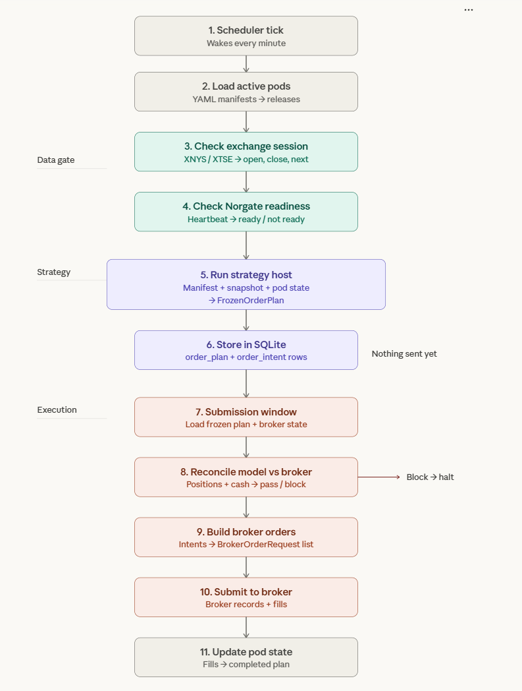

# Live Runbook

TL;DR: in live mode you do **not** run strategy files directly. You create one YAML manifest per pod, then run the generic live runner.

The simple live flow is:

1. Put one YAML file per pod under `alpha/live/releases/`.
2. Run the generic live runner.
3. The runner waits until data is ready.
4. The runner builds a frozen plan.
5. The runner submits orders and stores fills.

## What This Is

This file is the simple operator guide for the live layer under `alpha/live/`.

Use it for:
- where to put configs
- what each config section means
- which commands to run
- how to check if things are okay

Do **not** think of this as a separate strategy codebase.

The research strategies stay in:
- `strategies/`

The live layer just hosts them.

## Main Idea

One pod is:

```text
one strategy
+ one user
+ one broker account
+ one market calendar
```

One manifest file = one live pod.

Examples:
- DV2 pod
- TAA pod
- monthly momentum pod

## Where The Config Files Live

Current examples:
- [pod_dv2_01.yaml](C:/Users/User/Documents/workspace/alpha_super/alpha/live/releases/user_001/pod_dv2_01.yaml)
- [pod_taa_01.yaml](C:/Users/User/Documents/workspace/alpha_super/alpha/live/releases/user_001/pod_taa_01.yaml)
- [pod_ndx_mo_01.yaml](C:/Users/User/Documents/workspace/alpha_super/alpha/live/releases/user_001/pod_ndx_mo_01.yaml)

General location:

```text
alpha/live/releases/<user_id>/*.yaml
```

## Recommended Daily Command

This is the main command:

```bash
uv run python -m alpha.live.runner tick --mode paper
```

Later:

```bash
uv run python -m alpha.live.runner tick --mode live
```

`tick` is the main loop.

It does:
1. load enabled manifests
2. check market session timing
3. check if Norgate data is ready
4. build frozen plans if due
5. submit frozen plans if due
6. reconcile completed submissions

Recommended scheduler setup:
- Windows Task Scheduler
- run `tick` every minute

The scheduler stays dumb.
The Python runner decides whether anything is actually due.

## Useful Manual Commands

### 1. Status

```bash
uv run python -m alpha.live.runner status --mode paper
```

This shows:
- active pods
- latest plan status
- next action
- reason code
- latest fill timestamp

If you want the raw machine output instead:

```bash
uv run python -m alpha.live.runner status --mode paper --json
```

### 2. Execution Report

```bash
uv run python -m alpha.live.runner execution_report --mode paper
```

This shows raw broker fills:
- symbol
- fill amount
- fill price
- fill timestamp

### 3. Manual phase commands

Usually you should use `tick`, but for debugging you can run:

```bash
uv run python -m alpha.live.runner build_order_plans --mode paper
uv run python -m alpha.live.runner execute_order_plans --mode paper
uv run python -m alpha.live.runner post_execution_reconcile --mode paper
```

Default CLI output is human-readable.

Use `--json` only if you want the low-level debug fields.

## Simple Flow


## Manifest Structure

Example:

```yaml
identity:
  release_id: user_001.pod_dv2.daily_moo.v1
  user_id: user_001
  pod_id: pod_dv2_01

deployment:
  mode: paper
  enabled_bool: true

broker:
  account_route: DU1234567

strategy:
  strategy_import_str: strategies.dv2.strategy_mr_dv2:DVO2Strategy
  data_profile_str: norgate_eod_sp500_pit
  params:
    max_positions_int: 10

market:
  session_calendar_id_str: XNYS

schedule:
  signal_clock_str: eod_snapshot_ready
  execution_policy_str: next_open_moo

bootstrap:
  initial_cash_float: 100000.0

risk:
  risk_profile_str: standard_equity_mr
```

## What Each Section Means

### `identity`

- `release_id`
  - exact deployment version
- `user_id`
  - owner of the pod
- `pod_id`
  - stable live sleeve id

Keep `pod_id` stable.
If you make a new version of the same pod, usually change `release_id` and keep `pod_id`.

### `deployment`

- `mode`
  - allowed: `paper`, `live`
- `enabled_bool`
  - `true` means the runner will load it
  - `false` means the runner ignores it

Important:
- `paper` manifests are expected to use a paper-style IBKR route like `DU...`
- `live` manifests must not use the paper prefix

### `broker`

- `account_route`
  - broker account id
  - example: `DU1234567`

### `strategy`

- `strategy_import_str`
  - which research strategy to host
- `data_profile_str`
  - which data contract the pod expects
- `params`
  - actual strategy parameters

Currently supported `strategy_import_str` values:
- `strategies.dv2.strategy_mr_dv2:DVO2Strategy`
- `strategies.taa_df.strategy_taa_df_btal_fallback_tqqq_vix_cash`
- `strategies.momentum.strategy_mo_atr_normalized_ndx:AtrNormalizedNdxStrategy`

Currently supported `data_profile_str` values:
- `norgate_eod_sp500_pit`
- `norgate_eod_etf_plus_vix_helper`
- `norgate_eod_ndx_pit`
- `intraday_1m_plus_daily_pit`

### `market`

- `session_calendar_id_str`
  - which exchange calendar controls this pod

Currently supported values:
- `XNYS`
- `XTSE`
- `XASX`

This controls:
- holidays
- weekends
- early closes
- next session
- month-end session boundaries

### `schedule`

This has 2 different jobs:

#### `signal_clock_str`

This means:

> when the strategy is allowed to make the decision

Supported values:
- `eod_snapshot_ready`
- `month_end_snapshot_ready`
- `pre_close_15m`

Examples:
- `eod_snapshot_ready`
  - wait until Norgate daily snapshot is actually ready
- `month_end_snapshot_ready`
  - wait until Norgate snapshot is ready **and** today is the real last trading session of the month
- `pre_close_15m`
  - decision time is 15 minutes before the real session close

#### `execution_policy_str`

This means:

> when and how the frozen plan should be submitted

Supported values:
- `next_open_moo`
- `same_day_moc`
- `next_month_first_open`

Examples:
- `next_open_moo`
  - submit before next session open
- `same_day_moc`
  - submit before same-day close
- `next_month_first_open`
  - submit before first trading session of next month

### `bootstrap`

- `initial_cash_float`
  - used only if the pod has no saved state yet

Very simply:
- first run with no state -> use this cash
- later runs -> use saved pod state / broker state

### `risk`

- `risk_profile_str`
  - currently a routing/label field
  - not a full separate risk engine yet

## Supported Timing Combos

### Daily next-open pod

Example:

```yaml
schedule:
  signal_clock_str: eod_snapshot_ready
  execution_policy_str: next_open_moo
```

Meaning:
- wait for daily snapshot
- build plan
- submit next open

### Monthly month-end pod

Example:

```yaml
schedule:
  signal_clock_str: month_end_snapshot_ready
  execution_policy_str: next_month_first_open
```

Meaning:
- wait for true month-end trading session
- build plan
- submit on first next-month session

### Future close-entry pod

Example:

```yaml
schedule:
  signal_clock_str: pre_close_15m
  execution_policy_str: same_day_moc
```

Meaning:
- decide 15 minutes before close
- submit for same-day close

Important:
- the release plumbing exists
- real intraday signal hosting is still deferred

## What The System Uses For Timing

Two different sources:

### 1. Norgate

Used for:
- daily snapshot readiness
- month-end snapshot readiness

Simple meaning:

```text
Norgate says: data is ready, you may think now.
```

### 2. Exchange calendar

Used for:
- weekend / holiday checks
- early closes
- next session
- first session of next month
- submission windows

Simple meaning:

```text
Exchange calendar says: the market is really open now, you may trade now.
```

## What Happens Internally

The state machine is simple:

```text
NoPlan -> Frozen -> Submitting -> Submitted -> Completed
```

Possible safety stops:

```text
Blocked
Failed
```

That state is stored in SQLite.

So each `tick` asks:
- do I already have a plan?
- if yes, what status is it in?
- is data ready?
- is it time to submit?
- did I already submit?

That is how the system avoids duplicate orders.

## Where State Is Stored

Default SQLite file:
- [live_state.sqlite3](C:/Users/User/Documents/workspace/alpha_super/alpha/live/live_state.sqlite3)

The live layer stores:
- releases
- pod state
- frozen plans
- order intents
- broker orders
- fills
- reconciliation snapshots
- job runs

## Where Logs Go

Structured JSONL log:
- [live_events.jsonl](C:/Users/User/Documents/workspace/alpha_super/alpha/live/logs/live_events.jsonl)

Useful event names:
- `build_plan_created`
- `build_plan_skipped`
- `submit_plan_completed`
- `submit_plan_blocked`
- `post_execution_reconcile_completed`
- `tick_completed`

## What `execution_report` Means

This report is intentionally simple.

It shows raw broker truth:
- `fill_amount_float`
- `fill_price_float`
- `fill_timestamp_str`

So:

\[
P^{fill} = \text{actual broker fill price}
\]

We are intentionally **not** forcing a final slippage benchmark convention here yet.

That analysis can be added later from the raw fills.

## How To Add A New Pod

1. Copy one of the existing YAML files.
2. Change:
   - `identity.release_id`
   - `identity.pod_id`
   - `broker.account_route`
   - `strategy.strategy_import_str`
   - `strategy.data_profile_str`
   - `strategy.params`
   - `market.session_calendar_id_str`
   - `schedule.*`
3. Keep `deployment.enabled_bool: true`
4. Run:

```bash
uv run python -m alpha.live.runner status --mode paper
```

5. Then run:

```bash
uv run python -m alpha.live.runner tick --mode paper
```

## How To Run Multiple Strategies

Just add multiple manifest files under `alpha/live/releases/<user_id>/`.

Example:
- DV2 pod
- TAA pod
- monthly momentum pod

The same `tick` command will load all enabled pods.

You do **not** run each strategy file manually in live mode.

## Recommended First Workflow

### Step 1. Check manifests

```bash
uv run python -m alpha.live.runner status --mode paper
```

### Step 2. Run the live loop manually

```bash
uv run python -m alpha.live.runner tick --mode paper
```

### Step 3. Inspect raw fills

```bash
uv run python -m alpha.live.runner execution_report --mode paper
```

### Step 4. When comfortable, schedule `tick`

Use:
- Windows Task Scheduler
- every 1 minute

## Important Notes

- `tick` is the main command. Start there.
- Keep one manifest per pod.
- Keep `pod_id` stable for the same sleeve.
- Use `status` for health checks.
- Use `execution_report` for raw fills.
- Use `paper` first.
- Do not run live strategy files directly.

## Current Limitations

- The real IBKR adapter is still a thin boundary in v1.
- `same_day_moc` scheduling exists, but real intraday signal hosting is still deferred.
- `risk_profile_str` is currently more of a label than a full risk engine input.

## Short Summary

If you forget everything else, remember this:

1. create one YAML per pod
2. run `status`
3. run `tick`
4. inspect `execution_report`
5. later schedule `tick` every minute
