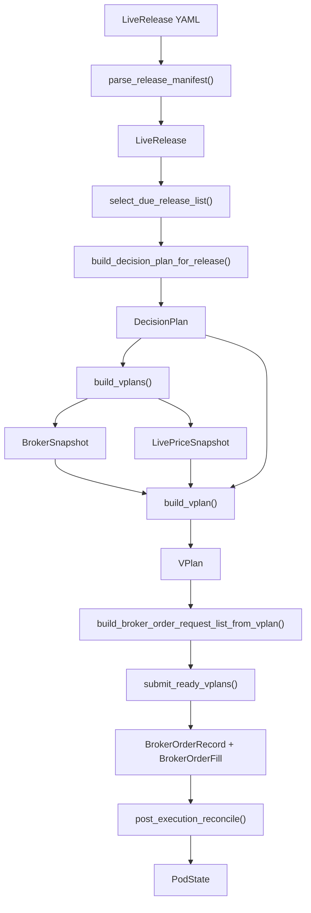

# Live Technical Reference

TL;DR: this file is the current implementation truth for the live layer under `alpha/live/`.

It describes:
- what the live system does today
- which modules and functions own each responsibility
- how timing is computed
- how broker truth is converted into trades
- what blocks trading
- what only raises warnings

It does not try to be:
- the shortest onboarding guide
- the operator command cheat sheet
- a roadmap

Related docs:
- quick start: [LIVE_START_HERE.md](LIVE_START_HERE.md)
- operator workflow and CLI inventory: [LIVE_RUNBOOK.md](LIVE_RUNBOOK.md)
- high-level design rationale: [LIVE_TRADING_ARCHITECTURE.md](LIVE_TRADING_ARCHITECTURE.md)

## Purpose

Use this file when you need the technical answer to questions like:
- What does `tick` actually do?
- What does `serve` actually do?
- How are `submission_timestamp` and `target_execution_timestamp` computed?
- How do `DecisionPlan`, `BrokerSnapshot`, `VPlan`, broker orders, fills, and `PodState` connect?
- How does the system ensure it trades from current broker truth?
- What is warning-only versus hard-blocking?

The rule for this document is:

```text
document current code truth, not planned behavior
```

## System Contract

The current live v2 contract is:

```text
DecisionPlan_t = f(approved_snapshot_t, strategy_memory_t)
BrokerSnapshot_submit = f(broker_account_at_submit)
LivePriceSnapshot_submit = f(broker_market_data_at_submit)
VPlan_submit = f(DecisionPlan_t, BrokerSnapshot_submit, LivePriceSnapshot_submit)
BrokerOrderRequest_list = f(VPlan_submit)
PodState_next = f(BrokerSnapshot_post_trade, fills, strategy_memory_next)
```

Core sizing formulas:

```text
PodBudget = NetLiq_broker * pod_budget_fraction
TargetDollar_i = target_weight_i * PodBudget
TargetShares_i = floor(TargetDollar_i / LivePrice_i)
OrderDelta_i = TargetShares_i - BrokerShares_i
```

Execution truth rules:

```text
current execution base = current broker positions
DecisionBaseShares_i != BrokerShares_i -> warning only
missing_live_price -> block VPlan creation
non_positive_net_liq -> block VPlan creation
submission_window_expired -> expire stale work
```

Research-to-live contract rules:

```text
incremental_entry_exit_book:
    entry_value(asset_i, value_i)
    exit_to_zero(asset_i)

full_target_weight_book:
    full_target_weight_map_dict
```

Accepted incremental research order shapes:

```text
entry_value:
    order_class = MarketOrder
    target = False
    unit = value
    amount > 0

exit_to_zero:
    order_class = MarketOrder
    target = True
    amount = 0
    unit in {shares, value, percent}
```

Mapping formulas:

```text
EntryWeight_i = EntryValue_i / PreviousTotalValue
ExitToZero_i = 1[target_i = True and amount_i = 0]
DecisionPlan = (DecisionBasePositions, EntryTargetWeightMap, ExitAssetSet, BookType)
```

Failure rule:

```text
unsupported research order shape -> fail loud with the full shape printed
```

## Core Objects

### `LiveRelease`

Purpose:
- one live deployment manifest for one pod

Created by:
- `parse_release_manifest()` in `alpha/live/release_manifest.py`

Consumed by:
- `runner.py`
- `scheduler_utils.py`
- `strategy_host.py`
- `execution_engine.py`

Important fields:
- `release_id_str`
- `user_id_str`
- `pod_id_str`
- `account_route_str`
- `strategy_import_str`
- `mode_str`
- `session_calendar_id_str`
- `signal_clock_str`
- `execution_policy_str`
- `data_profile_str`
- `params_dict`
- `enabled_bool`
- `pod_budget_fraction_float`
- `auto_submit_enabled_bool`

### `DecisionPlan`

Purpose:
- frozen decision artifact built after the signal snapshot is ready

Created by:
- `build_decision_plan_for_release()` in `alpha/live/strategy_host.py`

Consumed by:
- `runner.build_vplans()`
- `execution_engine.build_vplan()`
- `scheduler_service.get_scheduler_decision()`

Important fields:
- `decision_plan_id_int`
- `status_str`
- `signal_timestamp_ts`
- `submission_timestamp_ts`
- `target_execution_timestamp_ts`
- `decision_base_position_map`
- `decision_book_type_str`
- `entry_target_weight_map_dict`
- `full_target_weight_map_dict`
- `exit_asset_set`
- `entry_priority_list`
- `cash_reserve_weight_float`
- `preserve_untouched_positions_bool`
- `rebalance_omitted_assets_to_zero_bool`
- `strategy_state_dict`

Supported `decision_book_type_str` values:
- `incremental_entry_exit_book`
- `full_target_weight_book`

### `VPlan`

Purpose:
- final pre-submit execution plan built from broker truth

Created by:
- `build_vplan()` in `alpha/live/execution_engine.py`

Consumed by:
- `submit_ready_vplans()` in `alpha/live/runner.py`
- `show_vplan_summary()` in `alpha/live/runner.py`
- `state_store_v2.py`

Important fields:
- `vplan_id_int`
- `decision_plan_id_int`
- `status_str`
- `submission_key_str`
- `broker_snapshot_timestamp_ts`
- `live_reference_snapshot_timestamp_ts`
- `live_price_source_str`
- `net_liq_float`
- `available_funds_float`
- `excess_liquidity_float`
- `pod_budget_fraction_float`
- `pod_budget_float`
- `current_broker_position_map`
- `live_reference_price_map`
- `target_share_map`
- `order_delta_map`
- `vplan_row_list`

### `VPlanRow`

Purpose:
- one tradable asset row inside a `VPlan`

Created by:
- `execution_engine.build_vplan()`

Consumed by:
- `execution_engine.build_broker_order_request_list_from_vplan()`
- `show_vplan_summary()`

Important fields:
- `asset_str`
- `current_share_float`
- `target_share_float`
- `order_delta_share_float`
- `live_reference_price_float`
- `estimated_target_notional_float`
- `broker_order_type_str`

### `BrokerSnapshot`

Purpose:
- broker account truth at one timestamp

Created by:
- broker adapter path in `order_clerk.py` and `ibkr_socket_client.py`

Consumed by:
- `execution_engine.build_vplan()`
- `reconcile_account_state()`
- `post_execution_reconcile()`

Important fields:
- `account_route_str`
- `snapshot_timestamp_ts`
- `cash_float`
- `total_value_float`
- `position_amount_map`
- `net_liq_float`
- `available_funds_float`
- `excess_liquidity_float`
- `cushion_float`
- `open_order_id_list`

### `LivePriceSnapshot`

Purpose:
- reference prices used for pre-submit sizing

Created by:
- `IBKRSocketClient.get_live_price_snapshot()` through the broker adapter

Consumed by:
- `execution_engine.build_vplan()`

Important fields:
- `account_route_str`
- `snapshot_timestamp_ts`
- `price_source_str`
- `asset_reference_price_map`

### `BrokerOrderRequest`

Purpose:
- one outbound order request derived from a `VPlanRow`

Created by:
- `build_broker_order_request_list_from_vplan()`

Consumed by:
- broker adapter submit path in `order_clerk.py`

Important fields:
- `account_route_str`
- `asset_str`
- `side_str`
- `quantity_float`
- `order_type_str`

### `BrokerOrderRecord`

Purpose:
- one stored broker order acknowledgement

Created by:
- broker submit path in `submit_ready_vplans()`

Consumed by:
- state store and execution reporting

### `BrokerOrderFill`

Purpose:
- one stored broker fill

Created by:
- broker fill fetch in `submit_ready_vplans()` and `post_execution_reconcile()`

Consumed by:
- execution reporting
- post-trade reconcile

### `PodState`

Purpose:
- latest broker-backed pod state carried into the next cycle

Created by:
- `post_execution_reconcile()`
- `eod_snapshot()`

Consumed by:
- `build_decision_plan_for_release()`
- `compare_reference`

Important fields:
- `position_amount_map`
- `cash_float`
- `total_value_float`
- `strategy_state_dict`

Stage history:

```text
pod_state.snapshot_stage_str = post_execution | eod | unknown
pod_state.snapshot_source_str = broker | virtual_broker | pod_state
pod_state_history.snapshot_stage_str = post_execution | eod | unknown
pod_state_history.snapshot_source_str = broker | virtual_broker | pod_state
```

`pod_state` is the latest trusted broker-backed state and carries the stage/source of that latest update. `pod_state_history` is append-only evidence for charts and audits.

The two broker-state stages have different jobs:

```text
post_execution_reconcile = fill and position proof after the order plan executes
eod_snapshot = clean end-of-day cash, positions, and NetLiq
```

The final order budget still comes from the fresh broker snapshot used to build the VPlan:

```text
PodBudget_t = BrokerNetLiq_at_VPlan_t * pod_budget_fraction
TargetShares_i,t = floor(TargetWeight_i,t * PodBudget_t / LiveReferencePrice_i,t)
```

Backtest-reference equity comparison should use the EOD broker state when available:

```text
equity_error_t = actual_eod_net_liq_t / reference_close_equity_t - 1
```

## End-to-End Flow

The current main path is:

```text
manifest -> DecisionPlan -> BrokerSnapshot + LivePriceSnapshot -> VPlan -> BrokerOrderRequest -> fills -> PodState
```



Narrative order:

1. `parse_release_manifest()` loads enabled YAML releases into `LiveRelease`.
2. `select_due_release_list()` checks timing and snapshot gates.
3. `build_decision_plan_for_release()` runs the approved strategy host and writes a `DecisionPlan`.
4. `build_vplans()` pulls current broker truth and current live prices.
5. `build_vplan()` converts decision semantics into concrete target shares and deltas.
6. `build_broker_order_request_list_from_vplan()` derives tradable broker orders from non-zero deltas.
7. `submit_ready_vplans()` submits those orders if the path is manual-ready or auto-submit-ready.
8. `post_execution_reconcile()` waits until after the target execution time, reads broker truth, stores fills and broker order states, writes a new `PodState`, and only marks the plan complete if broker positions match target shares.

## Module And Function Reference

### `alpha/live/release_manifest.py`

Responsibility:
- parse and validate live release YAMLs

Key public functions:
- `parse_release_manifest(manifest_path_str)` at line 72
- `validate_release_manifest(release_obj)` at line 154
- `validate_release_list(release_list)` at line 213

Inputs and outputs:
- input: YAML file
- output: validated `LiveRelease`

Important invariants:
- `mode_str` must be `paper` or `live`
- `account_route_str` must match the chosen mode
- `0 < pod_budget_fraction_float <= 1`
- only one enabled release per `pod_id_str`

### `alpha/live/scheduler_utils.py`

Responsibility:
- exchange calendar and signal timing logic

Key public functions:
- `build_signal_timestamp_ts(...)` at line 216
- `build_submission_timestamp_ts(...)` at line 233
- `build_target_execution_timestamp_ts(...)` at line 268
- `evaluate_build_gate_dict(...)` at line 322
- `select_due_release_list(...)` at line 434

Inputs and outputs:
- input: `LiveRelease`, `as_of_ts`, exchange calendar, Norgate heartbeat
- output: timestamps and build-gate decisions

Important invariants:
- timing is derived from exchange session rules, not host local wall clock
- snapshot-ready logic is event-driven for `eod_snapshot_ready` and `month_end_snapshot_ready`

### `alpha/live/strategy_host.py`

Responsibility:
- run the approved research strategy and convert it into a live `DecisionPlan`

Key public functions:
- `build_order_plan_for_release(...)` at line 909
- `build_decision_plan_for_release(...)` at line 934

Important invariants:
- the live v2 path uses `build_decision_plan_for_release()`
- `build_order_plan_for_release()` is legacy frozen-plan plumbing, not the main v2 execution path

Current strategy family mapping:
- DV2 -> `incremental_entry_exit_book`
- QPI IBS RSI Exit -> `incremental_entry_exit_book`
- TAA -> `full_target_weight_book`
- ATR-normalized NDX momentum -> `full_target_weight_book`

### `alpha/live/execution_engine.py`

Responsibility:
- convert a `DecisionPlan` plus broker truth into a `VPlan`

Key public functions:
- `get_touched_asset_list_for_decision_plan(...)` at line 24
- `build_vplan(...)` at line 214
- `build_broker_order_request_list_from_vplan(vplan_obj)` at line 239

Inputs and outputs:
- input: `LiveRelease`, `DecisionPlan`, `BrokerSnapshot`, `LivePriceSnapshot`
- output: `VPlan`

Important invariants:
- sizing uses current broker `NetLiq`
- deltas are always computed from current broker shares
- untouched holdings stay untouched only for `incremental_entry_exit_book`

### `alpha/live/order_clerk.py`

Responsibility:
- broker adapter boundary used by the runner

Key responsibilities:
- expose broker readiness
- fetch visible accounts
- fetch broker account snapshot
- fetch live price snapshot
- submit order requests
- fetch recent fills

Important invariants:
- the live layer talks to the broker only through the adapter interface

### `alpha/live/ibkr_socket_client.py`

Responsibility:
- real IBKR socket implementation using `ib_async`

Key behavior:
- fetches live price snapshot via `reqTickers().marketPrice()`
- submits real broker orders through the IBKR API when called from the live submit path

Important invariants:
- the current price source is `ib_async.reqTickers.marketPrice`
- the current implementation does not include an explicit delayed-price fallback

### `alpha/live/reconcile.py`

Responsibility:
- compare model expectations against broker truth

Key public function:
- `reconcile_account_state(...)` at line 6

Inputs and outputs:
- input: model positions, model cash, `BrokerSnapshot`
- output: `ReconciliationResult`

Important invariants:
- position mismatch is the key comparison
- cash mismatch is audit information, not a hard block

### `alpha/live/state_store_v2.py`

Responsibility:
- persist v2 live state in SQLite

Key responsibilities:
- insert and fetch `DecisionPlan`
- insert and fetch `VPlan`
- store reconciliation snapshots
- store broker orders and fills
- store pod state
- guard active plans and duplicate submit races

Important invariants:
- active decision statuses include `planned`, `vplan_ready`, `submitted`
- `claim_vplan_for_submission()` performs the transient `ready -> submitting` claim

### `alpha/live/runner.py`

Responsibility:
- one-shot live mutation primitive

Key public functions:
- `build_decision_plans(...)`
- `build_vplans(...)`
- `submit_ready_vplans(...)`
- `post_execution_reconcile(...)`
- `get_status_summary(...)`
- `show_vplan_summary(...)`
- `get_execution_report_summary(...)`
- `tick(...)`

Important invariant:

```text
tick is the umbrella one-shot command
it calls the lower-level stages only when they are due
```

Stage order inside `tick`:

```text
build_decision_plans
expire_stale_decision_plans
build_vplans
submit_ready_vplans
post_execution_reconcile
```

### `alpha/live/scheduler_service.py`

Responsibility:
- optional UTC-native scheduler around `tick`

Key public functions:
- `get_scheduler_decision(...)` at line 93
- `run_once(...)` at line 370
- `serve(...)` at line 416
- `main(...)` at line 523

Important invariant:

```text
tick = atomic execution primitive
scheduler_service = timing wrapper around tick
```

The scheduler does not build plans or submit orders by itself.
It only decides when to call `tick`.

## Timing Model

### Exchange calendars

Current supported `session_calendar_id_str` values:
- `XNYS`
- `XTSE`
- `XASX`

Timing is derived from:
- current UTC time
- the exchange calendar for the release
- the release timing policy
- the snapshot-ready gate

The host local timezone is not authoritative.

Rule:

```text
now_utc -> exchange session timestamps -> live timing decisions
```

### Signal clocks

Current supported `signal_clock_str` values:
- `eod_snapshot_ready`
- `month_end_snapshot_ready`
- `pre_close_15m`

Current aliases:
- `eod_close_plus_10m -> eod_snapshot_ready`
- `month_end_eod -> month_end_snapshot_ready`
- `pre_close_1545_et -> pre_close_15m`

Current signal timestamp rules:

```text
eod_snapshot_ready       -> session close timestamp
month_end_snapshot_ready -> month-end session close timestamp
pre_close_15m            -> session close - 15 minutes
```

### Execution policies

Current supported `execution_policy_str` values:
- `next_open_moo`
- `same_day_moc`
- `next_month_first_open`

Current target execution rules:

```text
next_open_moo        -> next session open
same_day_moc         -> same session close
next_month_first_open -> first next-month session open
```

Current submission rules:

```text
submission_timestamp = target_execution_timestamp - 10 minutes
```

For `pre_close_15m`, the signal timestamp is:

```text
signal_timestamp = session_close - 15 minutes
```

### Snapshot-ready gate

`evaluate_build_gate_dict(...)` controls whether a release may build a `DecisionPlan`.

Current gate outcomes include:
- `snapshot_ready`
- `carry_forward_snapshot_ready`
- `snapshot_not_ready`
- `snapshot_not_ready_for_session`
- `snapshot_window_expired`
- `not_month_end_session`

The important behavior is:

```text
if the current approved snapshot corresponds to the release session date:
    build is due
elif the snapshot is still valid and the next submission window has not expired:
    carry-forward build is still allowed
else:
    no build
```

### Scheduler timing

Current defaults in `scheduler_service.py`:

```text
active_poll_seconds = 30
idle_max_sleep_seconds = 900
reconcile_grace_seconds = 300
error_retry_seconds = 60
```

Current scheduler formulas:

```text
reconcile_due_timestamp = target_execution_timestamp + 5 minutes
sleep_seconds = min(next_due_timestamp - now_utc, idle_max_sleep_seconds)
```

Current scheduler priority order:

```text
stale expiry
-> reconcile submitted VPlan
-> submit ready VPlan
-> build VPlan from planned DecisionPlan
-> build DecisionPlan
-> idle sleep
```

## What Gets Traded And Why

The execution engine always starts from broker truth.

Core rule:

```text
OrderDelta_i = TargetShares_i - BrokerShares_i
```

### Incremental books

Applies to:
- DV2
- QPI IBS RSI Exit

Semantics:

```text
entry assets -> sized from broker NetLiq and live price
exit assets  -> target shares = 0
untouched assets -> delta = 0
```

More explicitly:

```text
if asset_i is in entry_target_weight_map_dict:
    TargetShares_i = floor(entry_weight_i * PodBudget / LivePrice_i)
elif asset_i is in exit_asset_set:
    TargetShares_i = 0
else:
    TargetShares_i = BrokerShares_i
```

So the execution layer trades only the touched assets:
- new entries
- explicit exits

Untouched holdings are preserved because:
- `preserve_untouched_positions_bool` is part of the decision semantics

### Full target books

Applies to:
- TAA
- ATR-normalized NDX momentum

Semantics:

```text
all touched assets -> rebalance to target shares
omitted held assets -> zero only if full-target semantics require it
```

More explicitly:

```text
for each asset_i in touched asset set:
    TargetShares_i = floor(full_target_weight_i * PodBudget / LivePrice_i)
```

If `rebalance_omitted_assets_to_zero_bool = true`, currently held broker assets omitted from the target map are added to the touched set and driven toward zero.

### Warning-only drift

Current position reconcile rule:

```text
DecisionBaseShares_i != BrokerShares_i -> warning only
```

This is recorded before `VPlan` creation, but the system continues and sizes from current broker truth.

Current warning code:
- `position_reconciliation_warning`

### Blocking conditions

Current v2 pre-submit blocks in `build_vplans()` include:
- `submission_window_expired`
- `broker_not_ready`
- `account_not_visible`
- `session_mode_mismatch`
- `non_positive_net_liq`
- `missing_live_price`

Current submit-path blocks in `submit_ready_vplans()` include:
- `submission_window_expired`
- `duplicate_submission_guard`
- claim failure on `ready -> submitting`

## State Machine And Statuses

### `DecisionPlan.status_str`

Current documented statuses in the dataclass:
- `planned`
- `vplan_ready`
- `submitted`
- `completed`
- `expired`
- `blocked`

Current main-path transitions:

```text
planned -> vplan_ready -> submitted -> completed
planned -> expired
vplan_ready -> expired
```

Practical meaning:
- `planned`
  - decision exists, no `VPlan` has been stored yet
- `vplan_ready`
  - a `VPlan` exists and is the current execution artifact
- `submitted`
  - the linked `VPlan` has been sent to the broker
- `completed`
  - post-execution reconcile wrote the new broker-backed state
- `expired`
  - the valid submit window or execution window was missed

### `VPlan.status_str`

Dataclass comment lists:
- `ready`
- `submitted`
- `completed`
- `expired`
- `blocked`

Current implementation also uses a transient internal status:
- `submitting`

Current main-path transitions:

```text
ready -> submitting -> submitted -> completed
ready -> expired
```

Practical meaning:
- `ready`
  - built and waiting for submit
- `submitting`
  - submission claim acquired in SQLite to avoid duplicate sends
- `submitted`
  - broker submit path completed and order records were stored
- `completed`
  - reconcile confirmed execution evidence and wrote new `PodState`
- `expired`
  - submit window expired before a valid send

Current note:
- `blocked` exists as a model-level status possibility but is not part of the main current v2 happy path

### Stale expiry

Stale decisions are expired when:

```text
target_execution_timestamp <= as_of_ts
and status is still planned or vplan_ready
```

The system does not reuse stale execution artifacts after the valid window.

## CLI Semantics

The live layer exposes 2 public CLIs:
- `alpha.live.runner`
- `alpha.live.scheduler_service`

### Runner semantics

`build_decision_plans`
- build only overnight `DecisionPlan` objects that are due

`build_vplan`
- CLI name is singular, but the underlying function is `build_vplans(...)`
- builds due `VPlan` objects across all applicable pods

`submit_vplan`
- submit one ready `VPlan` manually by id

`post_execution_reconcile`
- fetch broker evidence after execution time and write the new pod state

`tick`
- umbrella one-shot command
- runs the lower-level stages only when each stage is due

Operationally:

```text
tick does not force every stage every time
tick checks due conditions and runs only the valid stages
```

### Scheduler semantics

`next_due`
- inspect-only
- does not mutate live state
- prints the next scheduler phase and next UTC wake-up

`run_once`
- one scheduler decision pass
- if work is due now, it calls `tick` once

`serve`
- long-running daemon loop
- repeatedly decides whether work is due
- calls `tick` when due
- otherwise sleeps

Current scheduler model:

```text
serve = decide -> tick -> sleep -> repeat
```

## Failure Modes And Troubleshooting

### Broker not connected

Symptoms:
- `broker_not_ready`
- scheduler retries without progress

Meaning:
- TWS or IB Gateway is not reachable on the configured host/port

### Account not visible

Symptoms:
- `account_not_visible`

Meaning:
- the broker session is up, but the configured `account_route_str` is not visible in that session

### Session mode mismatch

Symptoms:
- `session_mode_mismatch`

Meaning:
- the CLI mode and the broker session mode disagree, for example:
  - `--mode paper` against a live session
  - `--mode live` against a paper session

### Missing live prices

Symptoms:
- `missing_live_price`
- IBKR market data permission errors in the terminal

Meaning:
- the execution layer could not get a reference price for every required touched asset

Current behavior:
- `VPlan` creation is blocked for that cycle

### Market data subscription errors

Symptoms:
- IBKR errors like 10168 or 10089

Meaning:
- the account lacks the required real-time market data permission for one or more touched assets

Current behavior:
- no explicit delayed-price fallback
- missing prices block the `VPlan`

### Stale plan expiry

Symptoms:
- `submission_window_expired`
- plan status becomes `expired`

Meaning:
- the runner or scheduler reached the cycle too late

### Duplicate submission guard

Symptoms:
- `duplicate_submission_guard`

Meaning:
- a `VPlan` with the same `submission_key_str` was already submitted or claimed

### Scheduler retries

Symptoms:
- repeated `scheduler_error_retry`

Meaning:
- `serve` hit an exception, logged it, slept `error_retry_seconds`, and retried

### Warning-only vs blocked

Warning-only:
- `position_reconciliation_warning`

Blocking:
- `broker_not_ready`
- `account_not_visible`
- `session_mode_mismatch`
- `non_positive_net_liq`
- `missing_live_price`
- `submission_window_expired`
- `duplicate_submission_guard`

## Current Limitations

These are current implementation truths that materially affect interpretation.

### 1. No explicit delayed-price fallback

Current broker pricing path uses:

```text
ib_async.reqTickers.marketPrice
```

If a required price is missing, `build_vplans()` blocks with `missing_live_price`.

### 2. Share drift is warning-only

Current rule:

```text
DecisionBaseShares_i != BrokerShares_i -> warning only
```

This is intentionally RealTest-like, but it means the system will continue from broker truth even if the drift was unexpected.

### 3. One pod should map to one clean account or sleeve

The sizing and reconcile model is cleanest when:

```text
one pod = one broker account or one operational sleeve
```

If multiple pods share one raw account without a higher-level sleeve boundary, broker-truth deltas become harder to interpret.

### 4. `submitting` is real even though the dataclass comment is shorter

The SQLite claim path uses a transient `submitting` status for `VPlan`, even though the `VPlan` dataclass comment lists a shorter status set.

### 5. `build_order_plan_for_release()` still exists as legacy plumbing

The main live v2 path is `DecisionPlan -> VPlan`, but the older frozen-plan function still exists in `strategy_host.py`.

## Worked DV2 Example

This example uses the current DV2 path:
- `decision_book_type_str = incremental_entry_exit_book`
- `signal_clock_str = eod_snapshot_ready`
- `execution_policy_str = next_open_moo`
- `session_calendar_id_str = XNYS`
- `pod_budget_fraction_float = 0.03`
- `max_positions_int = 10`

Assume:

```text
signal session close       = 2026-04-09 16:00 ET
submission timestamp       = 2026-04-10 09:20 ET
target execution timestamp = 2026-04-10 09:30 ET
reconcile due timestamp    = 2026-04-10 09:35 ET
```

### 1. Snapshot becomes ready

At the approved snapshot gate, `build_decision_plan_for_release()` writes:

```text
DecisionPlan.status_str = planned
decision_book_type_str = incremental_entry_exit_book
entry_target_weight_map_dict = {
    "MSFT": 0.10,
    "NVDA": 0.10,
}
exit_asset_set = {"XOM"}
decision_base_position_map = {
    "XOM": 20,
    "AAPL": 50,
}
```

Interpretation:
- enter `MSFT` at 10 percent slot weight
- enter `NVDA` at 10 percent slot weight
- exit `XOM` to zero
- leave untouched holdings like `AAPL` alone

### 2. Pre-submit broker snapshot

At `2026-04-10 09:20 ET`, the broker snapshot says:

```text
NetLiq = 1,000,000
AvailableFunds = 700,000
ExcessLiquidity = 650,000
BrokerShares = {
    "AAPL": 50,
    "MSFT": 0,
    "NVDA": 0,
    "XOM": 40,
}
```

There is a share drift warning on `XOM`:

```text
DecisionBaseShares_XOM = 20
BrokerShares_XOM = 40
```

Current rule:

```text
DecisionBaseShares_XOM != BrokerShares_XOM -> warning only
```

### 3. Live price snapshot

Assume the broker price snapshot returns:

```text
MSFT = 300
NVDA = 180
XOM = 105
```

### 4. Pod budget and target shares

Pod budget:

```text
PodBudget = NetLiq_broker * pod_budget_fraction
PodBudget = 1,000,000 * 0.03 = 30,000
```

For `MSFT`:

```text
TargetDollar_MSFT = 0.10 * 30,000 = 3,000
TargetShares_MSFT = floor(3,000 / 300) = 10
OrderDelta_MSFT = 10 - 0 = 10
```

For `NVDA`:

```text
TargetDollar_NVDA = 0.10 * 30,000 = 3,000
TargetShares_NVDA = floor(3,000 / 180) = 16
OrderDelta_NVDA = 16 - 0 = 16
```

For `XOM` exit:

```text
TargetShares_XOM = 0
OrderDelta_XOM = 0 - 40 = -40
```

Untouched `AAPL` is not in the execution touched set for this incremental book, so:

```text
OrderDelta_AAPL = 0
```

### 5. Resulting `VPlan`

The `VPlan` rows are effectively:

```text
MSFT -> buy 10
NVDA -> buy 16
XOM  -> sell 40
```

And the warning section should surface:

```text
XOM | decision_base=20 | current=40 | drift=20 | target=0 | delta=-40 | warning=yes
```

### 6. Submit and reconcile

If `auto_submit_enabled_bool = true`:

```text
tick at 09:20 ET -> build VPlan -> submit VPlan
tick at or after 09:35 ET -> post_execution_reconcile
```

After fills are confirmed, `post_execution_reconcile()` writes:

```text
residual_share_float = target_share_float - broker_share_float

if all(abs(residual_share_float) <= tolerance_float):
    VPlan.status_str = completed
    DecisionPlan.status_str = completed
else:
    VPlan.status_str = submitted

PodState = broker-backed state for next cycle
```

If an exit target is `0` but broker shares remain, reconcile also writes a `critical` exit residual log.

That is the current DV2 live v2 path in production terms.
