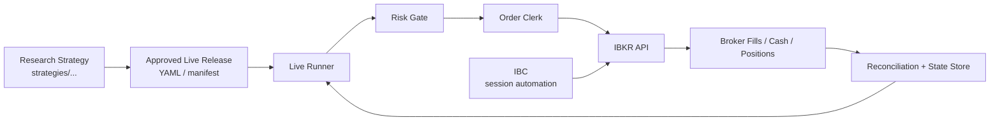
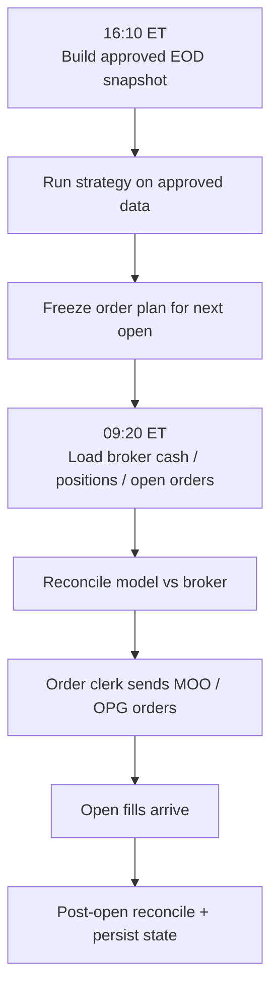

TL;DR: Keep `research` and `live` separate. Research strategies in `strategies/` remain the source of truth. Live trading is a thin generic layer that loads an approved strategy release, runs it automatically at the correct time, reconciles broker state, and sends orders through an order clerk. This is the simplest architecture that still preserves quantitative correctness.

# Live Trading Architecture

## Design Goal

The design goal is:

- keep the strategy logic deterministic and close to the backtest
- keep the live system generic across many strategies, pods, and users
- keep timing explicit so look-ahead mistakes are hard to express
- keep deployment portable so local-first can later move to cloud

The core live identity is:

```text
target_position = strategy(research_logic, approved_snapshot, current_state)
order_delta = target_position - broker_position
```

Minimal timing formulas:

```text
signal_t = f(I_cutoff_t)
execution_t >= cutoff_t
```

For next-open systems:

```text
decision_t = close_t
execution_t = open_t+1
```

For same-day close systems:

```text
decision_t = pre_close_t
execution_t = close_t
```

## Core Principle

The strategy decides.

The live system hosts the strategy.

That means:

- strategy code does not know about `IBKR`, `IBC`, `Docker`, `AWS`, `VPN`, or schedulers
- the live runner does not contain strategy logic
- the order clerk does not decide what to trade

## High-Level Structure



## Main Components

### 1. Research Strategy

This is the backtested strategy in `strategies/...`.

Examples:

- `strategies/dv2/strategy_mr_dv2.py`
- `strategies/taa_df/strategy_taa_df_btal_fallback_tqqq_vix_cash.py`
- `strategies/momentum/strategy_mo_atr_normalized_ndx.py`

This remains the source of truth.

### 2. Approved Live Release

This is a small manifest that says:

- which strategy is approved
- for which user
- for which pod
- for which account route
- at what signal time it runs
- how it executes
- with which parameters

Example:

```yaml
identity:
  release_id: user_001.pod_dv2.daily_moo.v1
  user_id: user_001
  pod_id: pod_dv2_01

deployment:
  mode: paper
  enabled_bool: true

broker:
  account_route: DU1234567

strategy:
  strategy_import_str: strategies.dv2.strategy_mr_dv2:DVO2Strategy
  data_profile_str: norgate_eod_sp500_pit
  params:
    max_positions_int: 10

market:
  session_calendar_id_str: XNYS

schedule:
  signal_clock_str: eod_snapshot_ready
  execution_policy_str: next_open_moo

bootstrap:
  initial_cash_float: 100000.0

risk:
  risk_profile_str: standard_equity_mr
```

### Manifest Reference

The grouped manifest keeps research parameters separate from live deployment metadata.

- `identity.release_id`
  - unique identifier for this exact live deployment
  - accepted value: any non-empty unique string
- `identity.user_id`
  - logical owner of the pod
  - accepted value: any non-empty string
- `identity.pod_id`
  - stateful live deployment unit
  - accepted value: any non-empty string; only one enabled release per pod in v1
- `deployment.mode`
  - execution environment gate checked by the runner before submission
  - accepted values: `paper`, `live`
  - v1 manifest validation also checks the IBKR account-route heuristic:
    - `paper` expects a `DU...` account-style route
    - `live` rejects `DU...` routes
- `deployment.enabled_bool`
  - operational kill switch
  - accepted values: `true`, `false`
- `broker.account_route`
  - broker account routing target
  - accepted value: non-empty IBKR account identifier string
  - v1 heuristic:
    - `DU...` is treated as paper
    - non-`DU...` is treated as live
- `strategy.strategy_import_str`
  - research strategy reference loaded by the live host
  - accepted values in v1:
    - `strategies.dv2.strategy_mr_dv2:DVO2Strategy`
    - `strategies.taa_df.strategy_taa_df_btal_fallback_tqqq_vix_cash`
    - `strategies.momentum.strategy_mo_atr_normalized_ndx:AtrNormalizedNdxStrategy`
- `strategy.data_profile_str`
  - approved data contract for the release
  - accepted values in v1:
    - `norgate_eod_sp500_pit`
    - `norgate_eod_etf_plus_vix_helper`
    - `norgate_eod_ndx_pit`
    - `intraday_1m_plus_daily_pit`
- `strategy.params`
  - strategy-specific parameters only
  - accepted values depend on the referenced strategy
- `market.session_calendar_id_str`
  - exchange session calendar used for holidays, short days, and submission/execution windows
  - accepted values in v1:
    - `XNYS`
    - `XTSE`
    - `XASX`
- `schedule.signal_clock_str`
  - semantic decision cutoff
  - accepted values:
    - `eod_snapshot_ready`
    - `month_end_snapshot_ready`
    - `pre_close_15m`
- `schedule.execution_policy_str`
  - broker execution policy and execution window
  - accepted values:
    - `next_open_moo`
    - `same_day_moc`
    - `next_month_first_open`
- `bootstrap.initial_cash_float`
  - only a bootstrap fallback for a new pod before real broker-backed state exists
  - accepted value: positive float
- `risk.risk_profile_str`
  - v1 risk label reserved for generic risk policy routing
  - accepted value in v1: any non-empty string

`*** CRITICAL***` `signal_clock_str` is intentionally a semantic market-session alias, not a raw UTC timestamp. For exchange-driven systems, aliases like `eod_snapshot_ready` and `pre_close_15m` are safer than naked UTC wall times because the trading session is defined by the pod's exchange calendar and must stay correct through DST, holidays, and early closes.

`*** CRITICAL***` `deployment.mode` is validated twice:

- statically from the manifest via the IBKR account-route heuristic
- at execution time from the broker adapter when session-mode metadata is available

### 3. Live Runner

The live runner is generic.

Its job is:

- load active releases
- wait for the configured decision time
- build the allowed market snapshot
- run the approved strategy
- freeze an order plan
- reconcile broker state
- call the order clerk

### 4. Order Clerk

The order clerk does not decide.

It only:

- converts target positions into broker orders
- submits / modifies / cancels orders
- records order ids and fills
- reports failures

### 5. IBC

`IBC` is only session/process automation for `TWS` / `IB Gateway`.

It is responsible for:

- login automation
- restart automation
- keeping the broker session available

It is not:

- a strategy engine
- a scheduler
- a portfolio engine

### 6. Reconciliation

Before sending any live orders, compare model state against broker truth.

```text
recon_error = model_position - broker_position
```

If the mismatch is material, stop normal trading and reconcile first.

This is one of the most important live controls.

## Daily Automation Flow

For a standard daily next-open pod:



This is how live trading happens automatically every day:

- `IBC` keeps the broker session alive
- a scheduler triggers the live runner at fixed times
- the runner loads active releases and produces the order plan
- the order clerk sends the orders

The scheduler can be simple at first:

- local Windows Task Scheduler
- a Python scheduler process

Later, the same runner can move to cloud:

- Docker container
- ECS / Kubernetes / VM scheduler

## Timing Rules

Timing must be part of the live release, not an implicit detail.

Examples:

- `next_open_moo`
- `same_day_moc`
- `next_month_first_open`

`*** CRITICAL***` If the decision cutoff changes, the strategy has changed.

Examples:

- `close -> next open` is one tested strategy contract
- `15:45 -> same-day close` is a different tested strategy contract

Do not silently switch between them.

## Pods, Users, and Accounts

Use a simple definition:

```text
Pod = one live deployment unit
```

A pod is usually:

- one strategy
- one user
- one account route
- one execution schedule
- one risk profile

Good phase-1 choice:

```text
pod = linked account
```

This gives:

- clean isolation
- clean P&L
- simple reconciliation
- easy paper-to-live rollout

One user can run several pods:

- `pod_dv2_01`
- `pod_taa_01`
- `pod_ndx_mo_01`

## Cloud-Ready Without Over-Engineering

The system should be local-first but cloud-portable.

Do this:

- keep config external
- keep state outside the process
- keep strategy code independent of machine/runtime
- keep the runner generic

Do not do this:

- hard-code local file paths into live orchestration
- mix broker login logic into strategy code
- tie architecture to Docker itself

`Docker` is packaging.

It is useful later for:

- the live runner
- the order clerk
- deployment portability

It is not the strategy architecture.

## Examples

### Example 1. `strategy_mr_dv2`

Source:

- `strategies/dv2/strategy_mr_dv2.py`

Current research contract:

```text
signal at daily close
execution at next open
```

Live flow:

1. After the close, build the approved EOD snapshot plus PIT universe.
2. Run the DV2 strategy.
3. Freeze tomorrow's order plan.
4. Before the open, reconcile broker state.
5. Send `MOO / OPG` orders.

Example order plan:

```json
[
  {"symbol_str":"MSFT","order_value_float":10000.0,"order_type_str":"MOO"},
  {"symbol_str":"AMZN","order_value_float":10000.0,"order_type_str":"MOO"},
  {"symbol_str":"AAPL","target_value_float":0.0,"order_type_str":"MOO"}
]
```

### Example 2. `DV2` Same-Day `MOC`

This is not just an execution toggle.

It is a separate tested strategy contract:

```text
signal at pre_close_t
execution at close_t
```

Live flow:

1. Maintain intraday data.
2. At the approved pre-close time, build the intraday snapshot.
3. Run the pre-close DV2 variant.
4. Freeze the same-day close order plan.
5. Send `MOC` orders before the operational cutoff.

`*** CRITICAL***` This must be backtested with the same intraday information set. It is not quant-correct to reuse the pure daily close strategy and pretend it is the same thing.

### Example 3. `strategy_taa_df_btal_fallback_tqqq_vix_cash`

Source:

- `strategies/taa_df/strategy_taa_df_btal_fallback_tqqq_vix_cash.py`

Current research contract:

```text
month-end decision
next-month first open execution
fallback asset = TQQQ
VRP gate can zero the fallback sleeve and leave residual cash
```

Live flow:

1. On the last tradable close of the month, compute month-end weights.
2. Apply the `rv20 vs VIX` fallback cash gate.
3. Freeze the rebalance plan.
4. On the first tradable open of the next month, reconcile broker state.
5. Send ETF rebalance orders.

Example target map:

```json
{
  "GLD": 0.3333333333,
  "UUP": 0.2666666667,
  "TLT": 0.2000000000,
  "BTAL": 0.1333333333,
  "TQQQ": 0.0000000000,
  "cash_weight_float": 0.0666666667
}
```

### Example 4. `strategy_mo_atr_normalized_ndx`

Source:

- `strategies/momentum/strategy_mo_atr_normalized_ndx.py`

Current research contract:

```text
month-end decision on PIT Nasdaq 100 universe
regime filter on SPY
top N names by ATR-adjusted momentum
next tradable open execution
```

Live flow:

1. At month-end, build the approved PIT universe and monthly decision snapshot.
2. Compute the ATR-adjusted momentum ranking.
3. Freeze the selected names and target equal weights.
4. On the next tradable open, reconcile broker state.
5. Submit the rebalance.

Example target map:

```json
{
  "MSFT": 0.10,
  "NVDA": 0.10,
  "META": 0.10,
  "AMZN": 0.10,
  "AVGO": 0.10,
  "NFLX": 0.10,
  "COST": 0.10,
  "AMD": 0.10,
  "ADBE": 0.10,
  "CSCO": 0.10
}
```

## Minimal Recommended Repo Shape

```text
strategies/                 # research truth
alpha/live/
  runner.py
  order_clerk.py
  reconcile.py
  logs/
  releases/
    user_001/
      pod_dv2_01.yaml
      pod_taa_01.yaml
      pod_ndx_mo_01.yaml
```

## Minimal Operations

Recommended Windows scheduler command:

```bash
uv run python -m alpha.live.runner tick --mode paper
```

Useful inspection command:

```bash
uv run python -m alpha.live.runner status --mode paper
```

Simple execution-quality report:

```bash
uv run python -m alpha.live.runner execution_report --mode paper
```

Structured live events are appended to:

```text
alpha/live/logs/live_events.jsonl
```

Each event records the pod, release, timestamps, and a short `reason_code_str` such as:

- `snapshot_ready`
- `active_plan_exists`
- `ready_to_build`
- `waiting_for_submission_window`
- `broker_not_ready`
- `reconciliation_failed`
- `submitted`
- `completed`

The execution report is intentionally simple in v1:

- raw fill price
- fill amount
- fill timestamp

This keeps the live layer anchored to broker truth. More detailed slippage decomposition can be added later once the correct benchmark price convention is finalized.

## Final Recommendation

Keep the system strict:

- research strategies stay in `strategies/`
- live trading uses approved release manifests
- the runner is generic
- the order clerk is generic
- timing is explicit
- reconciliation is mandatory

This is the simplest architecture that remains realistic, scalable, and quant-correct.
