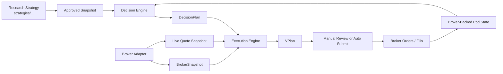

TL;DR: live v2 keeps the good local-first control plane from v1, but changes the sizing contract. The system now freezes the **decision** after the approved snapshot is ready, and freezes the **final share quantities** only near submit time from broker truth.

```text
DecisionPlan_t = f(approved_snapshot_t, strategy_memory_t)
BrokerSnapshot_submit = f(broker_account_at_submit)
VPlan_submit = f(DecisionPlan_t, BrokerSnapshot_submit, live_quote_snapshot)
```

## Document Role

Use this file for:
- high-level design
- system rationale
- the conceptual split between decision and execution

Do not use this file as the canonical code-level reference.

For implementation truth, read:
- [LIVE_TECHNICAL_REFERENCE.md](LIVE_TECHNICAL_REFERENCE.md)

# Live Trading Architecture

## Design Goal

The design goal is:

- keep the research strategy deterministic and close to the backtest
- keep broker truth authoritative for live positions
- size from live account state near the execution window
- keep the operator flow simple enough for manual review
- keep the system local-first and Windows-friendly

## Core Principle

The strategy decides **what it wants**.

The execution layer decides **how many shares to send**.

That means:

- research strategy code does not know about `IBKR`, sockets, schedulers, or session automation
- the decision engine does not use broker `NetLiq` to decide the signal
- the execution engine does not decide the signal
- the broker adapter does not decide weights or rankings

## V2 Contract

### Stage 1. Decision

After the approved snapshot is ready, the strategy builds a `DecisionPlan`.

This contains:
- an explicit decision-book type
- either incremental entry/exit instructions or a full target-weight book
- strategy memory
- signal / submit / target execution timestamps

It does **not** contain final overnight share quantities.

Supported decision-book types:
- `incremental_entry_exit_book`
  - DV2 / QPI-style equal-slot entry systems
  - semantics:

```text
enter new names at slot weight
exit selected names to zero
leave untouched names alone
```

- `full_target_weight_book`
  - TAA / full rebalance momentum systems
  - semantics:

```text
target_weight_i is defined for the whole target book
```

### Stage 2. Execution Sizing

Near the submit window, the execution engine reads:
- broker positions
- broker `NetLiq`
- broker `AvailableFunds`
- broker `ExcessLiquidity`
- live quote snapshot

Then it builds a `VPlan`.

The core formulas are:

```text
PodBudget = NetLiq_broker * pod_budget_fraction
TargetDollar_i = target_weight_i * PodBudget
TargetShares_i = floor(TargetDollar_i / LivePrice_i)
OrderDelta_i = TargetShares_i - BrokerShares_i
```

This makes the sizing deterministic at submit time and aligned with broker truth.

## High-Level Structure



## Main Components

### 1. Research Strategy

This remains the source of signal truth in `strategies/...`.

Examples:
- `strategies/dv2/strategy_mr_dv2.py`
- `strategies/taa_df/strategy_taa_df_btal_fallback_tqqq_vix_cash.py`
- `strategies/momentum/strategy_mo_atr_normalized_ndx.py`

### 2. Manifest / Live Release

The manifest says:
- which strategy is approved
- for which user
- for which pod
- for which account
- which market calendar controls timing
- which execution policy is used
- what fraction of that pod's own broker `NetLiq` is used for sizing
- whether auto-submit is enabled

Important execution fields:

```yaml
execution:
  pod_budget_fraction_float: 0.03
  auto_submit_enabled_bool: true
```

So:

```text
PodBudget_i = NetLiq_broker * pod_budget_fraction_i
```

In the intended live setup, this is not a way to split one raw broker account across several strategies. A live pod should have its own linked IBKR account/subaccount route and its own ledger. Values below `1.0` are a per-pod sizing cap or risk throttle inside that account.

### 3. Decision Engine

Responsibilities:
- check snapshot readiness
- run the approved strategy
- build `DecisionPlan`
- persist strategy memory

It does **not**:
- read live broker truth for sizing
- compute final share quantities
- submit orders

### 4. Execution Engine

Responsibilities:
- read broker truth near submit time
- read live quote snapshot
- reconcile decision-base positions against broker positions
- compute `VPlan`
- expose `VPlan` for manual review
- optionally submit the exact same `VPlan`

This is intentionally close in spirit to:
- RealTest + OrderClerk

### 5. Broker Adapter

Responsibilities:
- read visible accounts
- read broker account summary
- read positions
- read live prices
- submit broker orders
- read fills

The app only knows:
- host
- port
- client id

It does not care whether the socket endpoint is:
- `TWS`
- `IB Gateway`
- `IBC`-managed Gateway

### 6. State Store

The local SQLite database stores:
- `decision_plan`
- `vplan`
- `vplan_row`
- `broker_snapshot_cache`
- broker order records
- fills
- pod state
- append-only pod state history

This gives:
- auditability
- operator visibility
- deterministic restart behavior

`broker_snapshot_cache` remains one latest raw broker snapshot per account. It may be refreshed by pre-VPlan sizing, post-execution reconcile, or EOD sampling.

`pod_state` is one latest trusted sleeve state. It is updated by:

```text
post_execution_reconcile -> after fills/positions are checked
eod_snapshot              -> after market close for clean account state
```

`pod_state` stores the latest stage/source directly, and `pod_state_history` records every stage sample:

```text
snapshot_stage_str = post_execution | eod
snapshot_source_str = broker | virtual_broker
```

The sizing contract is unchanged:

```text
PodBudget = fresh BrokerNetLiq at VPlan build * pod_budget_fraction
TargetShares_i = floor(TargetWeight_i * PodBudget / LiveReferencePrice_i)
```

### 7. Optional Scheduler Service

The live daemon is optional and sits above the runner:

```text
tick = atomic execution primitive
scheduler_service = timing wrapper around tick
```

It is responsible only for:
- deciding when work is due
- sleeping until the next due UTC wake-up
- calling `tick`
- calling `eod_snapshot` after the close when that phase is due

It does not implement a second execution path.

## Hard Operational Rules

### 1. Broker truth wins for positions

```text
LiveShares = BrokerShares
```

If the `DecisionPlan` base positions do not match current broker positions, record the drift and still size from broker truth.

### 2. Position reconcile is advisory, cash reconcile is soft

Pre-submit position comparison is:

```text
warning if DecisionBaseShares_i != BrokerShares_i for any asset
```

This follows the RealTest / OrderClerk-style principle that the system should keep trading from current broker truth instead of freezing on share drift from events like splits or missed prior sessions.

Cash is stored and monitored, but it does not block v2 preflight.

### 3. `next_open_moo` means basket mode

For v2:

```text
MOO = one opening basket
```

Not:

```text
sell first, then buy
```

This matches the margin-account operating assumption.

### 4. Missed window means expire

If the system misses the valid submit window:

```text
DecisionPlan -> expired
```

and the stale `VPlan` is not reused later.

### 5. Manual and auto use the same execution artifact

Manual path:

```text
DecisionPlan -> VPlan -> operator review -> submit
```

Auto path:

```text
DecisionPlan -> VPlan -> submit
```

The submitted object is the same `VPlan` in both cases.

The manual review surface should show, per asset:
- decision-base shares
- current broker shares
- drift shares
- target shares
- order delta shares
- live reference price
- warning flag

## Why This Architecture

This design is intentionally chosen for:

- determinism
  - same decision inputs produce the same `DecisionPlan`
- precision
  - final shares use live `NetLiq`, live positions, and live prices
- robustness
  - stale plans expire instead of drifting
- simplicity
  - clear separation between signal generation and execution sizing

The old v1 idea was:

```text
freeze signal + freeze shares overnight
```

The v2 idea is:

```text
freeze signal overnight + freeze shares near submit
```

That is the key architectural change.

## CLI Shape

The public runner workflow is:

- `tick`
- `build_decision_plans`
- `build_vplan`
- `show_decision_plan`
- `show_vplan`
- `submit_vplan`
- `post_execution_reconcile`
- `status`
- `execution_report`

Recommended operating style:

- manual-first for early rollout
- auto-submit only after paper validation

## Short Mental Model

Night:

```text
approved snapshot -> DecisionPlan
```

Pre-submit:

```text
DecisionPlan + BrokerSnapshot + live quote snapshot -> VPlan
```

Execution:

```text
VPlan -> broker orders -> fills -> broker-backed pod state
```

That is the live v2 architecture.
