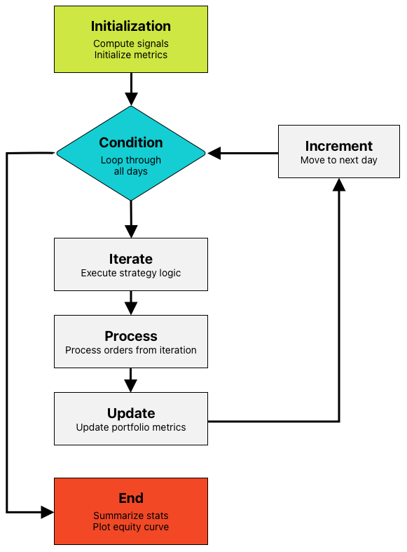

# System Design

## Overview

This document outlines the system design for our backtesting and trading strategy framework. The design emphasizes modularity, consistency, and flexibility to support the development, testing, and analysis of trading strategies.

---

## Strategy Class Structure

We will define a `Strategy` abstract base class. All custom strategies will inherit from this base class and implement the following key methods:

- `compute_signals()`:  
  Called **once before** the backtest starts to **precompute all trading signals**.  
  This ensures that the simulation has all necessary data to determine when to long/short an asset without introducing **lookahead bias**.

- `iterate()`:  
  Called **at the beginning of every trading session**.  
  This method contains the core strategy logic and is used to place orders based on the **precomputed signals**.

Additionally, the `Strategy` base class will include all the required infrastructure to:
- Process orders
- Simulate order execution
- Track portfolio performance

---

## Backtest Module

The `backtest` module will include a `run_daily()` method, which:

1. Takes a `Strategy` subclass (with implemented `compute_signals()` and `iterate()` methods) and **historical data** as input.
2. Iterates over the data **one day at a time**, calling `iterate()` on each trading session.
3. Handles:
   - Order execution
   - Portfolio state updates
   - Performance tracking over the backtest period

---

## Auxiliary Modules

We will also implement the following auxiliary modules:

- `metrics`:  
  For performance metrics such as returns, Sharpe ratio, drawdowns, etc.

- `plot`:  
  Visualization tools for trades, equity curves, drawdowns, etc.

- `risk`:  
  Risk assessment tools to analyze strategy robustness.

---

## Design Benefits

- Strategies are **easy to implement** and test while maintaining a **structured approach**.
- The backtesting engine is **efficient**, processing one day at a time to minimize computational overhead.
- Performance metrics and risk analysis are **integrated**, supporting robust strategy evaluation.
- Visualization tools help **analyze results effectively**, enabling rapid strategy iteration.

