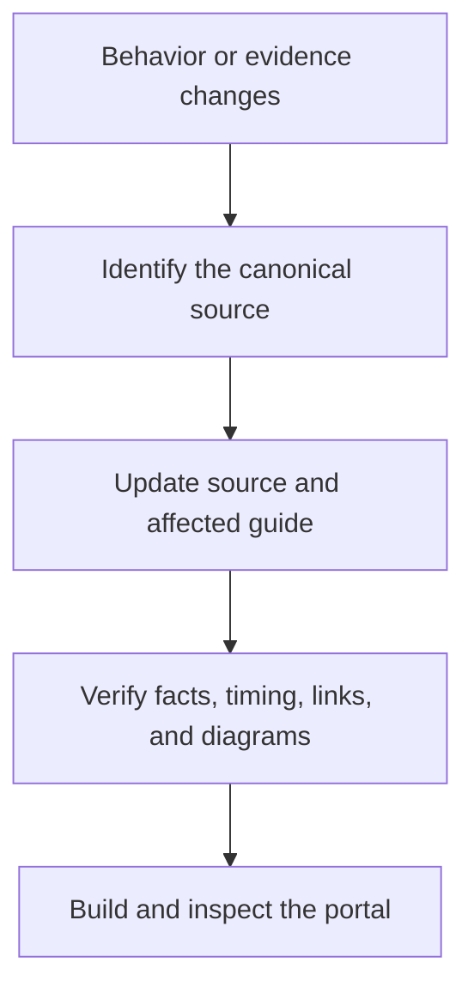

# Maintain the Base

!!! abstract "Who this section is for"
    Humans or AI adding, reviewing, or reorganizing documentation. Normal readers can ignore this section.

-   :material-ruler-square: **Documentation Standard**

    The minimum rules for readable, precise, source-backed pages.

    [:octicons-arrow-right-24: Open the standard](documentation-standard.md)

-   :material-map-legend: **Content Map**

    What exists, what is published, what needs review, and what is historical.

    [:octicons-arrow-right-24: Open the map](content-map.md)

-   :material-file-document-multiple-outline: **Templates**

    Start a strategy, operations, architecture, or research page without inventing a new structure.

    [:octicons-arrow-right-24: Open the strategy template](templates/strategy.md)

## Update flow

