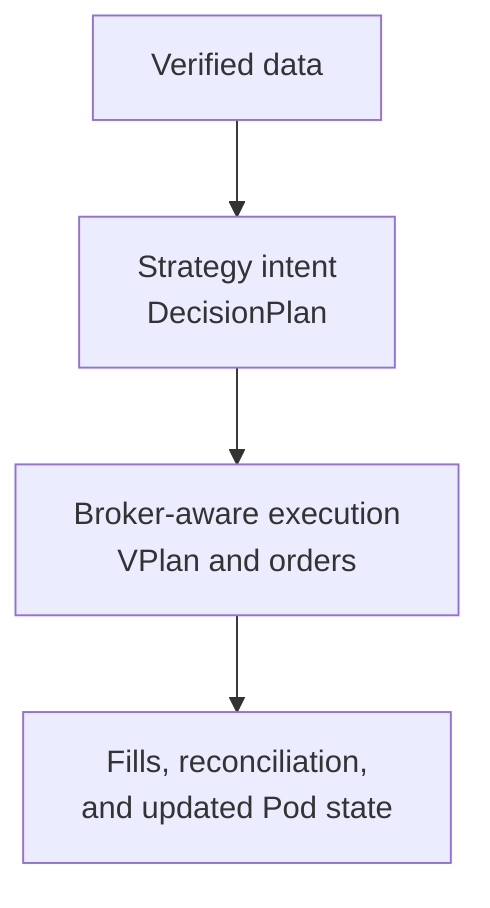

# Alpha Super Knowledge

!!! abstract "Purpose"
    One place to understand the system, read exact strategy rules, follow reviewed operating procedures, and find the governing source behind each important claim.

-   :material-compass-outline: **Understand**

    Start with the mental model and follow the system from data to reconciliation.

    [:octicons-arrow-right-24: Start here](start-here/index.md)

-   :material-chart-timeline-variant: **Strategies**

    Read strategy intuition, exact rules, timing, instruments, and limitations.

    [:octicons-arrow-right-24: Open the catalog](strategies/index.md)

-   :material-shield-check-outline: **Operations**

    Use only procedures that have been checked against current code and safety boundaries.

    [:octicons-arrow-right-24: Open operations](operations/index.md)

-   :material-flask-outline: **Research**

    Find studies, frozen specifications, evidence, and explicit verdicts.

    [:octicons-arrow-right-24: Open research](research/index.md)

-   :material-format-list-checks: **Backlog**

    Keep unprioritized ideas without presenting them as plans or commitments.

    [:octicons-arrow-right-24: Open the backlog](backlog/index.md)

-   :material-bookshelf: **Library**

    Locate canonical source documents and clearly separated historical material.

    [:octicons-arrow-right-24: Open current sources](reference/index.md)

-   :material-file-document-edit-outline: **Maintain**

    Standards, templates, and the migration map for people or AI updating the Base.

    [:octicons-arrow-right-24: Open maintenance](governance/index.md)

## The system in one picture

!!! warning "Reading surface only"
    The Base does not submit orders, change allocations, or replace broker and runtime verification. Canonical facts remain in the repository and are linked from each governed page.
