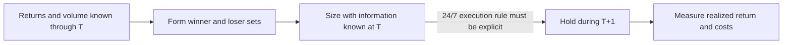

# Crypto TSMOM Lives in Volume-Weighted Returns

!!! important "Why this source is here"
    The central idea is unusually important: in this crypto study, the weighting rule appears to determine the result more than the momentum signal. Volume-weighted winners-minus-losers is strongly positive, while the same signal under equal weighting is strongly negative. That makes market construction, liquidity concentration, and causal volume timing the real research question.

[Open the preserved PDF](../../../assets/papers/crypto/crypto-tsmom-lives-in-volume-weighted-returns.pdf){ .md-button .md-button--primary }

## Source record

| Field | Value |
|---|---|
| Title | *6.50 Crypto TSMOM Lives in Volume-Weighted Returns* |
| Author | Ali H. Askar |
| Publication | Aligrithm |
| Publication date | July 22, 2026 |
| Source type | Research commentary summarizing an underlying academic study |
| Underlying study named by the article | *Cryptocurrency Volume-Weighted Time Series Momentum*, Huang, Sangiorgi, and Urquhart, SSRN 4825389 |
| Printed source length | 12 pages |
| Original article URL printed in the PDF | `https://aligrithm.com/crypto-tsmom-lives-in-volume-weighted-returns/` |
| Stored file status | Original PDF preserved without modification |
| SHA-256 | `CF80F20598685CF5775C652521E0CB999D653811919E79976B39DC9A3819DD29` |

## Knowledge status

| Boundary | Status |
|---|---|
| Role in the knowledge base | Crypto research commentary |
| Underlying academic paper | Identified, but not stored or independently audited here |
| Internal replication | Not performed |
| Strategy authority | None |
| PAPER or LIVE authority | None |
| Reported returns | Claims summarized by the article, not Alpha Super results |

## Exact idea

The source discusses a universe of 3,192 cryptocurrencies from 2014 through 2023. It defines a crypto market return using each coin's share of total dollar trading volume:

$$
R_{VW,t} = \sum_{i=1}^{N}
\frac{v_{i,t}}{\sum_{j=1}^{N} v_{j,t}} r_{i,t}
$$

Time-series momentum is tested by asking whether the market's cumulative return over the previous one to fourteen days predicts its next-day return. The tradable interpretation presented in the article splits coins into winners and losers using the formation-period return, weights each side by trading volume, goes long winners and short losers, holds for one day, and rebalances daily.

The article's main conclusion is narrower than “crypto momentum works.” It is closer to this:

> Momentum appears concentrated in the most heavily traded coins. A portfolio dominated by Bitcoin and Ethereum and financed by shorting smaller losers behaves very differently from an equal-weight portfolio spread across the long tail.

## Author-reported evidence

| Construction | Reported result |
|---|---|
| Volume-weighted WML, 1-day formation | 0.94% per day; annualized Sharpe 2.17 |
| Volume-weighted WML, 7-day formation | 0.87% per day; annualized Sharpe 2.66 |
| Volume-weighted WML, 14-day formation | 0.67% per day; annualized Sharpe 1.86 |
| Equal-weighted WML | Loss of 1.19% per day |
| Fixed 10 bp cost applied | 0.74%, 0.67%, and 0.47% per day for the 1-, 7-, and 14-day variants |

The article also reports regression slopes of 0.024 to 0.042, statistically significant from three-day through two-week horizons, and a monotonic next-day return pattern across past-return terciles. It says Bitcoin represented 52.62% of total volume and Ethereum another 16.82%, so roughly 70% of the weighting came from those two assets.

These are source claims, not internally verified findings.

## The critical timing problem

!!! danger "Potential same-day volume lookahead"
    The displayed formulas use `v_i,t` to weight `r_i,t`. If `v_i,t` is the completed trading volume from day `t`, it is not known before day `t` has ended and cannot be used to size exposure that earns the full return `r_i,t`. A tradeable replication must use a volume measure known before entry, such as lagged or pre-decision volume, and must state the resulting execution boundary explicitly.

A causal implementation must freeze a sequence such as:

Until the underlying study's exact timestamp alignment is audited, the headline portfolio should be treated as a statistical factor construction, not a proven executable strategy.

## Other limitations that matter

- **Short feasibility:** many small loser coins cannot be borrowed or shorted, and perpetual futures may not exist for them.
- **Costs and turnover:** daily long-short rebalancing across thousands of coins makes a fixed 10 bp assumption an optimistic upper-bound model, especially in the short tail.
- **Volume quality:** exchange-reported volume may include wash trading. A trusted-exchange check is useful but does not make the raw history clean.
- **Concentration:** the result may mainly be liquid BTC and ETH continuation plus an impractical short basket, rather than a broad crypto anomaly.
- **Market definition:** crypto has no universal exchange, closing auction, or single daily close. Venue, timezone, and aggregation rules can change the signal.
- **Universe history:** listing, delisting, dead coins, stale prices, stablecoins, forks, and survivorship treatment must be point-in-time correct.
- **Funding and collateral:** borrow, perpetual funding, margin, liquidation, and cross-venue collateral are part of the strategy, not implementation footnotes.
- **Search space:** all horizons, weighting schemes, subperiods, and alternative constructions must be counted before statistical promotion.

## Correct use inside Alpha Super

This source is best used as a diagnostic research prompt:

1. Reconstruct the volume-weighted crypto market return with a point-in-time, exchange-audited universe.
2. Compare contemporaneous-volume factor measurement with a separately labeled causal lagged-volume strategy.
3. Separate BTC and ETH contribution from the remaining long and short tails.
4. Re-run only on instruments that were actually shortable, with realistic fees, spreads, impact, funding, and collateral.
5. Keep every result research-only until timing and tradability survive those tests.

Return to the [Crypto collection](index.md) or the [Foundational Papers catalog](../index.md).
