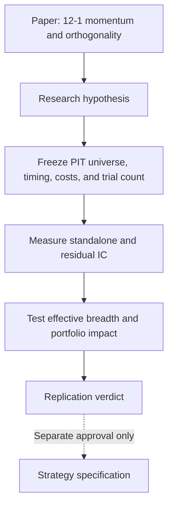

# Momentum Factor Construction and Signal Orthogonality

!!! important "Why this paper is here"
    This paper gives a compact mathematical bridge from a weak stock-level momentum signal to a scalable multi-signal portfolio. Its most useful contribution is the discipline it imposes: more signals add value only when they contribute independent predictive information after costs and constraints.

[Open the preserved original PDF](../../assets/papers/momentum-factor-construction-and-signal-orthogonality.pdf){ .md-button .md-button--primary }

## Source record

| Field | Value |
|---|---|
| Full title | *Momentum Factor Construction and Signal Orthogonality: A Mathematical Framework for Systematic Equity Strategies* |
| Author | Gilberto Pellerano |
| Affiliation stated in the paper | Head of Market Research, Windsheer Morningside |
| Date | May 2026 |
| Length | 10 pages |
| Stored file status | Original PDF preserved without modification |
| SHA-256 | `A01112296108C434E5A460B0AF07EBA29E4CE8D154A38E04849C3EBD1C7890D6` |

## Knowledge status

| Boundary | Status |
|---|---|
| Role in the knowledge base | Foundational primary source |
| Internal replication | Not yet performed |
| Authority over existing strategies | None; current strategy specifications remain governing |
| PAPER or LIVE authority | None |
| Headline performance figures | Author-reported claims, not Alpha Super results |

## Core framework

### 1. Canonical momentum signal

The paper starts with the 12-1 price-momentum signal: trailing twelve-month return with the most recent month skipped.

$$
M_{i,t} = \frac{P_{i,t-21}}{P_{i,t-252}} - 1
$$

It then ranks the signal within each rebalance-date cross-section and forms either an equal-weight long-only winner portfolio or an academic winner-minus-loser portfolio. It also proposes scaling momentum by trailing volatility to reduce raw momentum's bias toward high-volatility names.

### 2. Predictive edge through the information coefficient

Signal quality is measured with the cross-sectional Spearman correlation between today's score and a defined forward return:

$$
IC_t = \rho_{\mathrm{Spearman}}(R_{i,t}, r_{i,t+1})
$$

The paper emphasizes that a small but persistent information coefficient can matter more than an occasionally large, unstable one.

### 3. Breadth and implementation friction

The paper uses Grinold's fundamental law and the transfer coefficient to connect signal quality, independent decisions, and implementation constraints:

$$
IR = TC \cdot IC \cdot \sqrt{BR}
$$

The practical lesson is not that more positions automatically create more breadth. Bets and signals must be genuinely independent, and portfolio constraints reduce how much theoretical edge reaches the implemented portfolio.

### 4. Orthogonality before signal stacking

For a stack of correlated signals, the paper defines effective breadth as:

$$
BR_{\mathrm{eff}} = \frac{K^2}{\mathbf{1}^{\mathsf{T}}\Sigma_s\mathbf{1}}
$$

It then presents three ways to separate shared from incremental information:

- Gram-Schmidt orthogonalization;
- cross-sectional regression residualization;
- principal component decomposition.

The most operational test is residualization. If signal B is regressed on signal A, only the residual component of B should be tested for incremental predictive value. A strong standalone score that disappears after residualization does not expand the signal stack.

### 5. Risk, costs, and statistical honesty

The paper also connects the signal framework to:

- volatility targeting for momentum-crash control;
- turnover and cost-adjusted returns;
- a break-even information coefficient;
- Newey-West standard errors;
- block bootstrap confidence intervals;
- the deflated Sharpe ratio for multiple-testing correction.

These sections are important because they prevent signal discovery, portfolio construction, and implementation realism from becoming separate conversations.

## How this connects to Alpha Super

This source should influence the research process in four concrete ways:

1. Treat information coefficient persistence as a first-class diagnostic, not just portfolio CAGR.
2. Require incremental residual IC and effective-breadth evidence before adding a related signal.
3. Measure the transfer from unconstrained score to tradeable portfolio after turnover, costs, liquidity, and concentration limits.
4. Keep the paper-derived study separate from existing strategy, release, allocation, PAPER, and LIVE wiring until an internal replication earns a separate decision.

## Author-reported evidence and our treatment

| Paper statement | Evidence shown in the PDF | Knowledge-base treatment |
|---|---|---|
| The long-only monthly strategy produced 24.6% CAGR versus 9.6% for the S&P 500. | One summary table for 1980-2026, 389 rebalances, and a 100-stock subset. | Preserve as an author-reported result only. |
| Information ratio was 0.80 with mean IC of 0.013. | The same table reports an IC t-statistic of 1.09 and 55.3% positive months. | Conceptually interesting, but the displayed IC is not conventionally significant by the paper's own stated threshold. |
| Momentum persistence across regimes is strong evidence of a structural premium. | Narrative regime interpretation; no regime table or confidence intervals are provided. | Treat as a hypothesis that requires internal regime decomposition. |
| Volatility scaling substantially mitigates the momentum crash. | The method is defined, but no separate overlay result table is shown. | Do not treat the mitigation magnitude as replicated evidence. |
| Costs and capacity are incorporated into the framework. | Generic cost ranges and formulas are given; Table 2 does not identify a realized cost model. | Freeze and apply an explicit internal cost and capacity model before comparison. |

## Questions that must be frozen before replication

The PDF is a framework, not a complete reproducibility package. An internal study must resolve these points before viewing results:

- the exact point-in-time S&P 500 universe and the rule used to select the 100-stock subset;
- data vendor, price adjustment, delisting treatment, dividends, and corporate actions;
- the exact rebalance calendar and the meaning of day `t` in every signal and return formula;
- whether the decision is made at `Close_T` and executed at `Open_(T+1)`, or uses another explicitly causal boundary;
- the forward-return horizon used for each monthly IC observation;
- long-only versus long-short construction, tie handling, missing observations, and position caps;
- the train, validation, and out-of-sample dates, including every calibrated parameter;
- all tested signal variants and the multiple-comparison correction;
- commissions, slippage, borrow, market impact, turnover, liquidity, and capacity assumptions;
- exact code and saved artifacts needed to reproduce every table and claim.

!!! warning "Interpretation boundary"
    The paper is important because it supplies a coherent research architecture. Importance does not convert its backtest into verified project evidence. Any future replication must preserve causal timing, point-in-time membership, full trial accounting, and realistic implementation costs before a promotion verdict is possible.

## Proposed research lineage

If the paper is taken into active research, the first study should be a narrow replication of the canonical 12-1 long-only signal. Orthogonal extensions such as short-term reversal, quality, or low volatility should be preregistered as later arms and judged on incremental residual IC rather than on standalone backtest headlines.

Return to the [Foundational Papers catalog](index.md) or the [Research entry point](../../research/index.md).
