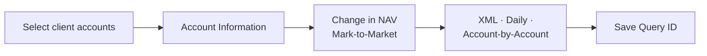
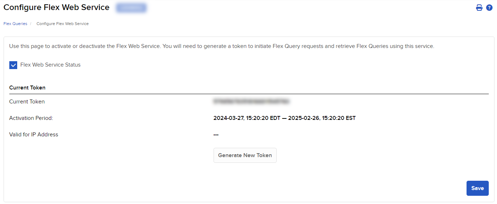
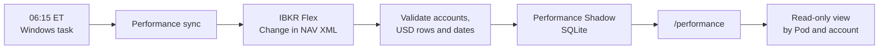

# Set Up IBKR Flex Performance

!!! abstract "Goal"
    Create one IBKR report, connect it to the client’s VPS, import the available history, and refresh it automatically every morning.

!!! danger "Before you start"
    This production checkout must contain LIVE releases for **one client only**. The IBKR user must be able to see every account used by those releases. The Flex Token is a secret: never paste it into chat, screenshots, commands, or Git.

## Setup

### 0. Confirm the client accounts

From the production repository root, print the LIVE releases that the sync will read:

```powershell
@'
from alpha.live.ibkr_performance_sync import build_live_binding_obj_list
from alpha.live.release_manifest import load_release_list

binding_by_pod = {
    binding_obj.pod_id_str: binding_obj
    for binding_obj in build_live_binding_obj_list()
}
for release_obj in load_release_list("alpha/live/releases"):
    if release_obj.mode_str == "live":
        binding_obj = binding_by_pod[release_obj.pod_id_str]
        print(
            release_obj.source_path_str,
            release_obj.user_id_str,
            release_obj.pod_id_str,
            release_obj.account_route_str,
            release_obj.enabled_bool,
            release_obj.session_calendar_id_str,
            binding_obj.return_start_date_str or "pending_baseline",
            sep=" | ",
        )
'@ | uv run python -
```

The columns are `manifest | client | Pod | IBKR account | enabled | calendar | return start`. Continue only when **every row belongs to this client**, every Pod has its own account, every calendar is `XNYS`, and no row says `pending_baseline`.

If a row is pending, finish that Pod’s normal LIVE onboarding first. After the market close, with the correct LIVE broker session connected, record the Pod’s trusted EOD snapshot:

```powershell
uv run python -m alpha.live.scheduler_service eod_snapshot --mode live --pod-id '<pod_id>' --json
```

This is a broker-backed LIVE state capture, not a Flex command. Do not run it before the Pod and its account route have been verified. Rerun Step 0 afterward and continue only when `pending_baseline` is gone.

Keep the printed account list. It is the exact list to select in IBKR, including disabled historical Pods whose performance must remain visible.

### 1. Create the Flex Query in IBKR

Open:

```text
Statements & Reporting → Flex Queries → Activity Flex Query → “+”
```

Name the Query:

```text
ALPHA_DAILY_TWR
```

Select **only** the following:

| Area | Required selection |
|---|---|
| Accounts | All LIVE accounts for this client; no PAPER or unrelated accounts |
| Account Information | `Account ID`, `Currency` |
| Change in NAV → Mark-to-Market | `Account ID`, `Currency`, `From Date`, `To Date`, `Starting Value`, `Ending Value`, `TWR` |
| Delivery format | `XML` |
| Period | `Last Business Day` |
| Breakout by Day | `Yes` |
| Multi-account format | `Account-by-Account` |
| Time zone | New York / Eastern, when shown |



Save the Query and record its numeric **Query ID**.

Temporarily run the Query for a short multi-day period such as `Last 30 Calendar Days` and download the XML. If the Run screen cannot override the period, edit the Query temporarily, download the sample, then restore `Last Business Day` and confirm its Query ID again.

Check only four things:

1. Every expected account appears, and no unrelated account appears.
2. Each selected account has its own `FlexStatement`.
3. Each account has one `ChangeInNAV` row per reported session, with no duplicate account/date rows.
4. Every row contains `currency="USD"`, `fromDate`, `toDate`, `startingValue`, `endingValue`, and `twr`.

If any check fails, fix the Query before continuing.

!!! danger "Sensitive data"
    The downloaded XML and Shadow database contain account IDs, financial values, and raw Flex XML. Screenshots, status output, task logs, and backups may also be sensitive. Keep them restricted to authorized operators and redact them before sharing.

### 2. Create the Web Service Token

Open:

```text
Statements & Reporting → Flex Queries → Flex Web Service Configuration
```

1. Enable the service and confirm it shows `ACTIVE`.
2. Choose the longest approved expiration offered; it must extend beyond the first scheduled run.
3. When the VPS has a confirmed fixed public IP, restrict the Token to that IP.
4. Generate a Token.
5. Record the Token and expiration date privately.
6. Set a renewal reminder seven days before expiration.

<figure markdown="span">
  
  <figcaption>The Token is the secret. The Query ID is the report identifier.</figcaption>
</figure>

Generating a new Token invalidates the previous Token. Do not replace an existing Token until you know nothing else uses it.

### 3. Add the settings on the VPS

Open PowerShell in the production repository root — the directory containing `pyproject.toml`.

Prepare a timestamped backup location and inspect its permissions **before** copying the secret-bearing file:

```powershell
$backupDir = 'C:\alpha\live_ops\config_backups'
New-Item -ItemType Directory -Force -Path $backupDir | Out-Null
Get-Acl $backupDir | Select-Object -ExpandProperty Access |
Select-Object IdentityReference, FileSystemRights, AccessControlType
```

Continue only when access is limited to the production operator, `SYSTEM`, and trusted administrators. Then create a non-overwriting backup:

```powershell
if (Test-Path .\config.env) {
    $stamp = Get-Date -Format 'yyyyMMdd-HHmmss'
    Copy-Item .\config.env (Join-Path $backupDir "config.env.pre-flex.$stamp.bak")
}
```

Open the file:

```powershell
notepad .\config.env
```

Preserve every existing line. Add or update these four settings so each appears **once**:

```text
IBKR_FLEX_TOKEN_STR=<secret token>
IBKR_FLEX_QUERY_ID_STR=<numeric query id>
IBKR_FLEX_QUERY_NAME_STR=ALPHA_DAILY_TWR
ALPHA_IBKR_PERFORMANCE_DB_PATH_STR=C:\alpha\live_ops\ibkr_performance.sqlite3
```

Inspect `config.env` permissions after saving:

```powershell
Get-Acl .\config.env | Select-Object -ExpandProperty Access |
Select-Object IdentityReference, FileSystemRights, AccessControlType
```

Continue only when `config.env` and its backup are restricted to the production operator, `SYSTEM`, and trusted administrators.

### 4. Import history and test one sync

First check whether a Shadow database already exists:

```powershell
uv run python -m alpha.live.ibkr_performance_sync status --json
```

For a new client, expect `status_str` to be `not_initialized`.

!!! warning "Existing database"
    If status reports an existing database, stop. Do not bootstrap, delete, or replace it until you know where it came from.

For a new database, run these commands **one at a time**:

```powershell
uv run python -m alpha.live.ibkr_performance_sync bootstrap
```

Expected result:

```text
Bootstrapped performance through YYYY-MM-DD.
```

Then:

```powershell
uv run python -m alpha.live.ibkr_performance_sync sync
uv run python -m alpha.live.ibkr_performance_sync status --json
```

The final status is good when:

- `status_str` is `available`;
- `covered_account_count_int` equals `expected_account_count_int`;
- `query_name_str` is `ALPHA_DAILY_TWR`;
- `coverage_through_date_str` and `latest_sync_timestamp_str` are present.

Open the Performance page and confirm every Pod is mapped to the intended account:

```text
http://127.0.0.1:8080/performance
```

A Pod marked `pending_baseline` is not finished. It needs its first trusted broker EOD baseline before official return coverage can begin.

### 5. Schedule the daily refresh

The VPS time zone must be `Eastern Standard Time`.

```powershell
Get-TimeZone
Get-ScheduledTask -TaskName AlphaIbkrPerformanceSync -ErrorAction SilentlyContinue
```

If the task already exists, stop and inspect it; the setup script can replace it. If no task exists:

```powershell
powershell -ExecutionPolicy Bypass -File scripts\setup_ibkr_performance_task.ps1
```

Confirm the installed task points to this production checkout and has the expected schedule:

```powershell
$task = Get-ScheduledTask -TaskName AlphaIbkrPerformanceSync
$task.Actions | Select-Object Execute, Arguments, WorkingDirectory
$task.Principal | Select-Object UserId, LogonType, RunLevel
$task.Triggers | Select-Object StartBoundary
$task.Settings | Select-Object StartWhenAvailable, MultipleInstances, RestartCount, RestartInterval, ExecutionTimeLimit
```

Expected: this checkout’s `run_ibkr_performance_sync.ps1`, daily `06:15`, `StartWhenAvailable`, no overlapping run, three retries every 15 minutes, and a 10-minute limit.

Now prove a **new** run completed instead of accepting an old result:

```powershell
$before = Get-ScheduledTaskInfo -TaskName AlphaIbkrPerformanceSync
$statusBefore = uv run python -m alpha.live.ibkr_performance_sync status --json | ConvertFrom-Json
Start-ScheduledTask -TaskName AlphaIbkrPerformanceSync
$deadline = (Get-Date).AddMinutes(10)
do {
    Start-Sleep -Seconds 2
    $state = (Get-ScheduledTask -TaskName AlphaIbkrPerformanceSync).State
    $after = Get-ScheduledTaskInfo -TaskName AlphaIbkrPerformanceSync
} while (($state -ne 'Ready' -or $after.LastRunTime -le $before.LastRunTime) -and (Get-Date) -lt $deadline)
if ($state -ne 'Ready' -or $after.LastRunTime -le $before.LastRunTime -or $after.LastTaskResult -ne 0) {
    throw 'The new scheduled run did not finish successfully.'
}
$after | Select-Object LastRunTime, LastTaskResult, NextRunTime
$statusAfter = uv run python -m alpha.live.ibkr_performance_sync status --json | ConvertFrom-Json
if ([datetime]$statusAfter.latest_sync_timestamp_str -le [datetime]$statusBefore.latest_sync_timestamp_str) {
    throw 'The Shadow sync timestamp did not advance.'
}
$statusAfter
```

The final status must remain `available`.

## Done

- [ ] The Query contains the correct accounts and required XML fields.
- [ ] The Web Service is `ACTIVE`, and the Token exists only in restricted `config.env` and its restricted recovery backup.
- [ ] Bootstrap and manual sync succeeded.
- [ ] Every Pod maps to the correct account on `/performance`.
- [ ] Every Pod is `available`; none remains `pending_baseline`.
- [ ] The scheduled task completed a new run with result `0`.

## How it works after setup



1. Every day at `06:15 ET`, Windows starts `scripts/run_ibkr_performance_sync.ps1`.
2. The sync requests the latest completed data from IBKR and rechecks roughly the last 35 calendar days.
3. The importer rejects unknown accounts, invalid currency, wrong Query name, bad dates, and duplicate account/day rows.
4. Valid rows are written transactionally to the separate Shadow SQLite database.
5. The Performance page reads that database and maps each IBKR account route to its Pod.

The Shadow is **read-only performance reporting**. It does not submit orders, change sizing, edit Pod state, or replace the official per-Pod broker return record. Any combined client line remains indicative and is not official Fund TWR.

## If it stops working

Do not delete the database or use `--replace`. First check:

```powershell
uv run python -m alpha.live.ibkr_performance_sync status --json
```

Stop and investigate when the output shows a wrong account, non-USD data, `error`, `stale`, missing coverage, or an unknown existing database/task.

For Token renewal: generate the replacement, update only `IBKR_FLEX_TOKEN_STR`, then run `sync` followed by `status --json`.

## Sources

- `alpha/live/ibkr_performance_sync.py` — bootstrap, daily sync, configuration, and account binding.
- `alpha/live/ibkr_performance.py` — XML validation and Shadow storage.
- `scripts/setup_ibkr_performance_task.ps1` — daily schedule and retry settings.
- [IBKR: Create an Activity Flex Query](https://www.ibkrguides.com/advisorportal/ug/activityflex.htm)
- [IBKR: Configure Flex Web Service](https://www.ibkrguides.com/advisorportal/ug/flex3.htm)
