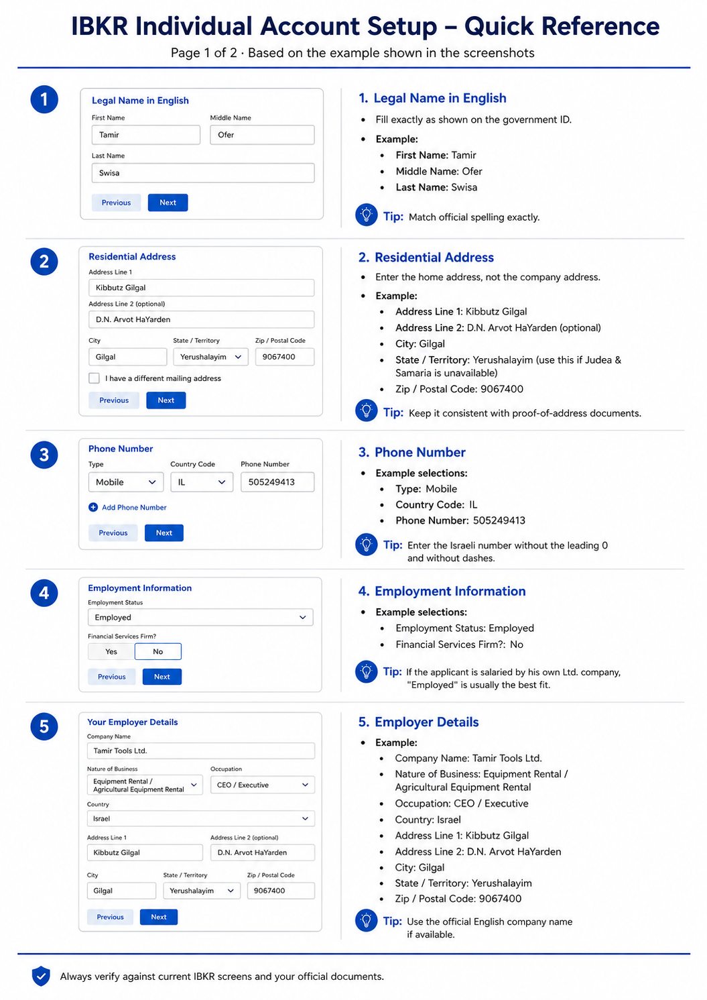
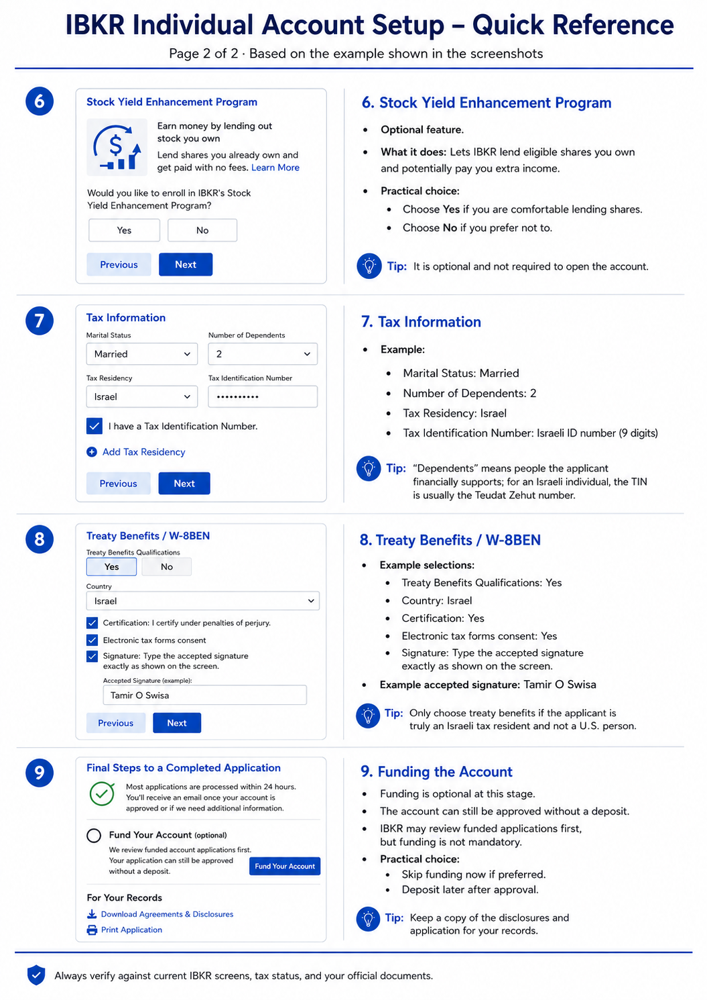

# Open an IBKR Individual Account

Use these screenshots as a map while completing the application.

!!! warning "Use the applicant's own details"
    Every value in the screenshots is an example. Follow the current IBKR form and the applicant's official documents. This guide is not tax or legal advice.

## Page 1 of 2

<figure markdown="span">
  
  <figcaption>Name, address, phone, employment, and employer details.</figcaption>
</figure>

## Page 2 of 2

<figure markdown="span">
  
  <figcaption>Stock lending, tax information, W-8BEN, and funding.</figcaption>
</figure>

## When finished

Download the application, agreements, and disclosures. After approval, continue with [New Client Onboarding](client-onboarding.md).
