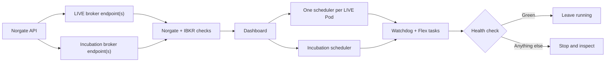

# VPS Runtime Checklist

!!! abstract "Goal"
    After a restart, know exactly what must run and how to prove it is healthy.

!!! warning "Scope"
    This is a restart and health guide for one already-approved client
    deployment. It is not a first-LIVE activation procedure. If LIVE approval
    is missing, or the manifests changed since the approved run, stop before
    `serve` and use [New Client Onboarding](client-onboarding.md).

!!! warning "Production proof pending"
    The commands and failure gates were reviewed against the current code. Keep
    this page in Draft until the full health check passes on the production VPS.

!!! danger "LIVE schedulers can submit real orders"
    Start a LIVE scheduler only for an approved release. If its manifest has
    `auto_submit_enabled_bool: true`, `serve` can submit real orders.

## What should be running

| Machine | Runtime | Count |
|---|---|---:|
| Norgate VPS | Norgate snapshot API | 1 |
| Client VPS | LIVE IBC + TWS or IB Gateway | 1 per broker endpoint in the enabled LIVE manifests |
| Client VPS | PAPER IBC + TWS or IB Gateway | 1 per broker endpoint in the enabled Incubation manifests |
| Client VPS | Dashboard | 1 |
| Client VPS | LIVE scheduler | 1 per enabled LIVE Pod |
| Client VPS | Incubation scheduler | 1 fan-out process, only when used |
| Client VPS | LIVE Ops Watchdog task | 1 |
| Client VPS | IBKR Flex Performance task | 1 |



## 1. Norgate VPS

Paste the approved Norgate deployment record, then run from the production
checkout:

```powershell
$ErrorActionPreference = 'Stop'
Set-Location C:\Users\Administrator\Documents\workspace\alpha_super

$approvedNorgateBranch = 'PASTE_APPROVED_BRANCH'
$approvedNorgateCommit = 'PASTE_APPROVED_COMMIT_SHA'
$approvedNorgateConfigSha256 = 'PASTE_APPROVED_CONFIG_SHA256'

if (-not (Test-Path .\pyproject.toml) -or -not (Test-Path .\.git) -or
    -not (Test-Path .\config.env)) { throw 'Wrong or incomplete Norgate checkout.' }
if ($approvedNorgateBranch -like 'PASTE_*' -or
    $approvedNorgateCommit -like 'PASTE_*' -or
    $approvedNorgateConfigSha256 -like 'PASTE_*') {
    throw 'Paste the approved Norgate deployment values first.'
}
$currentBranch = (& git branch --show-current).Trim()
if ($LASTEXITCODE -ne 0) { throw 'Could not read the Norgate branch.' }
$currentCommit = (& git rev-parse HEAD).Trim()
if ($LASTEXITCODE -ne 0) { throw 'Could not read the Norgate commit.' }
$workingTreeChangeList = @(& git status --porcelain --untracked-files=all)
if ($LASTEXITCODE -ne 0) { throw 'Could not inspect the Norgate working tree.' }
$configSha256 = (Get-FileHash -LiteralPath .\config.env -Algorithm SHA256).Hash
if ($currentBranch -ne $approvedNorgateBranch -or
    $currentCommit -ne $approvedNorgateCommit -or $workingTreeChangeList.Count -ne 0 -or
    $configSha256 -ne $approvedNorgateConfigSha256) {
    throw 'Norgate checkout or config does not match the approved deployment.'
}
.\scripts\start_norgate_server.cmd
```

Good:

- the Doctor prints `RESULT: PASS`, followed by `[PASS] server doctor passed`;
- the **Norgate API debug** window remains open.

Do not update code from this runtime page. Deploy a reviewed commit only during
an approved maintenance window, then record its exact branch, commit and
`config.env` SHA-256.

## 2. Client VPS

Start here in every PowerShell window:

```powershell
Set-Location C:\Users\Administrator\Documents\workspace\alpha_super
$clientId = 'YOUR_CLIENT_ID'
$liveRoot = "alpha/live/releases/$clientId"
$incubationRoot = 'NONE' # Replace with the Incubation release root when used.
```

Before any restart, run `git status --short --branch` and `git rev-parse HEAD`.
The commit must match the approved deployment record. Stop on unreviewed code
changes.

### A. Broker sessions

Start every installed broker session required by the enabled manifests. There
is no repository command for these VPS-specific shortcuts.

Good: every broker endpoint printed by the mandatory gate below is running,
logged into the approved user, and exposes the expected account routes.

### B. Pre-start checks

!!! danger "Mandatory gate before `serve`"
    Run [the automatic gate](#4-mandatory-pre-start-and-health-gate) with
    `$phase = 'prestart'`. Continue only after `PRE-START GATE: PASS`.

Run the Norgate client Doctor:

```powershell
uv run python scripts\doctor_norgate_client.py --releases-root $liveRoot
```

Good: the last line is `RESULT: PASS`.

When Incubation is used, run the same Doctor for its release root:

```powershell
uv run python scripts\doctor_norgate_client.py --releases-root $incubationRoot
```

With the LIVE schedulers still stopped, probe every enabled LIVE manifest:

```powershell
uv run python scripts/live_debug/ibkr_connectivity_probe.py --release-manifest-path $liveRoot/YOUR_LIVE_MANIFEST.yaml --json
```

Good: each result has `connected_bool: true`, and the requested account appears
in `visible_account_route_list`.

Run one Doctor per enabled LIVE Pod:

```powershell
uv run python -m alpha.live.runner doctor --mode live --releases-root $liveRoot --pod-id YOUR_LIVE_POD_ID
```

- `PASS` = ready now.
- `WAIT` is acceptable only for the printed expected timing reason, such as
  `not_month_end_session`.
- `BLOCK` = do not start the affected scheduler.

### C. Dashboard

Keep this command running in its own window:

```powershell
uv run python -m alpha.live.dashboard_v3 --host 127.0.0.1 --port 8080
```

Open [http://127.0.0.1:8080](http://127.0.0.1:8080). Every enabled LIVE Pod must appear.

### D. LIVE schedulers — approved restart only

First check for existing schedulers. Do not start a second copy for any Pod:

```powershell
Get-CimInstance Win32_Process -Filter "Name LIKE 'python%.exe'" |
    Where-Object { $_.CommandLine -like '*alpha.live.scheduler_service*serve*--mode live*' } |
    Select-Object ProcessId, CommandLine
```

Run one command per enabled LIVE Pod, each in a separate window:

```powershell
uv run python -m alpha.live.scheduler_service serve --mode live --releases-root $liveRoot --pod-id YOUR_LIVE_POD_ID
```

Good: every process remains running and reports its next action without an
exception or `BLOCK`.

### E. Incubation

Incubation uses the broker endpoint defined in each manifest for reference/open
prices. Its positions and P&L remain in the SIM ledger.

Before starting it, probe every Incubation broker endpoint with its approved
real PAPER account. Do not use the manifest's virtual `SIM_...` route:

```powershell
uv run python scripts/live_debug/ibkr_connectivity_probe.py --host YOUR_HOST --port YOUR_PORT --client-id YOUR_UNUSED_CLIENT_ID --account-route YOUR_REAL_PAPER_ACCOUNT --json
```

Good: `connected_bool: true`, and the requested account is visible.

If this client uses Incubation, check every enabled Incubation Pod and start one
fan-out scheduler:

```powershell
$incubationRoot = 'alpha/live/releases/YOUR_INCUBATION_CLIENT_ID'
uv run python -m alpha.live.runner status --mode incubation --releases-root $incubationRoot --pod-id YOUR_INCUBATION_POD_ID
uv run python -m alpha.live.scheduler_service next_due --mode incubation --releases-root $incubationRoot --pod-id YOUR_INCUBATION_POD_ID
uv run python -m alpha.live.scheduler_service serve --mode incubation --releases-root $incubationRoot
```

Repeat the first two commands for every enabled Incubation Pod. Good: every Pod
is present without a failed state, the fan-out scheduler remains running, and
every Pod appears on
[http://127.0.0.1:8080/incubation](http://127.0.0.1:8080/incubation).

## 3. Scheduled tasks

These tasks run automatically. **Do not rerun their setup scripts during normal
startup**: both setup scripts can replace an existing task.

```powershell
Get-ScheduledTask -TaskName AlphaLiveOpsWatchdog, AlphaIbkrPerformanceSync |
    Select-Object TaskName, State

Get-ScheduledTaskInfo -TaskName AlphaLiveOpsWatchdog |
    Select-Object LastRunTime, LastTaskResult, NextRunTime

Get-ScheduledTaskInfo -TaskName AlphaIbkrPerformanceSync |
    Select-Object LastRunTime, LastTaskResult, NextRunTime

$watchdogTask = Get-ScheduledTask -TaskName AlphaLiveOpsWatchdog
$flexTask = Get-ScheduledTask -TaskName AlphaIbkrPerformanceSync
$watchdogTask.Actions | Select-Object Execute, Arguments, WorkingDirectory
$flexTask.Actions | Select-Object Execute, Arguments, WorkingDirectory
$watchdogTask.Principal, $flexTask.Principal | Select-Object UserId, LogonType, RunLevel
$watchdogTask.Triggers, $flexTask.Triggers | Format-List StartBoundary, Repetition
$watchdogTask.Settings, $flexTask.Settings |
    Select-Object StartWhenAvailable, MultipleInstances, RestartCount, RestartInterval, ExecutionTimeLimit
```

Good:

- both tasks are `Ready` between runs;
- both have `LastTaskResult = 0`;
- Watchdog `LastRunTime` is recent;
- both actions point to this production checkout;
- both principals use `S4U`, `Limited`, `StartWhenAvailable`, `IgnoreNew`, and a
  10-minute limit;
- Watchdog repeats every 5 minutes;
- Flex runs at 06:15, retries three times every 15 minutes, and has a current
  successful daily run.

If a task is missing, stop. Do not run a setup script from this runtime page:

- Watchdog setup is still blocked in [New Client Onboarding](client-onboarding.md#8-start-monitoring).
- Flex has a reviewed [setup procedure](ibkr-flex-performance-setup.md#5-schedule-the-daily-refresh).

## 4. Mandatory pre-start and health gate

Run the same block twice:

1. Before any `serve`: keep `$phase = 'prestart'`; require `PRE-START GATE: PASS`.
2. After every service is running: set `$phase = 'poststart'`; require
   `LOCAL VPS HEALTH: PASS`.

The block derives Pods and broker endpoints from the manifests and stops on the
first failed check.

<details markdown="1">
<summary><strong>Copy/paste health check</strong></summary>

```powershell
$ErrorActionPreference = 'Stop'
Set-Location C:\Users\Administrator\Documents\workspace\alpha_super

$phase = 'prestart' # Change to 'poststart' only after every service is running.
$approvedBranch = 'PASTE_APPROVED_BRANCH'
$approvedCommit = 'PASTE_APPROVED_COMMIT_SHA'
$clientId = 'PASTE_CLIENT_ID'
$incubationClientId = 'NONE' # Replace with the Incubation user_id when used.
$brokerProbeMap = [ordered]@{
    # Use 'loopback:YOUR_PORT' for localhost, 127.0.0.1 or ::1.
    # 'YOUR_NORMALIZED_HOST:YOUR_PORT' = @{
    #     account_route_str = 'PASTE_APPROVED_REAL_IBKR_ACCOUNT'
    #     client_id_int = 'PASTE_APPROVED_UNUSED_PROBE_CLIENT_ID'
    # }
}
$approvedManifestSha256Map = [ordered]@{
    'alpha/live/releases/YOUR_CLIENT_ID/YOUR_LIVE_MANIFEST.yaml' = 'PASTE_APPROVED_SHA256'
    # Add every LIVE manifest, including disabled historical manifests.
    # Add every Incubation manifest in the checkout, including disabled ones.
}
$repoRoot = (Resolve-Path '.').Path
$allReleasesRoot = 'alpha/live/releases'
$liveRoot = "alpha/live/releases/$clientId"
$useIncubation = $incubationClientId -ne 'NONE'
$incubationRoot = if ($useIncubation) {
    "alpha/live/releases/$incubationClientId"
} else {
    '__NONE__'
}

if (-not (Test-Path .\pyproject.toml) -or -not (Test-Path .\.git)) {
    throw 'Wrong production checkout.'
}
if ($phase -notin @('prestart','poststart') -or
    $approvedBranch -like 'PASTE_*' -or $approvedCommit -like 'PASTE_*' -or
    $clientId -like 'PASTE_*') {
    throw 'Paste the approved deployment values first.'
}
$currentBranch = (& git branch --show-current).Trim()
if ($LASTEXITCODE -ne 0) { throw 'Could not read the current Git branch.' }
$currentCommit = (& git rev-parse HEAD).Trim()
if ($LASTEXITCODE -ne 0) { throw 'Could not read the current Git commit.' }
$workingTreeChangeList = @(& git status --porcelain --untracked-files=all)
if ($LASTEXITCODE -ne 0) { throw 'Could not inspect the Git working tree.' }
if ($currentBranch -ne $approvedBranch -or $currentCommit -ne $approvedCommit -or
    $workingTreeChangeList.Count -ne 0) {
    throw 'Checkout does not match the clean approved deployment.'
}
foreach ($manifestEntry in $approvedManifestSha256Map.GetEnumerator()) {
    if ($manifestEntry.Value -like 'PASTE_*') {
        throw 'Paste every approved manifest SHA-256 first.'
    }
    $actualHash = (Get-FileHash -LiteralPath $manifestEntry.Key -Algorithm SHA256).Hash
    if ($actualHash -ne $manifestEntry.Value) {
        throw "Manifest differs from the approved deployment: $($manifestEntry.Key)"
    }
}

$manifestJson = @'
import json
import sys
from pathlib import Path
from alpha.live.release_manifest import load_release_list

(
    all_root_str,
    client_id_str,
    live_root_str,
    incubation_client_id_str,
    incubation_root_str,
) = sys.argv[1:]

def canonical_broker_host_str(raw_host_str: str) -> str:
    normalized_host_str = str(raw_host_str).strip().lower()
    if normalized_host_str in {"localhost", "127.0.0.1", "::1"}:
        return "loopback"
    return normalized_host_str

release_list = load_release_list(all_root_str)
all_live_list = [release_obj for release_obj in release_list if release_obj.mode_str == "live"]
if not all_live_list:
    raise SystemExit("No LIVE manifests found.")
if {release_obj.user_id_str for release_obj in all_live_list} != {client_id_str}:
    raise SystemExit("LIVE checkout contains the wrong client.")
live_root_path = Path(live_root_str).resolve()
if any(
    not Path(release_obj.source_path_str).resolve().is_relative_to(live_root_path)
    for release_obj in all_live_list
):
    raise SystemExit("A LIVE manifest exists outside the selected client release root.")
live_list = [release_obj for release_obj in all_live_list if release_obj.enabled_bool]
if not live_list:
    raise SystemExit("No enabled LIVE Pods found.")

all_incubation_list = [
    release_obj for release_obj in release_list if release_obj.mode_str == "incubation"
]
enabled_incubation_list = [
    release_obj for release_obj in all_incubation_list if release_obj.enabled_bool
]
incubation_list = []
if incubation_root_str == "__NONE__":
    if enabled_incubation_list:
        raise SystemExit(
            "Enabled Incubation manifests exist; set the Incubation user_id."
        )
else:
    if not enabled_incubation_list:
        raise SystemExit("No enabled Incubation Pods found.")
    incubation_root_path = Path(incubation_root_str).resolve()
    if any(
        release_obj.user_id_str != incubation_client_id_str
        or not Path(release_obj.source_path_str).resolve().is_relative_to(
            incubation_root_path
        )
        for release_obj in enabled_incubation_list
    ):
        raise SystemExit(
            "An enabled Incubation manifest belongs to another user or release root."
        )
    incubation_list = enabled_incubation_list

if len({release_obj.account_route_str for release_obj in live_list}) != len(live_list):
    raise SystemExit("Duplicate LIVE account route.")
broker_identity_list = [
    (
        canonical_broker_host_str(release_obj.broker_host_str),
        release_obj.broker_port_int,
        release_obj.broker_client_id_int,
    )
    for release_obj in live_list + incubation_list
]
if len(set(broker_identity_list)) != len(broker_identity_list):
    raise SystemExit("Duplicate broker host/port/client ID across enabled Pods.")
live_endpoint_set = {
    (canonical_broker_host_str(release_obj.broker_host_str), release_obj.broker_port_int)
    for release_obj in live_list
}
incubation_endpoint_set = {
    (canonical_broker_host_str(release_obj.broker_host_str), release_obj.broker_port_int)
    for release_obj in incubation_list
}
if live_endpoint_set & incubation_endpoint_set:
    raise SystemExit("LIVE and Incubation cannot share one broker endpoint.")

print(json.dumps({
    "live": [
        {
            "pod_id_str": release_obj.pod_id_str,
            "source_path_str": release_obj.source_path_str,
            "broker_host_str": release_obj.broker_host_str,
            "broker_port_int": release_obj.broker_port_int,
            "broker_endpoint_str": (
                f"{canonical_broker_host_str(release_obj.broker_host_str)}:"
                f"{release_obj.broker_port_int}"
            ),
            "broker_client_id_int": release_obj.broker_client_id_int,
            "account_route_str": release_obj.account_route_str,
        }
        for release_obj in live_list
    ],
    "incubation": [
        {
            "pod_id_str": release_obj.pod_id_str,
            "source_path_str": release_obj.source_path_str,
            "broker_host_str": release_obj.broker_host_str,
            "broker_port_int": release_obj.broker_port_int,
            "broker_endpoint_str": (
                f"{canonical_broker_host_str(release_obj.broker_host_str)}:"
                f"{release_obj.broker_port_int}"
            ),
            "broker_client_id_int": release_obj.broker_client_id_int,
            "account_route_str": release_obj.account_route_str,
        }
        for release_obj in incubation_list
    ],
    "live_broker_endpoint_list": sorted({
        f"{canonical_broker_host_str(release_obj.broker_host_str)}:{release_obj.broker_port_int}"
        for release_obj in live_list
    }),
    "incubation_broker_endpoint_list": sorted({
        f"{canonical_broker_host_str(release_obj.broker_host_str)}:{release_obj.broker_port_int}"
        for release_obj in incubation_list
    }),
    "approved_manifest_path_str_list": [
        release_obj.source_path_str
        for release_obj in all_live_list + all_incubation_list
    ],
}))
'@ | uv run python - $allReleasesRoot $clientId $liveRoot $incubationClientId $incubationRoot
if ($LASTEXITCODE -ne 0) { throw 'Manifest inventory failed.' }
$manifestMap = $manifestJson | ConvertFrom-Json

$approvedManifestPathList = @(
    $approvedManifestSha256Map.Keys | ForEach-Object { (Resolve-Path -LiteralPath $_).Path }
)
$discoveredManifestPathList = @(
    $manifestMap.approved_manifest_path_str_list |
        ForEach-Object { (Resolve-Path -LiteralPath $_).Path }
)
if (@(Compare-Object $approvedManifestPathList $discoveredManifestPathList).Count -ne 0) {
    throw 'Approved manifest hash map does not match the complete manifest set.'
}

function Invoke-CheckedJson {
    param([string]$Label, [string[]]$ArgumentList)
    $rawText = (& uv @ArgumentList) -join [Environment]::NewLine
    if ($LASTEXITCODE -ne 0) { throw "$Label failed." }
    $jsonStartIndex = $rawText.IndexOf('{')
    if ($jsonStartIndex -lt 0) { throw "$Label returned no JSON object." }
    $jsonText = $rawText.Substring($jsonStartIndex)
    try { return ($jsonText | ConvertFrom-Json) }
    catch { throw "$Label returned invalid JSON." }
}

function Test-ExactCliArgument {
    param([string]$CommandLine, [string]$Name, [string]$Value)
    $namePattern = [regex]::Escape($Name)
    $valuePattern = [regex]::Escape($Value)
    $pattern = "(?i)(?:^|\s)$namePattern\s+(?:`"$valuePattern`"|$valuePattern)(?:\s|$)"
    return [regex]::IsMatch($CommandLine, $pattern)
}

function Test-ExactCliToken {
    param([string]$CommandLine, [string]$Token)
    $tokenPattern = [regex]::Escape($Token)
    return [regex]::IsMatch($CommandLine, "(?i)(?:^|\s)$tokenPattern(?:\s|$)")
}

Write-Host "LIVE broker endpoint(s): $(@($manifestMap.live_broker_endpoint_list) -join ', ')"
if ($useIncubation) {
    Write-Host "Incubation broker endpoint(s): $(@($manifestMap.incubation_broker_endpoint_list) -join ', ')"
}

& uv run python scripts\doctor_norgate_client.py --releases-root $liveRoot
if ($LASTEXITCODE -ne 0) { throw 'Norgate Doctor failed for LIVE.' }
if ($useIncubation) {
    & uv run python scripts\doctor_norgate_client.py --releases-root $incubationRoot
    if ($LASTEXITCODE -ne 0) { throw 'Norgate Doctor failed for Incubation.' }
}

$allManifestList = @($manifestMap.live) + @($manifestMap.incubation)
$discoveredBrokerEndpointList = @(
    @($manifestMap.live_broker_endpoint_list) +
    @($manifestMap.incubation_broker_endpoint_list) |
        Select-Object -Unique
)
$approvedBrokerEndpointList = @($brokerProbeMap.Keys)
if (@(Compare-Object $approvedBrokerEndpointList $discoveredBrokerEndpointList).Count -ne 0) {
    throw 'Broker probe map does not match the enabled broker endpoints.'
}
foreach ($endpoint in $discoveredBrokerEndpointList) {
    $endpointManifestList = @($allManifestList | Where-Object {
        $_.broker_endpoint_str -eq $endpoint
    })
    $probeConfig = $brokerProbeMap[$endpoint]
    $probeAccountRoute = [string]$probeConfig.account_route_str
    $probeClientId = 0
    if ($probeAccountRoute -like 'PASTE_*' -or $probeAccountRoute -like 'SIM_*' -or
        -not [int]::TryParse([string]$probeConfig.client_id_int, [ref]$probeClientId)) {
        throw "Broker probe config is incomplete: $endpoint"
    }
    if (@($endpointManifestList | Where-Object {
        $_.broker_client_id_int -eq $probeClientId
    }).Count -ne 0) {
        throw "Broker probe client ID is assigned to a scheduler: $endpoint"
    }
    $representativeManifest = $endpointManifestList[0]
    $expectedAccountMode = if ($endpoint -in @($manifestMap.incubation_broker_endpoint_list)) {
        'paper'
    } else {
        'live'
    }
    $brokerProbe = Invoke-CheckedJson "IBKR endpoint probe: $endpoint" @(
        'run','python','scripts/live_debug/ibkr_connectivity_probe.py',
        '--host',$representativeManifest.broker_host_str,
        '--port',"$($representativeManifest.broker_port_int)",
        '--client-id',"$probeClientId",'--account-route',$probeAccountRoute,'--json'
    )
    if (-not $brokerProbe.connected_bool -or
        $brokerProbe.requested_account_route_str -ne $probeAccountRoute -or
        $brokerProbe.requested_account_mode_str -ne $expectedAccountMode -or
        $probeAccountRoute -notin @($brokerProbe.visible_account_route_list)) {
        throw "Broker endpoint has the wrong account or mode: $endpoint"
    }
    foreach ($liveManifest in @($manifestMap.live | Where-Object {
        $_.broker_endpoint_str -eq $endpoint
    })) {
        if ($liveManifest.account_route_str -notin @($brokerProbe.visible_account_route_list)) {
            throw "LIVE account route is not visible: $($liveManifest.pod_id_str)"
        }
    }
}

$preStartSchedulerProcessList = @(
    Get-CimInstance Win32_Process -Filter "Name LIKE 'python%.exe'" |
        Where-Object {
            (Test-ExactCliArgument $_.CommandLine '-m' 'alpha.live.scheduler_service') -and
            (Test-ExactCliToken $_.CommandLine 'serve')
        }
)
if ($phase -eq 'prestart') {
    if ($preStartSchedulerProcessList.Count -ne 0) {
        throw 'A scheduler is already running. Do not start a duplicate; use poststart health instead.'
    }
    Write-Host 'PRE-START GATE: PASS' -ForegroundColor Green
    return
}

foreach ($manifest in $manifestMap.live) {
    $podId = $manifest.pod_id_str
    Invoke-CheckedJson "LIVE status: $podId" @(
        'run','python','-m','alpha.live.runner','status','--mode','live',
        '--releases-root',$liveRoot,'--pod-id',$podId,'--json'
    ) | Out-Null
    Invoke-CheckedJson "LIVE next_due: $podId" @(
        'run','python','-m','alpha.live.scheduler_service','next_due','--mode','live',
        '--releases-root',$liveRoot,'--pod-id',$podId,'--json'
    ) | Out-Null
}

foreach ($manifest in $manifestMap.incubation) {
    $podId = $manifest.pod_id_str
    $incubationStatus = Invoke-CheckedJson "Incubation status: $podId" @(
        'run','python','-m','alpha.live.runner','status','--mode','incubation',
        '--releases-root',$incubationRoot,'--pod-id',$podId,'--json'
    )
    $podStatusList = @($incubationStatus.pod_status_dict_list)
    $blockedStateList = @('blocked','failed','error','manual_review','manual_review_required')
    if ($incubationStatus.enabled_pod_count_int -ne 1 -or
        $podStatusList.Count -ne 1 -or
        $podStatusList[0].pod_id_str -ne $podId -or
        $podStatusList[0].exception_count_int -ne 0 -or
        $podStatusList[0].missing_ack_count_int -ne 0 -or
        $podStatusList[0].rehearsal_status_dict.status_str -ne 'active' -or
        $podStatusList[0].latest_decision_plan_status_str -in $blockedStateList -or
        $podStatusList[0].latest_vplan_status_str -in $blockedStateList -or
        $podStatusList[0].rehearsal_status_dict.promotion_gate_status_str -in $blockedStateList -or
        $podStatusList[0].rehearsal_status_dict.last_cycle_status_str -in $blockedStateList -or
        $podStatusList[0].reason_code_str -in @(
            'execution_exception_parked','manual_review_required','snapshot_window_expired'
        )) {
        throw "Incubation status is unhealthy: $podId"
    }

    $incubationNextDue = Invoke-CheckedJson "Incubation next_due: $podId" @(
        'run','python','-m','alpha.live.scheduler_service','next_due','--mode','incubation',
        '--releases-root',$incubationRoot,'--pod-id',$podId,'--json'
    )
    $acceptedReasonList = @(
        'eod_snapshot_due','waiting_for_eod_snapshot','ready_to_build_decision_plan',
        'ready_to_reconcile','waiting_for_post_execution_reconcile','vplan_ready',
        'ready_to_build_vplan','waiting_for_submission_window','no_due_work'
    )
    if (@($incubationNextDue.related_pod_id_list).Count -ne 1 -or
        $incubationNextDue.related_pod_id_list[0] -ne $podId -or
        $incubationNextDue.reason_code_str -notin $acceptedReasonList) {
        throw "Incubation next_due is blocked or unknown: $podId"
    }
}

$ops = Invoke-CheckedJson 'LIVE OPS' @(
    'run','python','-m','alpha.live.runner','ops_report','--mode','live',
    '--releases-root',$liveRoot,'--json'
)
$expectedLivePodCount = @($manifestMap.live).Count
if ($ops.overall_severity_str -ne 'green' -or $ops.source_stale_bool -or
    $ops.pod_count_int -ne $expectedLivePodCount) {
    throw "LIVE OPS is not fresh green for every Pod: $($ops.overall_severity_str)"
}

$flex = Invoke-CheckedJson 'Flex status' @(
    'run','python','-m','alpha.live.ibkr_performance_sync',
    '--releases-root',$liveRoot,'status','--json'
)
if ($flex.status_str -ne 'available' -or
    $flex.covered_account_count_int -ne $flex.expected_account_count_int) {
    throw 'Flex is not available for every expected account.'
}

$dashboardText = (Invoke-WebRequest http://127.0.0.1:8080/healthz -UseBasicParsing).Content
if ($dashboardText -notmatch 'dashboard_v3 ok') { throw 'Dashboard health check failed.' }

$schedulerProcessList = @(
    Get-CimInstance Win32_Process -Filter "Name LIKE 'python%.exe'" |
        Where-Object {
            (Test-ExactCliArgument $_.CommandLine '-m' 'alpha.live.scheduler_service') -and
            (Test-ExactCliToken $_.CommandLine 'serve')
        }
)
$liveProcessList = @($schedulerProcessList | Where-Object {
    Test-ExactCliArgument $_.CommandLine '--mode' 'live'
})
if ($liveProcessList.Count -ne $expectedLivePodCount) {
    throw 'LIVE scheduler process count does not match the enabled Pod count.'
}
$repoExecutablePrefix = $repoRoot.TrimEnd('\') + '\'
foreach ($manifest in $manifestMap.live) {
    $podId = $manifest.pod_id_str
    $podProcessList = @($liveProcessList | Where-Object {
        (Test-ExactCliArgument $_.CommandLine '--releases-root' $liveRoot) -and
        (Test-ExactCliArgument $_.CommandLine '--pod-id' $podId)
    })
    if ($podProcessList.Count -ne 1 -or
        -not $podProcessList[0].ExecutablePath.StartsWith($repoExecutablePrefix, [System.StringComparison]::OrdinalIgnoreCase)) {
        throw "Expected one production-checkout LIVE scheduler for $podId."
    }
}
$allIncubationProcessList = @($schedulerProcessList | Where-Object {
    Test-ExactCliArgument $_.CommandLine '--mode' 'incubation'
})
$expectedIncubationProcessCount = if ($useIncubation) { 1 } else { 0 }
if ($allIncubationProcessList.Count -ne $expectedIncubationProcessCount) {
    throw 'Incubation scheduler process count is wrong.'
}
if ($useIncubation) {
    $incubationProcessList = @($allIncubationProcessList | Where-Object {
        (Test-ExactCliArgument $_.CommandLine '--releases-root' $incubationRoot) -and
        $_.CommandLine -notmatch '(?i)(?:^|\s)--pod-id\s+'
    })
    if ($incubationProcessList.Count -ne 1 -or
        -not $incubationProcessList[0].ExecutablePath.StartsWith($repoExecutablePrefix, [System.StringComparison]::OrdinalIgnoreCase)) {
        throw 'Expected one production-checkout Incubation fan-out scheduler.'
    }
}

$watchdogTask = Get-ScheduledTask -TaskName AlphaLiveOpsWatchdog
$flexTask = Get-ScheduledTask -TaskName AlphaIbkrPerformanceSync
if ((Get-TimeZone).Id -ne 'Eastern Standard Time') {
    throw 'Windows time zone must be Eastern Standard Time.'
}
if ($watchdogTask.State.ToString() -notin @('Ready','Running') -or
    $flexTask.State.ToString() -notin @('Ready','Running')) {
    throw 'Watchdog or Flex task is disabled or unavailable.'
}
$watchdogActionList = @($watchdogTask.Actions)
$flexActionList = @($flexTask.Actions)
$watchdogWrapper = (Resolve-Path .\scripts\run_live_ops_watchdog.ps1).Path
$flexWrapper = (Resolve-Path .\scripts\run_ibkr_performance_sync.ps1).Path
if ($watchdogActionList.Count -ne 1 -or
    $watchdogActionList[0].WorkingDirectory -ne $repoRoot -or
    [IO.Path]::GetFileName($watchdogActionList[0].Execute) -ne 'powershell.exe' -or
    -not (Test-ExactCliArgument $watchdogActionList[0].Arguments '-File' $watchdogWrapper) -or
    -not (Test-ExactCliArgument $watchdogActionList[0].Arguments '-Mode' 'live')) {
    throw 'Watchdog task points to the wrong checkout or mode.'
}
if ($flexActionList.Count -ne 1 -or
    $flexActionList[0].WorkingDirectory -ne $repoRoot -or
    [IO.Path]::GetFileName($flexActionList[0].Execute) -ne 'powershell.exe' -or
    -not (Test-ExactCliArgument $flexActionList[0].Arguments '-File' $flexWrapper)) {
    throw 'Flex task points to the wrong checkout.'
}
foreach ($task in @($watchdogTask, $flexTask)) {
    if ($task.Principal.LogonType.ToString() -ne 'S4U' -or
        $task.Principal.RunLevel.ToString() -ne 'Limited' -or
        -not $task.Settings.StartWhenAvailable -or
        $task.Settings.MultipleInstances.ToString() -ne 'IgnoreNew' -or
        $task.Settings.ExecutionTimeLimit -ne 'PT10M') {
        throw "Scheduled-task contract mismatch: $($task.TaskName)"
    }
}
if ($watchdogTask.Triggers[0].Repetition.Interval -ne 'PT5M') {
    throw 'Watchdog interval is not 5 minutes.'
}
if (([datetime]$flexTask.Triggers[0].StartBoundary).TimeOfDay -ne ([timespan]'06:15:00') -or
    $flexTask.Settings.RestartCount -ne 3 -or
    $flexTask.Settings.RestartInterval -ne 'PT15M') {
    throw 'Flex schedule or retry contract is wrong.'
}

$watchdogInfo = Get-ScheduledTaskInfo -TaskName AlphaLiveOpsWatchdog
$flexInfo = Get-ScheduledTaskInfo -TaskName AlphaIbkrPerformanceSync
$now = Get-Date
if ($watchdogInfo.LastTaskResult -ne 0 -or
    ($now - $watchdogInfo.LastRunTime).TotalMinutes -gt 15) {
    throw 'Watchdog has no successful run in the last 15 minutes.'
}
if ($flexInfo.LastTaskResult -ne 0 -or
    ($now - $flexInfo.LastRunTime).TotalHours -gt 26 -or
    $flexInfo.NextRunTime -le $now -or
    ($flexInfo.NextRunTime - $now).TotalHours -gt 26) {
    throw 'Flex task timing or its latest result is unhealthy.'
}
$latestSyncTimestamp = [datetimeoffset]$flex.latest_sync_timestamp_str
if ($latestSyncTimestamp.UtcDateTime -lt $flexInfo.LastRunTime.ToUniversalTime()) {
    throw 'Flex Shadow was not refreshed by the latest scheduled run.'
}

Write-Host 'LOCAL VPS HEALTH: PASS' -ForegroundColor Green
```

</details>

After the local PASS, confirm Healthchecks.io received a new Watchdog ping and
open `/live`. When Incubation is used, open `/incubation` too. A local PASS
without the external heartbeat is not a complete health pass.

`yellow` means waiting or review is needed. `gray` means evidence is missing.
Neither is a full pass. `red`, `BLOCK`, a stale report, or a missing Pod means
stop and inspect.

## 5. Debug bundle

Create one bundle per affected Pod:

```powershell
.\scripts\collect_vps_debug_bundle.ps1 -Mode live -ReleasesRoot $liveRoot -PodId YOUR_LIVE_POD_ID
```

The bundle is diagnostic; it does not submit orders. Redact account and
financial data before sharing it outside the approved operations channel.
