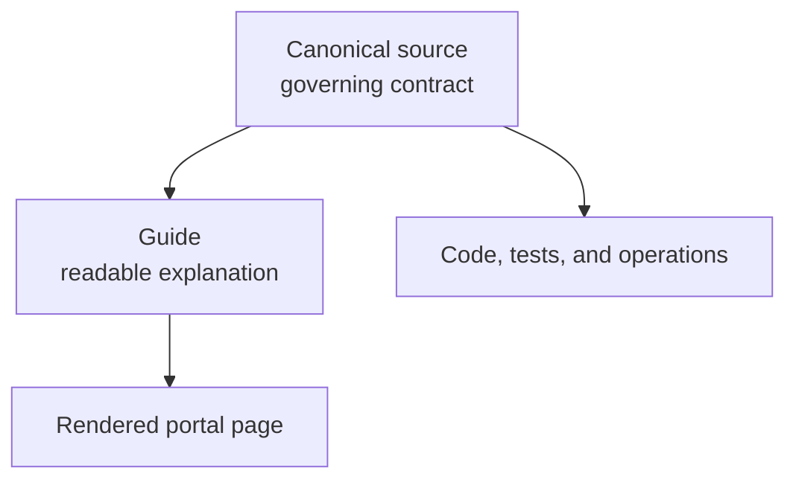

# Current Sources

!!! abstract "Use this page when"
    You need the exact governing contract rather than a simplified explanation.

| Question | Governing source |
|---|---|
| What quantitative principles govern the project? | `QUANT_PHILOSOPHY.md` |
| Which assumptions and realism gaps are currently accepted? | `ASSUMPTIONS_AND_GAPS.md` |
| How should AI and engineers change the repository? | `AGENTS.md`, `CLAUDE.md`, `docs/ai/KARPATHY_GUIDELINES.md` |
| Where does LIVE operation begin? | `LIVE_START_HERE.md` |
| What is the detailed LIVE contract? | `docs/live/LIVE_TECHNICAL_REFERENCE.md` |
| How is LIVE architecture organized? | `docs/live/LIVE_TRADING_ARCHITECTURE.md` |
| What does Inspector promise? | `docs/live/INSPECTOR_CONTRACT.md` |
| What do release fields mean? | `docs/live/LIVE_RELEASES_FIELDS.md` |

## Source hierarchy

If a guide conflicts with its canonical source, stop and correct the guide. Existing source paths remain stable because code, agents, and workflows already depend on them.
