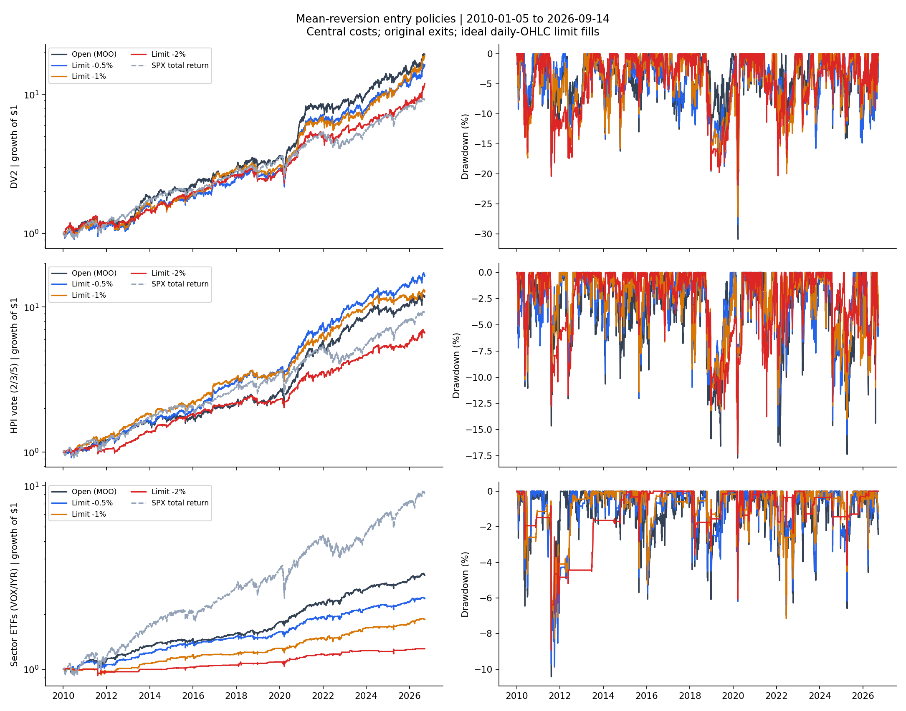
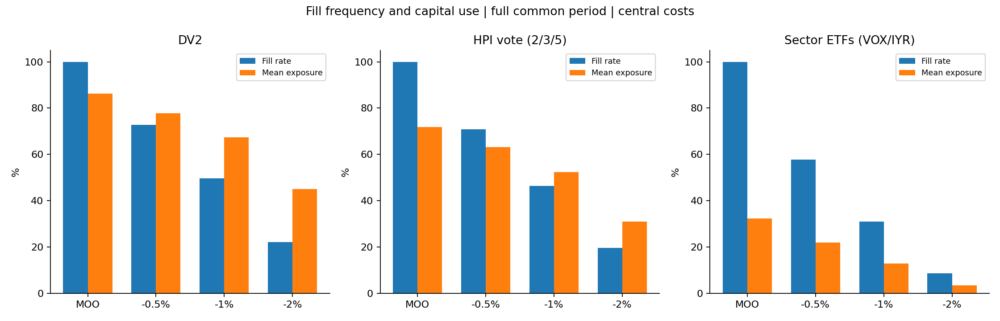
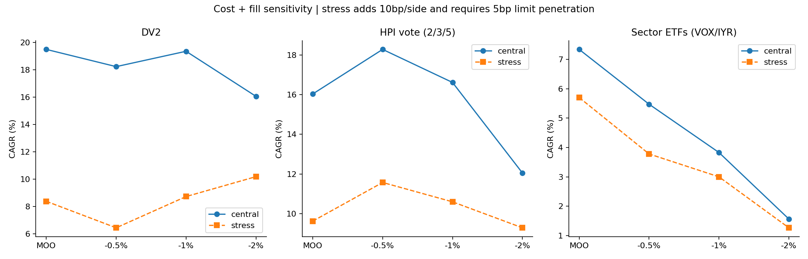

# האם כדאי לחכות לירידה עמוקה יותר לפני כניסה?

## סיכום

אין שיפור אחיד מעצם ההמתנה למחיר נמוך יותר. HPI בלימיט 0.5% מציג שיפור היסטורי, ו־DV2 בלימיט 1% מציג פשרה מעניינת בין תשואה לסיכון; בסקטורים הניסוי אינו תומך בהחלפת הכניסה בפתיחה. אף חלופה אינה מאומתת לאימוץ תפעולי.

נבדקו **24 חלופות שנקבעו מראש**: שלוש מערכות חזרה לממוצע, ארבע מדיניות כניסה ושתי שכבות עלות. החלון המשותף הוא **5 בינואר 2010 עד 14 בספטמבר 2026**, ובו 4,198 ימי מסחר. כל תיק התחיל ב־100,000 דולר והתפתח בנפרד. זהו ניסוי ברכיב הכניסה של המערכות הקיימות; האיתותים, הדירוג, כללי חישוב כמות המניות וכללי היציאה נשמרו. הכמויות בפועל משתנות עם שוויו של כל תיק.

**DV2:** לימיט 1% כמעט שומר על התשואה השנתית (19.35% מול 19.49%), ומשפר את השארפ ואת הירידה המרבית. זהו שינוי ביחס בין סיכון לתשואה, עם תלות חזקה בתקופה ובעלות.

**HPI בהצבעת 2/3/5:** לימיט 0.5% מעלה את התשואה השנתית מ־16.03% ל־18.28%. עיקר היתרון נוצר בשנים 2015–2019 ותלוי גם בשינוי מסלול העסקאות של התיק.

**סקטורים VOX/IYR:** כל שלושת העומקים מורידים את התשואה ואת השארפ. הירידה בחשיפה אינה מפצה על העסקאות שהוחמצו; התוצאה שלילית בכל ארבע תקופות המשנה ובשתי שכבות העלות.

השאלה החשובה היא האם מחיר זול יותר מפצה על עסקאות שלא מתמלאות ועל הזמן שבו ההון נשאר במזומן. תשואה ממוצעת טובה יותר בעסקאות שהתמלאו, כשלעצמה, אינה תשובה לשאלה הזאת.

## מה לקחנו מהמאמר

המאמר *Where to Buy the (Deeper) Dip* של Concretum Research מציג כניסות מתחת לפתיחת היום הבא לאחר שפל של עשרה ימים. ככל שהלימיט עמוק יותר, מספר העסקאות קטן והתשואה הממוצעת לעסקה המדווחת עולה. לדוגמה, בטבלה שבמאמר כניסה בפתיחה כוללת 71,091 עסקאות עם ממוצע של 29 נקודות בסיס; ב־1% מתחת לפתיחה יש 39,801 עסקאות וממוצע של 46 נקודות בסיס.

כאן נבדקה העברת **רעיון הכניסה** לשלוש המערכות שביקשת. אסטרטגיית שפל עשרת הימים של המאמר לא שוחזרה. עומק 0.5% הוא תוספת שביקשת; לא נוספו עומקים אחרי צפייה בתוצאות. השוואת הבסיס לקוד הקיים עברה התאמה מלאה, אבל אין בכך אישור לכל הנחות הנתונים של הקוד, ובפרט למגבלת החברות במדד של DV2.

## מה בדיוק השתנה

איתות ותקציב נקבעים בסגירת יום T. בגרסת הבסיס מתבצעת קנייה בפתיחת T+1. בגרסת הלימיט רואים תחילה את הפתיחה ומציבים מחיר נמוך ממנה באחוז הקבוע. לדוגמה, לפתיחה של 100 דולר ועומק 1% מתאים לימיט של 99 דולר. הוא בתוקף לאותו יום בלבד.

$$
L_{T+1}=O_{T+1}(1-d),\qquad d\in\{0.005,0.01,0.02\}
$$

$$
\mathrm{Fill}_{T+1}=\mathbf{1}\{Low_{T+1}\le L_{T+1}\},\qquad P_{buy}=L_{T+1}
$$

אם אין מילוי, הכסף נשאר במזומן. אין קנייה מאוחרת במחיר שוק ואין החלפה תוך־יומית במניה שהגיעה ללימיט. בסגירה הבאה המערכת בוחנת מחדש את האיתות המקורי. כך החמצת עסקה יכולה לשנות גם את בחירת העסקאות בעתיד; לכן לכל חלופה נוהל תיק עצמאי. בכל החלופות איתות היציאה הרגילה מתקבל בסגירה והמכירה מתבצעת בפתיחת היום הבא; סגירה מנהלית בהיעדר מחיר מתועדת בנפרד.

```text
[סגירת T: איתות, דירוג וכמות]
                  |
       *** CRITICAL *** מידע זמין עד T
                  v
[פתיחת T+1: קביעת מחיר הלימיט]
                  |
          [בדיקת מילוי ביום]
             /           \
          התמלא          פקע
            |              |
      [פוזיציה]         [מזומן]
            |              |
      [יציאה מקורית] [בחינה בסגירה הבאה]
```

**מגבלה מהותית:** המחיר בפתיחה ידוע רק לאחר הפתיחה. נר יומי אינו אומר אם השפל הגיע לפני שהפקודה יכלה להגיע לבורסה. המודל מניח הפעלה מיידית אחרי הפתיחה ומילוי מלא. הוא אינו מוכיח מילוי אמיתי, מקום בתור או היעדר מילוי חלקי.

## התוצאה בתיק

הטבלה כוללת עלויות, דיבידנדים נטו ומזומן. שארפ מחושב מכל ימי המסחר ובריבית חסרת סיכון אפס; ירידה מרבית נמדדת משיא קודם של שווי התיק. שיעור המילוי הוא מתוך הוראות הכניסה של כל תיק, ולכן המכנה משתנה בין החלופות.

| מערכת | כניסה | תשואה שנתית | שארפ | ירידה מרבית | שיעור מילוי | חשיפה ממוצעת |
| --- | --- | --- | --- | --- | --- | --- |
| DV2 | פתיחה | 19.49% | 0.98 | -30.87% | 100.00% | 86.15% |
| DV2 | לימיט ‎0.5% | 18.23% | 0.95 | -28.37% | 72.82% | 77.85% |
| DV2 | לימיט ‎1% | 19.35% | 1.04 | -27.13% | 49.72% | 67.30% |
| DV2 | לימיט ‎2% | 16.05% | 0.96 | -21.85% | 22.19% | 45.02% |
| HPI בהצבעת 2/3/5 | פתיחה | 16.03% | 1.04 | -17.71% | 99.89% | 71.88% |
| HPI בהצבעת 2/3/5 | לימיט ‎0.5% | 18.28% | 1.22 | -17.02% | 70.81% | 63.10% |
| HPI בהצבעת 2/3/5 | לימיט ‎1% | 16.62% | 1.18 | -17.31% | 46.45% | 52.44% |
| HPI בהצבעת 2/3/5 | לימיט ‎2% | 12.05% | 1.01 | -17.35% | 19.72% | 31.09% |
| סקטורים VOX/IYR | פתיחה | 7.34% | 1.00 | -10.43% | 100.00% | 32.32% |
| סקטורים VOX/IYR | לימיט ‎0.5% | 5.47% | 0.88 | -9.84% | 57.71% | 21.92% |
| סקטורים VOX/IYR | לימיט ‎1% | 3.83% | 0.72 | -8.44% | 31.06% | 12.86% |
| סקטורים VOX/IYR | לימיט ‎2% | 1.56% | 0.42 | -8.93% | 8.76% | 3.55% |



עקומת המדד היא S&P 500 בתשואה כוללת, ללא העמלות וניכוי המס שמוחלים בסימולציית המערכות. היא מוצגת להקשר; המערכות אינן מחזיקות חשיפה מלאה וקבועה למדד. הפחתה בירידה המרבית שמגיעה יחד עם ירידה גדולה בחשיפה אינה מספיקה לבדה כדי לקרוא לשינוי שיפור. לכן מוצגים גם שארפ, ניצול ההון והתשואה.



## האם היתרון מחזיק בתקופות ובעלויות?

לפני ההרצות הוגדרו ארבע תקופות: 2010–2014, 2015–2019, 2020–2022 ו־2023 עד סוף המדגם. בטבלה הבאה הפער הוא תשואת הלימיט פחות תשואת הכניסה בפתיחה, בנקודות אחוז לשנה. מספר תקופות חיוביות מסכם את כיוון ההשוואה, ואינו מבחן אימות עצמאי.

| מערכת | לימיט | פער שנתי בסיסי | פער שנתי בלחץ | תקופות עם יתרון מתוך 4 |
| --- | --- | --- | --- | --- |
| DV2 | לימיט ‎0.5% | -1.26% | -1.94% | 2 |
| DV2 | לימיט ‎1% | -0.14% | 0.35% | 2 |
| DV2 | לימיט ‎2% | -3.43% | 1.80% | 0 |
| HPI בהצבעת 2/3/5 | לימיט ‎0.5% | 2.25% | 1.95% | 3 |
| HPI בהצבעת 2/3/5 | לימיט ‎1% | 0.58% | 0.97% | 2 |
| HPI בהצבעת 2/3/5 | לימיט ‎2% | -3.98% | -0.34% | 0 |
| סקטורים VOX/IYR | לימיט ‎0.5% | -1.87% | -1.92% | 0 |
| סקטורים VOX/IYR | לימיט ‎1% | -3.51% | -2.70% | 0 |
| סקטורים VOX/IYR | לימיט ‎2% | -5.78% | -4.44% | 0 |

ב־HPI בלימיט 0.5%, היתרון השנתי על הבסיס הוא כ־0.69 נקודת אחוז בשנים 2010–2014 וכ־7.19 בשנים 2015–2019, אך כ־1.43− בשנים 2020–2022 ורק כ־0.03 בשנים 2023–2026. לכן ספירת שלוש תקופות חיוביות מסתירה ריכוז משמעותי בתקופה אחת. היתרון הכולל של 0.5% נשמר גם בתרחיש הלחץ: כ־11.57% לשנה מול 9.62% בבסיס, עם שארפ טוב יותר; גם שם 2015–2019 מספקת את עיקר היתרון. בשכבת העלות הבסיסית, לימיט 2% מפחית את תשואת HPI בכל ארבע התקופות. בתרחיש הלחץ שלו התשואה הכוללת עדיין נמוכה מהבסיס, 9.28% מול 9.62%, אך השארפ והירידה המרבית טובים יותר ושלוש תקופות מציגות פער תשואה חיובי. לימיט 1% של HPI משפר תשואה ושארפ בשתי שכבות העלות, אך בתרחיש הלחץ הירידה המרבית שלו גרועה מעט מהבסיס.

גם DV2 בלימיט 1% אינו יציב בין התקופות: הפערים הם כ־4.68−, 1.12+, 4.92− ו־8.71+ נקודות אחוז, בהתאמה. בתרחיש הלחץ התשואה השנתית שלו היא כ־8.72% מול 8.37% לבסיס, ובשתי שכבות העלות השארפ והירידה המרבית טובים יותר. ההפחתה במסחר חשובה כאשר העלויות גבוהות; אין מכאן אומדן של עלויות המסחר האמיתיות.

בתרחיש הבסיס עלות המחיר היא 2.5 נקודות בסיס לכל צד, בתוספת 0.005 דולר למניה ומינימום דולר לפקודה. במילוי לימיט המחיר נשאר בדיוק במחיר המגביל; עלות מחקר מקבילה של 2.5 נקודות בסיס נגבית בנפרד מהמזומן. כך מחיר העסקה אינו חורג מהלימיט. עיגול המניות והעמלה למניה משתמשים ביחידות המודל המתואמות לאירועי הון, כפי שעושה מנוע הבסיס; לא שוחזר מספר המניות המקורי בכל תאריך. לכן זו עלות מחקר, ולא שחזור של עמלות ברוקר היסטוריות.

בתרחיש הלחץ נוספו 10 נקודות בסיס לכל צד שבוצע, ונדרש שהשפל יעבור עוד 5 נקודות בסיס מתחת ללימיט. אי־מילוי אינו מחויב בעמלה. זו בדיקת רגישות משותפת למחיר ולמילוי, והיא אינה אומדן מכויל של הבורסה או חסם מתמטי לתשואה.



## המחיר המשופר מול העסקאות שהוחמצו

נוסף לתיקים העצמאיים נעשתה השוואה מזווגת: אותן כניסות שבוצעו בבסיס, אותן כמויות ואותן יציאות. חמש הוראות הבסיס של HPI שבוטלו בגלל היעדר פתיחה אינן נכללות בבדיקה המזווגת; הן כן נכללות בסימולציית התיק. עסקה שאינה מגיעה ללימיט מקבלת רווח אפס. כך אפשר להפריד בין חיסכון במחיר לבין ויתור על עסקאות, בלי לייחס את השינוי לריבית דריבית או לרשימת מניות אחרת.

| מערכת | לימיט | מילוי המקור | ממוצע להזדמנות בפתיחה | ממוצע להזדמנות בלימיט | שינוי רווח מזווג $ |
| --- | --- | --- | --- | --- | --- |
| DV2 | לימיט ‎0.5% | 72.77% | 0.40% | 0.36% | 34,974.03 |
| DV2 | לימיט ‎1% | 50.60% | 0.40% | 0.28% | -158,877.22 |
| DV2 | לימיט ‎2% | 23.90% | 0.40% | 0.16% | -782,918.89 |
| HPI בהצבעת 2/3/5 | לימיט ‎0.5% | 70.94% | 0.56% | 0.50% | -159,588.17 |
| HPI בהצבעת 2/3/5 | לימיט ‎1% | 46.92% | 0.56% | 0.40% | -323,396.74 |
| HPI בהצבעת 2/3/5 | לימיט ‎2% | 21.53% | 0.56% | 0.28% | -547,131.59 |
| סקטורים VOX/IYR | לימיט ‎0.5% | 58.54% | 0.95% | 0.64% | -73,412.17 |
| סקטורים VOX/IYR | לימיט ‎1% | 32.24% | 0.95% | 0.39% | -125,370.85 |
| סקטורים VOX/IYR | לימיט ‎2% | 9.12% | 0.95% | 0.12% | -196,063.26 |

ממוצע התשואה נותן לכל הזדמנות מקורית משקל שווה ומשתמש בשווי הכניסה המקורי בפתיחה כמכנה משותף. הסכומים הדולריים משתמשים בכמויות תיק הבסיס כפי שהתפתחו במשך השנים, ולכן נותנים יותר משקל לתקופות שבהן פוזיציות הבסיס גדולות יותר. הם כוללים גם את הפרש עלות הכניסה. הם אבחון של הזדמנויות קבועות, ואינם רווח של תיק חדש שניתן לחבר לעקומת ההון. עסקאות שעדיין פתוחות בסיום מסומנות לפי שווי השוק ומופרדות מעסקאות סגורות בקבצים.

ההבחנה הזאת משנה את פירוש התוצאה: ב־HPI בלימיט 0.5% התיק העצמאי השתפר, אך על אותה רשימת עסקאות מקורית הרווח קטן בכ־160 אלף דולר. מתוך 4,075 כניסות הלימיט בפועל, 884 הן בצירופי מניה ותאריך שאינם מופיעים בבסיס. כלומר, השיפור תלוי גם בהמשך מסלול התיק, ולא מוסבר רק במחיר קנייה נמוך יותר. זו אבחנה, ואינה בידוד סיבתי של תרומת המקומות שהתפנו לעומת שינוי בכמויות.

בכל תשע ההשוואות המזווגות ממוצע התשואה להזדמנות מקורית ירד. ב־DV2 בלימיט 0.5% הסכום הדולרי דווקא עלה בכ־35 אלף דולר, בגלל משקלן השונה של העסקאות לאורך השנים; בתיק העצמאי התשואה השנתית ירדה. שתי הבדיקות נדרשות כדי לא לבלבל בין מחיר טוב יותר, בחירה שונה וניצול הון.

## מה נשמר בכל מערכת

- **DV2:** מדד DV2 בחלון 126 נמוך מ־10, סגירה מעל ממוצע 200 יום ותשואת 126 ימים מעל 5%. הדירוג הוא תנודתיות מנורמלת ל־14 ימים בסדר יורד. עד עשר פוזיציות; יציאה כאשר הסגירה גבוהה מהגבוה של היום הקודם.
- **HPI בהצבעת 2/3/5:** לפחות שניים משלושת האופקים מציגים תשואה שלילית ו־HPI נמוך מ־30. נוסף לכך, מיקום הסגירה בטווח היום נמוך מ־0.10 והמחיר מעל ממוצע 200. הדירוג לפי מחזור כספי. עד עשר פוזיציות; יציאה במיקום סגירה מעל 0.90, RSI של יומיים מעל 90, או אובדן חברות במדד.
- **סקטורים:** מיקום הסגירה בטווח קטן מ־0.05, והירידה מהסגירה הקודמת גדולה מחצי ATR של היום הקודם. הדירוג לפי תנודתיות מנורמלת קודמת. יציאה דורשת מיקום סגירה מעל 0.90 וטווח לוגריתמי מעל חציון 21 הימים הקודמים. הסל כולל את תשע קרנות הסקטורים הוותיקות וכן VOX ו־IYR.

במניות הכמות היא החלק השלם של עשירית שווי התיק בסגירה חלקי מחיר הסגירה. בסקטורים נשמרו מניות חלקיות והקצאה של 1.5/11 לכל פוזיציה, עד חמש פוזיציות. לפיכך החשיפה המרבית המתוכננת היא כ־68.18%, ולא 150%. לא בוצע איזון שוטף של פוזיציות קיימות.

## מה אפשר להסיק — ומה עדיין חסר

המסקנה היא על ההשוואה ההיסטורית המסוימת הזאת. לא נשמרה כאן תקופת מבחן שלא נצפתה בעבר, ואין הצהרה על תשואה עתידית. בוצעו תשע השוואות עיקריות ותיקון Holm למובהקות המשפחתית; רווחי הסמך הם לתוחלת הפרש התשואה היומית, ולא להפרש התשואה השנתית המצטברת. כל המשפחה מדווחת, בלי לבחור רק את העומק המוצלח. בפועל, לא נמצא שיפור חיובי מובהק בתוחלת התשואה היומית באף חלופה מנייתית לאחר התיקון. ב־HPI בלימיט 0.5% ערך p המתוקן הוא כ־0.88; רווח הסמך הלא־מתוקן כולל אפס. הפגיעה בתוחלת התשואה של שלושת לימיטי הסקטורים כן נשארת מובהקת לאחר התיקון. מבחנים אלה אינם מבחני מובהקות לשארפ, לירידה המרבית או ל־CAGR.

ב־DV2 נשמר מנגנון הבסיס שמסיר בדיעבד את חמשת ימי החברות האחרונים של חברות שכבר אינן במדד: 1,610 ימי־מניה בתקופת הניסוי. נשמרו גם מוסכמות השלמת המחירים המקוריות. טבלאות הביקורת מפרטות את ההחלטות והביצועים שנחשפו לתצפיות כאלה; היעדר דגל בחלון 200 ימים אינו שולל השפעה רחוקה יותר של ATR רקורסיבי.

תזרים הדיבידנדים נשמר לפי מניות שהוחזקו בסגירה הקודמת, בניכוי 25%. קונה ביום האקס אינו מקבל את החלוקה, ומוכר באותו יום שומר עליה. מזומן מקבל תשואה אפס, ועלות מימון יתרות שליליות אינה ממודלת. לכן מוצגים מספר ימי המזומן השלילי והמינימום בדוח המלא.

בדיקת ההשתתפות במחזור משתמשת במחזור כספי ממוצע של 63 ימים שהיה ידוע בסגירה. היא בודקת את דרישת הפקודות שנבחרו, כולל אלה שלא התמלאו, בהון ההתחלתי שנקבע ובהתפתחותו. היא אינה אישור לקיבולת, לביצוע חלקי או לגודל תיק אחר.

**הכרעה:** אין שיפור אחיד מעצם ההמתנה למחיר נמוך יותר. HPI בלימיט 0.5% מציג שיפור היסטורי, ו־DV2 בלימיט 1% מציג פשרה מעניינת בין תשואה לסיכון; בסקטורים הניסוי אינו תומך בהחלפת הכניסה בפתיחה. אף חלופה אינה מאומתת לאימוץ תפעולי. בדיקת המשך של חלופה קיימת בעלת יתרון היסטורי צריכה לבחון זמן הפעלה אמיתי בנתונים תוך־יומיים ובהמשך מדגם עצמאי שלא נצפה. רעיון כניסה חדש דורש הגדרה נפרדת מראש. סריקת עוד אחוזים על אותה היסטוריה לא תהפוך אותה לאימות עצמאי.

## קבצים ואפשרות שחזור

[דוח מלא](full.md) · [מחברת עם פלטים](decision_notebook.ipynb) · [כל 24 התוצאות](tables/summary.csv) · [מפרט קפוא](research_spec_frozen.json) · [ייצוג סכמה נגזר](research_spec_normalized_view.json) · [מקור הכללים](SOURCE_RULE_MAP.md) · [ביקורת נתונים](DATA_AUDIT.md) · [חתימות הקבצים](run_manifest.json)

### רישום ביקורת לשחזור

המפתחות הבאים משמשים את כלי הבדיקה; זמן הריצה כולל גם המתנה, ולכן הוא חסם עליון שמרני לזמן עבודה פעיל. המפרט המקורי נשאר ללא שינוי; ייצוג הסכמה הנגזר הוא תרגום מאוחר של שדות התיעוד בלבד.

```yaml
scope: research-only
verdict: diagnostic
replication: שלושת בסיסי הקוד בלבד
validation: היסטוריה מוכרת ללא מדגם אימות עצמאי
runtime: 123 דקות שחלפו; תקרה קשיחה 180 דקות
source: SOURCE_RULE_MAP.md
timing: Close_T -> Open_T+1 או לימיט יומי מותנה
search: 24 תאים קבועים מראש; אפס סבבי התאמה
holdout: לא הוקצה מדגם שלא נצפה
failure: מגבלות הנתונים והמילוי מפורטות ב־DATA_AUDIT.md
artifact: run_manifest.json
```

הקוד והבדיקות נשמרו במחקר המבודד. לא השתנו כללי אסטרטגיות משותפים או נתיבי מסחר. הבדיקה העצמאית כיסתה התאמה לבסיס, מילויים, כמויות, עמלות, דיבידנדים, מזומן, שווי תיק והפרדה בין עסקאות סגורות להחזקות בסוף המדגם.


## חתימות העותק בבסיס הידע

[חתימות העותק הזה](portal_manifest.json) מאמתות את הקבצים שהועתקו לעמוד. [חתימות המחקר המלא](run_manifest.json) מתייחסות לתיקיית המחקר המקורית, הכוללת גם נתונים והרצות שלא הועתקו לכאן.
