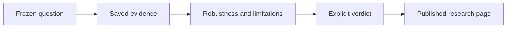

# Research

!!! info "Current publication status"
    The [Research Knowledge Base](knowledge-base/index.md) publishes validated, research-only summaries generated from Pakal knowledge records. Records that fail schema or artifact validation remain visible in the audit queue, but are excluded from study counts and evidence claims.

## Research Knowledge Base

Use the Knowledge Base to answer four questions quickly:

1. What did we test and why?
2. What was the exact signal, decision time, and executable fill?
3. Did the result survive costs, validation, and robustness checks?
4. What is the verdict, limitation, and next frozen gate?

The portal also provides cross-study indexes for signal features, sources, and records needing repair. For close-derived signals, study pages explicitly distinguish a hypothetical `Close_T` entry used to diagnose overnight return from the causal `Open_(T+1)` implementation.

## Existing research collections

| Collection | Current source | Portal status |
|---|---|---|
| Capacity | `docs/research/CAPACITY_ANALYSIS_GUIDE.md` | Needs audit |
| Transaction costs | `docs/research/TRANSACTION_COSTS_RESEARCH.md` | Needs audit |
| Engine realism | `docs/research/ENGINE_REALISM_*.md` | Separate current decisions from historical analysis |
| Sector-dispersion preregistrations | `docs/research/SECTOR_DISPERSION_*.md` | Preserve frozen specifications and link results |

## Foundational research sources

The Library preserves important external sources separately from internal study results. Start with [Momentum Factor Construction and Signal Orthogonality](../library/foundational-papers/momentum-factor-construction.md), which connects 12-1 momentum, information coefficients, effective breadth, signal orthogonality, risk management, and implementation costs. The separate [Crypto collection](../library/foundational-papers/crypto/index.md) covers sources whose data, timing, shorting, and exchange assumptions require crypto-specific controls. All performance figures remain source-reported until independently replicated.

## Promotion path

A published study must state exact data and timing, search space, costs, capacity, out-of-sample evidence, limitations, verdict, and reproducible artifact paths. Use the [research template](../governance/templates/research.md).

The generated pages are read-only views. Edit the canonical `knowledge_record.json` and saved Pakal artifacts, then run `REFRESH_RESEARCH_KB.cmd`; do not hand-edit the generated portal pages.
