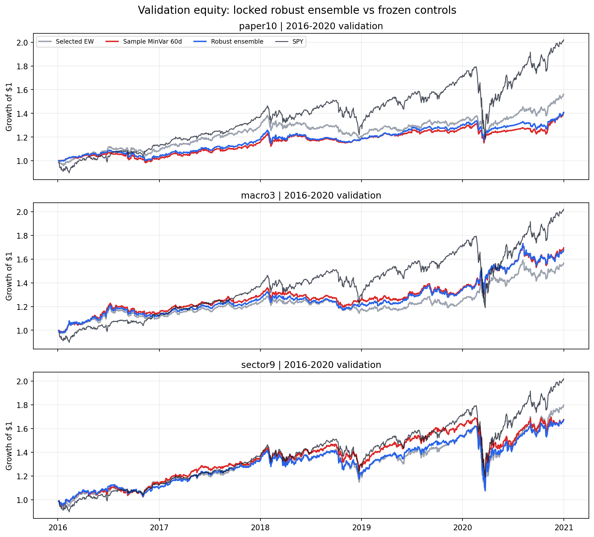
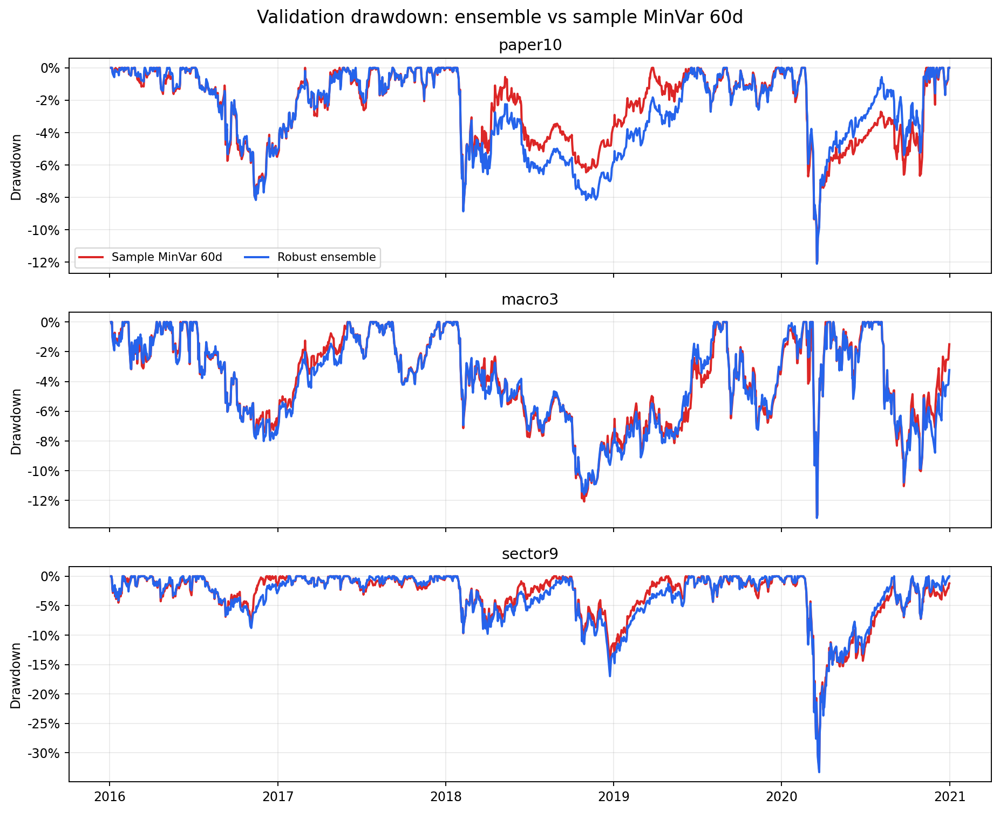

<!-- GENERATED FILE. EDIT THE CANONICAL KNOWLEDGE RECORD. -->

# Momentum selection plus robust covariance and long-only MinVar

!!! warning "Research-only"
    This page summarizes saved research evidence. It does not authorize LIVE, allocation, or deployment.

## TL;DR

> **Verdict:** Reject promotion. Shrinkage improved conditioning, concentration, and turnover, but the locked ensemble failed the validation breadth gate because sector9 QLIKE deteriorated materially and economic improvement was not broad.

> **Status:** `diagnostic`

> **Disposition:** `rejected`

> **Replication:** `not_reproducible`

## Research question

Test whether a broad predeclared shrinkage ensemble stabilizes momentum-selected MinVar and improves forecast and portfolio economics across paper, macro, and sector ETF universes.

## Exact setup

| Field | Value |
| --- | --- |
| Signal family | cross_asset_momentum_robust_covariance_minvar |
| Universe | ["paper10", "macro3", "sector9"] |
| Decision | completed monthly Close_T |
| Fill | first strict-common-session Open_(T+1) |
| Primary cost layer | central_research |
| Last reviewed | 2026-08-30T21:45:00+00:00 |

## Timing and overnight attribution

```text
information available: completed monthly Close_T
primary executable fill: first strict-common-session Open_(T+1)
```

If final `Close_T` data formed the signal, a hypothetical `Close_T` entry is diagnostic only unless a separate pre-close protocol was modeled. Comparing that diagnostic with `Open_(T+1)` and applying the compounded return identity shows whether the apparent edge occurred in the overnight gap. Missing attribution numbers mean **not tested**, not zero.

| Attribution field | Value |
| --- | --- |
| Status | next_open_executable_primary |
| Diagnostic Path | tables/validation_timing_diagnostic.csv |
| Executable Path | tables/validation_performance_central.csv |
| Method | same-close diagnostic compared with strict Close_T to Open_(T+1) |
| Headline Result | same-close was generally modestly better and is excluded from promotion evidence |
| Metrics | ["CAGR", "Sharpe", "maximum_daily_drawdown"] |

## Primary metrics

| Metric | Value |
| --- | ---: |
| Period | validation 2016-01-01 through 2020-12-31 |
| Universe | paper10 locked robust_ensemble; see table for macro3 and sector9 |
| Cost Layer | central_research_10_round_trip_bps_on_half_L1 |
| Cagr | 7.10% |
| Annualized Volatility | 7.46% |
| Sharpe | 0.957 |
| Maximum Drawdown | -12.10% |
| Turnover | 384.69% |

## Four separate verdicts

| Question | Conclusion |
| --- | --- |
| Source Replication | not_reproducible; the source omits proxy splices and the executable MinVar covariance/timing contract |
| Predictive Value | mixed; validation QLIKE improved in paper10 and macro3 but worsened about 21% in sector9 |
| Economic Value | not established; validation volatility changes were small and Sharpe improvement was not broad |
| Promotion | rejected; confirmation remained sealed and no post-hoc rescue was tested |

## Key findings

| Feature | Role | Direction | Status | Effect | Action |
| --- | --- | --- | --- | --- | --- |
| six_month_top_half_total_return_momentum | rank and selection | paper10 ladder directionally improved, but sector transfer was weak | diagnostic | {"declared_source_ladder_definitions": 15} | retain only as a transparent control; do not claim exact replication |
| covariance_shrinkage_grid | risk estimation and sizing | condition numbers and concentration improved, forecast ranking remained universe-dependent | promising_component | {"declared_incremental_cells": 33, "optimizer_failure_count": 0} | keep as an engineering diagnostic, not an alpha or promotion claim |
| robust_estimator_window_weight_ensemble | portfolio sizing | validation QLIKE improved in two universes but materially deteriorated in sector9 | rejected | {"macro3": {"qlike_ratio": 0.9183365974217504, "turnover_ratio": 0.8408604724675495, "volatility_ratio": 0.992315906887954}, "paper10": {"qlike_ratio": 0.8324492214901532, "turnover_ratio": 0.8636572354566043, "volatility_ratio": 0.9824486099749444}, "sector9": {"qlike_ratio": 1.2119249820839275, "turnover_ratio": 0.741853288895575, "volatility_ratio": 1.0016257415139023}} | reject promotion and keep confirmation sealed |
| robust_ensemble_50pct_selected_ew_blend | regularized sizing control | reduced concentration further but did not supply a qualifying validation rescue | rejected | {"blend_weight_to_selected_equal_weight": 0.5} | do not reopen or tune on consumed validation |

## Visual evidence






## Limitations

- exact source proxy splices and MinVar covariance rule are unavailable
- fixed surviving ETFs are not a point-in-time product universe
- Norgate total-return histories may be revised
- sklearn OAS 1.8 is not claimed identical to the original paper equation
- capacity is an uncalibrated ADV63 participation proxy
- no measured fills, live parity, or operational evidence

## Next gates

- Do not tune on the consumed 2016-2020 validation period.
- Any revisit requires a separately frozen mechanism and genuinely independent evidence before opening the sealed 2021-2026 period.

## Sources

- `C:\\Users\\User\\Downloads\\ssrn_id2759343_code1741163.pdf`
- `https://www.ledoit.net/Well-conditioned2004.pdf`
- `https://web.eecs.umich.edu/~hero/Preprints/ChenSAM10.pdf`

## Canonical artifacts

| Artifact | Pakal path |
| --- | --- |
| Concise Report | `pakal-research/reports/adaptive_asset_allocation_robust_covariance_study/REPORT.md` |
| Decision Log | `pakal-research/reports/adaptive_asset_allocation_robust_covariance_study/decision_log.jsonl` |
| Experiment Ledger | `pakal-research/reports/adaptive_asset_allocation_robust_covariance_study/experiment_ledger.jsonl` |
| Frozen Specification | `pakal-research/reports/adaptive_asset_allocation_robust_covariance_study/research_spec_frozen.json` |
| Full Report | `pakal-research/reports/adaptive_asset_allocation_robust_covariance_study/REPORT_FULL.md` |
| Hypothesis Registry | `pakal-research/reports/adaptive_asset_allocation_robust_covariance_study/hypothesis_registry.json` |
| Manifest | `pakal-research/reports/adaptive_asset_allocation_robust_covariance_study/run_manifest.json` |
| Notebook | `pakal-research/adaptive_asset_allocation_robust_covariance_study.ipynb` |
| Primary Charts | `["pakal-research/reports/adaptive_asset_allocation_robust_covariance_study/charts"]` |
| Primary Source Code | `["pakal-research/adaptive_asset_allocation_robust_covariance_study.py"]` |
| Primary Tables | `["pakal-research/reports/adaptive_asset_allocation_robust_covariance_study/tables"]` |
| Research State | `pakal-research/reports/adaptive_asset_allocation_robust_covariance_study/research_state.json` |
| Source Rule Map | `pakal-research/reports/adaptive_asset_allocation_robust_covariance_study/SOURCE_RULE_MAP.md` |
