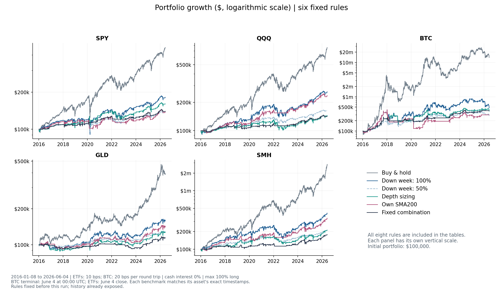
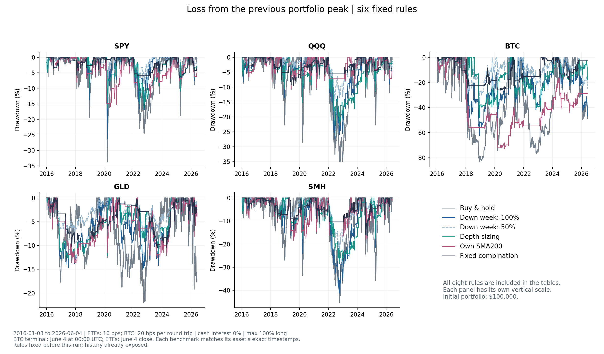

<!-- GENERATED FILE. EDIT THE CANONICAL KNOWLEDGE RECORD. -->

# Negative-week depth sizing, VIX and trend regimes across SPY, QQQ, BTC, GLD and SMH

!!! warning "Research-only"
    This page summarizes saved research evidence. It does not authorize LIVE, allocation, or deployment.

## TL;DR

> **Verdict:** Diagnostic: normalized depth does not reliably select stronger rebounds across assets. Own-asset MA200 shows a useful historical QQQ/SMH risk-return tradeoff; VIX scaling is not a broad improvement. All seven conditional rules trail own-asset buyhold in full-period CAGR and Sharpe. Preserve all results and treat narrower follow-up ideas as post-result hypotheses requiring a separate prospective freeze.

> **Status:** `diagnostic`

> **Disposition:** `diagnostic`

> **Replication:** `directionally_replicated`

## Research question

Do deeper volatility-normalized weekly losses improve subsequent rebound selection, and do VIX or MA200 sizing gates add portfolio value beyond holding less risk across SPY, QQQ, BTC, GLD and SMH?

## Exact setup

| Field | Value |
| --- | --- |
| Signal family | mean_reversion |
| Universe | ["SPY", "QQQ", "BTC-USD spot proxy", "GLD", "SMH current fund history from2011-12-20"] |
| Decision | Nominal Thursday16:30 America/New_York after known ETF/VIX EOD; last actual ETF close on/before Thursday, BTC completed Wednesday-labelled UTC bar closing Thursday00:00UTC |
| Fill | ETF next observed session open strictly after nominal Thursday; BTC Friday00:00UTC. All actual feature, decision and fill timestamps stored. |
| Primary cost layer | central_research |
| Last reviewed | 2026-09-15T18:01:47.241303+00:00 |

## Timing and overnight attribution

```text
information available: Nominal Thursday16:30 America/New_York after known ETF/VIX EOD; last actual ETF close on/before Thursday, BTC completed Wednesday-labelled UTC bar closing Thursday00:00UTC
primary executable fill: ETF next observed session open strictly after nominal Thursday; BTC Friday00:00UTC. All actual feature, decision and fill timestamps stored.
```

If final `Close_T` data formed the signal, a hypothetical `Close_T` entry is diagnostic only unless a separate pre-close protocol was modeled. Comparing that diagnostic with `Open_(T+1)` and applying the compounded return identity shows whether the apparent edge occurred in the overnight gap. Missing attribution numbers mean **not tested**, not zero.

| Attribution field | Value |
| --- | --- |
| Status | tested |
| Diagnostic Path | Completed feature close to the declared cycle exit; no same-close trading portfolio |
| Executable Path | Weekly next-open rebalance; venue-specific terminal liquidation |
| Method | For each frozen cycle use gross identity(1+close_to_exit)=(1+feature_close_to_entry)*(1+entry_to_exit); BTC waiting interval includes its deliberately older completed bar. No extra same-close portfolio. |
| Headline Result | ETF and BTC clocks remain distinct, including BTC's older completed signal bar; exact own-asset benchmarks are used and no pooled NAV is formed. |
| Metrics | [{"after_negative_close_diagnostic_bps": 101.23770266048602, "after_negative_entry_delay_bps": -14.303369508948673, "after_negative_executable_bps": 121.75686486305194, "asset": "BTC", "compound_identity_max_error": 4.440892098500626e-16, "n": 542.0, "negative_n": 242.0, "period": "full"}, {"after_negative_close_diagnostic_bps": 162.39829111209954, "after_negative_entry_delay_bps": -22.115676218455683, "after_negative_executable_bps": 183.5758167470458, "asset": "BTC", "compound_identity_max_error": 3.3306690738754696e-16, "n": 156.0, "negative_n": 59.0, "period": "discovery"}, {"after_negative_close_diagnostic_bps": 138.73741935463534, "after_negative_entry_delay_bps": 19.54161530757643, "after_negative_executable_bps": 131.2129809333998, "asset": "BTC", "compound_identity_max_error": 3.3306690738754696e-16, "n": 209.0, "negative_n": 103.0, "period": "validation"}, {"after_negative_close_diagnostic_bps": 7.850883433703791, "after_negative_entry_delay_bps": -52.117211261963355, "after_negative_executable_bps": 63.990638408033654, "asset": "BTC", "compound_identity_max_error": 4.440892098500626e-16, "n": 177.0, "negative_n": 80.0, "period": "confirmation"}, {"after_negative_close_diagnostic_bps": 44.16712602129361, "after_negative_entry_delay_bps": 15.53387706689226, "after_negative_executable_bps": 28.532212573481058, "asset": "GLD", "compound_identity_max_error": 3.3306690738754696e-16, "n": 542.0, "negative_n": 231.0, "period": "full"}, {"after_negative_close_diagnostic_bps": 23.699455099787976, "after_negative_entry_delay_bps": 17.4900494154298, "after_negative_executable_bps": 6.118015452865884, "asset": "GLD", "compound_identity_max_error": 2.220446049250313e-16, "n": 156.0, "negative_n": 70.0, "period": "discovery"}, {"after_negative_close_diagnostic_bps": 46.12475466100563, "after_negative_entry_delay_bps": 15.560101806303207, "after_negative_executable_bps": 30.48015611799356, "asset": "GLD", "compound_identity_max_error": 2.220446049250313e-16, "n": 209.0, "negative_n": 93.0, "period": "validation"}, {"after_negative_close_diagnostic_bps": 62.559442212649145, "after_negative_entry_delay_bps": 13.48430404979159, "after_negative_executable_bps": 48.941551526472246, "asset": "GLD", "compound_identity_max_error": 3.3306690738754696e-16, "n": 177.0, "negative_n": 68.0, "period": "confirmation"}, {"after_negative_close_diagnostic_bps": 61.51162824105703, "after_negative_entry_delay_bps": 6.555188525268361, "after_negative_executable_bps": 54.819096857984476, "asset": "QQQ", "compound_identity_max_error": 3.3306690738754696e-16, "n": 542.0, "negative_n": 214.0, "period": "full"}, {"after_negative_close_diagnostic_bps": 36.849577739050666, "after_negative_entry_delay_bps": 0.5283487344767176, "after_negative_executable_bps": 36.341639451205275, "asset": "QQQ", "compound_identity_max_error": 2.220446049250313e-16, "n": 156.0, "negative_n": 61.0, "period": "discovery"}, {"after_negative_close_diagnostic_bps": 49.118981392694806, "after_negative_entry_delay_bps": 14.247102602607407, "after_negative_executable_bps": 34.47204279623872, "asset": "QQQ", "compound_identity_max_error": 3.3306690738754696e-16, "n": 209.0, "negative_n": 87.0, "period": "validation"}, {"after_negative_close_diagnostic_bps": 100.6411033384798, "after_negative_entry_delay_bps": 1.9861082602652285, "after_negative_executable_bps": 98.71786360321798, "asset": "QQQ", "compound_identity_max_error": 2.220446049250313e-16, "n": 177.0, "negative_n": 66.0, "period": "confirmation"}, {"after_negative_close_diagnostic_bps": 89.72194695440524, "after_negative_entry_delay_bps": 11.518556085696892, "after_negative_executable_bps": 77.8712808734857, "asset": "SMH", "compound_identity_max_error": 3.3306690738754696e-16, "n": 542.0, "negative_n": 226.0, "period": "full"}, {"after_negative_close_diagnostic_bps": 81.78652860860362, "after_negative_entry_delay_bps": 3.142136641264331, "after_negative_executable_bps": 78.84489054834513, "asset": "SMH", "compound_identity_max_error": 3.3306690738754696e-16, "n": 156.0, "negative_n": 66.0, "period": "discovery"}, {"after_negative_close_diagnostic_bps": 49.90047740297616, "after_negative_entry_delay_bps": 23.354933551373968, "after_negative_executable_bps": 25.473532305567282, "asset": "SMH", "compound_identity_max_error": 2.220446049250313e-16, "n": 209.0, "negative_n": 88.0, "period": "validation"}, {"after_negative_close_diagnostic_bps": 145.66676544535895, "after_negative_entry_delay_bps": 4.7302570072658865, "after_negative_executable_bps": 141.0204980323204, "asset": "SMH", "compound_identity_max_error": 2.220446049250313e-16, "n": 177.0, "negative_n": 72.0, "period": "confirmation"}, {"after_negative_close_diagnostic_bps": 48.750296267826855, "after_negative_entry_delay_bps": 9.299868785416484, "after_negative_executable_bps": 39.424066572221946, "asset": "SPY", "compound_identity_max_error": 4.440892098500626e-16, "n": 542.0, "negative_n": 204.0, "period": "full"}, {"after_negative_close_diagnostic_bps": 37.26976056621225, "after_negative_entry_delay_bps": 10.19811747986886, "after_negative_executable_bps": 27.003121376370235, "asset": "SPY", "compound_identity_max_error": 3.3306690738754696e-16, "n": 156.0, "negative_n": 64.0, "period": "discovery"}, {"after_negative_close_diagnostic_bps": 45.74395725268673, "after_negative_entry_delay_bps": 14.870391337522232, "after_negative_executable_bps": 30.83591587696657, "asset": "SPY", "compound_identity_max_error": 4.440892098500626e-16, "n": 209.0, "negative_n": 81.0, "period": "validation"}, {"after_negative_close_diagnostic_bps": 65.33110550731301, "after_negative_entry_delay_bps": 0.6778307656619491, "after_negative_executable_bps": 64.6881462137507, "asset": "SPY", "compound_identity_max_error": 2.220446049250313e-16, "n": 177.0, "negative_n": 59.0, "period": "confirmation"}] |
| Artifact | pakal-research/reports/badweek_multiasset_sizing_regime_20260915/tables/timing_attribution.csv |

## Primary metrics

| Metric | Value |
| --- | ---: |
| Period | Primary Jan8,2016 venue open to Jun4,2026 venue terminal; per-asset long eligible histories separately |
| Universe | Five separate asset portfolios; no aggregate portfolio |
| Cost Layer | central_research |
| Cagr | N/A |
| Annualized Volatility | N/A |
| Sharpe | N/A |
| Maximum Drawdown | N/A |
| Turnover | N/A |

## Four separate verdicts

| Question | Conclusion |
| --- | --- |
| Source Replication | The literal SPY weekly association is directionally replicated. The other assets, variable sizing, trend gates and fixed combination are internal extensions of the user request, not claims reproduced from the paper. |
| Predictive Value | Deeper normalized losses do not reliably imply stronger subsequent rebounds across these five assets. SPY depth selection covariance is positive in all three periods but uncertain; BTC changes sign, and QQQ is adverse in both later periods. None of 50 locked-period sizing covariance tests survives Holm correction. No positive net-return increment survives the 70-test paired family; two significant findings are negative half-size effects in late QQQ and SMH. |
| Economic Value | All five negative-week baselines are historically profitable after central costs, but all seven nonbenchmark rules have lower full-period CAGR and Sharpe than their own buyhold benchmark. Own-asset MA200 reduces QQQ and SMH drawdowns with a useful historical tradeoff. VIX scaling reduces exposure to both larger risks and larger rebounds. The fixed combination substantially reduces exposure and drawdown in some assets but is not a universal improvement. |
| Promotion | diagnostic. Retain the evidence and frozen rules; do not select an asset, threshold, strategy or capital allocation from these already-seen histories. |

## Key findings

| Feature | Role | Direction | Status | Effect | Action |
| --- | --- | --- | --- | --- | --- |
| Negative weekly return | h=1[r_week<0], w=h | All five baselines are positive after central costs; all trail their own buyhold CAGR and Sharpe. High cash exposure is material. | diagnostic | {"central_primary_metrics": [{"annualization_days": 252.0, "annualized_cost_drag": 0.013725799969320093, "annualized_volatility": 0.1332299843438364, "asset": "SPY", "average_exposure": 0.3769113149847095, "average_overnight_exposure": 0.3769113149847095, "cagr": 0.0588945965755209, "cost_layer": "central_research", "daily_beta": 0.5680859702605827, "daily_correlation": 0.7602846719339914, "elapsed_years": 10.404460415240704, "end_date": "2026-06-04", "end_time_utc": "2026-06-04 20:00:00+00:00", "ending_nav": 181375.7694666283, "fee_cash": 17675.86459833881, "gross_cagr": 0.072620396544841, "gross_total_return": 1.0738375478144953, "max_drawdown": -0.2629133503480938, "monthly_beta": 0.5507660553463762, "monthly_correlation": 0.7859433224628314, "n_days": 2616.0, "n_orders": 268.0, "round_trip_bps": 10.0, "sample": "primary", "sharpe": 0.4970566912863676, "start_date": "2016-01-08", "start_time_utc": "2016-01-08 14:30:00+00:00", "starting_nav": 100000.0, "strategy": "negative_week", "terminal_partial_observations": 0.0, "total_return": 0.8137576946662777, "turnover_per_year": 25.7517471151876}, {"annualization_days": 252.0, "annualized_cost_drag": 0.014198785393585003, "annualized_volatility": 0.1627523462002059, "asset": "QQQ", "average_exposure": 0.3948776758409786, "average_overnight_exposure": 0.3948776758409786, "cagr": 0.0953836690618821, "cost_layer": "central_research", "daily_beta": 0.539068256340663, "daily_correlation": 0.7342610477400731, "elapsed_years": 10.404460415240704, "end_date": "2026-06-04", "end_time_utc": "2026-06-04 20:00:00+00:00", "ending_nav": 258027.2683434095, "fee_cash": 21090.1887503437, "gross_cagr": 0.1095824544554671, "gross_total_return": 1.950265291908373, "max_drawdown": -0.2732981225863194, "monthly_beta": 0.4855414819296158, "monthly_correlation": 0.7287325467679088, "n_days": 2616.0, "n_orders": 268.0, "round_trip_bps": 10.0, "sample": "primary", "sharpe": 0.6424900009776705, "start_date": "2016-01-08", "start_time_utc": "2016-01-08 14:30:00+00:00", "starting_nav": 100000.0, "strategy": "negative_week", "terminal_partial_observations": 0.0, "total_return": 1.5802726834340977, "turnover_per_year": 25.751747115187605}, {"annualization_days": 365.0, "annualized_cost_drag": 0.03145131373891699, "annualized_volatility": 0.4535959021056275, "asset": "BTC", "average_exposure": 0.4472507234938174, "average_overnight_exposure": 0.4472507234938174, "cagr": 0.1613735361071002, "cost_layer": "central_research", "daily_beta": 0.4633128775439946, "daily_correlation": 0.680200130469867, "elapsed_years": 10.403832991101986, "end_date": "2026-06-04", "end_time_utc": "2026-06-04 00:00:00+00:00", "ending_nav": 474195.1019036856, "fee_cash": 122689.17863843036, "gross_cagr": 0.1928248498460172, "gross_total_return": 5.2616814487291625, "max_drawdown": -0.6234653208763685, "monthly_beta": 0.3039008400458379, "monthly_correlation": 0.6099818298500279, "n_days": 3801.0, "n_orders": 278.0, "round_trip_bps": 20.0, "sample": "primary", "sharpe": 0.5593849968576112, "start_date": "2016-01-08", "start_time_utc": "2016-01-08 00:00:00+00:00", "starting_nav": 100000.0, "strategy": "negative_week", "terminal_partial_observations": 1.0, "total_return": 3.741951019036857, "turnover_per_year": 26.707573939218676}, {"annualization_days": 252.0, "annualized_cost_drag": 0.013854945816761798, "annualized_volatility": 0.0999999027168389, "asset": "GLD", "average_exposure": 0.430045871559633, "average_overnight_exposure": 0.4296636085626911, "cagr": 0.0453010385925776, "cost_layer": "central_research", "daily_beta": 0.384329337065193, "daily_correlation": 0.6165040036668855, "elapsed_years": 10.404460415240704, "end_date": "2026-06-04", "end_time_utc": "2026-06-04 20:00:00+00:00", "ending_nav": 158560.93436378406, "fee_cash": 15905.290955142667, "gross_cagr": 0.0591559844093394, "gross_total_return": 0.8184214486011243, "max_drawdown": -0.1505267203399743, "monthly_beta": 0.335580043894036, "monthly_correlation": 0.5900030481758114, "n_days": 2616.0, "n_orders": 274.0, "round_trip_bps": 10.0, "sample": "primary", "sharpe": 0.4940193500060774, "start_date": "2016-01-08", "start_time_utc": "2016-01-08 14:30:00+00:00", "starting_nav": 100000.0, "strategy": "negative_week", "terminal_partial_observations": 0.0, "total_return": 0.5856093436378331, "turnover_per_year": 26.32827876702016}, {"annualization_days": 252.0, "annualized_cost_drag": 0.0144092174411736, "annualized_volatility": 0.2327057496826896, "asset": "SMH", "average_exposure": 0.4170489296636085, "average_overnight_exposure": 0.4170489296636085, "cagr": 0.1460420866234595, "cost_layer": "central_research", "daily_beta": 0.5264906228935194, "daily_correlation": 0.7298312037783683, "elapsed_years": 10.404460415240704, "end_date": "2026-06-04", "end_time_utc": "2026-06-04 20:00:00+00:00", "ending_nav": 412999.9061544443, "fee_cash": 26812.5619503769, "gross_cagr": 0.1604513040646331, "gross_total_return": 3.703360205343904, "max_drawdown": -0.4125960971033641, "monthly_beta": 0.4158947989497792, "monthly_correlation": 0.6779318260135274, "n_days": 2616.0, "n_orders": 260.0, "round_trip_bps": 10.0, "sample": "primary", "sharpe": 0.7032895526726631, "start_date": "2016-01-08", "start_time_utc": "2016-01-08 14:30:00+00:00", "starting_nav": 100000.0, "strategy": "negative_week", "terminal_partial_observations": 0.0, "total_return": 3.1299990615444395, "turnover_per_year": 24.983038246077523}], "chronological_comparisons": [{"annualized_volatility": 0.0994902213717319, "asset": "SPY", "average_exposure": 0.4093333333333333, "cagr_difference": -0.0692918341553869, "cagr_difference_vs_half_negative": 0.018350457785064403, "comparator": "buy_hold", "daily_beta": 0.6034033478337129, "max_drawdown": -0.137651265800671, "net_cagr": 0.0388628389926524, "period": "discovery", "round_trip_bps": 10.0}, {"annualized_volatility": 0.1697878090737918, "asset": "SPY", "average_exposure": 0.3888888888888889, "cagr_difference": -0.09151902114429451, "cagr_difference_vs_half_negative": 0.0169578926601008, "comparator": "buy_hold", "daily_beta": 0.5757161432707966, "max_drawdown": -0.2629133503480931, "net_cagr": 0.0394609573481889, "period": "validation", "round_trip_bps": 10.0}, {"annualized_volatility": 0.1078415427200896, "asset": "SPY", "average_exposure": 0.3344988344988345, "cagr_difference": -0.1352970091600792, "cagr_difference_vs_half_negative": 0.0503393858926695, "comparator": "buy_hold", "daily_beta": 0.5255103889106699, "max_drawdown": -0.1099034784204182, "net_cagr": 0.1001302889365922, "period": "confirmation", "round_trip_bps": 10.0}, {"annualized_volatility": 0.129836836999827, "asset": "QQQ", "average_exposure": 0.392, "cagr_difference": -0.09141786303859051, "cagr_difference_vs_half_negative": 0.0259013468785907, "comparator": "buy_hold", "daily_beta": 0.5764772031134404, "max_drawdown": -0.136410663996513, "net_cagr": 0.0548588428109719, "period": "discovery", "round_trip_bps": 10.0}, {"annualized_volatility": 0.1993050123869355, "asset": "QQQ", "average_exposure": 0.4146825396825397, "cagr_difference": -0.09838408327618128, "cagr_difference_vs_half_negative": 0.025228043442933296, "comparator": "buy_hold", "daily_beta": 0.5442258325623947, "max_drawdown": -0.2732981225863196, "net_cagr": 0.0554420627034744, "period": "validation", "round_trip_bps": 10.0}, {"annualized_volatility": 0.139228503877732, "asset": "QQQ", "average_exposure": 0.3741258741258741, "cagr_difference": -0.1731077313086213, "cagr_difference_vs_half_negative": 0.0930477366994276, "comparator": "buy_hold", "daily_beta": 0.5027739264829416, "max_drawdown": -0.1149835701162287, "net_cagr": 0.1819801164797645, "period": "confirmation", "round_trip_bps": 10.0}, {"annualized_volatility": 0.5067556082682262, "asset": "BTC", "average_exposure": 0.379247015610652, "cagr_difference": -0.7580222816382716, "cagr_difference_vs_half_negative": 0.11114171776468229, "comparator": "buy_hold", "daily_beta": 0.4221233939467031, "max_drawdown": -0.6234653208763685, "net_cagr": 0.2649638651568062, "period": "discovery", "round_trip_bps": 20.0}, {"annualized_volatility": 0.5026129815684333, "asset": "BTC", "average_exposure": 0.4900752908966461, "cagr_difference": -0.24697347563085462, "cagr_difference_vs_half_negative": 0.0722563632148476, "comparator": "buy_hold", "daily_beta": 0.4950935276179074, "max_drawdown": -0.4991404846584139, "net_cagr": 0.2030893026460047, "period": "validation", "round_trip_bps": 20.0}, {"annualized_volatility": 0.3267742223885121, "asset": "BTC", "average_exposure": 0.4564348521183053, "cagr_difference": -0.4499444655581516, "cagr_difference_vs_half_negative": 0.002872678162943995, "comparator": "buy_hold", "daily_beta": 0.4762330670178931, "max_drawdown": -0.4686527920777602, "net_cagr": 0.0345037070363178, "period": "confirmation", "round_trip_bps": 20.0}, {"annualized_volatility": 0.079075787462785, "asset": "GLD", "average_exposure": 0.4506666666666666, "cagr_difference": -0.0493459686536271, "cagr_difference_vs_half_negative": -0.0016056478308805553, "comparator": "buy_hold", "daily_beta": 0.4087254504111846, "max_drawdown": -0.1465233706416847, "net_cagr": -0.0016475261771046, "period": "discovery", "round_trip_bps": 10.0}, {"annualized_volatility": 0.1075827136385602, "asset": "GLD", "average_exposure": 0.4503968253968254, "cagr_difference": -0.036340471403665704, "cagr_difference_vs_half_negative": 0.0245193721180376, "comparator": "buy_hold", "daily_beta": 0.4844452992236012, "max_drawdown": -0.150526720339974, "net_cagr": 0.0513031130091103, "period": "validation", "round_trip_bps": 10.0}, {"annualized_volatility": 0.1069377402585354, "asset": "GLD", "average_exposure": 0.3881118881118881, "cagr_difference": -0.2139532273534217, "cagr_difference_vs_half_negative": 0.0398408954951675, "comparator": "buy_hold", "daily_beta": 0.3033067517244547, "max_drawdown": -0.1117312659762389, "net_cagr": 0.0806616802579012, "period": "confirmation", "round_trip_bps": 10.0}, {"annualized_volatility": 0.1634172732618195, "asset": "SMH", "average_exposure": 0.4226666666666667, "cagr_difference": -0.0639567214780829, "cagr_difference_vs_half_negative": 0.0814052688490373, "comparator": "buy_hold", "daily_beta": 0.5309921454895838, "max_drawdown": -0.1528796983111431, "net_cagr": 0.1626885816501833, "period": "discovery", "round_trip_bps": 10.0}, {"annualized_volatility": 0.2705027356619197, "asset": "SMH", "average_exposure": 0.4246031746031746, "cagr_difference": -0.230053994203891, "cagr_difference_vs_half_negative": 0.0017895455155015009, "comparator": "buy_hold", "daily_beta": 0.555538385792905, "max_drawdown": -0.4125960971033643, "net_cagr": 0.0169197017583349, "period": "validation", "round_trip_bps": 10.0}, {"annualized_volatility": 0.2362088443862368, "asset": "SMH", "average_exposure": 0.4032634032634032, "cagr_difference": -0.40701688590604596, "cagr_difference_vs_half_negative": 0.15467731800225828, "comparator": "buy_hold", "daily_beta": 0.4852954001043078, "max_drawdown": -0.2156612080013314, "net_cagr": 0.301059495366182, "period": "confirmation", "round_trip_bps": 10.0}]} | Assess costs, risk and exposure together; retain the entire frozen family without choosing an allocation from already-seen history. |
| Fixed half-size negative-week control | w=0.5*h; fixed sizing null, not exact realized exposure/volatility match | Fixed lower-exposure control; its Sharpe is similar to the baseline. Lower returns in late QQQ/SMH survive the paired-test correction, which is not evidence against risk control itself. | diagnostic | {"central_primary_metrics": [{"annualization_days": 252.0, "annualized_cost_drag": 0.006709571939829798, "annualized_volatility": 0.0663828412899007, "asset": "SPY", "average_exposure": 0.1886610051522758, "average_overnight_exposure": 0.1887307314620633, "cagr": 0.0308381454089152, "cost_layer": "central_research", "daily_beta": 0.2830255102330918, "daily_correlation": 0.7602105508841779, "elapsed_years": 10.404460415240704, "end_date": "2026-06-04", "end_time_utc": "2026-06-04 20:00:00+00:00", "ending_nav": 137163.90368460203, "fee_cash": 7803.367506378087, "gross_cagr": 0.037547717348745, "gross_total_return": 0.4674233556625267, "max_drawdown": -0.1371735210705049, "monthly_beta": 0.2734220109181999, "monthly_correlation": 0.7851298322520721, "n_days": 2616.0, "n_orders": 338.0, "round_trip_bps": 10.0, "sample": "primary", "sharpe": 0.4917574641519745, "start_date": "2016-01-08", "start_time_utc": "2016-01-08 14:30:00+00:00", "starting_nav": 100000.0, "strategy": "half_negative", "terminal_partial_observations": 0.0, "total_return": 0.3716390368460212, "turnover_per_year": 12.973895851214143}, {"annualization_days": 252.0, "annualized_cost_drag": 0.006837173120625602, "annualized_volatility": 0.0812176707741991, "asset": "QQQ", "average_exposure": 0.1976829960047127, "average_overnight_exposure": 0.1977863736563888, "cagr": 0.0488333828420286, "cost_layer": "central_research", "daily_beta": 0.2690205719983927, "daily_correlation": 0.7342922600593729, "elapsed_years": 10.404460415240704, "end_date": "2026-06-04", "end_time_utc": "2026-06-04 20:00:00+00:00", "ending_nav": 164225.26789242105, "fee_cash": 8502.821088449627, "gross_cagr": 0.0556705559626542, "gross_total_return": 0.7571158518154912, "max_drawdown": -0.1453576480972568, "monthly_beta": 0.2422615926927755, "monthly_correlation": 0.7282804547155216, "n_days": 2616.0, "n_orders": 348.0, "round_trip_bps": 10.0, "sample": "primary", "sharpe": 0.6290276502335843, "start_date": "2016-01-08", "start_time_utc": "2016-01-08 14:30:00+00:00", "starting_nav": 100000.0, "strategy": "half_negative", "terminal_partial_observations": 0.0, "total_return": 0.6422526789242156, "turnover_per_year": 12.993733845887652}, {"annualization_days": 365.0, "annualized_cost_drag": 0.0151938371893931, "annualized_volatility": 0.2245936813936942, "asset": "BTC", "average_exposure": 0.2241362790281636, "average_overnight_exposure": 0.2242578024151147, "cagr": 0.1035367628244772, "cost_layer": "central_research", "daily_beta": 0.2292181344634524, "daily_correlation": 0.6796462134946519, "elapsed_years": 10.403832991101986, "end_date": "2026-06-04", "end_time_utc": "2026-06-04 00:00:00+00:00", "ending_nav": 278706.2965241126, "fee_cash": 33923.51047288507, "gross_cagr": 0.1187306000138703, "gross_total_return": 2.21315846168868, "max_drawdown": -0.3608152453818591, "monthly_beta": 0.1499938222602798, "monthly_correlation": 0.6067242586329634, "n_days": 3801.0, "n_orders": 382.0, "round_trip_bps": 20.0, "sample": "primary", "sharpe": 0.5508229780285008, "start_date": "2016-01-08", "start_time_utc": "2016-01-08 00:00:00+00:00", "starting_nav": 100000.0, "strategy": "half_negative", "terminal_partial_observations": 1.0, "total_return": 1.7870629652411232, "turnover_per_year": 13.670967499046414}, {"annualization_days": 252.0, "annualized_cost_drag": 0.006804095009220801, "annualized_volatility": 0.0500532623160482, "asset": "GLD", "average_exposure": 0.2151052308829876, "average_overnight_exposure": 0.2149722414013472, "cagr": 0.0235975937189842, "cost_layer": "central_research", "daily_beta": 0.1923656215343812, "daily_correlation": 0.6164913868978233, "elapsed_years": 10.404460415240704, "end_date": "2026-06-04", "end_time_utc": "2026-06-04 20:00:00+00:00", "ending_nav": 127464.55846777884, "fee_cash": 7449.083757838206, "gross_cagr": 0.030401688728205, "gross_total_return": 0.3656086443267836, "max_drawdown": -0.0776811909995124, "monthly_beta": 0.1671135348555036, "monthly_correlation": 0.5877010619523435, "n_days": 2616.0, "n_orders": 369.0, "round_trip_bps": 10.0, "sample": "primary", "sharpe": 0.4920520883748217, "start_date": "2016-01-08", "start_time_utc": "2016-01-08 14:30:00+00:00", "starting_nav": 100000.0, "strategy": "half_negative", "terminal_partial_observations": 0.0, "total_return": 0.2746455846777829, "turnover_per_year": 13.248823815233688}, {"annualization_days": 252.0, "annualized_cost_drag": 0.006838845872743499, "annualized_volatility": 0.116222393746326, "asset": "SMH", "average_exposure": 0.2089053088023946, "average_overnight_exposure": 0.2090532831076337, "cagr": 0.07589643594729, "cost_layer": "central_research", "daily_beta": 0.2629562427038226, "daily_correlation": 0.7298482492484868, "elapsed_years": 10.404460415240704, "end_date": "2026-06-04", "end_time_utc": "2026-06-04 20:00:00+00:00", "ending_nav": 214069.39693688447, "fee_cash": 9598.525083592784, "gross_cagr": 0.0827352818200335, "gross_total_return": 1.286576773992382, "max_drawdown": -0.2281346423307237, "monthly_beta": 0.2066936973721744, "monthly_correlation": 0.6761890590128407, "n_days": 2616.0, "n_orders": 356.0, "round_trip_bps": 10.0, "sample": "primary", "sharpe": 0.6889608195715409, "start_date": "2016-01-08", "start_time_utc": "2016-01-08 14:30:00+00:00", "starting_nav": 100000.0, "strategy": "half_negative", "terminal_partial_observations": 0.0, "total_return": 1.1406939693688467, "turnover_per_year": 12.67101150411897}], "chronological_comparisons": [{"annualized_volatility": 0.0494830583088429, "asset": "SPY", "average_exposure": 0.2048437578314457, "cagr_difference": -0.018350457785064403, "cagr_difference_vs_half_negative": 0.0, "comparator": "negative_week", "daily_beta": 0.3001202073013573, "max_drawdown": -0.0699688006233649, "net_cagr": 0.020512381207588, "period": "discovery", "round_trip_bps": 10.0}, {"annualized_volatility": 0.0846902403005975, "asset": "SPY", "average_exposure": 0.1945481556072302, "cagr_difference": -0.0169578926601008, "cagr_difference_vs_half_negative": 0.0, "comparator": "negative_week", "daily_beta": 0.287117932705924, "max_drawdown": -0.1371735210705053, "net_cagr": 0.0225030646880881, "period": "validation", "round_trip_bps": 10.0}, {"annualized_volatility": 0.0536337475343712, "asset": "SPY", "average_exposure": 0.1675988697583695, "cagr_difference": -0.0503393858926695, "cagr_difference_vs_half_negative": 0.0, "comparator": "negative_week", "daily_beta": 0.2613753139584375, "max_drawdown": -0.0560112037417341, "net_cagr": 0.0497909030439227, "period": "confirmation", "round_trip_bps": 10.0}, {"annualized_volatility": 0.0645945470728012, "asset": "QQQ", "average_exposure": 0.1961362957053948, "cagr_difference": -0.0259013468785907, "cagr_difference_vs_half_negative": 0.0, "comparator": "negative_week", "daily_beta": 0.2868148897270057, "max_drawdown": -0.0697886673514895, "net_cagr": 0.0289574959323812, "period": "discovery", "round_trip_bps": 10.0}, {"annualized_volatility": 0.0995965441228517, "asset": "QQQ", "average_exposure": 0.2074226583784775, "cagr_difference": -0.025228043442933296, "cagr_difference_vs_half_negative": 0.0, "comparator": "negative_week", "daily_beta": 0.2719937816305211, "max_drawdown": -0.1453576480972568, "net_cagr": 0.0302140192605411, "period": "validation", "round_trip_bps": 10.0}, {"annualized_volatility": 0.0694055208804378, "asset": "QQQ", "average_exposure": 0.1875926062048682, "cagr_difference": -0.0930477366994276, "cagr_difference_vs_half_negative": 0.0, "comparator": "negative_week", "daily_beta": 0.2506040647367182, "max_drawdown": -0.0587956082967547, "net_cagr": 0.0889323797803369, "period": "confirmation", "round_trip_bps": 10.0}, {"annualized_volatility": 0.2513670780270747, "asset": "BTC", "average_exposure": 0.1898308900075913, "cagr_difference": -0.11114171776468229, "cagr_difference_vs_half_negative": 0.0, "comparator": "negative_week", "daily_beta": 0.2092186777685279, "max_drawdown": -0.3608152453818591, "net_cagr": 0.1538221473921239, "period": "discovery", "round_trip_bps": 20.0}, {"annualized_volatility": 0.2481679046785121, "asset": "BTC", "average_exposure": 0.2458115568147013, "cagr_difference": -0.0722563632148476, "cagr_difference_vs_half_negative": 0.0, "comparator": "negative_week", "daily_beta": 0.2442396551518134, "max_drawdown": -0.2592283740188678, "net_cagr": 0.1308329394311571, "period": "validation", "round_trip_bps": 20.0}, {"annualized_volatility": 0.1624429725235762, "asset": "BTC", "average_exposure": 0.2286854299452471, "cagr_difference": -0.002872678162943995, "cagr_difference_vs_half_negative": 0.0, "comparator": "negative_week", "daily_beta": 0.2365969795477768, "max_drawdown": -0.2527544481855887, "net_cagr": 0.0316310288733738, "period": "confirmation", "round_trip_bps": 20.0}, {"annualized_volatility": 0.039521905994963, "asset": "GLD", "average_exposure": 0.2252467975530597, "cagr_difference": 0.0016056478308805553, "cagr_difference_vs_half_negative": 0.0, "comparator": "negative_week", "daily_beta": 0.2042782285525003, "max_drawdown": -0.0752611186888305, "net_cagr": -4.187834622404463e-05, "period": "discovery", "round_trip_bps": 10.0}, {"annualized_volatility": 0.0538688653389162, "asset": "GLD", "average_exposure": 0.2253410837689496, "cagr_difference": -0.0245193721180376, "cagr_difference_vs_half_negative": 0.0, "comparator": "negative_week", "daily_beta": 0.2425568110080414, "max_drawdown": -0.0776811909995122, "net_cagr": 0.0267837408910727, "period": "validation", "round_trip_bps": 10.0}, {"annualized_volatility": 0.0535399155189929, "asset": "GLD", "average_exposure": 0.1942148873962699, "cagr_difference": -0.0398408954951675, "cagr_difference_vs_half_negative": 0.0, "comparator": "negative_week", "daily_beta": 0.1518598594911535, "max_drawdown": -0.0573172611782736, "net_cagr": 0.0408207847627337, "period": "confirmation", "round_trip_bps": 10.0}, {"annualized_volatility": 0.0816405227270126, "asset": "SMH", "average_exposure": 0.2116508881665411, "cagr_difference": -0.0814052688490373, "cagr_difference_vs_half_negative": 0.0, "comparator": "negative_week", "daily_beta": 0.265292486495678, "max_drawdown": -0.0769107339196965, "net_cagr": 0.081283312801146, "period": "discovery", "round_trip_bps": 10.0}, {"annualized_volatility": 0.1351810324407809, "asset": "SMH", "average_exposure": 0.2123969681833767, "cagr_difference": -0.0017895455155015009, "cagr_difference_vs_half_negative": 0.0, "comparator": "negative_week", "daily_beta": 0.2776639509298302, "max_drawdown": -0.2281346423307241, "net_cagr": 0.0151301562428334, "period": "validation", "round_trip_bps": 10.0}, {"annualized_volatility": 0.1178463377279121, "asset": "SMH", "average_exposure": 0.2024032374980357, "cagr_difference": -0.15467731800225828, "cagr_difference_vs_half_negative": 0.0, "comparator": "negative_week", "daily_beta": 0.242078312428687, "max_drawdown": -0.1121297035825452, "net_cagr": 0.1463821773639237, "period": "confirmation", "round_trip_bps": 10.0}]} | Assess costs, risk and exposure together; retain the entire frozen family without choosing an allocation from already-seen history. |
| Volatility-normalized weekly decline | d=max(0,-r_week)/(SD(last63 daily simple returns through completed bar)*sqrt(k)); w=min(1,d), k=5 ETF/7 BTC | No general improvement beyond taking less risk. Full-period selection covariance is positive but uncertain for SPY/BTC, negative for QQQ/GLD/SMH; all 50 locked-period sizing tests fail Holm. BTC covariance changes sign across later periods. | diagnostic | {"central_primary_metrics": [{"annualization_days": 252.0, "annualized_cost_drag": 0.009244658459449905, "annualized_volatility": 0.1043177704984714, "asset": "SPY", "average_exposure": 0.2259673868629189, "average_overnight_exposure": 0.2259967179198271, "cagr": 0.0464214488960472, "cost_layer": "central_research", "daily_beta": 0.403431870189221, "daily_correlation": 0.6895663410149269, "elapsed_years": 10.404460415240704, "end_date": "2026-06-04", "end_time_utc": "2026-06-04 20:00:00+00:00", "ending_nav": 160338.1552792101, "fee_cash": 11495.122586632971, "gross_cagr": 0.0556661073554971, "gross_total_return": 0.7570388134604635, "max_drawdown": -0.1641870040003447, "monthly_beta": 0.2925107010059765, "monthly_correlation": 0.6264611843766136, "n_days": 2616.0, "n_orders": 331.0, "round_trip_bps": 10.0, "sample": "primary", "sharpe": 0.4882390011292948, "start_date": "2016-01-08", "start_time_utc": "2016-01-08 14:30:00+00:00", "starting_nav": 100000.0, "strategy": "depth", "terminal_partial_observations": 0.0, "total_return": 0.6033815527921034, "turnover_per_year": 17.58816929700292}, {"annualization_days": 252.0, "annualized_cost_drag": 0.009020394096643597, "annualized_volatility": 0.1276682354610878, "asset": "QQQ", "average_exposure": 0.223809424808007, "average_overnight_exposure": 0.2238585426952821, "cagr": 0.0359416626952748, "cost_layer": "central_research", "daily_beta": 0.3807595297339309, "daily_correlation": 0.6611529116123549, "elapsed_years": 10.404460415240704, "end_date": "2026-06-04", "end_time_utc": "2026-06-04 20:00:00+00:00", "ending_nav": 144396.11778152987, "fee_cash": 10455.478672820904, "gross_cagr": 0.0449620567919184, "gross_total_return": 0.5802675315824606, "max_drawdown": -0.2310481012856488, "monthly_beta": 0.2512322757783488, "monthly_correlation": 0.5785101141117097, "n_days": 2616.0, "n_orders": 343.0, "round_trip_bps": 10.0, "sample": "primary", "sharpe": 0.3409931834068052, "start_date": "2016-01-08", "start_time_utc": "2016-01-08 14:30:00+00:00", "starting_nav": 100000.0, "strategy": "depth", "terminal_partial_observations": 0.0, "total_return": 0.443961177815299, "turnover_per_year": 17.33626964109447}, {"annualization_days": 365.0, "annualized_cost_drag": 0.02112317858949589, "annualized_volatility": 0.3052060489278307, "asset": "BTC", "average_exposure": 0.2416194478625028, "average_overnight_exposure": 0.2416831836991253, "cagr": 0.1371162475134919, "cost_layer": "central_research", "daily_beta": 0.263603726852217, "daily_correlation": 0.5751615842165679, "elapsed_years": 10.403832991101986, "end_date": "2026-06-04", "end_time_utc": "2026-06-04 00:00:00+00:00", "ending_nav": 380701.4183194365, "fee_cash": 57126.73056384239, "gross_cagr": 0.1582394261029878, "gross_total_return": 3.6104924702408416, "max_drawdown": -0.4812483233406857, "monthly_beta": 0.1255467534079881, "monthly_correlation": 0.3568358249752891, "n_days": 3801.0, "n_orders": 377.0, "round_trip_bps": 20.0, "sample": "primary", "sharpe": 0.5707390477028019, "start_date": "2016-01-08", "start_time_utc": "2016-01-08 00:00:00+00:00", "starting_nav": 100000.0, "strategy": "depth", "terminal_partial_observations": 1.0, "total_return": 2.807014183194356, "turnover_per_year": 18.399055179770837}, {"annualization_days": 252.0, "annualized_cost_drag": 0.009911228092543498, "annualized_volatility": 0.0738007745198921, "asset": "GLD", "average_exposure": 0.2577601092242725, "average_overnight_exposure": 0.2576788527527943, "cagr": 0.0232621490367628, "cost_layer": "central_research", "daily_beta": 0.2463458391512369, "daily_correlation": 0.5354467090880579, "elapsed_years": 10.404460415240704, "end_date": "2026-06-04", "end_time_utc": "2026-06-04 20:00:00+00:00", "ending_nav": 127030.61662865322, "fee_cash": 10258.610623414006, "gross_cagr": 0.0331733771293063, "gross_total_return": 0.4043151084859162, "max_drawdown": -0.1365561627947942, "monthly_beta": 0.1861555749036888, "monthly_correlation": 0.4799597052101804, "n_days": 2616.0, "n_orders": 361.0, "round_trip_bps": 10.0, "sample": "primary", "sharpe": 0.3491206875821963, "start_date": "2016-01-08", "start_time_utc": "2016-01-08 14:30:00+00:00", "starting_nav": 100000.0, "strategy": "depth", "terminal_partial_observations": 0.0, "total_return": 0.2703061662865327, "turnover_per_year": 19.274936646689174}, {"annualization_days": 252.0, "annualized_cost_drag": 0.009241323915920599, "annualized_volatility": 0.1719196834209509, "asset": "SMH", "average_exposure": 0.2263932254713139, "average_overnight_exposure": 0.2264295685028186, "cagr": 0.0744328111315932, "cost_layer": "central_research", "daily_beta": 0.3450952796930092, "daily_correlation": 0.6475187030329923, "elapsed_years": 10.404460415240704, "end_date": "2026-06-04", "end_time_utc": "2026-06-04 20:00:00+00:00", "ending_nav": 211058.76925199464, "fee_cash": 12464.919065566, "gross_cagr": 0.0836741350475138, "gross_total_return": 1.307290214028146, "max_drawdown": -0.2865272773330265, "monthly_beta": 0.203560560236037, "monthly_correlation": 0.5079013677942396, "n_days": 2616.0, "n_orders": 351.0, "round_trip_bps": 10.0, "sample": "primary", "sharpe": 0.5044700620098915, "start_date": "2016-01-08", "start_time_utc": "2016-01-08 14:30:00+00:00", "starting_nav": 100000.0, "strategy": "depth", "terminal_partial_observations": 0.0, "total_return": 1.1105876925199478, "turnover_per_year": 17.12549564920721}], "chronological_comparisons": [{"annualized_volatility": 0.0790238976513282, "asset": "SPY", "average_exposure": 0.2184097939914448, "cagr_difference": -0.009488287103731903, "cagr_difference_vs_half_negative": 0.0088621706813325, "comparator": "negative_week", "daily_beta": 0.4391928185662097, "max_drawdown": -0.098936587330327, "net_cagr": 0.0293745518889205, "period": "discovery", "round_trip_bps": 10.0}, {"annualized_volatility": 0.1274263136096368, "asset": "SPY", "average_exposure": 0.2306786663471793, "cagr_difference": -0.0082697694556483, "cagr_difference_vs_half_negative": 0.008688123204452499, "comparator": "negative_week", "daily_beta": 0.384114061718651, "max_drawdown": -0.1641870040003443, "net_cagr": 0.0311911878925406, "period": "validation", "round_trip_bps": 10.0}, {"annualized_volatility": 0.0930719306188909, "asset": "SPY", "average_exposure": 0.227038744594237, "cagr_difference": -0.020356594819320506, "cagr_difference_vs_half_negative": 0.029982791073348995, "comparator": "negative_week", "daily_beta": 0.4310498933831559, "max_drawdown": -0.108702612550152, "net_cagr": 0.0797736941172717, "period": "confirmation", "round_trip_bps": 10.0}, {"annualized_volatility": 0.1017458133637291, "asset": "QQQ", "average_exposure": 0.2111630330104822, "cagr_difference": -0.0210797218943872, "cagr_difference_vs_half_negative": 0.0048216249842035, "comparator": "negative_week", "daily_beta": 0.3928205593624324, "max_drawdown": -0.1058450817297181, "net_cagr": 0.0337791209165847, "period": "discovery", "round_trip_bps": 10.0}, {"annualized_volatility": 0.1549442997026885, "asset": "QQQ", "average_exposure": 0.2449085680988107, "cagr_difference": -0.0669917140546603, "cagr_difference_vs_half_negative": -0.041763670611727005, "comparator": "negative_week", "daily_beta": 0.3842143811607826, "max_drawdown": -0.2310481012856481, "net_cagr": -0.0115496513511859, "period": "validation", "round_trip_bps": 10.0}, {"annualized_volatility": 0.1116072901256478, "asset": "QQQ", "average_exposure": 0.2100761583872765, "cagr_difference": -0.0857763116163459, "cagr_difference_vs_half_negative": 0.007271425083081706, "comparator": "negative_week", "daily_beta": 0.3650398004979287, "max_drawdown": -0.1145311025535947, "net_cagr": 0.0962038048634186, "period": "confirmation", "round_trip_bps": 10.0}, {"annualized_volatility": 0.3631479330048711, "asset": "BTC", "average_exposure": 0.2145335744755628, "cagr_difference": -0.012561677126101622, "cagr_difference_vs_half_negative": 0.09858004063858067, "comparator": "negative_week", "daily_beta": 0.2705790151129185, "max_drawdown": -0.4812483233406857, "net_cagr": 0.2524021880307046, "period": "discovery", "round_trip_bps": 20.0}, {"annualized_volatility": 0.3224081510035093, "asset": "BTC", "average_exposure": 0.2574988834565834, "cagr_difference": -0.13468043516982248, "cagr_difference_vs_half_negative": -0.06242407195497489, "comparator": "negative_week", "daily_beta": 0.2572210422721671, "max_drawdown": -0.401576599408827, "net_cagr": 0.0684088674761822, "period": "validation", "round_trip_bps": 20.0}, {"annualized_volatility": 0.2166504136909215, "asset": "BTC", "average_exposure": 0.2466527497932988, "cagr_difference": 0.0898527135449532, "cagr_difference_vs_half_negative": 0.0927253917078972, "comparator": "negative_week", "daily_beta": 0.2639693554044053, "max_drawdown": -0.2019579328946826, "net_cagr": 0.124356420581271, "period": "confirmation", "round_trip_bps": 20.0}, {"annualized_volatility": 0.0574778074410032, "asset": "GLD", "average_exposure": 0.2915187468204961, "cagr_difference": -0.021813361316640398, "cagr_difference_vs_half_negative": -0.023419009147520955, "comparator": "negative_week", "daily_beta": 0.2590533825731128, "max_drawdown": -0.1365561627947942, "net_cagr": -0.023460887493745, "period": "discovery", "round_trip_bps": 10.0}, {"annualized_volatility": 0.0772680875845325, "asset": "GLD", "average_exposure": 0.2547926014452087, "cagr_difference": -0.0171481712447561, "cagr_difference_vs_half_negative": 0.0073712008732815006, "comparator": "negative_week", "daily_beta": 0.2953335703260729, "max_drawdown": -0.0925530357434032, "net_cagr": 0.0341549417643542, "period": "validation", "round_trip_bps": 10.0}, {"annualized_volatility": 0.0818822430689133, "asset": "GLD", "average_exposure": 0.2317371134715088, "cagr_difference": -0.0280515984629204, "cagr_difference_vs_half_negative": 0.011789297032247098, "comparator": "negative_week", "daily_beta": 0.206273434094067, "max_drawdown": -0.0921087465928379, "net_cagr": 0.0526100817949808, "period": "confirmation", "round_trip_bps": 10.0}, {"annualized_volatility": 0.1185314262960621, "asset": "SMH", "average_exposure": 0.2249710129416581, "cagr_difference": -0.0870656420144369, "cagr_difference_vs_half_negative": -0.005660373165399593, "comparator": "negative_week", "daily_beta": 0.335620765147615, "max_drawdown": -0.0953083199747885, "net_cagr": 0.0756229396357464, "period": "discovery", "round_trip_bps": 10.0}, {"annualized_volatility": 0.1951617174689365, "asset": "SMH", "average_exposure": 0.2288965403494635, "cagr_difference": -0.0128796447661311, "cagr_difference_vs_half_negative": -0.0110900992506296, "comparator": "negative_week", "daily_beta": 0.3530119268226182, "max_drawdown": -0.2865272773330256, "net_cagr": 0.0040400569922038, "period": "validation", "round_trip_bps": 10.0}, {"annualized_volatility": 0.1819567565336493, "asset": "SMH", "average_exposure": 0.2246954609026276, "cagr_difference": -0.13939763984972028, "cagr_difference_vs_half_negative": 0.015279678152538001, "comparator": "negative_week", "daily_beta": 0.3380090901340574, "max_drawdown": -0.1780514743121632, "net_cagr": 0.1616618555164617, "period": "confirmation", "round_trip_bps": 10.0}]} | Assess costs, risk and exposure together; retain the entire frozen family without choosing an allocation from already-seen history. |
| VIX state scaling | w=h*min(1,20/VIX_level), SPX volatility state proxy even for other assets | Higher VIX accompanies larger subsequent absolute moves and larger mean rebounds in all five assets. Scaling cuts both. Full-period CAGR and Sharpe are below the negative-week baseline in all five assets at central costs. | diagnostic | {"central_primary_metrics": [{"annualization_days": 252.0, "annualized_cost_drag": 0.012447209221271495, "annualized_volatility": 0.098554254721007, "asset": "SPY", "average_exposure": 0.336868525553835, "average_overnight_exposure": 0.3369195639033905, "cagr": 0.0386435128730489, "cost_layer": "central_research", "daily_beta": 0.3928237245993066, "daily_correlation": 0.7107002673582821, "elapsed_years": 10.404460415240704, "end_date": "2026-06-04", "end_time_utc": "2026-06-04 20:00:00+00:00", "ending_nav": 148362.8550445805, "fee_cash": 14671.891701476146, "gross_cagr": 0.0510907220943204, "gross_total_return": 0.6794018664061023, "max_drawdown": -0.1851175491629139, "monthly_beta": 0.4418328330353633, "monthly_correlation": 0.7576754127732827, "n_days": 2616.0, "n_orders": 315.0, "round_trip_bps": 10.0, "sample": "primary", "sharpe": 0.4349315800446443, "start_date": "2016-01-08", "start_time_utc": "2016-01-08 14:30:00+00:00", "starting_nav": 100000.0, "strategy": "vix_scale", "terminal_partial_observations": 0.0, "total_return": 0.4836285504458115, "turnover_per_year": 23.820264435339315}, {"annualization_days": 252.0, "annualized_cost_drag": 0.012983041605703502, "annualized_volatility": 0.1280601024265857, "asset": "QQQ", "average_exposure": 0.3554928174814773, "average_overnight_exposure": 0.3555419915481784, "cagr": 0.0754516678702443, "cost_layer": "central_research", "daily_beta": 0.4087336352089092, "daily_correlation": 0.7075555175599144, "elapsed_years": 10.404460415240704, "end_date": "2026-06-04", "end_time_utc": "2026-06-04 20:00:00+00:00", "ending_nav": 213150.44407829756, "fee_cash": 17618.79068315059, "gross_cagr": 0.0884347094759478, "gross_total_return": 1.4149543960831203, "max_drawdown": -0.2429495431979305, "monthly_beta": 0.4090035443636826, "monthly_correlation": 0.7190298355296052, "n_days": 2616.0, "n_orders": 320.0, "round_trip_bps": 10.0, "sample": "primary", "sharpe": 0.6334176302175165, "start_date": "2016-01-08", "start_time_utc": "2016-01-08 14:30:00+00:00", "starting_nav": 100000.0, "strategy": "vix_scale", "terminal_partial_observations": 0.0, "total_return": 1.1315044407829895, "turnover_per_year": 23.994268342136348}, {"annualization_days": 365.0, "annualized_cost_drag": 0.02966639577934549, "annualized_volatility": 0.4087769986323654, "asset": "BTC", "average_exposure": 0.4147316443722165, "average_overnight_exposure": 0.4147446805781029, "cagr": 0.1523257517021572, "cost_layer": "central_research", "daily_beta": 0.4071895719974703, "daily_correlation": 0.6633483582595936, "elapsed_years": 10.403832991101986, "end_date": "2026-06-04", "end_time_utc": "2026-06-04 00:00:00+00:00", "ending_nav": 437138.239311987, "fee_cash": 111032.4345257612, "gross_cagr": 0.1819921474815027, "gross_total_return": 4.694689914394162, "max_drawdown": -0.6425889868155461, "monthly_beta": 0.2806528281680405, "monthly_correlation": 0.5960785407561628, "n_days": 3801.0, "n_orders": 326.0, "round_trip_bps": 20.0, "sample": "primary", "sharpe": 0.54988663903739, "start_date": "2016-01-08", "start_time_utc": "2016-01-08 00:00:00+00:00", "starting_nav": 100000.0, "strategy": "vix_scale", "terminal_partial_observations": 1.0, "total_return": 3.371382393119857, "turnover_per_year": 25.40709694985508}, {"annualization_days": 252.0, "annualized_cost_drag": 0.012822361269829906, "annualized_volatility": 0.0879054547954255, "asset": "GLD", "average_exposure": 0.3998819270257768, "average_overnight_exposure": 0.3995234374663149, "cagr": 0.0352690303565126, "cost_layer": "central_research", "daily_beta": 0.3289936823957052, "daily_correlation": 0.6003488391438633, "elapsed_years": 10.404460415240704, "end_date": "2026-06-04", "end_time_utc": "2026-06-04 20:00:00+00:00", "ending_nav": 143423.61254038563, "fee_cash": 14088.059832020928, "gross_cagr": 0.0480913916263425, "gross_total_return": 0.6302048843283086, "max_drawdown": -0.1465233706416844, "monthly_beta": 0.3105854338325161, "monthly_correlation": 0.5927587790094989, "n_days": 2616.0, "n_orders": 305.0, "round_trip_bps": 10.0, "sample": "primary", "sharpe": 0.4391616808205734, "start_date": "2016-01-08", "start_time_utc": "2016-01-08 14:30:00+00:00", "starting_nav": 100000.0, "strategy": "vix_scale", "terminal_partial_observations": 0.0, "total_return": 0.4342361254038533, "turnover_per_year": 24.613152963491988}, {"annualization_days": 252.0, "annualized_cost_drag": 0.012927265383659597, "annualized_volatility": 0.1920489647240547, "asset": "SMH", "average_exposure": 0.3792737619844283, "average_overnight_exposure": 0.3793542959859705, "cagr": 0.1099617608852585, "cost_layer": "central_research", "daily_beta": 0.416278118587212, "daily_correlation": 0.6992146412881775, "elapsed_years": 10.404460415240704, "end_date": "2026-06-04", "end_time_utc": "2026-06-04 20:00:00+00:00", "ending_nav": 296077.5455250416, "fee_cash": 20935.219560447804, "gross_cagr": 0.1228890262689181, "gross_total_return": 2.339855168439755, "max_drawdown": -0.3783261650048362, "monthly_beta": 0.3784361837267652, "monthly_correlation": 0.6744516236399146, "n_days": 2616.0, "n_orders": 310.0, "round_trip_bps": 10.0, "sample": "primary", "sharpe": 0.6405856560483845, "start_date": "2016-01-08", "start_time_utc": "2016-01-08 14:30:00+00:00", "starting_nav": 100000.0, "strategy": "vix_scale", "terminal_partial_observations": 0.0, "total_return": 1.9607754552504184, "turnover_per_year": 23.15327452692458}], "chronological_comparisons": [{"annualized_volatility": 0.0905899199865402, "asset": "SPY", "average_exposure": 0.394041071746221, "cagr_difference": -0.0116555793566658, "cagr_difference_vs_half_negative": 0.006694878428398603, "comparator": "negative_week", "daily_beta": 0.5450606618247167, "max_drawdown": -0.1277207217279764, "net_cagr": 0.0272072596359866, "period": "discovery", "round_trip_bps": 10.0}, {"annualized_volatility": 0.1106629872954747, "asset": "SPY", "average_exposure": 0.314445408636689, "cagr_difference": -0.035510791852998796, "cagr_difference_vs_half_negative": -0.018552899192898, "comparator": "negative_week", "daily_beta": 0.3420161689309128, "max_drawdown": -0.1775442080740583, "net_cagr": 0.0039501654951901, "period": "validation", "round_trip_bps": 10.0}, {"annualized_volatility": 0.0897797515948544, "asset": "SPY", "average_exposure": 0.3132357658897249, "cagr_difference": -0.009060829226243503, "cagr_difference_vs_half_negative": 0.041278556666426, "comparator": "negative_week", "daily_beta": 0.4280859446490774, "max_drawdown": -0.0930442086017087, "net_cagr": 0.0910694597103487, "period": "confirmation", "round_trip_bps": 10.0}, {"annualized_volatility": 0.1175674891396367, "asset": "QQQ", "average_exposure": 0.3761457017974475, "cagr_difference": -0.011594768474586702, "cagr_difference_vs_half_negative": 0.014306578404003997, "comparator": "negative_week", "daily_beta": 0.5185623117426391, "max_drawdown": -0.1210588920325244, "net_cagr": 0.0432640743363852, "period": "discovery", "round_trip_bps": 10.0}, {"annualized_volatility": 0.142258285770982, "asset": "QQQ", "average_exposure": 0.3432420362874944, "cagr_difference": -0.026121367337261996, "cagr_difference_vs_half_negative": -0.0008933238943286993, "comparator": "negative_week", "daily_beta": 0.3696745516331848, "max_drawdown": -0.2429495431979305, "net_cagr": 0.0293206953662124, "period": "validation", "round_trip_bps": 10.0}, {"annualized_volatility": 0.118932157572641, "asset": "QQQ", "average_exposure": 0.3518321230835253, "cagr_difference": -0.01981909959369471, "cagr_difference_vs_half_negative": 0.0732286371057329, "comparator": "negative_week", "daily_beta": 0.4214000072069077, "max_drawdown": -0.0922079130233478, "net_cagr": 0.1621610168860698, "period": "confirmation", "round_trip_bps": 10.0}, {"annualized_volatility": 0.4955193981248745, "asset": "BTC", "average_exposure": 0.3711452905091216, "cagr_difference": -0.016852981069089112, "cagr_difference_vs_half_negative": 0.09428873669559318, "comparator": "negative_week", "daily_beta": 0.4112336660639517, "max_drawdown": -0.6425889868155461, "net_cagr": 0.2481108840877171, "period": "discovery", "round_trip_bps": 20.0}, {"annualized_volatility": 0.4084381802992009, "asset": "BTC", "average_exposure": 0.4221587083940961, "cagr_difference": -0.0007669505580251978, "cagr_difference_vs_half_negative": 0.0714894126568224, "comparator": "negative_week", "daily_beta": 0.3845482341398247, "max_drawdown": -0.3933350609671502, "net_cagr": 0.2023223520879795, "period": "validation", "round_trip_bps": 20.0}, {"annualized_volatility": 0.3151368649154834, "asset": "BTC", "average_exposure": 0.4439999088174158, "cagr_difference": -0.011671020279179399, "cagr_difference_vs_half_negative": -0.008798342116235404, "comparator": "negative_week", "daily_beta": 0.457741626337149, "max_drawdown": -0.4815370049186003, "net_cagr": 0.0228326867571384, "period": "confirmation", "round_trip_bps": 20.0}, {"annualized_volatility": 0.0781496282606006, "asset": "GLD", "average_exposure": 0.4458849334093431, "cagr_difference": -0.0034885178379862004, "cagr_difference_vs_half_negative": -0.005094165668866756, "comparator": "negative_week", "daily_beta": 0.4038462909289756, "max_drawdown": -0.1465233706416844, "net_cagr": -0.0051360440150908, "period": "discovery", "round_trip_bps": 10.0}, {"annualized_volatility": 0.0835104366143554, "asset": "GLD", "average_exposure": 0.3840067711795022, "cagr_difference": -0.015812969660651897, "cagr_difference_vs_half_negative": 0.008706402457385704, "comparator": "negative_week", "daily_beta": 0.3571162058533245, "max_drawdown": -0.1216318941432126, "net_cagr": 0.0354901433484584, "period": "validation", "round_trip_bps": 10.0}, {"annualized_volatility": 0.1001779261563158, "asset": "GLD", "average_exposure": 0.3783200416008004, "cagr_difference": -0.009206355288481599, "cagr_difference_vs_half_negative": 0.0306345402066859, "comparator": "negative_week", "daily_beta": 0.2826415083522305, "max_drawdown": -0.1117312659762381, "net_cagr": 0.0714553249694196, "period": "confirmation", "round_trip_bps": 10.0}, {"annualized_volatility": 0.1521475875794842, "asset": "SMH", "average_exposure": 0.407420713018828, "cagr_difference": -0.017394582849956486, "cagr_difference_vs_half_negative": 0.06401068599908082, "comparator": "negative_week", "daily_beta": 0.4914007015723664, "max_drawdown": -0.1501637992544598, "net_cagr": 0.1452939988002268, "period": "discovery", "round_trip_bps": 10.0}, {"annualized_volatility": 0.1992289989831122, "asset": "SMH", "average_exposure": 0.3532974231425492, "cagr_difference": -0.0400922458024103, "cagr_difference_vs_half_negative": -0.0383027002869088, "comparator": "negative_week", "daily_beta": 0.3820842170008776, "max_drawdown": -0.3783261650048362, "net_cagr": -0.0231725440440754, "period": "validation", "round_trip_bps": 10.0}, {"annualized_volatility": 0.2133765148541063, "asset": "SMH", "average_exposure": 0.3851874406287341, "cagr_difference": -0.047371459216423994, "cagr_difference_vs_half_negative": 0.10730585878583429, "comparator": "negative_week", "daily_beta": 0.4337380921362609, "max_drawdown": -0.2182836669326571, "net_cagr": 0.253688036149758, "period": "confirmation", "round_trip_bps": 10.0}]} | Assess costs, risk and exposure together; retain the entire frozen family without choosing an allocation from already-seen history. |
| Own-asset MA200 gate | w=h*1[own adjusted close>own trailing200-bar mean] | Historical risk-return tradeoff improves in QQQ/SMH, including substantial 2022 loss reduction, but is asset-specific. BTC drawdown worsens despite lower exposure. No corrected positive paired-return effect. | diagnostic | {"central_primary_metrics": [{"annualization_days": 252.0, "annualized_cost_drag": 0.010760686891410506, "annualized_volatility": 0.0825827673008225, "asset": "SPY", "average_exposure": 0.2817278287461773, "average_overnight_exposure": 0.2817278287461773, "cagr": 0.0312875894250173, "cost_layer": "central_research", "daily_beta": 0.2130423669058394, "daily_correlation": 0.4599818488719044, "elapsed_years": 10.404460415240704, "end_date": "2026-06-04", "end_time_utc": "2026-06-04 20:00:00+00:00", "ending_nav": 137787.401693637, "fee_cash": 12644.360810916764, "gross_cagr": 0.0420482763164278, "gross_total_return": 0.5350174558097112, "max_drawdown": -0.1597760070741442, "monthly_beta": 0.2900279394984948, "monthly_correlation": 0.5281499761168894, "n_days": 2616.0, "n_orders": 216.0, "round_trip_bps": 10.0, "sample": "primary", "sharpe": 0.4153933621117582, "start_date": "2016-01-08", "start_time_utc": "2016-01-08 14:30:00+00:00", "starting_nav": 100000.0, "strategy": "own_ma200", "terminal_partial_observations": 0.0, "total_return": 0.3778740169363759, "turnover_per_year": 20.755139465972096}, {"annualization_days": 252.0, "annualized_cost_drag": 0.0113279552649726, "annualized_volatility": 0.1115654977047149, "asset": "QQQ", "average_exposure": 0.290519877675841, "average_overnight_exposure": 0.290519877675841, "cagr": 0.0856537130221157, "cost_layer": "central_research", "daily_beta": 0.2510347994022225, "daily_correlation": 0.4988132842906769, "elapsed_years": 10.404460415240704, "end_date": "2026-06-04", "end_time_utc": "2026-06-04 20:00:00+00:00", "ending_nav": 235152.14637800495, "fee_cash": 16417.414860264995, "gross_cagr": 0.0969816682870883, "gross_total_return": 1.619707208529392, "max_drawdown": -0.1057338789473011, "monthly_beta": 0.2324986615914507, "monthly_correlation": 0.4940202230721487, "n_days": 2616.0, "n_orders": 216.0, "round_trip_bps": 10.0, "sample": "primary", "sharpe": 0.7942448988131845, "start_date": "2016-01-08", "start_time_utc": "2016-01-08 14:30:00+00:00", "starting_nav": 100000.0, "strategy": "own_ma200", "terminal_partial_observations": 0.0, "total_return": 1.3515214637800463, "turnover_per_year": 20.7551394659721}, {"annualization_days": 365.0, "annualized_cost_drag": 0.018295335434705684, "annualized_volatility": 0.3344368034554646, "asset": "BTC", "average_exposure": 0.2338858195211786, "average_overnight_exposure": 0.2338858195211786, "cagr": 0.1105334264800486, "cost_layer": "central_research", "daily_beta": 0.252246460028515, "daily_correlation": 0.5022760593263689, "elapsed_years": 10.403832991101986, "end_date": "2026-06-04", "end_time_utc": "2026-06-04 00:00:00+00:00", "ending_nav": 297648.3830314853, "fee_cash": 36164.29880756149, "gross_cagr": 0.1288287619147543, "gross_total_return": 2.5280409238712225, "max_drawdown": -0.7303790653213378, "monthly_beta": 0.1678251042308949, "monthly_correlation": 0.4246812491063365, "n_days": 3801.0, "n_orders": 170.0, "round_trip_bps": 20.0, "sample": "primary", "sharpe": 0.4862055584722922, "start_date": "2016-01-08", "start_time_utc": "2016-01-08 00:00:00+00:00", "starting_nav": 100000.0, "strategy": "own_ma200", "terminal_partial_observations": 1.0, "total_return": 1.976483830314856, "turnover_per_year": 16.331969675061778}, {"annualization_days": 252.0, "annualized_cost_drag": 0.009983217913859303, "annualized_volatility": 0.0851211842895943, "asset": "GLD", "average_exposure": 0.2912844036697247, "average_overnight_exposure": 0.2909021406727828, "cagr": 0.0337162564318673, "cost_layer": "central_research", "daily_beta": 0.2770816478990014, "daily_correlation": 0.5221581326628456, "elapsed_years": 10.404460415240704, "end_date": "2026-06-04", "end_time_utc": "2026-06-04 20:00:00+00:00", "ending_nav": 141201.15063029228, "fee_cash": 10945.46121930784, "gross_cagr": 0.0436994743457266, "gross_total_return": 0.5605140657584518, "max_drawdown": -0.1370072746853585, "monthly_beta": 0.2263608620438854, "monthly_correlation": 0.4447337016747256, "n_days": 2616.0, "n_orders": 200.0, "round_trip_bps": 10.0, "sample": "primary", "sharpe": 0.4330350223873106, "start_date": "2016-01-08", "start_time_utc": "2016-01-08 14:30:00+00:00", "starting_nav": 100000.0, "strategy": "own_ma200", "terminal_partial_observations": 0.0, "total_return": 0.412011506302923, "turnover_per_year": 19.217721727751943}, {"annualization_days": 252.0, "annualized_cost_drag": 0.011403540385490393, "annualized_volatility": 0.1685124584752058, "asset": "SMH", "average_exposure": 0.3134556574923547, "average_overnight_exposure": 0.3134556574923547, "cagr": 0.1242856737857083, "cost_layer": "central_research", "daily_beta": 0.2740142600466814, "daily_correlation": 0.5245417380609768, "elapsed_years": 10.404460415240704, "end_date": "2026-06-04", "end_time_utc": "2026-06-04 20:00:00+00:00", "ending_nav": 338333.0071157128, "fee_cash": 18446.23065275989, "gross_cagr": 0.1356892141711987, "gross_total_return": 2.757900641251368, "max_drawdown": -0.1839256048788842, "monthly_beta": 0.2310960895193126, "monthly_correlation": 0.4766302683767628, "n_days": 2616.0, "n_orders": 210.0, "round_trip_bps": 10.0, "sample": "primary", "sharpe": 0.7811780246152958, "start_date": "2016-01-08", "start_time_utc": "2016-01-08 14:30:00+00:00", "starting_nav": 100000.0, "strategy": "own_ma200", "terminal_partial_observations": 0.0, "total_return": 2.383330071157128, "turnover_per_year": 20.17860781413954}], "chronological_comparisons": [{"annualized_volatility": 0.0767623502577823, "asset": "SPY", "average_exposure": 0.3346666666666666, "cagr_difference": 0.0034111526252013982, "cagr_difference_vs_half_negative": 0.0217616104102658, "comparator": "negative_week", "daily_beta": 0.3592102921073284, "max_drawdown": -0.0809825177809938, "net_cagr": 0.0422739916178538, "period": "discovery", "round_trip_bps": 10.0}, {"annualized_volatility": 0.0904256480648213, "asset": "SPY", "average_exposure": 0.2321428571428571, "cagr_difference": -0.0397570584602553, "cagr_difference_vs_half_negative": -0.0227991658001545, "comparator": "negative_week", "daily_beta": 0.1555208159161939, "max_drawdown": -0.1595526236496516, "net_cagr": -0.0002961011120664, "period": "validation", "round_trip_bps": 10.0}, {"annualized_volatility": 0.0777459873249649, "asset": "SPY", "average_exposure": 0.2937062937062937, "cagr_difference": -0.0405532866872125, "cagr_difference_vs_half_negative": 0.009786099205456998, "comparator": "negative_week", "daily_beta": 0.2699896555195805, "max_drawdown": -0.0762042087440074, "net_cagr": 0.0595770022493797, "period": "confirmation", "round_trip_bps": 10.0}, {"annualized_volatility": 0.0942757275040442, "asset": "QQQ", "average_exposure": 0.2906666666666667, "cagr_difference": 0.006065450548151503, "cagr_difference_vs_half_negative": 0.0319667974267422, "comparator": "negative_week", "daily_beta": 0.3076018426535872, "max_drawdown": -0.0832436795581379, "net_cagr": 0.0609242933591234, "period": "discovery", "round_trip_bps": 10.0}, {"annualized_volatility": 0.1287293096898048, "asset": "QQQ", "average_exposure": 0.2609126984126984, "cagr_difference": 0.0111233481652055, "cagr_difference_vs_half_negative": 0.0363513916081388, "comparator": "negative_week", "daily_beta": 0.2227371010063378, "max_drawdown": -0.1020484091811493, "net_cagr": 0.0665654108686799, "period": "validation", "round_trip_bps": 10.0}, {"annualized_volatility": 0.1035868295318826, "asset": "QQQ", "average_exposure": 0.3251748251748251, "cagr_difference": -0.05121113359375509, "cagr_difference_vs_half_negative": 0.04183660310567251, "comparator": "negative_week", "daily_beta": 0.2755559053485953, "max_drawdown": -0.0862471263061844, "net_cagr": 0.1307689828860094, "period": "confirmation", "round_trip_bps": 10.0}, {"annualized_volatility": 0.4232643095009595, "asset": "BTC", "average_exposure": 0.2378328741965105, "cagr_difference": -0.038262199630116206, "cagr_difference_vs_half_negative": 0.07287951813456608, "comparator": "negative_week", "daily_beta": 0.294570853412125, "max_drawdown": -0.564003593984946, "net_cagr": 0.22670166552669, "period": "discovery", "round_trip_bps": 20.0}, {"annualized_volatility": 0.3238807553591069, "asset": "BTC", "average_exposure": 0.191649555099247, "cagr_difference": -0.1910715187580687, "cagr_difference_vs_half_negative": -0.11881515554322108, "comparator": "negative_week", "daily_beta": 0.2064389903629128, "max_drawdown": -0.5484593797294475, "net_cagr": 0.012017783887936, "period": "validation", "round_trip_bps": 20.0}, {"annualized_volatility": 0.2479795202363232, "asset": "BTC", "average_exposure": 0.2797761790567546, "cagr_difference": 0.10061920588343701, "cagr_difference_vs_half_negative": 0.10349188404638102, "comparator": "negative_week", "daily_beta": 0.2738151351503673, "max_drawdown": -0.330676446156585, "net_cagr": 0.1351229129197548, "period": "confirmation", "round_trip_bps": 20.0}, {"annualized_volatility": 0.0660166686074652, "asset": "GLD", "average_exposure": 0.2506666666666666, "cagr_difference": -0.0115573727349253, "cagr_difference_vs_half_negative": -0.013163020565805855, "comparator": "negative_week", "daily_beta": 0.282732135312488, "max_drawdown": -0.1370072746853585, "net_cagr": -0.0132048989120299, "period": "discovery", "round_trip_bps": 10.0}, {"annualized_volatility": 0.0785614944775031, "asset": "GLD", "average_exposure": 0.2589285714285714, "cagr_difference": -0.014330948310291802, "cagr_difference_vs_half_negative": 0.0101884238077458, "comparator": "negative_week", "daily_beta": 0.254636209803788, "max_drawdown": -0.0873339631026449, "net_cagr": 0.0369721646988185, "period": "validation", "round_trip_bps": 10.0}, {"annualized_volatility": 0.1050411071258669, "asset": "GLD", "average_exposure": 0.3648018648018648, "cagr_difference": -0.008290081632961202, "cagr_difference_vs_half_negative": 0.031550813862206296, "comparator": "negative_week", "daily_beta": 0.2913283203322359, "max_drawdown": -0.1010324737291207, "net_cagr": 0.07237159862494, "period": "confirmation", "round_trip_bps": 10.0}, {"annualized_volatility": 0.1213732225653708, "asset": "SMH", "average_exposure": 0.3213333333333333, "cagr_difference": -0.024038016124636297, "cagr_difference_vs_half_negative": 0.057367252724401005, "comparator": "negative_week", "daily_beta": 0.2927154835779386, "max_drawdown": -0.1004697691921304, "net_cagr": 0.138650565525547, "period": "discovery", "round_trip_bps": 10.0}, {"annualized_volatility": 0.1793242003678486, "asset": "SMH", "average_exposure": 0.2738095238095238, "cagr_difference": 0.0034521392032961992, "cagr_difference_vs_half_negative": 0.0052416847187977, "comparator": "negative_week", "daily_beta": 0.2401047099191659, "max_drawdown": -0.1839256048788842, "net_cagr": 0.0203718409616311, "period": "validation", "round_trip_bps": 10.0}, {"annualized_volatility": 0.1894691783490726, "asset": "SMH", "average_exposure": 0.3531468531468531, "cagr_difference": -0.055969023376140986, "cagr_difference_vs_half_negative": 0.0987082946261173, "comparator": "negative_week", "daily_beta": 0.3125307434668232, "max_drawdown": -0.1794583603368514, "net_cagr": 0.245090471990041, "period": "confirmation", "round_trip_bps": 10.0}]} | Assess costs, risk and exposure together; retain the entire frozen family without choosing an allocation from already-seen history. |
| SPY MA200 market gate | w=h*1[SPY adjusted close>SPY trailing200-session mean] | Broad SPY market trend differs materially from own-asset trend. BTC full-period CAGR improves, but the benefit reverses in the 2023-2026 confirmation period. SPY duplicate with own-MA200 is disclosed. | diagnostic | {"central_primary_metrics": [{"annualization_days": 252.0, "annualized_cost_drag": 0.010760686891410506, "annualized_volatility": 0.0825827673008225, "asset": "SPY", "average_exposure": 0.2817278287461773, "average_overnight_exposure": 0.2817278287461773, "cagr": 0.0312875894250173, "cost_layer": "central_research", "daily_beta": 0.2130423669058394, "daily_correlation": 0.4599818488719044, "elapsed_years": 10.404460415240704, "end_date": "2026-06-04", "end_time_utc": "2026-06-04 20:00:00+00:00", "ending_nav": 137787.401693637, "fee_cash": 12644.360810916764, "gross_cagr": 0.0420482763164278, "gross_total_return": 0.5350174558097112, "max_drawdown": -0.1597760070741442, "monthly_beta": 0.2900279394984948, "monthly_correlation": 0.5281499761168894, "n_days": 2616.0, "n_orders": 216.0, "round_trip_bps": 10.0, "sample": "primary", "sharpe": 0.4153933621117582, "start_date": "2016-01-08", "start_time_utc": "2016-01-08 14:30:00+00:00", "starting_nav": 100000.0, "strategy": "spy_ma200", "terminal_partial_observations": 0.0, "total_return": 0.3778740169363759, "turnover_per_year": 20.755139465972096}, {"annualization_days": 252.0, "annualized_cost_drag": 0.011280551700591598, "annualized_volatility": 0.1094714281713715, "asset": "QQQ", "average_exposure": 0.2981651376146789, "average_overnight_exposure": 0.2981651376146789, "cagr": 0.0711406168110677, "cost_layer": "central_research", "daily_beta": 0.2449711258488871, "daily_correlation": 0.4960758705483509, "elapsed_years": 10.404460415240704, "end_date": "2026-06-04", "end_time_utc": "2026-06-04 20:00:00+00:00", "ending_nav": 204426.22086531343, "fee_cash": 15945.077712634626, "gross_cagr": 0.0824211685116593, "gross_total_return": 1.2796842700229505, "max_drawdown": -0.1594495157996387, "monthly_beta": 0.2633986742363525, "monthly_correlation": 0.5273869733652622, "n_days": 2616.0, "n_orders": 218.0, "round_trip_bps": 10.0, "sample": "primary", "sharpe": 0.6841508947633399, "start_date": "2016-01-08", "start_time_utc": "2016-01-08 14:30:00+00:00", "starting_nav": 100000.0, "strategy": "spy_ma200", "terminal_partial_observations": 0.0, "total_return": 1.0442622086531306, "turnover_per_year": 20.94731668324961}, {"annualization_days": 365.0, "annualized_cost_drag": 0.027818765047786298, "annualized_volatility": 0.3857022393238749, "asset": "BTC", "average_exposure": 0.3514864509339647, "average_overnight_exposure": 0.3514864509339647, "cagr": 0.2336495929949014, "cost_layer": "central_research", "daily_beta": 0.3347948401694626, "daily_correlation": 0.5780402200142838, "elapsed_years": 10.403832991101986, "end_date": "2026-06-04", "end_time_utc": "2026-06-04 00:00:00+00:00", "ending_nav": 888678.0702678615, "fee_cash": 181431.69725560676, "gross_cagr": 0.2614683580426877, "gross_total_return": 10.207295336616804, "max_drawdown": -0.5123958736039073, "monthly_beta": 0.2398152792492994, "monthly_correlation": 0.532015233802457, "n_days": 3801.0, "n_orders": 232.0, "round_trip_bps": 20.0, "sample": "primary", "sharpe": 0.7347705934219644, "start_date": "2016-01-08", "start_time_utc": "2016-01-08 00:00:00+00:00", "starting_nav": 100000.0, "strategy": "spy_ma200", "terminal_partial_observations": 1.0, "total_return": 7.886780702678571, "turnover_per_year": 22.288335085966665}, {"annualization_days": 252.0, "annualized_cost_drag": 0.0112924175421589, "annualized_volatility": 0.0844960897299465, "asset": "GLD", "average_exposure": 0.3577981651376147, "average_overnight_exposure": 0.3574159021406727, "cagr": 0.0249913082814874, "cost_layer": "central_research", "daily_beta": 0.2763907681848194, "daily_correlation": 0.5247094230874247, "elapsed_years": 10.404460415240704, "end_date": "2026-06-04", "end_time_utc": "2026-06-04 20:00:00+00:00", "ending_nav": 129281.89708410064, "fee_cash": 11943.176508013454, "gross_cagr": 0.0362837258236463, "gross_total_return": 0.448929622425422, "max_drawdown": -0.1465233706416846, "monthly_beta": 0.3008209828609296, "monthly_correlation": 0.5843197843176526, "n_days": 2616.0, "n_orders": 228.0, "round_trip_bps": 10.0, "sample": "primary", "sharpe": 0.335090900921412, "start_date": "2016-01-08", "start_time_utc": "2016-01-08 14:30:00+00:00", "starting_nav": 100000.0, "strategy": "spy_ma200", "terminal_partial_observations": 0.0, "total_return": 0.2928189708410074, "turnover_per_year": 21.908202769637214}, {"annualization_days": 252.0, "annualized_cost_drag": 0.011142667379078208, "annualized_volatility": 0.1701123900347103, "asset": "SMH", "average_exposure": 0.3241590214067278, "average_overnight_exposure": 0.3241590214067278, "cagr": 0.0985659609708922, "cost_layer": "central_research", "daily_beta": 0.2766843975033735, "daily_correlation": 0.5246716813423365, "elapsed_years": 10.404460415240704, "end_date": "2026-06-04", "end_time_utc": "2026-06-04 20:00:00+00:00", "ending_nav": 265934.04519282066, "fee_cash": 16615.16285152344, "gross_cagr": 0.1097086283499704, "gross_total_return": 1.9537576823501743, "max_drawdown": -0.3027096375317245, "monthly_beta": 0.2653531213386873, "monthly_correlation": 0.4983079074353529, "n_days": 2616.0, "n_orders": 210.0, "round_trip_bps": 10.0, "sample": "primary", "sharpe": 0.6391681184613459, "start_date": "2016-01-08", "start_time_utc": "2016-01-08 14:30:00+00:00", "starting_nav": 100000.0, "strategy": "spy_ma200", "terminal_partial_observations": 0.0, "total_return": 1.6593404519282071, "turnover_per_year": 20.17860781413954}], "chronological_comparisons": [{"annualized_volatility": 0.0767623502577823, "asset": "SPY", "average_exposure": 0.3346666666666666, "cagr_difference": 0.0034111526252013982, "cagr_difference_vs_half_negative": 0.0217616104102658, "comparator": "negative_week", "daily_beta": 0.3592102921073284, "max_drawdown": -0.0809825177809938, "net_cagr": 0.0422739916178538, "period": "discovery", "round_trip_bps": 10.0}, {"annualized_volatility": 0.0904256480648213, "asset": "SPY", "average_exposure": 0.2321428571428571, "cagr_difference": -0.0397570584602553, "cagr_difference_vs_half_negative": -0.0227991658001545, "comparator": "negative_week", "daily_beta": 0.1555208159161939, "max_drawdown": -0.1595526236496516, "net_cagr": -0.0002961011120664, "period": "validation", "round_trip_bps": 10.0}, {"annualized_volatility": 0.0777459873249649, "asset": "SPY", "average_exposure": 0.2937062937062937, "cagr_difference": -0.0405532866872125, "cagr_difference_vs_half_negative": 0.009786099205456998, "comparator": "negative_week", "daily_beta": 0.2699896555195805, "max_drawdown": -0.0762042087440074, "net_cagr": 0.0595770022493797, "period": "confirmation", "round_trip_bps": 10.0}, {"annualized_volatility": 0.0961485667675392, "asset": "QQQ", "average_exposure": 0.3106666666666666, "cagr_difference": 0.017051859048482297, "cagr_difference_vs_half_negative": 0.042953205927072996, "comparator": "negative_week", "daily_beta": 0.3200717303001374, "max_drawdown": -0.0832436795581379, "net_cagr": 0.0719107018594542, "period": "discovery", "round_trip_bps": 10.0}, {"annualized_volatility": 0.1214290932494534, "asset": "QQQ", "average_exposure": 0.2658730158730158, "cagr_difference": -0.0129446238801346, "cagr_difference_vs_half_negative": 0.012283419562798697, "comparator": "negative_week", "daily_beta": 0.2029203773454568, "max_drawdown": -0.1533178738934929, "net_cagr": 0.0424974388233398, "period": "validation", "round_trip_bps": 10.0}, {"annualized_volatility": 0.1056168128378164, "asset": "QQQ", "average_exposure": 0.3251748251748251, "cagr_difference": -0.0771315116518234, "cagr_difference_vs_half_negative": 0.015916225047604204, "comparator": "negative_week", "daily_beta": 0.2876293335358024, "max_drawdown": -0.0862471263061854, "net_cagr": 0.1048486048279411, "period": "confirmation", "round_trip_bps": 10.0}, {"annualized_volatility": 0.4647708750106876, "asset": "BTC", "average_exposure": 0.3021120293847567, "cagr_difference": 0.182064912689756, "cagr_difference_vs_half_negative": 0.2932066304544383, "comparator": "negative_week", "daily_beta": 0.3548913871952438, "max_drawdown": -0.5123958736039073, "net_cagr": 0.4470287778465622, "period": "discovery", "round_trip_bps": 20.0}, {"annualized_volatility": 0.3744690226448751, "asset": "BTC", "average_exposure": 0.3162217659137577, "cagr_difference": 0.09460271158790409, "cagr_difference_vs_half_negative": 0.1668590748027517, "comparator": "negative_week", "daily_beta": 0.2744774745073575, "max_drawdown": -0.3620134468463423, "net_cagr": 0.2976920142339088, "period": "validation", "round_trip_bps": 20.0}, {"annualized_volatility": 0.3165709259841194, "asset": "BTC", "average_exposure": 0.4356514788169464, "cagr_difference": -0.0225971277894974, "cagr_difference_vs_half_negative": -0.019724449626553404, "comparator": "negative_week", "daily_beta": 0.4470465265892644, "max_drawdown": -0.4992313380865044, "net_cagr": 0.0119065792468204, "period": "confirmation", "round_trip_bps": 20.0}, {"annualized_volatility": 0.0756377655678863, "asset": "GLD", "average_exposure": 0.4213333333333333, "cagr_difference": -0.0159027628387165, "cagr_difference_vs_half_negative": -0.017508410669597057, "comparator": "negative_week", "daily_beta": 0.3774576874972564, "max_drawdown": -0.1465233706416846, "net_cagr": -0.0175502890158211, "period": "discovery", "round_trip_bps": 10.0}, {"annualized_volatility": 0.0770540328650952, "asset": "GLD", "average_exposure": 0.2946428571428571, "cagr_difference": -0.0202959666080657, "cagr_difference_vs_half_negative": 0.004223405509971901, "comparator": "negative_week", "daily_beta": 0.2461324822449182, "max_drawdown": -0.1078243818686615, "net_cagr": 0.0310071464010446, "period": "validation", "round_trip_bps": 10.0}, {"annualized_volatility": 0.0989854459546027, "asset": "GLD", "average_exposure": 0.3764568764568765, "cagr_difference": -0.024429934459798297, "cagr_difference_vs_half_negative": 0.015410961035369201, "comparator": "negative_week", "daily_beta": 0.2633139207380806, "max_drawdown": -0.1117312659762376, "net_cagr": 0.0562317457981029, "period": "confirmation", "round_trip_bps": 10.0}, {"annualized_volatility": 0.1343631310108012, "asset": "SMH", "average_exposure": 0.348, "cagr_difference": -0.039091556570334696, "cagr_difference_vs_half_negative": 0.042313712278702606, "comparator": "negative_week", "daily_beta": 0.3522021578709433, "max_drawdown": -0.1464223176848434, "net_cagr": 0.1235970250798486, "period": "discovery", "round_trip_bps": 10.0}, {"annualized_volatility": 0.1752864598818063, "asset": "SMH", "average_exposure": 0.2777777777777778, "cagr_difference": -0.0287005006309521, "cagr_difference_vs_half_negative": -0.0269109551154506, "comparator": "negative_week", "daily_beta": 0.2254817038636494, "max_drawdown": -0.2692124854006771, "net_cagr": -0.0117807988726172, "period": "validation", "round_trip_bps": 10.0}, {"annualized_volatility": 0.1905763011395626, "asset": "SMH", "average_exposure": 0.3578088578088578, "cagr_difference": -0.0822572068221206, "cagr_difference_vs_half_negative": 0.07242011118013769, "comparator": "negative_week", "daily_beta": 0.3169317605316549, "max_drawdown": -0.1794583603368513, "net_cagr": 0.2188022885440614, "period": "confirmation", "round_trip_bps": 10.0}]} | Assess costs, risk and exposure together; retain the entire frozen family without choosing an allocation from already-seen history. |
| Fixed depth, VIX and own-trend product | w=min(1,d)*min(1,20/VIX_level)*1[own close>own MA200] | Fixed combination raises full-period Sharpe in SPY/BTC with very low average exposure, but not in QQQ/GLD/SMH. No claim of superiority to a properly predeclared equal-risk control or a universally improved strategy. | diagnostic | {"central_primary_metrics": [{"annualization_days": 252.0, "annualized_cost_drag": 0.0065204932804055, "annualized_volatility": 0.0509316576410728, "asset": "SPY", "average_exposure": 0.1484749262054373, "average_overnight_exposure": 0.1485086889138458, "cagr": 0.0325775183697603, "cost_layer": "central_research", "daily_beta": 0.1137475752309383, "daily_correlation": 0.3982157969460995, "elapsed_years": 10.404460415240704, "end_date": "2026-06-04", "end_time_utc": "2026-06-04 20:00:00+00:00", "ending_nav": 139591.1287475224, "fee_cash": 7774.674742155711, "gross_cagr": 0.0390980116501658, "gross_total_return": 0.4903972423996401, "max_drawdown": -0.0673204923571553, "monthly_beta": 0.1112310337234335, "monthly_correlation": 0.3627568581240416, "n_days": 2616.0, "n_orders": 260.0, "round_trip_bps": 10.0, "sample": "primary", "sharpe": 0.6564135758296712, "start_date": "2016-01-08", "start_time_utc": "2016-01-08 14:30:00+00:00", "starting_nav": 100000.0, "strategy": "combination", "terminal_partial_observations": 0.0, "total_return": 0.3959112874752182, "turnover_per_year": 12.587643133676131}, {"annualization_days": 252.0, "annualized_cost_drag": 0.006329914364840601, "annualized_volatility": 0.0688869392243934, "asset": "QQQ", "average_exposure": 0.1465999062520607, "average_overnight_exposure": 0.14665352059221, "cagr": 0.0342184557211135, "cost_layer": "central_research", "daily_beta": 0.134271454765968, "daily_correlation": 0.4320965458867243, "elapsed_years": 10.404460415240704, "end_date": "2026-06-04", "end_time_utc": "2026-06-04 20:00:00+00:00", "ending_nav": 141916.5110043576, "fee_cash": 7393.372211887786, "gross_cagr": 0.0405483700859541, "gross_total_return": 0.5121840013556997, "max_drawdown": -0.0962838432694077, "monthly_beta": 0.1045321391273001, "monthly_correlation": 0.3642028655536702, "n_days": 2616.0, "n_orders": 264.0, "round_trip_bps": 10.0, "sample": "primary", "sharpe": 0.5240891132720705, "start_date": "2016-01-08", "start_time_utc": "2016-01-08 14:30:00+00:00", "starting_nav": 100000.0, "strategy": "combination", "terminal_partial_observations": 0.0, "total_return": 0.4191651100435793, "turnover_per_year": 12.201515210965974}, {"annualization_days": 365.0, "annualized_cost_drag": 0.011518344443395695, "annualized_volatility": 0.1973838614297075, "asset": "BTC", "average_exposure": 0.1153411391209797, "average_overnight_exposure": 0.1154273969781048, "cagr": 0.1410874184107569, "cost_layer": "central_research", "daily_beta": 0.121704534804169, "daily_correlation": 0.4106072201312653, "elapsed_years": 10.403832991101986, "end_date": "2026-06-04", "end_time_utc": "2026-06-04 00:00:00+00:00", "ending_nav": 394762.9979269236, "fee_cash": 25875.125471641462, "gross_cagr": 0.1526057628541526, "gross_total_return": 3.382446299411738, "max_drawdown": -0.2734055875254563, "monthly_beta": 0.0604256283627388, "monthly_correlation": 0.283794764152209, "n_days": 3801.0, "n_orders": 212.0, "round_trip_bps": 20.0, "sample": "primary", "sharpe": 0.7650047485433822, "start_date": "2016-01-08", "start_time_utc": "2016-01-08 00:00:00+00:00", "starting_nav": 100000.0, "strategy": "combination", "terminal_partial_observations": 1.0, "total_return": 2.9476299792692457, "turnover_per_year": 10.040117274809516}, {"annualization_days": 252.0, "annualized_cost_drag": 0.006219541844790798, "annualized_volatility": 0.0530190075842476, "asset": "GLD", "average_exposure": 0.1516462973022762, "average_overnight_exposure": 0.1515669959855496, "cagr": 0.012757357208329, "cost_layer": "central_research", "daily_beta": 0.1467108229264982, "daily_correlation": 0.4438768556042351, "elapsed_years": 10.404460415240704, "end_date": "2026-06-04", "end_time_utc": "2026-06-04 20:00:00+00:00", "ending_nav": 114098.72391009209, "fee_cash": 6316.672993785083, "gross_cagr": 0.0189768990531198, "gross_total_return": 0.216033488361651, "max_drawdown": -0.1045737233892911, "monthly_beta": 0.1095562702903284, "monthly_correlation": 0.3666898337232203, "n_days": 2616.0, "n_orders": 257.0, "round_trip_bps": 10.0, "sample": "primary", "sharpe": 0.2661432616454466, "start_date": "2016-01-08", "start_time_utc": "2016-01-08 14:30:00+00:00", "starting_nav": 100000.0, "strategy": "combination", "terminal_partial_observations": 0.0, "total_return": 0.1409872391009183, "turnover_per_year": 12.242718090480198}, {"annualization_days": 252.0, "annualized_cost_drag": 0.006455225497177898, "annualized_volatility": 0.1049607413603902, "asset": "SMH", "average_exposure": 0.1527139475183201, "average_overnight_exposure": 0.1527712185177195, "cagr": 0.0565805350973991, "cost_layer": "central_research", "daily_beta": 0.1477889762061823, "daily_correlation": 0.4542072394893083, "elapsed_years": 10.404460415240704, "end_date": "2026-06-04", "end_time_utc": "2026-06-04 20:00:00+00:00", "ending_nav": 177293.8675386044, "fee_cash": 7748.420232189141, "gross_cagr": 0.063035760594577, "gross_total_return": 0.8889319348350853, "max_drawdown": -0.1646634067561226, "monthly_beta": 0.093667265124413, "monthly_correlation": 0.3256655724513899, "n_days": 2616.0, "n_orders": 273.0, "round_trip_bps": 10.0, "sample": "primary", "sharpe": 0.5781640532609773, "start_date": "2016-01-08", "start_time_utc": "2016-01-08 14:30:00+00:00", "starting_nav": 100000.0, "strategy": "combination", "terminal_partial_observations": 0.0, "total_return": 0.7729386753860297, "turnover_per_year": 12.179779209860946}], "chronological_comparisons": [{"annualized_volatility": 0.048938169590173, "asset": "SPY", "average_exposure": 0.1539101892647242, "cagr_difference": -0.0153198202661236, "cagr_difference_vs_half_negative": 0.0030306375189408027, "comparator": "negative_week", "daily_beta": 0.2060415734427769, "max_drawdown": -0.0583099691033878, "net_cagr": 0.0235430187265288, "period": "discovery", "round_trip_bps": 10.0}, {"annualized_volatility": 0.0490735946432144, "asset": "SPY", "average_exposure": 0.1141287853607721, "cagr_difference": -0.0097662746739768, "cagr_difference_vs_half_negative": 0.007191617986123999, "comparator": "negative_week", "daily_beta": 0.0675306103742706, "max_drawdown": -0.0581205047060708, "net_cagr": 0.0296946826742121, "period": "validation", "round_trip_bps": 10.0}, {"annualized_volatility": 0.0546955166413208, "asset": "SPY", "average_exposure": 0.1840745330550379, "cagr_difference": -0.056236787036816505, "cagr_difference_vs_half_negative": -0.005897401144147003, "comparator": "negative_week", "daily_beta": 0.1755876077242744, "max_drawdown": -0.0673204923571552, "net_cagr": 0.0438935018997757, "period": "confirmation", "round_trip_bps": 10.0}, {"annualized_volatility": 0.0633282014240712, "asset": "QQQ", "average_exposure": 0.1426264435099314, "cagr_difference": -0.0263546123381419, "cagr_difference_vs_half_negative": -0.0004532654595512005, "comparator": "negative_week", "daily_beta": 0.1746500151177408, "max_drawdown": -0.0762221890203914, "net_cagr": 0.02850423047283, "period": "discovery", "round_trip_bps": 10.0}, {"annualized_volatility": 0.0691717738053352, "asset": "QQQ", "average_exposure": 0.1264344463215629, "cagr_difference": -0.0461818435882871, "cagr_difference_vs_half_negative": -0.0209538001453538, "comparator": "negative_week", "daily_beta": 0.1048114402346377, "max_drawdown": -0.073478974243197, "net_cagr": 0.0092602191151873, "period": "validation", "round_trip_bps": 10.0}, {"annualized_volatility": 0.0731101693494886, "asset": "QQQ", "average_exposure": 0.1737641028331081, "cagr_difference": -0.1127382283689098, "cagr_difference_vs_half_negative": -0.019690491669482196, "comparator": "negative_week", "daily_beta": 0.171979824607877, "max_drawdown": -0.0656316466093857, "net_cagr": 0.0692418881108547, "period": "confirmation", "round_trip_bps": 10.0}, {"annualized_volatility": 0.2636475689250372, "asset": "BTC", "average_exposure": 0.1079671288989925, "cagr_difference": -0.004932168285357308, "cagr_difference_vs_half_negative": 0.10620954947932498, "comparator": "negative_week", "daily_beta": 0.1579879916808889, "max_drawdown": -0.245920780042939, "net_cagr": 0.2600316968714489, "period": "discovery", "round_trip_bps": 20.0}, {"annualized_volatility": 0.1650464438828895, "asset": "BTC", "average_exposure": 0.0962320747677637, "cagr_difference": -0.1533513142893847, "cagr_difference_vs_half_negative": -0.0810949510745371, "comparator": "negative_week", "daily_beta": 0.0772161718279602, "max_drawdown": -0.2428419080273296, "net_cagr": 0.04973798835662, "period": "validation", "round_trip_bps": 20.0}, {"annualized_volatility": 0.1614470974578469, "asset": "BTC", "average_exposure": 0.1440770625037077, "cagr_difference": 0.11936872724685249, "cagr_difference_vs_half_negative": 0.1222414054097965, "comparator": "negative_week", "daily_beta": 0.1539316785927268, "max_drawdown": -0.1938484025968909, "net_cagr": 0.1538724342831703, "period": "confirmation", "round_trip_bps": 20.0}, {"annualized_volatility": 0.0429208998238372, "asset": "GLD", "average_exposure": 0.1445192971509776, "cagr_difference": -0.0204922012523365, "cagr_difference_vs_half_negative": -0.022097849083217054, "comparator": "negative_week", "daily_beta": 0.1575784418940237, "max_drawdown": -0.1027691310394129, "net_cagr": -0.0221397274294411, "period": "discovery", "round_trip_bps": 10.0}, {"annualized_volatility": 0.0397412075496463, "asset": "GLD", "average_exposure": 0.1112550376104676, "cagr_difference": -0.0345738076515964, "cagr_difference_vs_half_negative": -0.010054435533558798, "comparator": "negative_week", "daily_beta": 0.1004543909479965, "max_drawdown": -0.0384742197827798, "net_cagr": 0.0167293053575139, "period": "validation", "round_trip_bps": 10.0}, {"annualized_volatility": 0.0714430669549569, "asset": "GLD", "average_exposure": 0.2053288612682633, "cagr_difference": -0.04131477588957, "cagr_difference_vs_half_negative": -0.0014738803944025006, "comparator": "negative_week", "daily_beta": 0.1763540612235911, "max_drawdown": -0.0792101192983358, "net_cagr": 0.0393469043683312, "period": "confirmation", "round_trip_bps": 10.0}, {"annualized_volatility": 0.0801001210402471, "asset": "SMH", "average_exposure": 0.1581649245163796, "cagr_difference": -0.13599499706039309, "cagr_difference_vs_half_negative": -0.0545897282113558, "comparator": "negative_week", "daily_beta": 0.1717798268496274, "max_drawdown": -0.0896646418527638, "net_cagr": 0.0266935845897902, "period": "discovery", "round_trip_bps": 10.0}, {"annualized_volatility": 0.0993514121047026, "asset": "SMH", "average_exposure": 0.1181602408919604, "cagr_difference": -0.0063900145341212, "cagr_difference_vs_half_negative": -0.004600469018619699, "comparator": "negative_week", "daily_beta": 0.1133205564654155, "max_drawdown": -0.135041104078192, "net_cagr": 0.0105296872242137, "period": "validation", "round_trip_bps": 10.0}, {"annualized_volatility": 0.1279510561638533, "asset": "SMH", "average_exposure": 0.188543671913222, "cagr_difference": -0.16000966378449408, "cagr_difference_vs_half_negative": -0.005332345782235792, "comparator": "negative_week", "daily_beta": 0.1849247161091833, "max_drawdown": -0.1646634067561222, "net_cagr": 0.1410498315816879, "period": "confirmation", "round_trip_bps": 10.0}]} | Assess costs, risk and exposure together; retain the entire frozen family without choosing an allocation from already-seen history. |

## Visual evidence






## Limitations

- All source SPY1993–2026 association, all preceding SPY/VIX regressions and portfolio results
- General workspace BTC/ETF trend and normalized-sizing research history; this new asset/rule grid has not yet been run
- Retrospective historical data through2026-06-04, no claim of untouched future evidence
- ETF/BTC clocks, daily annualization and MA200 economic duration differ; no synchronous cross-asset NAV or naive BTC/SPY daily correlation.
- VIX is SPX volatility, not direct volatility measurement for BTC/gold/semiconductors.
- The fixed50% control is not calibrated to exact realized risk/exposure.
- All sizing weights are at most the negative-week baseline; reduced drawdown can simply reflect less exposure.
- Static parameters63/200/20 and one clipped-depth scale are internal choices, not source-literal or tuned optimum.
- Cash earns zero and BTC20/50bps cost assumptions are uncalibrated; no funding or venue fill evidence.
- SMH and other user-selected assets create retrospective selection risk.
- ETF total-return adjustment and fractional units are retrospective accounting proxies.
- BTC capacity unavailable from aggregated vendor volume; ETF daily ADV is not auction depth.
- Conditional HAC uses eight retained event observations; paired HAC uses eight weekly cycles. These are labelled approximations, not causal structural estimates.
- Full-period diagnostic statistics were requested and frozen before results; no additional strategy was chosen from them.
- Daily subperiods use actual mark dates and prior saved NAV timestamps; weekly tests assign phase by entry date, including December cycles maturing in January.
- BTC includes one final terminal-open partial observation in daily365 annualization; it is counted separately and is not a full extra24hour bar.
- Conditional HAC8 uses eight retained group observations, not necessarily eight calendar weeks; no confidence interval is estimated for groups with fewer than 12 observations.
- Paired tests concern mean net weekly-return differences, not direct significance tests for Sharpe or maximum drawdown improvements.
- Figures show descriptive views of the same fixed 151 evaluations; adding a displayed curve is not a new strategy test.

## Next gates

- The next decision-changing research question is whether the own-asset MA200 gate in QQQ and SMH improves the tradeoff versus a separately predeclared simple exposure rule at comparable risk, with realistic cash yield and cost controls, on prospective unseen data. This is a post-result research focus that requires a separate specification before testing; its comparator and risk target have not been fitted or tested here. Preserve all40 current rule-asset definitions and151 evaluated cells as archived reference, not an actively monitored project. No new test, automation, schedule, broker action or capital allocation is claimed or authorized.

## Sources

- `{"content_id": "sha256:3084420e316bbebe9c85825bb042975b425a182d469ca926f5ca71c6617dac26", "location": "data/badweek_spy.pdf", "read_complete": true, "read_method": "Unchanged fourteen-page PDF fully visually read in preceding study; hash preserved", "role": "Literal SPY weekly association, not multiasset sizing or complete portfolio rules", "source_id": "concretum-badweek-spy-2026"}`
- `{"location": "Current user conversation,2026-09-15", "read_complete": true, "role": "User requests deeper-drop sizing, VIX state, MA200 regimes and five assets; formulas/costs/control are predeclared internal operationalizations", "source_id": "user-multiasset-sizing-followup"}`

## Canonical artifacts

| Artifact | Pakal path |
| --- | --- |
| Concise Report | `pakal-research/reports/badweek_multiasset_sizing_regime_20260915/REPORT.md` |
| Full Report | `pakal-research/reports/badweek_multiasset_sizing_regime_20260915/REPORT_FULL.md` |
| Frozen Specification | `pakal-research/reports/badweek_multiasset_sizing_regime_20260915/research_spec_frozen.json` |
| Manifest | `pakal-research/reports/badweek_multiasset_sizing_regime_20260915/run_manifest.json` |
| Research State | `pakal-research/reports/badweek_multiasset_sizing_regime_20260915/research_state.json` |
| Hypothesis Registry | `pakal-research/reports/badweek_multiasset_sizing_regime_20260915/hypothesis_registry.json` |
| Experiment Ledger | `pakal-research/reports/badweek_multiasset_sizing_regime_20260915/experiment_ledger.jsonl` |
| Decision Log | `pakal-research/reports/badweek_multiasset_sizing_regime_20260915/decision_log.jsonl` |
| Source Rule Map | `pakal-research/reports/badweek_multiasset_sizing_regime_20260915/SOURCE_RULE_MAP.md` |
| Notebook | `pakal-research/badweek_multiasset_sizing_regime_20260915.ipynb` |
| Primary Source Code | `["pakal-research/reports/badweek_multiasset_sizing_regime_20260915/run_study.py", "pakal-research/reports/badweek_multiasset_sizing_regime_20260915/publish_record.py", "pakal-research/build_badweek_multiasset_delivery.py", "pakal-research/build_badweek_multiasset_knowledge.py"]` |
| Primary Tables | `["pakal-research/reports/badweek_multiasset_sizing_regime_20260915/tables/annual_metrics.csv", "pakal-research/reports/badweek_multiasset_sizing_regime_20260915/tables/capacity_participation.csv", "pakal-research/reports/badweek_multiasset_sizing_regime_20260915/tables/combination_annual_metrics.csv", "pakal-research/reports/badweek_multiasset_sizing_regime_20260915/tables/combination_cycle_returns.csv", "pakal-research/reports/badweek_multiasset_sizing_regime_20260915/tables/combination_daily_equity.csv", "pakal-research/reports/badweek_multiasset_sizing_regime_20260915/tables/combination_metrics.csv", "pakal-research/reports/badweek_multiasset_sizing_regime_20260915/tables/combination_orders.csv", "pakal-research/reports/badweek_multiasset_sizing_regime_20260915/tables/combination_subperiod_metrics.csv", "pakal-research/reports/badweek_multiasset_sizing_regime_20260915/tables/components_annual_metrics.csv", "pakal-research/reports/badweek_multiasset_sizing_regime_20260915/tables/components_cycle_returns.csv", "pakal-research/reports/badweek_multiasset_sizing_regime_20260915/tables/components_daily_equity.csv", "pakal-research/reports/badweek_multiasset_sizing_regime_20260915/tables/components_metrics.csv", "pakal-research/reports/badweek_multiasset_sizing_regime_20260915/tables/components_orders.csv", "pakal-research/reports/badweek_multiasset_sizing_regime_20260915/tables/components_subperiod_metrics.csv", "pakal-research/reports/badweek_multiasset_sizing_regime_20260915/tables/controls_annual_metrics.csv", "pakal-research/reports/badweek_multiasset_sizing_regime_20260915/tables/controls_cycle_returns.csv", "pakal-research/reports/badweek_multiasset_sizing_regime_20260915/tables/controls_daily_equity.csv", "pakal-research/reports/badweek_multiasset_sizing_regime_20260915/tables/controls_metrics.csv", "pakal-research/reports/badweek_multiasset_sizing_regime_20260915/tables/controls_orders.csv", "pakal-research/reports/badweek_multiasset_sizing_regime_20260915/tables/controls_subperiod_metrics.csv", "pakal-research/reports/badweek_multiasset_sizing_regime_20260915/tables/cycle_returns.csv", "pakal-research/reports/badweek_multiasset_sizing_regime_20260915/tables/daily_equity.csv", "pakal-research/reports/badweek_multiasset_sizing_regime_20260915/tables/depth_band_stats.csv", "pakal-research/reports/badweek_multiasset_sizing_regime_20260915/tables/metrics.csv", "pakal-research/reports/badweek_multiasset_sizing_regime_20260915/tables/orders.csv", "pakal-research/reports/badweek_multiasset_sizing_regime_20260915/tables/paired_tests.csv", "pakal-research/reports/badweek_multiasset_sizing_regime_20260915/tables/regime_stats.csv", "pakal-research/reports/badweek_multiasset_sizing_regime_20260915/tables/risk_state_stats.csv", "pakal-research/reports/badweek_multiasset_sizing_regime_20260915/tables/sample_coverage.csv", "pakal-research/reports/badweek_multiasset_sizing_regime_20260915/tables/signal_panel.csv", "pakal-research/reports/badweek_multiasset_sizing_regime_20260915/tables/sizing_attribution.csv", "pakal-research/reports/badweek_multiasset_sizing_regime_20260915/tables/subperiod_metrics.csv", "pakal-research/reports/badweek_multiasset_sizing_regime_20260915/tables/timing_attribution.csv"]` |
| Primary Charts | `["pakal-research/reports/badweek_multiasset_sizing_regime_20260915/charts/all_rules_heatmap.png", "pakal-research/reports/badweek_multiasset_sizing_regime_20260915/charts/cost_sensitivity.png", "pakal-research/reports/badweek_multiasset_sizing_regime_20260915/charts/depth_response.png", "pakal-research/reports/badweek_multiasset_sizing_regime_20260915/charts/drawdown_paths.png", "pakal-research/reports/badweek_multiasset_sizing_regime_20260915/charts/equity_paths.png", "pakal-research/reports/badweek_multiasset_sizing_regime_20260915/charts/period_stability.png", "pakal-research/reports/badweek_multiasset_sizing_regime_20260915/charts/risk_return.png", "pakal-research/reports/badweek_multiasset_sizing_regime_20260915/charts/rolling_market_relationship.png", "pakal-research/reports/badweek_multiasset_sizing_regime_20260915/charts/vix_risk_context.png"]` |
| Reviewed Narrative | `pakal-research/reports/badweek_multiasset_sizing_regime_20260915/delivery_narrative.json` |
