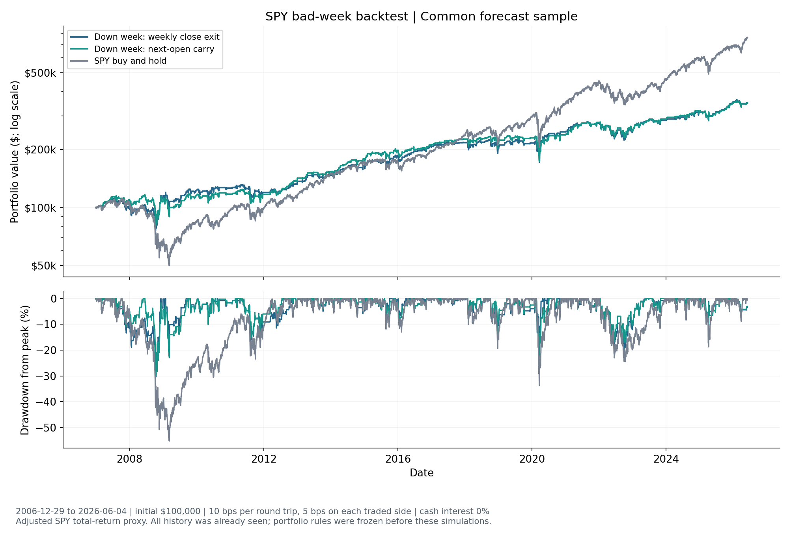
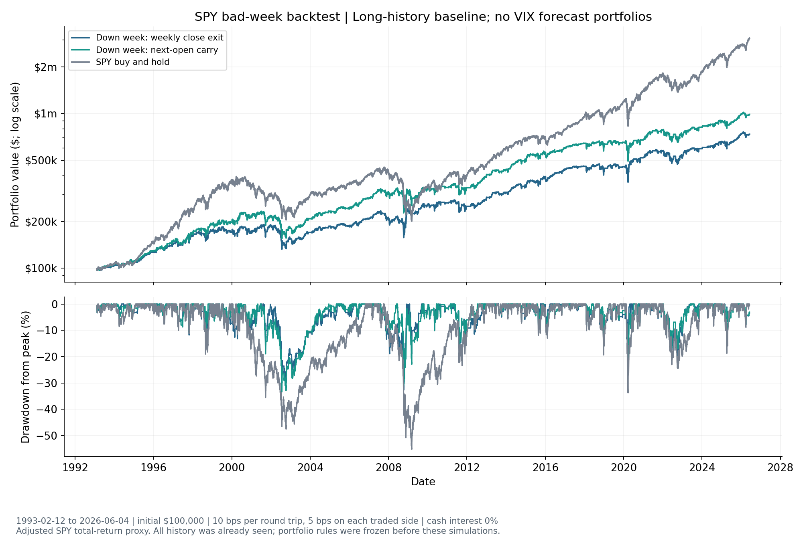

<!-- GENERATED FILE. EDIT THE CANONICAL KNOWLEDGE RECORD. -->

# SPY after a negative week: stateful backtest and VIX forecast portfolios

!!! warning "Research-only"
    This page summarizes saved research evidence. It does not authorize LIVE, allocation, or deployment.

## TL;DR

> **Verdict:** The negative-week strategy earns 6.66% CAGR at 10 bps round trip with 32.74% maximum drawdown versus buyhold 11.00% and 55.19%. It holds equity about 39% of days. Continuous next-open carry greatly reduces forecast-portfolio churn; daily VIX carry earns 9.65% versus AR1 carry 9.37%, an unproven small increment. Every central-cost strategy has lower CAGR than buyhold. diagnostic. These are reproducible research backtests with lower-exposure tradeoffs, not independently confirmed alpha, deployment readiness, or capital-allocation advice.

> **Status:** `diagnostic`

> **Disposition:** `diagnostic`

> **Replication:** `directionally_replicated`

## Research question

Does the source negative-week signal or any of the six unchanged regression forecasts produce useful SPY long/cash portfolio economics after costs, and does forced weekly close liquidation versus continuous next-open rebalancing change that conclusion?

## Exact setup

| Field | Value |
| --- | --- |
| Signal family | mean_reversion |
| Universe | ["SPY ETF"] |
| Decision | After finalSPY/VIXEOD_T, conservatively16:30NY normaldays; savedprediction train_last_outcome<=T |
| Fill | NextobservedSPYOpen afteractualThursdayanchorT |
| Primary cost layer | central_research |
| Last reviewed | 2026-09-15T17:04:32.600723+00:00 |

## Timing and overnight attribution

```text
information available: After finalSPY/VIXEOD_T, conservatively16:30NY normaldays; savedprediction train_last_outcome<=T
primary executable fill: NextobservedSPYOpen afteractualThursdayanchorT
```

If final `Close_T` data formed the signal, a hypothetical `Close_T` entry is diagnostic only unless a separate pre-close protocol was modeled. Comparing that diagnostic with `Open_(T+1)` and applying the compounded return identity shows whether the apparent edge occurred in the overnight gap. Missing attribution numbers mean **not tested**, not zero.

| Attribution field | Value |
| --- | --- |
| Status | tested |
| Diagnostic Path | Source close-to-close association, reviewed in the preceding immutable regression study |
| Executable Path | Next-session open to the predetermined Thursday-anchor close, with a missed auction deferred to the first available reopening open |
| Method | The preceding study supplied the same-exit endpoint decomposition; this study adds daily stateful close-exit and next-open-carry portfolio ledgers. |
| Headline Result | Both implementations use the corrected causal calendar; carry changes the holding target, overnight exposure and turnover while retaining the original forecasts unchanged. |
| Metrics | [{"annualized_cost_drag": 0.021847681431183874, "annualized_volatility": 0.14424745966879077, "average_exposure": 0.3898096992019644, "average_overnight_exposure": 0.3091876406793534, "cagr": 0.06659563743675845, "daily_beta": 0.5325386706896207, "daily_correlation": 0.7249730411826344, "elapsed_years": 19.43126853753137, "end_date": "2026-06-04", "ending_nav": 350002.9390928741, "fee_cash": 74814.32531835878, "gross_cagr": 0.08844331886794232, "gross_total_return": 4.190195674597312, "max_drawdown": -0.3274305246106264, "monthly_beta": 0.3841256887307101, "monthly_correlation": 0.5602535929107276, "n_days": 4887.0, "n_orders": 788.0, "round_trip_bps": 10.0, "sample": "primary", "sharpe": 0.5196179987572898, "start_date": "2006-12-29", "starting_nav": 100000.0, "strategy": "negative_week", "timing": "close_exit", "total_cost_drag": 1.6901662836685563, "total_return": 2.500029390928756, "turnover_per_year": 40.54306063081461}, {"annualized_cost_drag": 0.042143729203938385, "annualized_volatility": 0.1667070172286663, "average_exposure": 0.7474933497032945, "average_overnight_exposure": 0.5923879680785759, "cagr": 0.05941612257036799, "daily_beta": 0.7137977814599628, "daily_correlation": 0.8408145021096036, "elapsed_years": 19.43126853753137, "end_date": "2026-06-04", "ending_nav": 306955.49081628036, "fee_cash": 121127.85314606178, "gross_cagr": 0.10155985177430638, "gross_total_return": 5.550442687233538, "max_drawdown": -0.38795456561129493, "monthly_beta": 0.6380385128650609, "monthly_correlation": 0.7967989386360043, "n_days": 4887.0, "n_orders": 1516.0, "round_trip_bps": 10.0, "sample": "primary", "sharpe": 0.4301420331322497, "start_date": "2006-12-29", "starting_nav": 100000.0, "strategy": "ar1", "timing": "close_exit", "total_cost_drag": 3.4808877790707493, "total_return": 2.0695549081627886, "turnover_per_year": 77.99908618821692}, {"annualized_cost_drag": 0.03695874074245098, "annualized_volatility": 0.17330383874745064, "average_exposure": 0.6664620421526499, "average_overnight_exposure": 0.5285451197053407, "cagr": 0.047139559227090455, "daily_beta": 0.7700583096589484, "daily_correlation": 0.872558010634941, "elapsed_years": 19.43126853753137, "end_date": "2026-06-04", "ending_nav": 244745.15895101364, "fee_cash": 97272.59962627638, "gross_cagr": 0.08409829996954143, "gross_total_return": 3.802071425611925, "max_drawdown": -0.4544021343952144, "monthly_beta": 0.7031568494740025, "monthly_correlation": 0.8354389667362275, "n_days": 4887.0, "n_orders": 1348.0, "round_trip_bps": 10.0, "sample": "primary", "sharpe": 0.3530078756314874, "start_date": "2006-12-29", "starting_nav": 100000.0, "strategy": "vix_level", "timing": "close_exit", "total_cost_drag": 2.354619836101779, "total_return": 1.447451589510146, "turnover_per_year": 69.35538798266255}, {"annualized_cost_drag": 0.04227505440493462, "annualized_volatility": 0.16681065272888987, "average_exposure": 0.7491303458154287, "average_overnight_exposure": 0.5936157151626765, "cagr": 0.05986587188003689, "daily_beta": 0.7147935590364686, "daily_correlation": 0.8414643664539891, "elapsed_years": 19.43126853753137, "end_date": "2026-06-04", "ending_nav": 309497.51942125586, "fee_cash": 123560.80045140733, "gross_cagr": 0.10214092628497151, "gross_total_return": 5.6179122799465295, "max_drawdown": -0.389255111353785, "monthly_beta": 0.6392003683370006, "monthly_correlation": 0.7967801272003672, "n_days": 4887.0, "n_orders": 1520.0, "round_trip_bps": 10.0, "sample": "primary", "sharpe": 0.43252788043179924, "start_date": "2006-12-29", "starting_nav": 100000.0, "strategy": "vix_weekly", "timing": "close_exit", "total_cost_drag": 3.5229370857339526, "total_return": 2.094975194212577, "turnover_per_year": 78.2048885264444}, {"annualized_cost_drag": 0.04109000493762016, "annualized_volatility": 0.16286363073672053, "average_exposure": 0.7241661551053816, "average_overnight_exposure": 0.5739717618170657, "cagr": 0.06736479404521267, "daily_beta": 0.6803735850460607, "daily_correlation": 0.8203557239894724, "elapsed_years": 19.43126853753137, "end_date": "2026-06-04", "ending_nav": 354940.0911836978, "fee_cash": 127841.77100115623, "gross_cagr": 0.10845479898283283, "gross_total_return": 6.394813626319337, "max_drawdown": -0.4048595892894674, "monthly_beta": 0.6105065567753118, "monthly_correlation": 0.7925059634342021, "n_days": 4887.0, "n_orders": 1468.0, "round_trip_bps": 10.0, "sample": "primary", "sharpe": 0.4824894527197378, "start_date": "2006-12-29", "starting_nav": 100000.0, "strategy": "vix_daily", "timing": "close_exit", "total_cost_drag": 3.8454127144823658, "total_return": 2.549400911836971, "turnover_per_year": 75.52945812948711}, {"annualized_cost_drag": 0.03699450811550564, "annualized_volatility": 0.17473092054682887, "average_exposure": 0.6685082872928176, "average_overnight_exposure": 0.5299774913034582, "cagr": 0.043427231330387395, "daily_beta": 0.7823581703106943, "daily_correlation": 0.8792547806232318, "elapsed_years": 19.43126853753137, "end_date": "2026-06-04", "ending_nav": 228424.83488883136, "fee_cash": 91104.45931947857, "gross_cagr": 0.08042173944589304, "gross_total_return": 3.4953209929601803, "max_drawdown": -0.48454017966715524, "monthly_beta": 0.708949624621895, "monthly_correlation": 0.8356707444596949, "n_days": 4887.0, "n_orders": 1354.0, "round_trip_bps": 10.0, "sample": "primary", "sharpe": 0.3311739329535789, "start_date": "2006-12-29", "starting_nav": 100000.0, "strategy": "level_weekly", "timing": "close_exit", "total_cost_drag": 2.211072644071859, "total_return": 1.2842483488883212, "turnover_per_year": 69.66409149000378}, {"annualized_cost_drag": 0.035786490472740295, "annualized_volatility": 0.17115411318505744, "average_exposure": 0.6437487210967874, "average_overnight_exposure": 0.5105381624718641, "cagr": 0.050373866823786306, "daily_beta": 0.7503341824443492, "daily_correlation": 0.8608872425421085, "elapsed_years": 19.43126853753137, "end_date": "2026-06-04", "ending_nav": 259859.86494292793, "fee_cash": 91283.41285319207, "gross_cagr": 0.0861603572965266, "gross_total_return": 3.982702293015559, "max_drawdown": -0.476766149737887, "monthly_beta": 0.6998629117855696, "monthly_correlation": 0.8318991272554961, "n_days": 4887.0, "n_orders": 1302.0, "round_trip_bps": 10.0, "sample": "primary", "sharpe": 0.37331130564139847, "start_date": "2006-12-29", "starting_nav": 100000.0, "strategy": "level_daily", "timing": "close_exit", "total_cost_drag": 2.3841036435862955, "total_return": 1.5985986494292637, "turnover_per_year": 66.98866109304647}, {"annualized_cost_drag": 5.712411079050739e-05, "annualized_volatility": 0.1963717934120596, "average_exposure": 1.0, "average_overnight_exposure": 0.9997953754859832, "cagr": 0.1099652824114219, "daily_beta": 1.0000001849955829, "daily_correlation": 0.9999996656998198, "elapsed_years": 19.43126853753137, "end_date": "2026-06-04", "ending_nav": 759309.8320485734, "fee_cash": 429.8198509372616, "gross_cagr": 0.1100224065222124, "gross_total_return": 6.600695217254638, "max_drawdown": -0.5518946818407561, "monthly_beta": 1.0000232651521925, "monthly_correlation": 0.9999994673622307, "n_days": 4887.0, "n_orders": 2.0, "round_trip_bps": 10.0, "sample": "primary", "sharpe": 0.6306890831260714, "start_date": "2006-12-29", "starting_nav": 100000.0, "strategy": "buy_hold", "timing": "close_exit", "total_cost_drag": 0.007596896768967909, "total_return": 6.59309832048567, "turnover_per_year": 0.10290116911374267}, {"annualized_cost_drag": 0.013807194966241054, "annualized_volatility": 0.14684232830610544, "average_exposure": 0.3898096992019644, "average_overnight_exposure": 0.3898096992019644, "cagr": 0.0662763690574697, "daily_beta": 0.5559305480316294, "daily_correlation": 0.7434438237108202, "elapsed_years": 19.43126853753137, "end_date": "2026-06-04", "ending_nav": 347972.7739975125, "fee_cash": 49216.485692570335, "gross_cagr": 0.08008356402371075, "gross_total_return": 3.4680589543659535, "max_drawdown": -0.3085325589420883, "monthly_beta": 0.46286896649151343, "monthly_correlation": 0.6604941113939183, "n_days": 4887.0, "n_orders": 500.0, "round_trip_bps": 10.0, "sample": "primary", "sharpe": 0.5109593068521162, "start_date": "2006-12-29", "starting_nav": 100000.0, "strategy": "negative_week", "timing": "open_carry", "total_cost_drag": 0.9883312143908349, "total_return": 2.4797277399751185, "turnover_per_year": 25.725292278435667}, {"annualized_cost_drag": 0.01142858853812112, "annualized_volatility": 0.17158593907502753, "average_exposure": 0.7474933497032945, "average_overnight_exposure": 0.7472887251892777, "cagr": 0.09366171712303539, "daily_beta": 0.7572672036289904, "daily_correlation": 0.8666551726094396, "elapsed_years": 19.43126853753137, "end_date": "2026-06-04", "ending_nav": 569568.8280414497, "fee_cash": 45329.00814340326, "gross_cagr": 0.10509030566115651, "gross_total_return": 5.970656874147839, "max_drawdown": -0.3586076151973313, "monthly_beta": 0.724590940836272, "monthly_correlation": 0.8578151178047426, "n_days": 4887.0, "n_orders": 404.0, "round_trip_bps": 10.0, "sample": "primary", "sharpe": 0.6085597965998711, "start_date": "2006-12-29", "starting_nav": 100000.0, "strategy": "ar1", "timing": "open_carry", "total_cost_drag": 1.274968593733333, "total_return": 4.695688280414506, "turnover_per_year": 20.786036160976014}, {"annualized_cost_drag": 0.013339411839841775, "annualized_volatility": 0.17867965633852273, "average_exposure": 0.6664620421526499, "average_overnight_exposure": 0.6664620421526499, "cagr": 0.07786979091723256, "daily_beta": 0.822370018738151, "daily_correlation": 0.903797303374949, "elapsed_years": 19.43126853753137, "end_date": "2026-06-04", "ending_nav": 429343.13774713717, "fee_cash": 47222.114642891436, "gross_cagr": 0.09120920275707434, "gross_total_return": 4.45256580628109, "max_drawdown": -0.4117002862978911, "monthly_beta": 0.773820159743465, "monthly_correlation": 0.8796034535369595, "n_days": 4887.0, "n_orders": 478.0, "round_trip_bps": 10.0, "sample": "primary", "sharpe": 0.5098676777947824, "start_date": "2006-12-29", "starting_nav": 100000.0, "strategy": "vix_level", "timing": "open_carry", "total_cost_drag": 1.1591344288097005, "total_return": 3.2934313774713893, "turnover_per_year": 24.593379418184494}, {"annualized_cost_drag": 0.011285295217322577, "annualized_volatility": 0.1717165881709292, "average_exposure": 0.7491303458154287, "average_overnight_exposure": 0.7489257213014119, "cagr": 0.09080495014015799, "daily_beta": 0.7583231205306709, "daily_correlation": 0.8672033111104583, "elapsed_years": 19.43126853753137, "end_date": "2026-06-04", "ending_nav": 541344.8868737634, "fee_cash": 42341.419143748506, "gross_cagr": 0.10209024535748057, "gross_total_return": 5.612001489635157, "max_drawdown": -0.3586076151973313, "monthly_beta": 0.7238529629273001, "monthly_correlation": 0.858816675271491, "n_days": 4887.0, "n_orders": 400.0, "round_trip_bps": 10.0, "sample": "primary", "sharpe": 0.5929607682169731, "start_date": "2006-12-29", "starting_nav": 100000.0, "strategy": "vix_weekly", "timing": "open_carry", "total_cost_drag": 1.1985526208975203, "total_return": 4.413448868737636, "turnover_per_year": 20.580233822748532}, {"annualized_cost_drag": 0.012370888214883191, "annualized_volatility": 0.1674103681141887, "average_exposure": 0.7241661551053816, "average_overnight_exposure": 0.7239615305913648, "cagr": 0.09649598825308048, "daily_beta": 0.7230277627488105, "daily_correlation": 0.8481086704861492, "elapsed_years": 19.43126853753137, "end_date": "2026-06-04", "ending_nav": 598946.0083213816, "fee_cash": 52421.23016510293, "gross_cagr": 0.10886687646796367, "gross_total_return": 6.448415236818163, "max_drawdown": -0.35860761519733086, "monthly_beta": 0.6974088656624173, "monthly_correlation": 0.8595361066555214, "n_days": 4887.0, "n_orders": 436.0, "round_trip_bps": 10.0, "sample": "primary", "sharpe": 0.635072352943948, "start_date": "2006-12-29", "starting_nav": 100000.0, "strategy": "vix_daily", "timing": "open_carry", "total_cost_drag": 1.4589551536043412, "total_return": 4.989460083213822, "turnover_per_year": 22.4324548667959}, {"annualized_cost_drag": 0.012763590451018603, "annualized_volatility": 0.18010728797458733, "average_exposure": 0.6685082872928176, "average_overnight_exposure": 0.6685082872928176, "cagr": 0.06727904359356884, "daily_beta": 0.8403239432748256, "daily_correlation": 0.9162085329895285, "elapsed_years": 19.43126853753137, "end_date": "2026-06-04", "ending_nav": 354386.41193754744, "fee_cash": 38599.73925484585, "gross_cagr": 0.08004263404458745, "gross_total_return": 3.4647700400945665, "max_drawdown": -0.49380425605328127, "monthly_beta": 0.8105825552309243, "monthly_correlation": 0.8892726027306456, "n_days": 4887.0, "n_orders": 462.0, "round_trip_bps": 10.0, "sample": "primary", "sharpe": 0.45231502651428424, "start_date": "2006-12-29", "starting_nav": 100000.0, "strategy": "level_weekly", "timing": "open_carry", "total_cost_drag": 0.920905920719091, "total_return": 2.5438641193754754, "turnover_per_year": 23.770170065274556}, {"annualized_cost_drag": 0.013548500301191035, "annualized_volatility": 0.1763318596272854, "average_exposure": 0.6437487210967874, "average_overnight_exposure": 0.6435440965827706, "cagr": 0.07663297903082489, "daily_beta": 0.8008879246559687, "daily_correlation": 0.8919075472159068, "elapsed_years": 19.43126853753137, "end_date": "2026-06-04", "ending_nav": 419870.80601049593, "fee_cash": 45940.54131004827, "gross_cagr": 0.09018147933201592, "gross_total_return": 4.353641017684279, "max_drawdown": -0.4398007905990149, "monthly_beta": 0.768568258234696, "monthly_correlation": 0.8738470136907346, "n_days": 4887.0, "n_orders": 486.0, "round_trip_bps": 10.0, "sample": "primary", "sharpe": 0.5077446991224064, "start_date": "2006-12-29", "starting_nav": 100000.0, "strategy": "level_daily", "timing": "open_carry", "total_cost_drag": 1.1549329575793221, "total_return": 3.1987080601049565, "turnover_per_year": 25.004984094639465}, {"annualized_cost_drag": 5.712411079050739e-05, "annualized_volatility": 0.1963717934120596, "average_exposure": 1.0, "average_overnight_exposure": 0.9997953754859832, "cagr": 0.1099652824114219, "daily_beta": 1.0000001849955829, "daily_correlation": 0.9999996656998198, "elapsed_years": 19.43126853753137, "end_date": "2026-06-04", "ending_nav": 759309.8320485734, "fee_cash": 429.8198509372616, "gross_cagr": 0.1100224065222124, "gross_total_return": 6.600695217254638, "max_drawdown": -0.5518946818407561, "monthly_beta": 1.0000232651521925, "monthly_correlation": 0.9999994673622307, "n_days": 4887.0, "n_orders": 2.0, "round_trip_bps": 10.0, "sample": "primary", "sharpe": 0.6306890831260714, "start_date": "2006-12-29", "starting_nav": 100000.0, "strategy": "buy_hold", "timing": "open_carry", "total_cost_drag": 0.007596896768967909, "total_return": 6.59309832048567, "turnover_per_year": 0.10290116911374267}] |
| Artifact | pakal-research/reports/badweek_spy_backtest_20260915/tables/metrics.csv |

## Primary metrics

| Metric | Value |
| --- | ---: |
| Period | 2006-12-29 open through 2026-06-04 close; all history already seen |
| Universe | SPY |
| Cost Layer | central_research |
| Cagr | 6.66% |
| Annualized Volatility | 14.42% |
| Sharpe | 0.520 |
| Maximum Drawdown | -32.74% |
| Turnover | 4054.31% |

## Four separate verdicts

| Question | Conclusion |
| --- | --- |
| Source Replication | The literal weekly association remains directionally replicated. A stateful portfolio is an internal translation; one full-source 2001 calendar exit required a causal missed-auction fallback before equity results. |
| Predictive Value | Unchanged saved regression forecasts were converted to positive/negative exposure without retraining. Daily VIX adds a small positive portfolio mean relative to AR1 in both periods; all 20 paired Holm tests fail, and all mappings use already-seen history. |
| Economic Value | The negative-week strategy earns 6.66% CAGR at 10 bps round trip with 32.74% maximum drawdown versus buyhold 11.00% and 55.19%. It holds equity about 39% of days. Continuous next-open carry greatly reduces forecast-portfolio churn; daily VIX carry earns 9.65% versus AR1 carry 9.37%, an unproven small increment. Every central-cost strategy has lower CAGR than buyhold. |
| Promotion | diagnostic. These are reproducible research backtests with lower-exposure tradeoffs, not independently confirmed alpha, deployment readiness, or capital-allocation advice. |

## Key findings

| Feature | Role | Direction | Status | Effect | Action |
| --- | --- | --- | --- | --- | --- |
| Prior negative SPY week | Fixed binary long/cash portfolio mapping; VIX additions compared with AR1 | Primary close-exit net CAGR difference versus buy_hold: -4.337 percentage points | diagnostic | {"central_primary_metrics": {"annualized_cost_drag": 0.021847681431183874, "annualized_volatility": 0.14424745966879077, "average_exposure": 0.3898096992019644, "average_overnight_exposure": 0.3091876406793534, "cagr": 0.06659563743675845, "daily_beta": 0.5325386706896207, "daily_correlation": 0.7249730411826344, "elapsed_years": 19.43126853753137, "end_date": "2026-06-04", "ending_nav": 350002.9390928741, "fee_cash": 74814.32531835878, "gross_cagr": 0.08844331886794232, "gross_total_return": 4.190195674597312, "max_drawdown": -0.3274305246106264, "monthly_beta": 0.3841256887307101, "monthly_correlation": 0.5602535929107276, "n_days": 4887.0, "n_orders": 788.0, "round_trip_bps": 10.0, "sample": "primary", "sharpe": 0.5196179987572898, "start_date": "2006-12-29", "starting_nav": 100000.0, "strategy": "negative_week", "timing": "close_exit", "total_cost_drag": 1.6901662836685563, "total_return": 2.500029390928756, "turnover_per_year": 40.54306063081461}, "chronological_comparisons": [{"cagr_difference": 0.006373473008798536, "comparator": "buy_hold", "comparator_net_cagr": 0.0686995175106686, "net_cagr": 0.07507299051946714, "period": "early", "timing": "close_exit"}, {"cagr_difference": -0.0978280204313633, "comparator": "buy_hold", "comparator_net_cagr": 0.15551679906093718, "net_cagr": 0.05768877862957389, "period": "late", "timing": "close_exit"}, {"cagr_difference": 0.00832159818915934, "comparator": "buy_hold", "comparator_net_cagr": 0.0686995175106686, "net_cagr": 0.07702111569982795, "period": "early", "timing": "open_carry"}, {"cagr_difference": -0.1005089705780593, "comparator": "buy_hold", "comparator_net_cagr": 0.15551679906093718, "net_cagr": 0.055007828482877885, "period": "late", "timing": "open_carry"}], "matched_comparator_metrics": {"annualized_cost_drag": 5.712411079050739e-05, "annualized_volatility": 0.1963717934120596, "average_exposure": 1.0, "average_overnight_exposure": 0.9997953754859832, "cagr": 0.1099652824114219, "daily_beta": 1.0000001849955829, "daily_correlation": 0.9999996656998198, "elapsed_years": 19.43126853753137, "end_date": "2026-06-04", "ending_nav": 759309.8320485734, "fee_cash": 429.8198509372616, "gross_cagr": 0.1100224065222124, "gross_total_return": 6.600695217254638, "max_drawdown": -0.5518946818407561, "monthly_beta": 1.0000232651521925, "monthly_correlation": 0.9999994673622307, "n_days": 4887.0, "n_orders": 2.0, "round_trip_bps": 10.0, "sample": "primary", "sharpe": 0.6306890831260714, "start_date": "2006-12-29", "starting_nav": 100000.0, "strategy": "buy_hold", "timing": "close_exit", "total_cost_drag": 0.007596896768967909, "total_return": 6.59309832048567, "turnover_per_year": 0.10290116911374267}} | Retain the complete frozen comparison; no model selection or allocation from these already-seen results. |
| SPY weekly-return forecast | Fixed binary long/cash portfolio mapping; VIX additions compared with AR1 | Primary close-exit net CAGR difference versus buy_hold: -5.055 percentage points | diagnostic | {"central_primary_metrics": {"annualized_cost_drag": 0.042143729203938385, "annualized_volatility": 0.1667070172286663, "average_exposure": 0.7474933497032945, "average_overnight_exposure": 0.5923879680785759, "cagr": 0.05941612257036799, "daily_beta": 0.7137977814599628, "daily_correlation": 0.8408145021096036, "elapsed_years": 19.43126853753137, "end_date": "2026-06-04", "ending_nav": 306955.49081628036, "fee_cash": 121127.85314606178, "gross_cagr": 0.10155985177430638, "gross_total_return": 5.550442687233538, "max_drawdown": -0.38795456561129493, "monthly_beta": 0.6380385128650609, "monthly_correlation": 0.7967989386360043, "n_days": 4887.0, "n_orders": 1516.0, "round_trip_bps": 10.0, "sample": "primary", "sharpe": 0.4301420331322497, "start_date": "2006-12-29", "starting_nav": 100000.0, "strategy": "ar1", "timing": "close_exit", "total_cost_drag": 3.4808877790707493, "total_return": 2.0695549081627886, "turnover_per_year": 77.99908618821692}, "chronological_comparisons": [{"cagr_difference": -0.029034351822611493, "comparator": "buy_hold", "comparator_net_cagr": 0.0686995175106686, "net_cagr": 0.039665165688057114, "period": "early", "timing": "close_exit"}, {"cagr_difference": -0.07472152907502672, "comparator": "buy_hold", "comparator_net_cagr": 0.15551679906093718, "net_cagr": 0.08079526998591047, "period": "late", "timing": "close_exit"}, {"cagr_difference": 0.0026440647520240557, "comparator": "buy_hold", "comparator_net_cagr": 0.0686995175106686, "net_cagr": 0.07134358226269266, "period": "early", "timing": "open_carry"}, {"cagr_difference": -0.03764606137245341, "comparator": "buy_hold", "comparator_net_cagr": 0.15551679906093718, "net_cagr": 0.11787073768848377, "period": "late", "timing": "open_carry"}], "matched_comparator_metrics": {"annualized_cost_drag": 5.712411079050739e-05, "annualized_volatility": 0.1963717934120596, "average_exposure": 1.0, "average_overnight_exposure": 0.9997953754859832, "cagr": 0.1099652824114219, "daily_beta": 1.0000001849955829, "daily_correlation": 0.9999996656998198, "elapsed_years": 19.43126853753137, "end_date": "2026-06-04", "ending_nav": 759309.8320485734, "fee_cash": 429.8198509372616, "gross_cagr": 0.1100224065222124, "gross_total_return": 6.600695217254638, "max_drawdown": -0.5518946818407561, "monthly_beta": 1.0000232651521925, "monthly_correlation": 0.9999994673622307, "n_days": 4887.0, "n_orders": 2.0, "round_trip_bps": 10.0, "sample": "primary", "sharpe": 0.6306890831260714, "start_date": "2006-12-29", "starting_nav": 100000.0, "strategy": "buy_hold", "timing": "close_exit", "total_cost_drag": 0.007596896768967909, "total_return": 6.59309832048567, "turnover_per_year": 0.10290116911374267}} | Retain the complete frozen comparison; no model selection or allocation from these already-seen results. |
| VIX level / 10 | Fixed binary long/cash portfolio mapping; VIX additions compared with AR1 | Primary close-exit net CAGR difference versus ar1: -1.228 percentage points | diagnostic | {"central_primary_metrics": {"annualized_cost_drag": 0.03695874074245098, "annualized_volatility": 0.17330383874745064, "average_exposure": 0.6664620421526499, "average_overnight_exposure": 0.5285451197053407, "cagr": 0.047139559227090455, "daily_beta": 0.7700583096589484, "daily_correlation": 0.872558010634941, "elapsed_years": 19.43126853753137, "end_date": "2026-06-04", "ending_nav": 244745.15895101364, "fee_cash": 97272.59962627638, "gross_cagr": 0.08409829996954143, "gross_total_return": 3.802071425611925, "max_drawdown": -0.4544021343952144, "monthly_beta": 0.7031568494740025, "monthly_correlation": 0.8354389667362275, "n_days": 4887.0, "n_orders": 1348.0, "round_trip_bps": 10.0, "sample": "primary", "sharpe": 0.3530078756314874, "start_date": "2006-12-29", "starting_nav": 100000.0, "strategy": "vix_level", "timing": "close_exit", "total_cost_drag": 2.354619836101779, "total_return": 1.447451589510146, "turnover_per_year": 69.35538798266255}, "chronological_comparisons": [{"cagr_difference": 0.00985073036340034, "comparator": "ar1", "comparator_net_cagr": 0.039665165688057114, "net_cagr": 0.04951589605145745, "period": "early", "timing": "close_exit"}, {"cagr_difference": -0.03616090460749044, "comparator": "ar1", "comparator_net_cagr": 0.08079526998591047, "net_cagr": 0.04463436537842003, "period": "late", "timing": "close_exit"}, {"cagr_difference": 0.0035275460077286436, "comparator": "ar1", "comparator_net_cagr": 0.07134358226269266, "net_cagr": 0.0748711282704213, "period": "early", "timing": "open_carry"}, {"cagr_difference": -0.03679308614790622, "comparator": "ar1", "comparator_net_cagr": 0.11787073768848377, "net_cagr": 0.08107765154057756, "period": "late", "timing": "open_carry"}], "matched_comparator_metrics": {"annualized_cost_drag": 0.042143729203938385, "annualized_volatility": 0.1667070172286663, "average_exposure": 0.7474933497032945, "average_overnight_exposure": 0.5923879680785759, "cagr": 0.05941612257036799, "daily_beta": 0.7137977814599628, "daily_correlation": 0.8408145021096036, "elapsed_years": 19.43126853753137, "end_date": "2026-06-04", "ending_nav": 306955.49081628036, "fee_cash": 121127.85314606178, "gross_cagr": 0.10155985177430638, "gross_total_return": 5.550442687233538, "max_drawdown": -0.38795456561129493, "monthly_beta": 0.6380385128650609, "monthly_correlation": 0.7967989386360043, "n_days": 4887.0, "n_orders": 1516.0, "round_trip_bps": 10.0, "sample": "primary", "sharpe": 0.4301420331322497, "start_date": "2006-12-29", "starting_nav": 100000.0, "strategy": "ar1", "timing": "close_exit", "total_cost_drag": 3.4808877790707493, "total_return": 2.0695549081627886, "turnover_per_year": 77.99908618821692}} | Retain the complete frozen comparison; no model selection or allocation from these already-seen results. |
| Weekly simple VIX return | Fixed binary long/cash portfolio mapping; VIX additions compared with AR1 | Primary close-exit net CAGR difference versus ar1: +0.045 percentage points | diagnostic | {"central_primary_metrics": {"annualized_cost_drag": 0.04227505440493462, "annualized_volatility": 0.16681065272888987, "average_exposure": 0.7491303458154287, "average_overnight_exposure": 0.5936157151626765, "cagr": 0.05986587188003689, "daily_beta": 0.7147935590364686, "daily_correlation": 0.8414643664539891, "elapsed_years": 19.43126853753137, "end_date": "2026-06-04", "ending_nav": 309497.51942125586, "fee_cash": 123560.80045140733, "gross_cagr": 0.10214092628497151, "gross_total_return": 5.6179122799465295, "max_drawdown": -0.389255111353785, "monthly_beta": 0.6392003683370006, "monthly_correlation": 0.7967801272003672, "n_days": 4887.0, "n_orders": 1520.0, "round_trip_bps": 10.0, "sample": "primary", "sharpe": 0.43252788043179924, "start_date": "2006-12-29", "starting_nav": 100000.0, "strategy": "vix_weekly", "timing": "close_exit", "total_cost_drag": 3.5229370857339526, "total_return": 2.094975194212577, "turnover_per_year": 78.2048885264444}, "chronological_comparisons": [{"cagr_difference": 0.002495374044504395, "comparator": "ar1", "comparator_net_cagr": 0.039665165688057114, "net_cagr": 0.04216053973256151, "period": "early", "timing": "close_exit"}, {"cagr_difference": -0.001801971498463617, "comparator": "ar1", "comparator_net_cagr": 0.08079526998591047, "net_cagr": 0.07899329848744685, "period": "late", "timing": "close_exit"}, {"cagr_difference": -0.0033254762475043442, "comparator": "ar1", "comparator_net_cagr": 0.07134358226269266, "net_cagr": 0.06801810601518832, "period": "early", "timing": "open_carry"}, {"cagr_difference": -0.0023368936354914993, "comparator": "ar1", "comparator_net_cagr": 0.11787073768848377, "net_cagr": 0.11553384405299227, "period": "late", "timing": "open_carry"}], "matched_comparator_metrics": {"annualized_cost_drag": 0.042143729203938385, "annualized_volatility": 0.1667070172286663, "average_exposure": 0.7474933497032945, "average_overnight_exposure": 0.5923879680785759, "cagr": 0.05941612257036799, "daily_beta": 0.7137977814599628, "daily_correlation": 0.8408145021096036, "elapsed_years": 19.43126853753137, "end_date": "2026-06-04", "ending_nav": 306955.49081628036, "fee_cash": 121127.85314606178, "gross_cagr": 0.10155985177430638, "gross_total_return": 5.550442687233538, "max_drawdown": -0.38795456561129493, "monthly_beta": 0.6380385128650609, "monthly_correlation": 0.7967989386360043, "n_days": 4887.0, "n_orders": 1516.0, "round_trip_bps": 10.0, "sample": "primary", "sharpe": 0.4301420331322497, "start_date": "2006-12-29", "starting_nav": 100000.0, "strategy": "ar1", "timing": "close_exit", "total_cost_drag": 3.4808877790707493, "total_return": 2.0695549081627886, "turnover_per_year": 77.99908618821692}} | Retain the complete frozen comparison; no model selection or allocation from these already-seen results. |
| Daily simple VIX return | Fixed binary long/cash portfolio mapping; VIX additions compared with AR1 | Primary close-exit net CAGR difference versus ar1: +0.795 percentage points | diagnostic | {"central_primary_metrics": {"annualized_cost_drag": 0.04109000493762016, "annualized_volatility": 0.16286363073672053, "average_exposure": 0.7241661551053816, "average_overnight_exposure": 0.5739717618170657, "cagr": 0.06736479404521267, "daily_beta": 0.6803735850460607, "daily_correlation": 0.8203557239894724, "elapsed_years": 19.43126853753137, "end_date": "2026-06-04", "ending_nav": 354940.0911836978, "fee_cash": 127841.77100115623, "gross_cagr": 0.10845479898283283, "gross_total_return": 6.394813626319337, "max_drawdown": -0.4048595892894674, "monthly_beta": 0.6105065567753118, "monthly_correlation": 0.7925059634342021, "n_days": 4887.0, "n_orders": 1468.0, "round_trip_bps": 10.0, "sample": "primary", "sharpe": 0.4824894527197378, "start_date": "2006-12-29", "starting_nav": 100000.0, "strategy": "vix_daily", "timing": "close_exit", "total_cost_drag": 3.8454127144823658, "total_return": 2.549400911836971, "turnover_per_year": 75.52945812948711}, "chronological_comparisons": [{"cagr_difference": 0.008325490435600047, "comparator": "ar1", "comparator_net_cagr": 0.039665165688057114, "net_cagr": 0.04799065612365716, "period": "early", "timing": "close_exit"}, {"cagr_difference": 0.007532034322911274, "comparator": "ar1", "comparator_net_cagr": 0.08079526998591047, "net_cagr": 0.08832730430882174, "period": "late", "timing": "close_exit"}, {"cagr_difference": 0.0030956264569999004, "comparator": "ar1", "comparator_net_cagr": 0.07134358226269266, "net_cagr": 0.07443920871969256, "period": "early", "timing": "open_carry"}, {"cagr_difference": 0.002544363595369026, "comparator": "ar1", "comparator_net_cagr": 0.11787073768848377, "net_cagr": 0.1204151012838528, "period": "late", "timing": "open_carry"}], "matched_comparator_metrics": {"annualized_cost_drag": 0.042143729203938385, "annualized_volatility": 0.1667070172286663, "average_exposure": 0.7474933497032945, "average_overnight_exposure": 0.5923879680785759, "cagr": 0.05941612257036799, "daily_beta": 0.7137977814599628, "daily_correlation": 0.8408145021096036, "elapsed_years": 19.43126853753137, "end_date": "2026-06-04", "ending_nav": 306955.49081628036, "fee_cash": 121127.85314606178, "gross_cagr": 0.10155985177430638, "gross_total_return": 5.550442687233538, "max_drawdown": -0.38795456561129493, "monthly_beta": 0.6380385128650609, "monthly_correlation": 0.7967989386360043, "n_days": 4887.0, "n_orders": 1516.0, "round_trip_bps": 10.0, "sample": "primary", "sharpe": 0.4301420331322497, "start_date": "2006-12-29", "starting_nav": 100000.0, "strategy": "ar1", "timing": "close_exit", "total_cost_drag": 3.4808877790707493, "total_return": 2.0695549081627886, "turnover_per_year": 77.99908618821692}} | Retain the complete frozen comparison; no model selection or allocation from these already-seen results. |
| VIX level plus weekly return | Fixed binary long/cash portfolio mapping; VIX additions compared with AR1 | Primary close-exit net CAGR difference versus ar1: -1.599 percentage points | diagnostic | {"central_primary_metrics": {"annualized_cost_drag": 0.03699450811550564, "annualized_volatility": 0.17473092054682887, "average_exposure": 0.6685082872928176, "average_overnight_exposure": 0.5299774913034582, "cagr": 0.043427231330387395, "daily_beta": 0.7823581703106943, "daily_correlation": 0.8792547806232318, "elapsed_years": 19.43126853753137, "end_date": "2026-06-04", "ending_nav": 228424.83488883136, "fee_cash": 91104.45931947857, "gross_cagr": 0.08042173944589304, "gross_total_return": 3.4953209929601803, "max_drawdown": -0.48454017966715524, "monthly_beta": 0.708949624621895, "monthly_correlation": 0.8356707444596949, "n_days": 4887.0, "n_orders": 1354.0, "round_trip_bps": 10.0, "sample": "primary", "sharpe": 0.3311739329535789, "start_date": "2006-12-29", "starting_nav": 100000.0, "strategy": "level_weekly", "timing": "close_exit", "total_cost_drag": 2.211072644071859, "total_return": 1.2842483488883212, "turnover_per_year": 69.66409149000378}, "chronological_comparisons": [{"cagr_difference": 0.0020768752768698384, "comparator": "ar1", "comparator_net_cagr": 0.039665165688057114, "net_cagr": 0.04174204096492695, "period": "early", "timing": "close_exit"}, {"cagr_difference": -0.035567680967615534, "comparator": "ar1", "comparator_net_cagr": 0.08079526998591047, "net_cagr": 0.045227589018294934, "period": "late", "timing": "close_exit"}, {"cagr_difference": -0.016013912729806457, "comparator": "ar1", "comparator_net_cagr": 0.07134358226269266, "net_cagr": 0.055329669532886205, "period": "early", "timing": "open_carry"}, {"cagr_difference": -0.037750687441314934, "comparator": "ar1", "comparator_net_cagr": 0.11787073768848377, "net_cagr": 0.08012005024716884, "period": "late", "timing": "open_carry"}], "matched_comparator_metrics": {"annualized_cost_drag": 0.042143729203938385, "annualized_volatility": 0.1667070172286663, "average_exposure": 0.7474933497032945, "average_overnight_exposure": 0.5923879680785759, "cagr": 0.05941612257036799, "daily_beta": 0.7137977814599628, "daily_correlation": 0.8408145021096036, "elapsed_years": 19.43126853753137, "end_date": "2026-06-04", "ending_nav": 306955.49081628036, "fee_cash": 121127.85314606178, "gross_cagr": 0.10155985177430638, "gross_total_return": 5.550442687233538, "max_drawdown": -0.38795456561129493, "monthly_beta": 0.6380385128650609, "monthly_correlation": 0.7967989386360043, "n_days": 4887.0, "n_orders": 1516.0, "round_trip_bps": 10.0, "sample": "primary", "sharpe": 0.4301420331322497, "start_date": "2006-12-29", "starting_nav": 100000.0, "strategy": "ar1", "timing": "close_exit", "total_cost_drag": 3.4808877790707493, "total_return": 2.0695549081627886, "turnover_per_year": 77.99908618821692}} | Retain the complete frozen comparison; no model selection or allocation from these already-seen results. |
| VIX level plus daily return | Fixed binary long/cash portfolio mapping; VIX additions compared with AR1 | Primary close-exit net CAGR difference versus ar1: -0.904 percentage points | diagnostic | {"central_primary_metrics": {"annualized_cost_drag": 0.035786490472740295, "annualized_volatility": 0.17115411318505744, "average_exposure": 0.6437487210967874, "average_overnight_exposure": 0.5105381624718641, "cagr": 0.050373866823786306, "daily_beta": 0.7503341824443492, "daily_correlation": 0.8608872425421085, "elapsed_years": 19.43126853753137, "end_date": "2026-06-04", "ending_nav": 259859.86494292793, "fee_cash": 91283.41285319207, "gross_cagr": 0.0861603572965266, "gross_total_return": 3.982702293015559, "max_drawdown": -0.476766149737887, "monthly_beta": 0.6998629117855696, "monthly_correlation": 0.8318991272554961, "n_days": 4887.0, "n_orders": 1302.0, "round_trip_bps": 10.0, "sample": "primary", "sharpe": 0.37331130564139847, "start_date": "2006-12-29", "starting_nav": 100000.0, "strategy": "level_daily", "timing": "close_exit", "total_cost_drag": 2.3841036435862955, "total_return": 1.5985986494292637, "turnover_per_year": 66.98866109304647}, "chronological_comparisons": [{"cagr_difference": 0.002364397228376003, "comparator": "ar1", "comparator_net_cagr": 0.039665165688057114, "net_cagr": 0.042029562916433116, "period": "early", "timing": "close_exit"}, {"cagr_difference": -0.021484099830971548, "comparator": "ar1", "comparator_net_cagr": 0.08079526998591047, "net_cagr": 0.05931117015493892, "period": "late", "timing": "close_exit"}, {"cagr_difference": -0.006809850966701614, "comparator": "ar1", "comparator_net_cagr": 0.07134358226269266, "net_cagr": 0.06453373129599105, "period": "early", "timing": "open_carry"}, {"cagr_difference": -0.028233169566310057, "comparator": "ar1", "comparator_net_cagr": 0.11787073768848377, "net_cagr": 0.08963756812217372, "period": "late", "timing": "open_carry"}], "matched_comparator_metrics": {"annualized_cost_drag": 0.042143729203938385, "annualized_volatility": 0.1667070172286663, "average_exposure": 0.7474933497032945, "average_overnight_exposure": 0.5923879680785759, "cagr": 0.05941612257036799, "daily_beta": 0.7137977814599628, "daily_correlation": 0.8408145021096036, "elapsed_years": 19.43126853753137, "end_date": "2026-06-04", "ending_nav": 306955.49081628036, "fee_cash": 121127.85314606178, "gross_cagr": 0.10155985177430638, "gross_total_return": 5.550442687233538, "max_drawdown": -0.38795456561129493, "monthly_beta": 0.6380385128650609, "monthly_correlation": 0.7967989386360043, "n_days": 4887.0, "n_orders": 1516.0, "round_trip_bps": 10.0, "sample": "primary", "sharpe": 0.4301420331322497, "start_date": "2006-12-29", "starting_nav": 100000.0, "strategy": "ar1", "timing": "close_exit", "total_cost_drag": 3.4808877790707493, "total_return": 2.0695549081627886, "turnover_per_year": 77.99908618821692}} | Retain the complete frozen comparison; no model selection or allocation from these already-seen results. |

## Visual evidence






## Limitations

- Allnewportfoliomappingsinventedafterseeingregressionhistory; no untouchedvalidation.
- Fractionaladjustedunits anddividendreinvestment are historicalproxies, not executable rawsharebook.
- No cashinterestcredits changes absolute/opportunityreturns; discloseduniformassumption.
- Openprints/closeprints are fillproxies; no measuredspread,auctionvolume,slippage,partials oroperationalcapacity.
- Costs are scenarios,notempiricalcalibration. ADVdailyvolumeisnotauctioncapacity;1m/10m/100m scaleinitialAUM andcompoundpathnotionals.
- InheritedYahoo currentvintageadjustments,VIXbackcastmethodology andsourceholiday/vendorambiguity remain.
- open_carry changes targethorizonwithoutrefittingforecasts; reportonlyaspredeclaredimplementationrobustness.
- Full-source causal backtest differs from literal endpoint replication for September2001: delayed missed-auction exit atSeptember17open, never retroactiveSeptember10close. No new variant orperformance selection.
- Average exposure means intraday capital exposure; separately reported overnight exposure and measured beta describe carried overnight risk.
- Lower drawdown accompanies substantial cash time andlowerbeta; no exposure-matched alpha claim is established.
- The daily-VIX portfolio increment is positive in both periods although its earlier continuous return-forecast MSE worsened. Binary portfolio andforecastaccuracy are distinct questions.
- Source-compatible close_exit intentionally pays weekly liquidation/reentry when positive; carry tests an altered holding target without retraining the original forecasts.
- Simultaneous2001fallback SELL/BUY demand is aggregatedwithinthatportfolio; alternative models are never combined intoanensemble.

## Next gates

- Preserve all seven nonbenchmark exposure rules, both timing protocols and 0/10/25 bps cost scenarios. On 104 new Thursday cycles after 2026-09-15, record paper/shadow auction fills and published-data availability; credit no hypothetical fills as measured. Evaluate the frozen family once against buyhold and AR1, including drawdown, cash yield under a separately frozen realistic convention, turnover and 20 paired-test correction. Any cash-yield addition requires a new prospective amendment; do not tune thresholds on this history. No automation, broker action or capital allocation is authorized.

## Sources

- `{"content_id": "sha256:3084420e316bbebe9c85825bb042975b425a182d469ca926f5ca71c6617dac26", "location": "data/badweek_spy.pdf", "read_complete": true, "read_method": "All14pages visually read during immediately preceding study; unchanged exactPDFhash.", "role": "literal weekly association; article does not specify an executable portfolio", "source_id": "concretum-badweek-spy-2026"}`
- `{"location": "C:\\\\Users\\\\User\\\\Documents\\\\workspace\\\\pakal\\\\pakal-research\\\\reports\\\\badweek_spy_vix_regression_20260915", "read_complete": true, "role": "Frozen saved forecasts and source-rule/data lineage; all historical results already seen", "source_id": "completed-badweek-regression-study"}`

## Canonical artifacts

| Artifact | Pakal path |
| --- | --- |
| Concise Report | `pakal-research/reports/badweek_spy_backtest_20260915/REPORT.md` |
| Full Report | `pakal-research/reports/badweek_spy_backtest_20260915/REPORT_FULL.md` |
| Frozen Specification | `pakal-research/reports/badweek_spy_backtest_20260915/research_spec_frozen.json` |
| Manifest | `pakal-research/reports/badweek_spy_backtest_20260915/run_manifest.json` |
| Research State | `pakal-research/reports/badweek_spy_backtest_20260915/research_state.json` |
| Hypothesis Registry | `pakal-research/reports/badweek_spy_backtest_20260915/hypothesis_registry.json` |
| Experiment Ledger | `pakal-research/reports/badweek_spy_backtest_20260915/experiment_ledger.jsonl` |
| Decision Log | `pakal-research/reports/badweek_spy_backtest_20260915/decision_log.jsonl` |
| Source Rule Map | `pakal-research/reports/badweek_spy_backtest_20260915/SOURCE_RULE_MAP.md` |
| Notebook | `pakal-research/badweek_spy_backtest_20260915.ipynb` |
| Primary Source Code | `["pakal-research/reports/badweek_spy_backtest_20260915/run_backtest.py", "pakal-research/build_badweek_spy_backtest_delivery.py", "pakal-research/build_badweek_spy_backtest_knowledge.py"]` |
| Primary Tables | `["pakal-research/reports/badweek_spy_backtest_20260915/tables/aggregated_auction_demand.csv", "pakal-research/reports/badweek_spy_backtest_20260915/tables/annual_metrics.csv", "pakal-research/reports/badweek_spy_backtest_20260915/tables/calendar_timing_audit.csv", "pakal-research/reports/badweek_spy_backtest_20260915/tables/capacity_aggregated_participation.csv", "pakal-research/reports/badweek_spy_backtest_20260915/tables/capacity_participation.csv", "pakal-research/reports/badweek_spy_backtest_20260915/tables/daily_equity.csv", "pakal-research/reports/badweek_spy_backtest_20260915/tables/metrics.csv", "pakal-research/reports/badweek_spy_backtest_20260915/tables/orders.csv", "pakal-research/reports/badweek_spy_backtest_20260915/tables/paired_vix_tests.csv", "pakal-research/reports/badweek_spy_backtest_20260915/tables/subperiod_metrics.csv", "pakal-research/reports/badweek_spy_backtest_20260915/tables/trades.csv"]` |
| Primary Charts | `["pakal-research/reports/badweek_spy_backtest_20260915/charts/cost_sensitivity.png", "pakal-research/reports/badweek_spy_backtest_20260915/charts/equity_drawdown.png", "pakal-research/reports/badweek_spy_backtest_20260915/charts/full_history_equity.png", "pakal-research/reports/badweek_spy_backtest_20260915/charts/rolling_market_relationship.png", "pakal-research/reports/badweek_spy_backtest_20260915/charts/vix_portfolio_value.png"]` |
