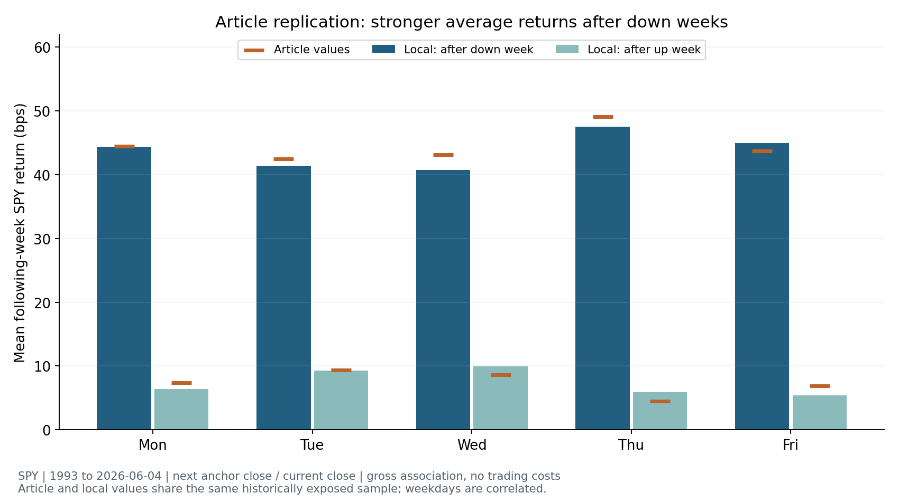
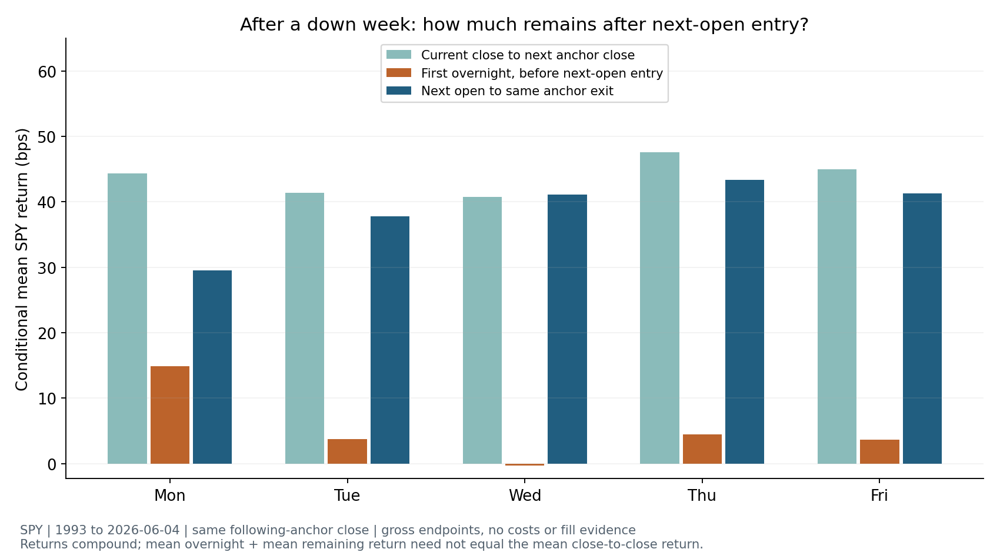

<!-- GENERATED FILE. EDIT THE CANONICAL KNOWLEDGE RECORD. -->

# SPY weekly reversal: VIX level and daily/weekly return regressions

!!! warning "Research-only"
    This page summarizes saved research evidence. It does not authorize LIVE, allocation, or deployment.

## TL;DR

> **Verdict:** Weekly reversal direction reproduced. VIX level and weekly change add no stable prediction; daily change helps only in the late period and fails corrected/stability gates. Diagnostic only.

> **Status:** `diagnostic`

> **Disposition:** `inconclusive`

> **Replication:** `directionally_replicated`

## Research question

Does the source weekly SPY reversal reproduce, and do close-known VIX level, weekly change, or daily change add stable chronological prediction beyond prior weekly SPY return for the same following-week exit?

## Exact setup

| Field | Value |
| --- | --- |
| Signal family | mean_reversion |
| Universe | ["SPY ETF"] |
| Decision | After final SPY Close_T and same-date VIX official EOD are available, conservatively after 16:30 New York. |
| Fill | Source association diagnostic Close_T; executable endpoint Open_(T+1) on next observed SPY session. |
| Primary cost layer | paper_like |
| Last reviewed | 2026-09-15T16:21:06.111593+00:00 |

## Timing and overnight attribution

```text
information available: After final SPY Close_T and same-date VIX official EOD are available, conservatively after 16:30 New York.
primary executable fill: Source association diagnostic Close_T; executable endpoint Open_(T+1) on next observed SPY session.
```

If final `Close_T` data formed the signal, a hypothetical `Close_T` entry is diagnostic only unless a separate pre-close protocol was modeled. Comparing that diagnostic with `Open_(T+1)` and applying the compounded return identity shows whether the apparent edge occurred in the overnight gap. Missing attribution numbers mean **not tested**, not zero.

| Attribution field | Value |
| --- | --- |
| Status | tested |
| Diagnostic Path | Close_T to next anchor Close |
| Executable Path | Open_T+1 to same next anchor Close |
| Method | Exact compounded overnight/remaining identity per row |
| Headline Result | Thursday after-down mean47.56bps at close versus43.34bps from next open; gross endpoints only. |
| Metrics | [{"anchor": "Thu", "condition": "down", "executable_bps": 43.33596940825088, "identity_max_error": 2.220446049250313e-16, "interaction_bps": -0.2654427609158481, "n": 700, "overnight_bps": 4.489390405944024, "source_bps": 47.55991705327898}, {"anchor": "Thu", "condition": "up", "executable_bps": 2.4836019945523704, "identity_max_error": 2.220446049250313e-16, "interaction_bps": 0.0603791776584483, "n": 1035, "overnight_bps": 3.3329503491795847, "source_bps": 5.876931521390426}, {"anchor": "Thu", "condition": "all", "executable_bps": 18.853103752843783, "identity_max_error": 2.220446049250313e-16, "interaction_bps": -0.0704673228723438, "n": 1738, "overnight_bps": 3.6599889756296737, "source_bps": 22.442625405601103}] |
| Artifact | pakal-research/reports/badweek_spy_vix_regression_20260915/tables/timing_attribution.csv |

## Primary metrics

| Metric | Value |
| --- | ---: |
| Period | 1993-01-29 through 2026-06-04; prior-exposed history |
| Universe | SPY |
| Cost Layer | paper_like |
| Cagr | N/A |
| Annualized Volatility | N/A |
| Sharpe | N/A |
| Maximum Drawdown | N/A |
| Turnover | N/A |

## Four separate verdicts

| Question | Conclusion |
| --- | --- |
| Source Replication | Directionally replicated. All5weekly source slopes are negative; Thursday beta−0.1200007 matches−0.120. Exact conditional means differ modestly and Table3edges are undocumented. |
| Predictive Value | VIX level and weekly return do not improve either chronological period. Daily VIX return improves2017-2026 prediction modestly, fails2007-2016, changes coefficient sign across periods and does not survive family correction. Evidence remains diagnostic. |
| Economic Value | Thursday after-down gross endpoint mean remains43.34bps from next-session open to the same exit. This is a conditional association, not a sized portfolio, cost-adjusted return or capacity estimate. |
| Promotion | diagnostic; no research or deployment candidate. Historical source and prior local studies expose all tested periods. Next test must use newly arriving outcomes with the existing frozen family. |

## Key findings

| Feature | Role | Direction | Status | Effect | Action |
| --- | --- | --- | --- | --- | --- |
| Prior-week SPY return | return forecasting covariate | Negative historical slope; later forecast instability | diagnostic | [{"period": "validation", "r2_vs_ar1": 0.0, "r2_vs_mean": 0.0166712185501184, "rmse_bps": 253.74750428900853}, {"period": "confirmation", "r2_vs_ar1": 0.0, "r2_vs_mean": -0.008095517104206, "rmse_bps": 220.6786244715732}] | Retain evidence; do not change trading allocation. Use the original frozen family for future outcomes. |
| VIX level / 10 | return forecasting covariate | No stable incremental prediction | diagnostic | [{"period": "validation", "r2_vs_ar1": -0.0075971206909983, "r2_vs_mean": 0.0092007511185113, "rmse_bps": 254.7095557485624}, {"period": "confirmation", "r2_vs_ar1": -0.0005369649644462, "r2_vs_mean": -0.0086368290777063, "rmse_bps": 220.7378648650081}] | Retain evidence; do not change trading allocation. Use the original frozen family for future outcomes. |
| Weekly simple VIX change | return forecasting covariate | No stable incremental prediction | diagnostic | [{"period": "validation", "r2_vs_ar1": -0.0052055626087725, "r2_vs_mean": 0.011552439013273, "rmse_bps": 254.4070962765583}, {"period": "confirmation", "r2_vs_ar1": -0.0019336583906817, "r2_vs_mean": -0.0100448294594632, "rmse_bps": 220.8918799674676}] | Retain evidence; do not change trading allocation. Use the original frozen family for future outcomes. |
| Daily simple VIX change | return forecasting covariate | Negative late coefficient; unstable across periods | diagnostic | [{"period": "validation", "r2_vs_ar1": -0.0022092855457722, "r2_vs_mean": 0.0144987644865195, "rmse_bps": 254.0276499906636}, {"period": "confirmation", "r2_vs_ar1": 0.0152947986263575, "r2_vs_mean": 0.0073231008260364, "rmse_bps": 218.984504142596}] | Retain evidence; do not change trading allocation. Use the original frozen family for future outcomes. |
| VIX level plus weekly change | return forecasting covariate | No stable incremental prediction | diagnostic | [{"period": "validation", "r2_vs_ar1": -0.012558542173501, "r2_vs_mean": 0.0043220425778628, "rmse_bps": 255.33588228759092}, {"period": "confirmation", "r2_vs_ar1": -0.0022831851486391, "r2_vs_mean": -0.010397185817268, "rmse_bps": 220.9304059166059}] | Retain evidence; do not change trading allocation. Use the original frozen family for future outcomes. |
| VIX level plus daily change | return forecasting covariate | Late-only improvement; no validated winner | diagnostic | [{"period": "validation", "r2_vs_ar1": -0.0099674034223931, "r2_vs_mean": 0.0068699838885573, "rmse_bps": 255.00897056857107}, {"period": "confirmation", "r2_vs_ar1": 0.0167967301627295, "r2_vs_mean": 0.0088371912748504, "rmse_bps": 218.81743625139669}] | Retain evidence; do not change trading allocation. Use the original frozen family for future outcomes. |

## Visual evidence






## Limitations

- PDF clips right margins; bucket edges, holidays, vendor, standard errors and exact source code absent.
- VIX historical modern methodology is backcast before2003 and is not a tradable asset.
- Yahoo adjusted OHLC is current-vintage total-return proxy, not decision-time archived vendor snapshots.
- Five anchors share returns; Thursday was singled out by source and is already selected on historical performance.
- All1993-Jun2026 evidence source-exposed; fresh forward evidence starts after this freeze and is unavailable.
- Source reward/risk on selected active weeks is not calendar-time portfolio Sharpe.
- Source economic suggestions have no exact entry,sizing,holding,cost or allocation rule.
- Full-source fit and later fitted coefficients are descriptive and cannot turn pseudo-OOS into untouched confirmation.
- Daily-VIX stress-persistence interpretation arose after results; it is post-hoc explanation, not confirmation of the original positive-rebound mechanism.
- Unadjusted nested-model squared-error loss test is conservative for estimating larger models; failure of a p-value alone is not proof of zero signal.
- Fixed subperiod coefficient p-values are descriptive uncorrected diagnostics; the model-level50test and forecast10test families are the declared corrected inference.
- SPY/VIX frozen inputs have no NaN price endpoints; reusable runner resample.last would need an explicit finite-input guard before using future dirty datasets.

## Next gates

- Keep the six original Thursday model formulas and expanding matured-label algorithm unchanged. Collect104new completed Thursday outcomes with decisions strictly after2026-09-15; inspect the family once. Require positive executable incremental R2vsAR1 and vsmean, stable coefficient direction and Holm-corrected loss evidence across10extension-target comparisons. Only then freeze a separate stateful exposure/cost/capacity study. No scheduled monitoring or trading authorized.

## Sources

- `{"content_id": "sha256:3084420e316bbebe9c85825bb042975b425a182d469ca926f5ca71c6617dac26", "location": "data/badweek_spy.pdf", "read_complete": true, "read_method": "All 14 rendered pages visually read by lead and root; OCR supplementary. Right-hand source margin physically clipped; public author page confirms cutoff.", "role": "literal source", "source_id": "concretum-badweek-spy-2026"}`

## Canonical artifacts

| Artifact | Pakal path |
| --- | --- |
| Concise Report | `pakal-research/reports/badweek_spy_vix_regression_20260915/REPORT.md` |
| Full Report | `pakal-research/reports/badweek_spy_vix_regression_20260915/REPORT_FULL.md` |
| Frozen Specification | `pakal-research/reports/badweek_spy_vix_regression_20260915/research_spec_frozen.json` |
| Manifest | `pakal-research/reports/badweek_spy_vix_regression_20260915/run_manifest.json` |
| Research State | `pakal-research/reports/badweek_spy_vix_regression_20260915/research_state.json` |
| Hypothesis Registry | `pakal-research/reports/badweek_spy_vix_regression_20260915/hypothesis_registry.json` |
| Experiment Ledger | `pakal-research/reports/badweek_spy_vix_regression_20260915/experiment_ledger.jsonl` |
| Decision Log | `pakal-research/reports/badweek_spy_vix_regression_20260915/decision_log.jsonl` |
| Source Rule Map | `pakal-research/reports/badweek_spy_vix_regression_20260915/SOURCE_RULE_MAP.md` |
| Notebook | `pakal-research/badweek_spy_vix_regression_20260915.ipynb` |
| Primary Source Code | `["pakal-research/reports/badweek_spy_vix_regression_20260915/run_research.py", "pakal-research/build_badweek_spy_vix_charts.py", "pakal-research/build_badweek_spy_vix_delivery.py"]` |
| Primary Tables | `["pakal-research/reports/badweek_spy_vix_regression_20260915/tables/baseline_conditional.csv", "pakal-research/reports/badweek_spy_vix_regression_20260915/tables/baseline_regressions.csv", "pakal-research/reports/badweek_spy_vix_regression_20260915/tables/full_regressions.csv", "pakal-research/reports/badweek_spy_vix_regression_20260915/tables/oos_metrics.csv", "pakal-research/reports/badweek_spy_vix_regression_20260915/tables/diagnostics_coefficients.csv", "pakal-research/reports/badweek_spy_vix_regression_20260915/tables/timing_attribution.csv"]` |
| Primary Charts | `["pakal-research/reports/badweek_spy_vix_regression_20260915/charts/baseline_replication.png", "pakal-research/reports/badweek_spy_vix_regression_20260915/charts/entry_timing.png", "pakal-research/reports/badweek_spy_vix_regression_20260915/charts/regression_uncertainty.png", "pakal-research/reports/badweek_spy_vix_regression_20260915/charts/vix_forecast_value.png"]` |
