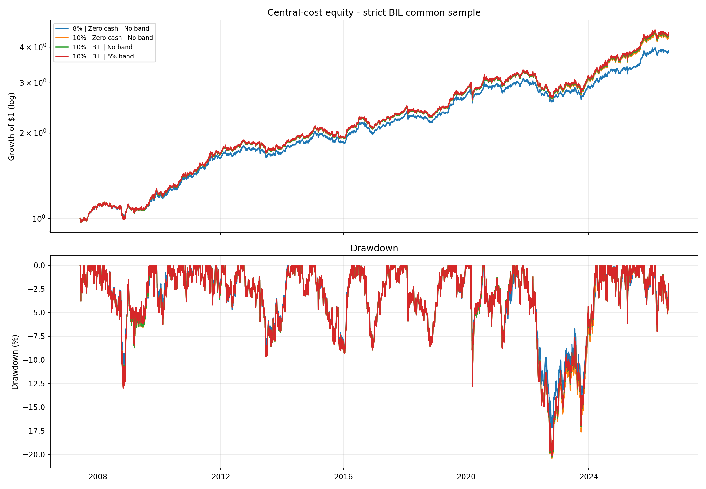
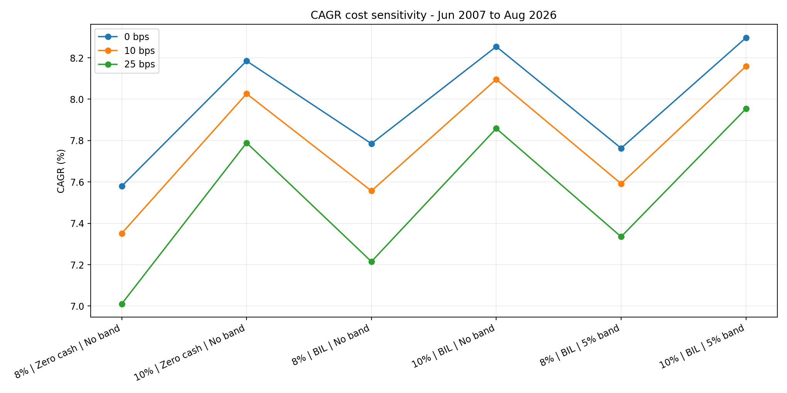

<!-- GENERATED FILE. EDIT THE CANONICAL KNOWLEDGE RECORD. -->

# Beyond 60/40 - cash yield and exposure band sweep

!!! warning "Research-only"
    This page summarizes saved research evidence. It does not authorize LIVE, allocation, or deployment.

## TL;DR

> **Verdict:** מועמד יעד 10% עבר את חמשת השערים הכלכליים אך נכשל בשער היציבות: Sharpe היה טוב מהבסיס רק בתקופה רחבה אחת מתוך שלוש. לכן הוא אינו מחליף את הבסיס. יעד 8% עם BIL ורצועה 5% הוא שיפור Pareto נצפה והשערת המעקב המועדפת, אך נשאר פוסט-הוק ומחקרי בלבד.

> **Status:** `forward_hypothesis`

> **Disposition:** `not_recorded`

> **Replication:** `not_recorded`

## Research question

Test whether BIL residual return and a 5 percentage-point exposure band improve the frozen Rolling-63 volatility-target portfolio.

## Exact setup

| Field | Value |
| --- | --- |
| Signal family | cross_asset_risk_allocation |
| Universe | ["Fixed VTI/GLD/TLT risky sleeve plus BIL cash proxy"] |
| Decision | Close_T |
| Fill | Open_T+1 |
| Primary cost layer | central_research |
| Last reviewed | 2026-08-08T17:43:37.134712+03:00 |

## Timing and overnight attribution

```text
information available: Close_T
primary executable fill: Open_T+1
```

If final `Close_T` data formed the signal, a hypothetical `Close_T` entry is diagnostic only unless a separate pre-close protocol was modeled. Comparing that diagnostic with `Open_(T+1)` and applying the compounded return identity shows whether the apparent edge occurred in the overnight gap. Missing attribution numbers mean **not tested**, not zero.


## Primary metrics

| Metric | Value |
| --- | ---: |
| Period | ["2007-06-01", "2026-08-07"] |
| Universe | VTI/GLD/TLT plus BIL residual proxy |
| Cost Layer | central_research_10_bps_risky_turnover |
| Cagr | 7.59% |
| Annualized Volatility | 7.77% |
| Sharpe | 0.982 |
| Maximum Drawdown | -17.01% |
| Turnover | 159.41% |

## Key findings

| Feature | Role | Direction | Status | Effect | Action |
| --- | --- | --- | --- | --- | --- |
| BIL residual cash return | cash return proxy | raises return on residual non-risky weight | forward_hypothesis | {"target10_cagr_increment": 0.0006935295036258893, "target8_cagr_increment": 0.002050265144711849} | Track forward and reprice with literal BIL trading costs before any promotion. |
| 5 percentage-point exposure no-trade band | turnover control | holds current sleeve weights when desired exposure is close to actual Close_T exposure | forward_hypothesis | {"target10_annual_turnover_change": -0.19640306996821333, "target8_annual_turnover_change": -0.5298993024075207} | Keep only if the frozen economic and consistency gates pass. |

## Visual evidence






## Limitations

- BIL funding-leg transaction costs are excluded.
- BIL inception shifts the common evaluation start to 2007-06-01.
- Adjusted Open is not a verified fill.
- The extension is post-hoc and capped at forward hypothesis.

## Next gates

- Forward-track target8+BIL+5% band for 12-24 months without changes.
- Reprice BIL with empirical spread, fees, and opening fills.
- Only after that consider one separate trend-overlay study.

## Sources

- `pakal-research/reports/beyond_60_40_volatility_estimators/REPORT_FULL.md`
- `Norgate US Equities VTI/GLD/TLT/BIL`

## Canonical artifacts

| Artifact | Pakal path |
| --- | --- |
| Concise Report | `pakal-research/reports/beyond_60_40_cash_band_sweep/REPORT.md` |
| Frozen Specification | `pakal-research/reports/beyond_60_40_cash_band_sweep/research_spec_frozen.json` |
| Full Report | `pakal-research/reports/beyond_60_40_cash_band_sweep/REPORT_FULL.md` |
| Manifest | `pakal-research/reports/beyond_60_40_cash_band_sweep/run_manifest.json` |
| Notebook | `pakal-research/beyond_60_40_cash_band_sweep.ipynb` |
| Primary Charts | `["pakal-research/reports/beyond_60_40_cash_band_sweep/charts"]` |
| Primary Source Code | `["pakal-research/beyond_60_40_cash_band_sweep.py"]` |
| Primary Tables | `["pakal-research/reports/beyond_60_40_cash_band_sweep/tables"]` |
