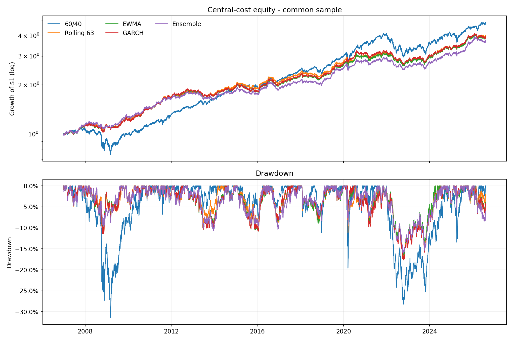
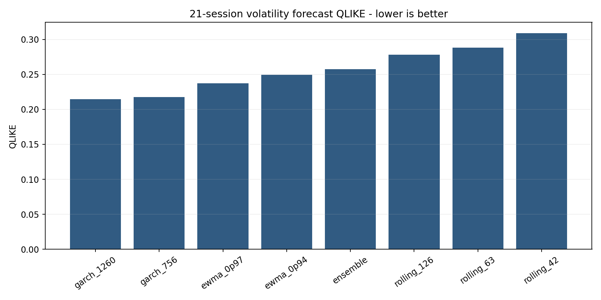

<!-- GENERATED FILE. EDIT THE CANONICAL KNOWLEDGE RECORD. -->

# Beyond 60/40 - volatility estimator comparison

!!! warning "Research-only"
    This page summarizes saved research evidence. It does not authorize LIVE, allocation, or deployment.

## TL;DR

> **Verdict:** EWMA 0.94 + יעד 8% is the strongest observed central-cost target row, but estimator superiority is unproven and the study is capped at forward hypothesis.

> **Status:** `forward_hypothesis`

> **Disposition:** `not_recorded`

> **Replication:** `not_recorded`

## Research question

Compare Rolling, EWMA, GARCH, and a fixed ensemble in the supplied VTI/GLD/TLT inverse-volatility and volatility-target system.

## Exact setup

| Field | Value |
| --- | --- |
| Signal family | cross_asset_risk_allocation |
| Universe | ["Fixed VTI, GLD, TLT ETFs on strict common Norgate sessions"] |
| Decision | Close_T |
| Fill | Open_T+1 |
| Primary cost layer | central_research |
| Last reviewed | 2026-08-08T17:08:47.767658+03:00 |

## Timing and overnight attribution

```text
information available: Close_T
primary executable fill: Open_T+1
```

If final `Close_T` data formed the signal, a hypothetical `Close_T` entry is diagnostic only unless a separate pre-close protocol was modeled. Comparing that diagnostic with `Open_(T+1)` and applying the compounded return identity shows whether the apparent edge occurred in the overnight gap. Missing attribution numbers mean **not tested**, not zero.


## Primary metrics

| Metric | Value |
| --- | ---: |
| Period | ["2007-01-03", "2026-08-07"] |
| Universe | VTI/GLD/TLT |
| Cost Layer | central_research_10_bps_per_unit_risky_turnover |
| Cagr | 7.21% |
| Annualized Volatility | 7.56% |
| Sharpe | 0.960 |
| Maximum Drawdown | -16.55% |
| Turnover | 444.67% |

## Key findings

| Feature | Role | Direction | Status | Effect | Action |
| --- | --- | --- | --- | --- | --- |
| rolling_63 | position-size normalizer and gross-exposure scaler | lower forecast volatility permits more exposure; no leverage | diagnostic | {"central_max_drawdown": -0.1718602049547909, "central_sharpe": 0.957754936259208, "qlike": 0.2879864406746765} | Keep frozen in forward tracking; do not wire to live execution. |
| ewma_0p94 | position-size normalizer and gross-exposure scaler | lower forecast volatility permits more exposure; no leverage | forward_hypothesis | {"central_max_drawdown": -0.1654987565843353, "central_sharpe": 0.9604866349388612, "qlike": 0.2493124597841335} | Keep frozen in forward tracking; do not wire to live execution. |
| garch_1260 | position-size normalizer and gross-exposure scaler | lower forecast volatility permits more exposure; no leverage | diagnostic | {"central_max_drawdown": -0.1768641981114239, "central_sharpe": 0.9588383019392432, "qlike": 0.2142979988934514} | Keep frozen in forward tracking; do not wire to live execution. |
| ensemble | position-size normalizer and gross-exposure scaler | lower forecast volatility permits more exposure; no leverage | diagnostic | {"central_max_drawdown": -0.1607620193368563, "central_sharpe": 0.8968832737129537, "qlike": 0.2575580331265644} | Keep frozen in forward tracking; do not wire to live execution. |

## Visual evidence






## Limitations

- Source pre-inception ETF history is undisclosed and not reproducible.
- Clean post-publication confirmation is less than one year.
- Adjusted Open is not a verified opening-auction fill.
- Cash yield, taxes, impact, partial fills, and capacity are excluded.

## Next gates

- Forward-track Rolling-63 and the observed best estimator unchanged for 12-24 months.
- Reprice with actual opening fills, spreads, and cash yield.
- Test a non-USD country/currency basket only as a separate frozen study.

## Sources

- `C:/Users/User/Downloads/beyond-60-40.pdf`
- `https://beyondpassive.substack.com/p/beyond-6040-building-a-portfolio`

## Canonical artifacts

| Artifact | Pakal path |
| --- | --- |
| Concise Report | `pakal-research/reports/beyond_60_40_volatility_estimators/REPORT.md` |
| Frozen Specification | `pakal-research/reports/beyond_60_40_volatility_estimators/research_spec_frozen.json` |
| Full Report | `pakal-research/reports/beyond_60_40_volatility_estimators/REPORT_FULL.md` |
| Manifest | `pakal-research/reports/beyond_60_40_volatility_estimators/run_manifest.json` |
| Notebook | `pakal-research/beyond_60_40_volatility_estimators.ipynb` |
| Primary Charts | `["pakal-research/reports/beyond_60_40_volatility_estimators/charts"]` |
| Primary Source Code | `["pakal-research/beyond_60_40_volatility_estimators.py"]` |
| Primary Tables | `["pakal-research/reports/beyond_60_40_volatility_estimators/tables"]` |
