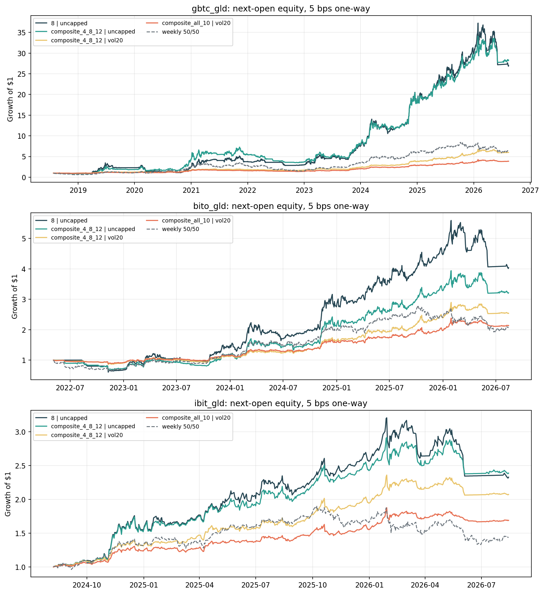
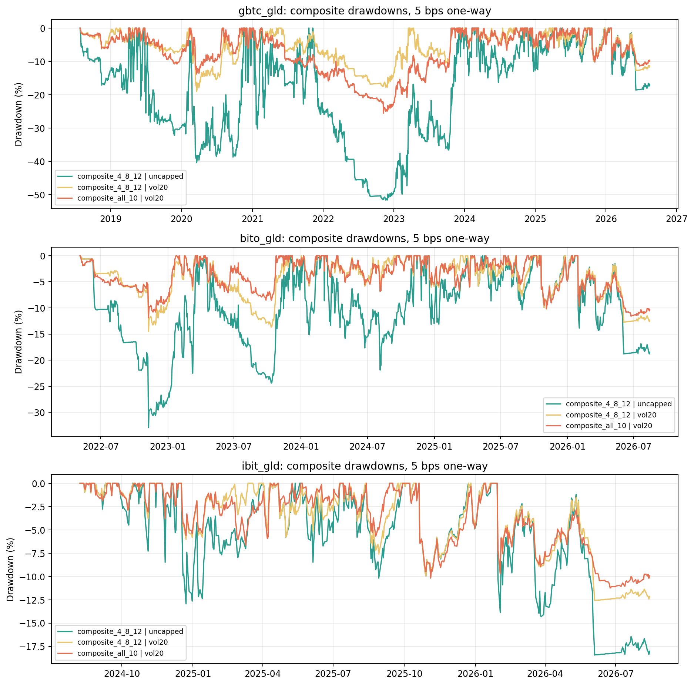

<!-- GENERATED FILE. EDIT THE CANONICAL KNOWLEDGE RECORD. -->

# Bitcoin-Gold Weekly Dual Momentum

!!! warning "Research-only"
    This page summarizes saved research evidence. It does not authorize LIVE, allocation, or deployment.

## TL;DR

> **Verdict:** Research-only forward hypothesis. The source's 8-week headline is an in-sample selected peak; the current IBIT history and post-source shadow are too short for promotion.

> **Status:** `forward_hypothesis`

> **Disposition:** `not_recorded`

> **Replication:** `not_recorded`

## Research question

Test whether weekly relative-plus-absolute momentum between a tradable Bitcoin vehicle and GLD survives causal next-open timing, full lookback-family accounting, cash yield, costs, and vehicle changes.

## Exact setup

| Field | Value |
| --- | --- |
| Signal family | dual_momentum |
| Universe | ["GBTC/GLD", "BITO/GLD", "IBIT/GLD"] |
| Decision | Close_T on observed Wednesday |
| Fill | Open_T+1 |
| Primary cost layer | central_research |
| Last reviewed | 2026-08-15T00:21:27.543474+03:00 |

## Timing and overnight attribution

```text
information available: Close_T on observed Wednesday
primary executable fill: Open_T+1
```

If final `Close_T` data formed the signal, a hypothetical `Close_T` entry is diagnostic only unless a separate pre-close protocol was modeled. Comparing that diagnostic with `Open_(T+1)` and applying the compounded return identity shows whether the apparent edge occurred in the overnight gap. Missing attribution numbers mean **not tested**, not zero.


## Primary metrics

| Metric | Value |
| --- | ---: |
| Period | 2024-08-08 to 2026-08-14 |
| Universe | IBIT/GLD with BIL residual cash |
| Cost Layer | 5 bps per one-way turnover |
| Cagr | 30.01% |
| Annualized Volatility | 17.75% |
| Sharpe | 1.344 |
| Maximum Drawdown | -11.24% |
| Turnover | 793.97% |

## Key findings

| Feature | Role | Direction | Status | Effect | Action |
| --- | --- | --- | --- | --- | --- |
| absolute momentum gate | entry filter | tested with and without the gate across the full family | diagnostic | see performance_summary.csv | retain only as a frozen forward hypothesis |
| 20 percent volatility cap | position sizing | reduces selected-asset exposure when prior 12-week volatility exceeds 20 percent | forward_hypothesis | see headline_summary.csv | continue research; do not treat the source-selected 20 percent as optimal |

## Visual evidence






## Limitations

- Exact Bitfinex-BITO-IBIT splice is undisclosed and not reproduced.
- No untouched confirmation beyond a short May-August 2026 shadow.
- IBIT common history after a 28-week warmup is short.
- Full-day ADV63 is not opening-auction liquidity.

## Next gates

- Run a locked forward shadow without changing lookbacks, weekday, or cap.
- Calibrate next-open spread and partial-fill costs from real paper-trading orders.
- Revisit only after at least one additional independent Bitcoin risk regime.

## Sources

- `C:/Users/User/Downloads/gold_vs_TLT.pdf`
- `SSRN:6729918`
- `Norgate US Equities database as of 2026-08-14T23:35:52+03:00`

## Canonical artifacts

| Artifact | Pakal path |
| --- | --- |
| Concise Report | `C:\\Users\\User\\Documents\\workspace\\pakal\\pakal-research\\reports\\bitcoin_gold_dual_momentum_signal_study\\REPORT.md` |
| Frozen Specification | `C:\\Users\\User\\Documents\\workspace\\pakal\\pakal-research\\reports\\bitcoin_gold_dual_momentum_signal_study\\research_spec_frozen.json` |
| Full Report | `C:\\Users\\User\\Documents\\workspace\\pakal\\pakal-research\\reports\\bitcoin_gold_dual_momentum_signal_study\\REPORT_FULL.md` |
| Manifest | `C:\\Users\\User\\Documents\\workspace\\pakal\\pakal-research\\reports\\bitcoin_gold_dual_momentum_signal_study\\run_manifest.json` |
| Notebook | `C:\\Users\\User\\Documents\\workspace\\pakal\\pakal-research\\bitcoin_gold_dual_momentum_signal_study.ipynb` |
| Primary Charts | `["C:\\\\Users\\\\User\\\\Documents\\\\workspace\\\\pakal\\\\pakal-research\\\\reports\\\\bitcoin_gold_dual_momentum_signal_study\\\\charts\\\\primary_equity.png", "C:\\\\Users\\\\User\\\\Documents\\\\workspace\\\\pakal\\\\pakal-research\\\\reports\\\\bitcoin_gold_dual_momentum_signal_study\\\\charts\\\\primary_drawdown.png", "C:\\\\Users\\\\User\\\\Documents\\\\workspace\\\\pakal\\\\pakal-research\\\\reports\\\\bitcoin_gold_dual_momentum_signal_study\\\\charts\\\\lookback_sharpe_surface.png", "C:\\\\Users\\\\User\\\\Documents\\\\workspace\\\\pakal\\\\pakal-research\\\\reports\\\\bitcoin_gold_dual_momentum_signal_study\\\\charts\\\\rolling_spy_correlation.png"]` |
| Primary Source Code | `["C:\\\\Users\\\\User\\\\Documents\\\\workspace\\\\pakal\\\\pakal-research\\\\bitcoin_gold_dual_momentum_signal_study.py"]` |
| Primary Tables | `["C:\\\\Users\\\\User\\\\Documents\\\\workspace\\\\pakal\\\\pakal-research\\\\reports\\\\bitcoin_gold_dual_momentum_signal_study\\\\tables\\\\performance_summary.csv", "C:\\\\Users\\\\User\\\\Documents\\\\workspace\\\\pakal\\\\pakal-research\\\\reports\\\\bitcoin_gold_dual_momentum_signal_study\\\\tables\\\\inference_summary.csv", "C:\\\\Users\\\\User\\\\Documents\\\\workspace\\\\pakal\\\\pakal-research\\\\reports\\\\bitcoin_gold_dual_momentum_signal_study\\\\tables\\\\market_relationship.csv", "C:\\\\Users\\\\User\\\\Documents\\\\workspace\\\\pakal\\\\pakal-research\\\\reports\\\\bitcoin_gold_dual_momentum_signal_study\\\\tables\\\\capacity_summary.csv"]` |
