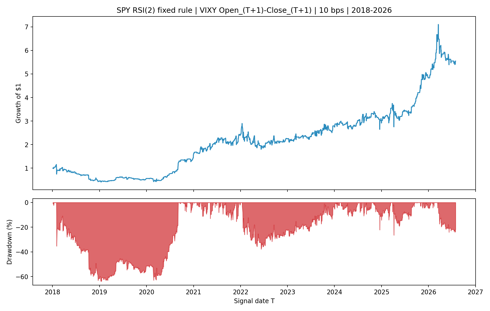
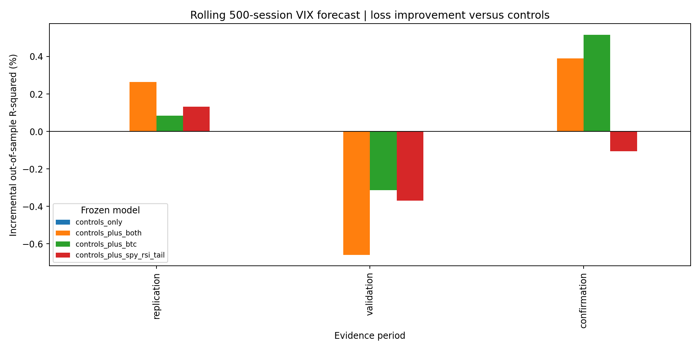

<!-- GENERATED FILE. EDIT THE CANONICAL KNOWLEDGE RECORD. -->

# Bitcoin and SPX signals for later VIX dynamics

!!! warning "Research-only"
    This page summarizes saved research evidence. It does not authorize LIVE, allocation, or deployment.

## TL;DR

> **Verdict:** Reject the linked forecast. Preserve the fixed SPY RSI(2) next-open VIXY proxy only as a diagnostic promising component because it remains positive after costs but fails frozen timing-retention and year-concentration gates and lacks literal VX and execution evidence.

> **Status:** `diagnostic`

> **Disposition:** `promising_component`

> **Replication:** `timing_conflicted`

## Research question

Test the separate and incremental information in Bitcoin overnight returns and lagged SPX RSI(2) tails for later VIX dynamics, and test whether the fixed SPX RSI rule survives causal next-open VIXY execution and frozen costs.

## Exact setup

| Field | Value |
| --- | --- |
| Signal family | cross_market_sentiment_and_short_horizon_equity_reversal |
| Universe | ["One aggregate US equity session with complete BTCUSDT, SPY, VIX, and VIXY proxy fields"] |
| Decision | SPY RSI decision after final Close_T; BTC diagnostic after the completed 09:30 America/New_York endpoint. The lagged SPY-RSI forecast feature uses only Close_(T-1). |
| Fill | Primary SPY-RSI proxy enters VIXY at Open_(T+1) and exits at Close_(T+1); same-close is diagnostic only. No exact-open Bitcoin trade is claimed. |
| Primary cost layer | central_research |
| Last reviewed | 2026-08-19T15:05:00+03:00 |

## Timing and overnight attribution

```text
information available: SPY RSI decision after final Close_T; BTC diagnostic after the completed 09:30 America/New_York endpoint. The lagged SPY-RSI forecast feature uses only Close_(T-1).
primary executable fill: Primary SPY-RSI proxy enters VIXY at Open_(T+1) and exits at Close_(T+1); same-close is diagnostic only. No exact-open Bitcoin trade is claimed.
```

If final `Close_T` data formed the signal, a hypothetical `Close_T` entry is diagnostic only unless a separate pre-close protocol was modeled. Comparing that diagnostic with `Open_(T+1)` and applying the compounded return identity shows whether the apparent edge occurred in the overnight gap. Missing attribution numbers mean **not tested**, not zero.


## Primary metrics

| Metric | Value |
| --- | ---: |
| Period | 2018-01-02 to 2026-07-31 full descriptive |
| Universe | Fixed SPY Wilder RSI(2) rule on VIXY next-session open-to-close proxy |
| Cost Layer | central_research_10_bps_round_trip |
| Cagr | 22.24% |
| Annualized Volatility | 40.45% |
| Sharpe | 0.703 |
| Maximum Drawdown | -63.78% |
| Turnover | 90.14% |

## Four separate verdicts

| Question | Conclusion |
| --- | --- |
| Source Replication | Timing-conflicted proxy result: BTC keeps the negative source direction, and the fixed RSI rule is profitable on VIXY, but instruments and source clocks are not literally reproduced. |
| Predictive Value | Rejected for the linked model: combined rolling forecast loss worsens in validation and never passes the one-sided HAC gate. |
| Economic Value | Promising but diagnostic: fixed causal SPY RSI(2) VIXY returns remain positive at 10 and 25 bps, with large drawdowns, unstable timing attribution, and concentrated annual contribution. |
| Promotion | No promotion. Status remains diagnostic; no LIVE, allocation, release, broker, scheduler, or forward-trading authority. |

## Key findings

| Feature | Role | Direction | Status | Effect | Action |
| --- | --- | --- | --- | --- | --- |
| btc_prior_close_to_0930_return | predictor | higher Bitcoin overnight return predicts lower VIX open-to-close change | diagnostic | Spearman IC -0.0740 in replication, -0.0387 in validation, -0.1347 in small confirmation, and -0.0704 full descriptive | retain as a diagnostic feature only; do not claim an exact 09:30 fill |
| fixed_spy_wilder_rsi2_30_90_rule | entry_and_direction | RSI(2) <=30 shorts next-session VIXY; RSI(2) >90 goes long; otherwise flat | diagnostic | 10 bps executable Sharpe 0.626 replication, 0.900 validation, 0.912 short confirmation, and 0.703 full descriptive | preserve unchanged for a future high-quality VX or auction-VIXY study; do not tune or promote |
| lagged_spy_rsi_tail_in_rolling_vix_model | forecast_input | incremental VIX forecast value beyond lagged VIX state, SPY gap, and Bitcoin | rejected | combined incremental out-of-sample R-squared +0.263% replication, -0.659% validation, +0.390% confirmation | reject; do not run parameter rescue on the seen panel |
| spy_rsi2_bucket_ordering_vs_vix_rsi2 | mechanism_diagnostic | lower SPY RSI should precede lower next-session VIXY returns more cleanly than VIX RSI | inconclusive | validation SPY RSI <=20 mean -0.976%, but five-bucket monotonicity and high-tail sign do not confirm | do not select a new threshold; require future predeclared evidence |

## Visual evidence






## Limitations

- Both supplied PDFs are secondary commentary rather than primary papers or appendices.
- Binance BTCUSDT, SPY, and VIXY are material proxies for CoinDesk Bitcoin, SPX, and a rolled VX contract.
- The panel begins in 2018 and cannot assess 2007-2017 or the 2008 crisis.
- The Bitcoin 09:30 endpoint conflicts with an exact opening fill.
- The confirmation slice has 141 executable sessions and 59 active dates.
- Borrow, recalls, financing, impact, opening-auction depth, rolled-VX economics, and capacity are not measured.
- Full-history results are descriptive after all holdouts opened.

## Next gates

- Freeze a new prospective study using point-in-time continuous VX or auction-quality VIXY data, with an explicit roll ledger, multiplier, collateral, spread, borrow, fill, selected-order capacity, and AUM-band contract.
- Collect genuinely future dates without changing the 30/90 Wilder RSI(2) thresholds or next-open timing.

## Sources

- `C:/Users/User/Downloads/vix-bitcoin.pdf \| sha256:AFE0C2FF5F03D3361D485CBC4144FF31726A3F6A2F3DC45C12731BF51C4C78B4`
- `C:/Users/User/Downloads/VIX-SPX.pdf \| sha256:9BA9D097E58FE9AC1D5E489210CA082997057FB27433A14E548D7A0A48009433`
- `pakal-research/reports/btc_overnight_vix_predictability_study \| preserved prior internal diagnostic`

## Canonical artifacts

| Artifact | Pakal path |
| --- | --- |
| Concise Report | `C:/Users/User/Documents/workspace/pakal/pakal-research/reports/bitcoin_spx_vix_linked_signal_study/REPORT.md` |
| Full Report | `C:/Users/User/Documents/workspace/pakal/pakal-research/reports/bitcoin_spx_vix_linked_signal_study/REPORT_FULL.md` |
| Notebook | `C:/Users/User/Documents/workspace/pakal/pakal-research/bitcoin_spx_vix_linked_signal_study.ipynb` |
| Frozen Specification | `C:/Users/User/Documents/workspace/pakal/pakal-research/reports/bitcoin_spx_vix_linked_signal_study/research_spec_frozen.json` |
| Manifest | `C:/Users/User/Documents/workspace/pakal/pakal-research/reports/bitcoin_spx_vix_linked_signal_study/run_manifest.json` |
| Research State | `C:/Users/User/Documents/workspace/pakal/pakal-research/reports/bitcoin_spx_vix_linked_signal_study/research_state.json` |
| Hypothesis Registry | `C:/Users/User/Documents/workspace/pakal/pakal-research/reports/bitcoin_spx_vix_linked_signal_study/hypothesis_registry.json` |
| Experiment Ledger | `C:/Users/User/Documents/workspace/pakal/pakal-research/reports/bitcoin_spx_vix_linked_signal_study/experiment_ledger.jsonl` |
| Decision Log | `C:/Users/User/Documents/workspace/pakal/pakal-research/reports/bitcoin_spx_vix_linked_signal_study/decision_log.jsonl` |
| Source Rule Map | `C:/Users/User/Documents/workspace/pakal/pakal-research/reports/bitcoin_spx_vix_linked_signal_study/SOURCE_RULE_MAP.md` |
| Primary Source Code | `["C:/Users/User/Documents/workspace/pakal/pakal-research/bitcoin_spx_vix_linked_signal_study.py"]` |
| Primary Tables | `["C:/Users/User/Documents/workspace/pakal/pakal-research/reports/bitcoin_spx_vix_linked_signal_study/tables/rsi_strategy_performance_replication.csv", "C:/Users/User/Documents/workspace/pakal/pakal-research/reports/bitcoin_spx_vix_linked_signal_study/tables/rsi_strategy_performance_validation.csv", "C:/Users/User/Documents/workspace/pakal/pakal-research/reports/bitcoin_spx_vix_linked_signal_study/tables/rsi_strategy_performance_confirmation.csv", "C:/Users/User/Documents/workspace/pakal/pakal-research/reports/bitcoin_spx_vix_linked_signal_study/tables/forecast_metrics_validation.csv", "C:/Users/User/Documents/workspace/pakal/pakal-research/reports/bitcoin_spx_vix_linked_signal_study/tables/cost_capacity_layers.csv"]` |
| Primary Charts | `["C:/Users/User/Documents/workspace/pakal/pakal-research/reports/bitcoin_spx_vix_linked_signal_study/charts/rsi_executable_equity_drawdown_10bps.png", "C:/Users/User/Documents/workspace/pakal/pakal-research/reports/bitcoin_spx_vix_linked_signal_study/charts/timing_attribution_active_signals.png", "C:/Users/User/Documents/workspace/pakal/pakal-research/reports/bitcoin_spx_vix_linked_signal_study/charts/forecast_rmse_period.png", "C:/Users/User/Documents/workspace/pakal/pakal-research/reports/bitcoin_spx_vix_linked_signal_study/charts/rsi_bucket_period_heatmap.png"]` |
