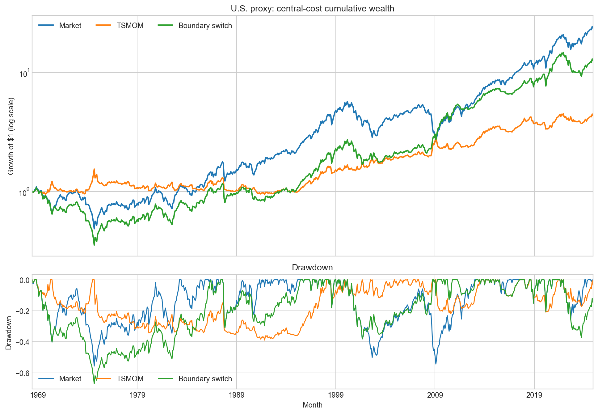
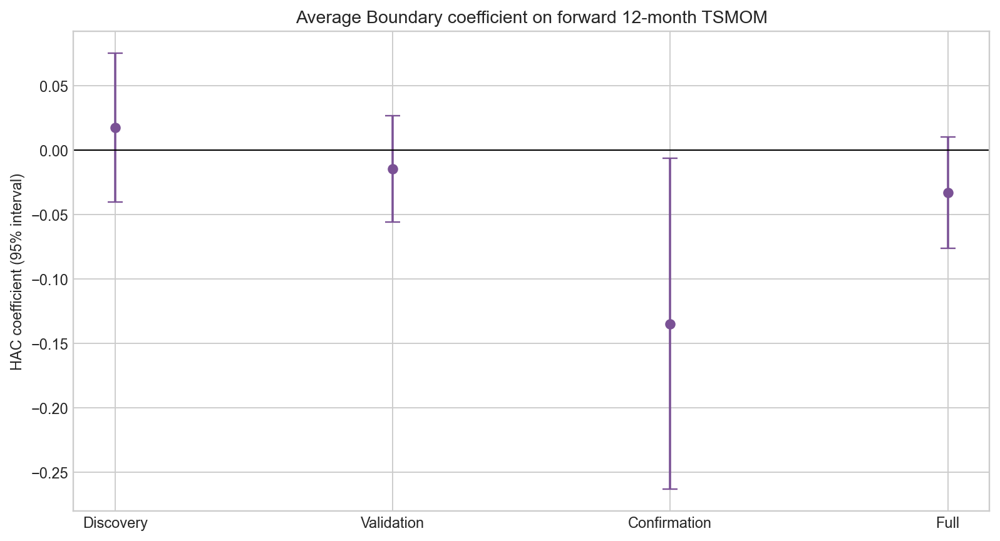

<!-- GENERATED FILE. EDIT THE CANONICAL KNOWLEDGE RECORD. -->

# Boundaries of Time Series Momentum: U.S. proxy replication

!!! warning "Research-only"
    This page summarizes saved research evidence. It does not authorize LIVE, allocation, or deployment.

## TL;DR

> **Verdict:** Reject the literal U.S. proxy as a stable investable rule. Discovery did not reproduce the source direction, confirmation failed Holm, and portfolio benchmark/drawdown gates failed. Research-only.

> **Status:** `diagnostic`

> **Disposition:** `rejected`

> **Replication:** `not_reproducible`

## Research question

Test whether causally lagged U.S. valuation/yield-curve Boundaries predict forward diversified equity TSMOM and improve a literal TSMOM-versus-market route after costs.

## Exact setup

| Field | Value |
| --- | --- |
| Signal family | valuation_yield_curve_regime_router |
| Universe | ["Aggregate U.S. equity market excess return; no constituent universe"] |
| Decision | After calendar month Close_T when French and Shiller monthly inputs are complete; Boundary_T and lookback_T affect return beginning T+1 only. |
| Fill | Conceptual Open_(T+1), but French monthly returns provide only a causal holding-period proxy; opening fill attribution is not tested. |
| Primary cost layer | central_research |
| Last reviewed | 2026-08-30T20:20:00+00:00 |

## Timing and overnight attribution

```text
information available: After calendar month Close_T when French and Shiller monthly inputs are complete; Boundary_T and lookback_T affect return beginning T+1 only.
primary executable fill: Conceptual Open_(T+1), but French monthly returns provide only a causal holding-period proxy; opening fill attribution is not tested.
```

If final `Close_T` data formed the signal, a hypothetical `Close_T` entry is diagnostic only unless a separate pre-close protocol was modeled. Comparing that diagnostic with `Open_(T+1)` and applying the compounded return identity shows whether the apparent edge occurred in the overnight gap. Missing attribution numbers mean **not tested**, not zero.

| Attribution field | Value |
| --- | --- |
| Status | not_tested |
| Diagnostic Path | Completed-month signal_T to following French monthly return_T+1 |
| Executable Path | Open_(T+1) price, spread, auction, borrow, and fills unavailable |
| Method | Causal monthly lag with no same-month signal return |
| Headline Result | Timing direction is causal, but executable fill parity is unmeasured |
| Artifact | pakal-research/reports/boundaries_tsmom_valuation_extremes/tables/full_monthly_returns.csv |

## Primary metrics

| Metric | Value |
| --- | ---: |
| Period | 1968-06 through 2024-12 |
| Universe | U.S. aggregate market; literal primary Boundary switch |
| Cost Layer | central_research |
| Cagr | 4.58% |
| Annualized Volatility | 14.85% |
| Sharpe | 0.377 |
| Maximum Drawdown | -67.15% |
| Turnover | 6.50% |

## Four separate verdicts

| Question | Conclusion |
| --- | --- |
| Source Replication | Not reproducible with the available U.S. French-FIZ/Shiller proxy; exact Ibbotson, vendor vintage, and international data are absent. |
| Predictive Value | Full Average Boundary coefficient -0.0329, HAC p=0.1347, Holm p=0.4468; unstable by period. |
| Economic Value | Central-cost switch CAGR 0.0458, Sharpe 0.3774, maximum drawdown -0.6715; no stable advantage over both market and TSMOM. |
| Promotion | Diagnostic only; no LIVE, PAPER, allocation, release, scheduler, broker, or deployment authority. |

## Key findings

| Feature | Role | Direction | Status | Effect | Action |
| --- | --- | --- | --- | --- | --- |
| Average Boundary of CAPE/dividend-yield and term-spread extremes | regime_router | Source predicts lower forward TSMOM at higher Boundary | diagnostic_rejected | Full coefficient -0.0329; central switch Sharpe 0.3774 | Do not use for allocation or trading; only retest on a newly frozen PIT and opening-fill dataset. |

## Visual evidence






## Limitations

- Current-vintage Shiller workbook, not a December-2024 point-in-time snapshot
- Shiller monthly averages and no Open_(T+1) fill attribution
- GS10/French-RF proxy instead of source Ibbotson series
- No Datastream international panel
- Ambiguous equal-strategy versus equal-cohort source wording
- Synthetic scenario costs, no borrow, impact, partial fills, or capacity
- Local holdouts are not independent post-publication evidence
- French FIZ-to-CIZ break blocks a clean extension into 2025

## Next gates

- Freeze a true forward study using a point-in-time Shiller snapshot, source-equivalent Ibbotson data, consistent post-2025 returns, and Open_(T+1) fills before revealing results.

## Sources

- `{"content_id": "4923C9444E3B4AC813DB6D5529CD34817B271F5DAA53BFC0AD70A699C3A9E3AD", "location": "C:/Users/User/Downloads/ssrn-6867878.pdf", "title": "Boundaries of Time Series Momentum (attached SSRN version)"}`
- `{"content_id": "4B6A318CAEA9F1C2AAD97F15697590E9EFF3986BD2950B2BE8CDBFDF195FB586", "location": "C:/Users/User/Downloads/shiller.pdf", "title": "Quantpedia print: Boundaries of Time Series Momentum"}`
- `{"content_id": "FC9E41CC3B66C62FA8F565A01FB4C8C0D7962C777303C46B8AB7102190B98EA2", "location": "pakal-research/reports/boundaries_tsmom_valuation_extremes/data/F-F_Research_Data_Factors_202412_FIZ_CSV.zip", "title": "Kenneth French Data Library Dec-2024 FIZ archive"}`
- `{"content_id": "71C3636DA5269B074489DB41ECF0DCF0CAEF6275D1F3ECAF753DDACA2B81DB2F", "location": "pakal-research/reports/boundaries_tsmom_valuation_extremes/data/shiller_ie_data_shillerdata_20260830.xls", "title": "Robert Shiller official current-vintage workbook"}`

## Canonical artifacts

| Artifact | Pakal path |
| --- | --- |
| Concise Report | `pakal-research/reports/boundaries_tsmom_valuation_extremes/REPORT.md` |
| Full Report | `pakal-research/reports/boundaries_tsmom_valuation_extremes/REPORT_FULL.md` |
| Notebook | `pakal-research/notebooks/boundaries_tsmom_valuation_extremes.ipynb` |
| Frozen Specification | `pakal-research/reports/boundaries_tsmom_valuation_extremes/research_spec_frozen.json` |
| Manifest | `pakal-research/reports/boundaries_tsmom_valuation_extremes/run_manifest.json` |
| Primary Source Code | `["pakal-research/boundaries_tsmom_study.py", "pakal-research/boundaries_tsmom_diagnosis.py", "pakal-research/build_boundaries_tsmom_artifacts.py", "pakal-research/build_boundaries_tsmom_notebook.py"]` |
| Primary Tables | `["pakal-research/reports/boundaries_tsmom_valuation_extremes/tables/full_portfolio_metrics.csv", "pakal-research/reports/boundaries_tsmom_valuation_extremes/tables/full_regressions.csv", "pakal-research/reports/boundaries_tsmom_valuation_extremes/tables/period_comparison.csv", "pakal-research/reports/boundaries_tsmom_valuation_extremes/tables/source_reported_comparison.csv", "pakal-research/reports/boundaries_tsmom_valuation_extremes/tables/episode_contribution.csv"]` |
| Primary Charts | `["pakal-research/reports/boundaries_tsmom_valuation_extremes/charts/central_equity_drawdown.png", "pakal-research/reports/boundaries_tsmom_valuation_extremes/charts/period_sharpe.png", "pakal-research/reports/boundaries_tsmom_valuation_extremes/charts/average_boundary_coefficients.png"]` |
| Research State | `pakal-research/reports/boundaries_tsmom_valuation_extremes/research_state.json` |
| Hypothesis Registry | `pakal-research/reports/boundaries_tsmom_valuation_extremes/hypothesis_registry.json` |
| Experiment Ledger | `pakal-research/reports/boundaries_tsmom_valuation_extremes/experiment_ledger.jsonl` |
| Decision Log | `pakal-research/reports/boundaries_tsmom_valuation_extremes/decision_log.jsonl` |
| Source Rule Map | `pakal-research/reports/boundaries_tsmom_valuation_extremes/SOURCE_RULE_MAP.md` |
