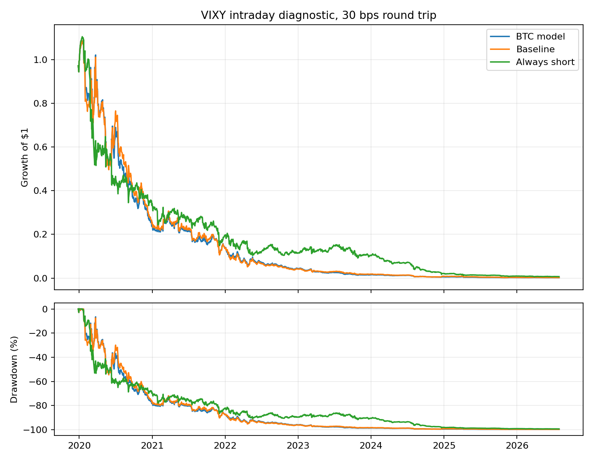
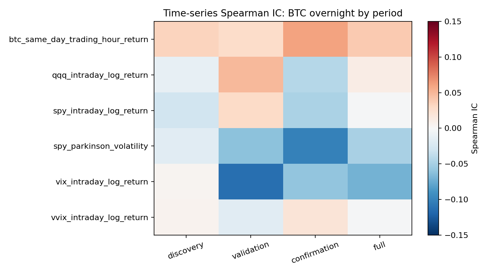

<!-- GENERATED FILE. EDIT THE CANONICAL KNOWLEDGE RECORD. -->

# Bitcoin overnight return and VIX predictability

!!! warning "Research-only"
    This page summarizes saved research evidence. It does not authorize LIVE, allocation, or deployment.

## TL;DR

> **Verdict:** Weak negative VIX rank predictability exists in-sample, but the BTC feature does not improve the frozen 500-session forecast model and is rejected as a trading rule.

> **Status:** `diagnostic`

> **Disposition:** `not_recorded`

> **Replication:** `not_recorded`

## Research question

Test causal BTC overnight predictability for same-session VIX dynamics.

## Exact setup

| Field | Value |
| --- | --- |
| Signal family | cross_market_sentiment |
| Universe | ["Aggregate US market session"] |
| Decision | 09:30 America/New_York after completed BTC 09:25-09:30 bar |
| Fill | Diagnostic US open to same-session close |
| Primary cost layer | central_research |
| Last reviewed | 2026-08-17T18:13:55.928186+03:00 |

## Timing and overnight attribution

```text
information available: 09:30 America/New_York after completed BTC 09:25-09:30 bar
primary executable fill: Diagnostic US open to same-session close
```

If final `Close_T` data formed the signal, a hypothetical `Close_T` entry is diagnostic only unless a separate pre-close protocol was modeled. Comparing that diagnostic with `Open_(T+1)` and applying the compounded return identity shows whether the apparent edge occurred in the overnight gap. Missing attribution numbers mean **not tested**, not zero.


## Primary metrics

| Metric | Value |
| --- | ---: |
| Period | 2018-01-02 to 2026-07-31 |
| Universe | VIXY diagnostic on aggregate market signal |
| Cost Layer | central_research_30_bps_round_trip |
| Cagr | -62.02% |
| Annualized Volatility | 57.72% |
| Sharpe | -1.074 |
| Maximum Drawdown | -99.85% |
| Turnover | 200.00% |

## Key findings

| Feature | Role | Direction | Status | Effect | Action |
| --- | --- | --- | --- | --- | --- |
| btc_overnight_return | predictor | higher BTC overnight predicts lower VIX open-to-close | diagnostic | full-sample Spearman IC -0.070; causal D10-D1 -2.53% VIX log change | retain as a frozen diagnostic feature only |
| btc_overnight_in_rolling_vix_model | forecast input | incremental forecast value | rejected | RMSE and MAE both worsened; squared-loss improvement was negative | do not tune or promote |

## Visual evidence






## Limitations

- Binance proxy rather than CoinDesk
- Yahoo daily OHLC proxy
- not untouched confirmation
- short borrow unresolved

## Next gates

- Frozen forward shadow with independent BTC feed and executable 09:30 prices

## Sources

- `C:/Users/User/Downloads/vix-bitcoin.pdf`
- `https://doi.org/10.1016/j.econmod.2026.107648`

## Canonical artifacts

| Artifact | Pakal path |
| --- | --- |
| Concise Report | `C:\\Users\\User\\Documents\\workspace\\pakal\\pakal-research\\reports\\btc_overnight_vix_predictability_study\\REPORT.md` |
| Full Report | `C:\\Users\\User\\Documents\\workspace\\pakal\\pakal-research\\reports\\btc_overnight_vix_predictability_study\\REPORT_FULL.md` |
| Notebook | `C:\\Users\\User\\Documents\\workspace\\pakal\\pakal-research\\btc_overnight_vix_predictability_study.ipynb` |
| Frozen Specification | `C:\\Users\\User\\Documents\\workspace\\pakal\\pakal-research\\reports\\btc_overnight_vix_predictability_study\\research_spec_frozen.json` |
| Manifest | `C:\\Users\\User\\Documents\\workspace\\pakal\\pakal-research\\reports\\btc_overnight_vix_predictability_study\\run_manifest.json` |
| Primary Source Code | `["C:\\\\Users\\\\User\\\\Documents\\\\workspace\\\\pakal\\\\pakal-research\\\\btc_overnight_vix_predictability_study.py"]` |
| Primary Tables | `["C:\\\\Users\\\\User\\\\Documents\\\\workspace\\\\pakal\\\\pakal-research\\\\reports\\\\btc_overnight_vix_predictability_study\\\\tables\\\\ic_summary.csv", "C:\\\\Users\\\\User\\\\Documents\\\\workspace\\\\pakal\\\\pakal-research\\\\reports\\\\btc_overnight_vix_predictability_study\\\\tables\\\\decile_summary.csv", "C:\\\\Users\\\\User\\\\Documents\\\\workspace\\\\pakal\\\\pakal-research\\\\reports\\\\btc_overnight_vix_predictability_study\\\\tables\\\\rolling_forecast_metrics.csv", "C:\\\\Users\\\\User\\\\Documents\\\\workspace\\\\pakal\\\\pakal-research\\\\reports\\\\btc_overnight_vix_predictability_study\\\\tables\\\\trading_performance.csv"]` |
| Primary Charts | `["C:\\\\Users\\\\User\\\\Documents\\\\workspace\\\\pakal\\\\pakal-research\\\\reports\\\\btc_overnight_vix_predictability_study\\\\charts\\\\vix_causal_deciles.png", "C:\\\\Users\\\\User\\\\Documents\\\\workspace\\\\pakal\\\\pakal-research\\\\reports\\\\btc_overnight_vix_predictability_study\\\\charts\\\\ic_period_heatmap.png", "C:\\\\Users\\\\User\\\\Documents\\\\workspace\\\\pakal\\\\pakal-research\\\\reports\\\\btc_overnight_vix_predictability_study\\\\charts\\\\vixy_equity_drawdown.png"]` |
