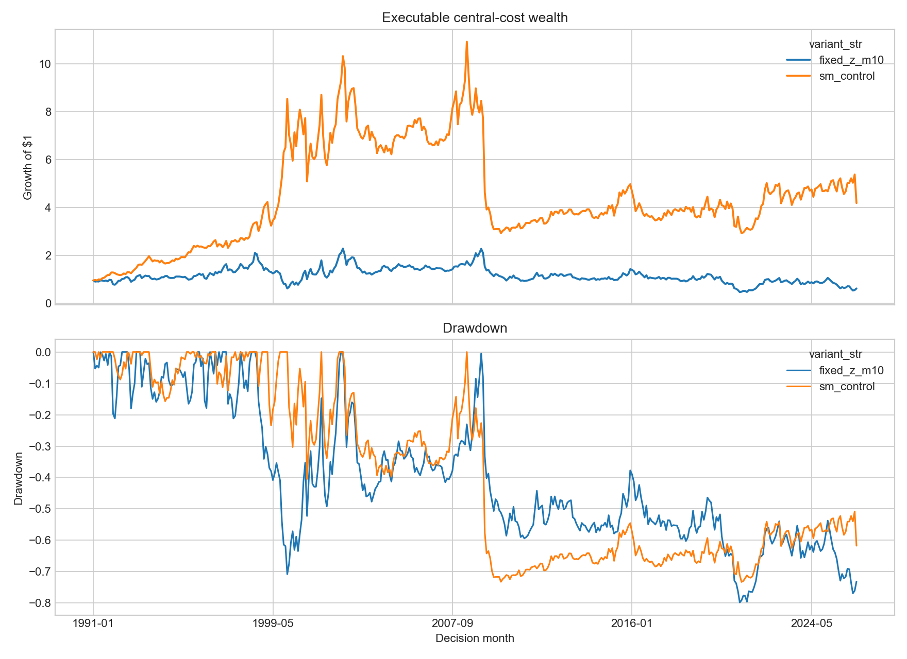
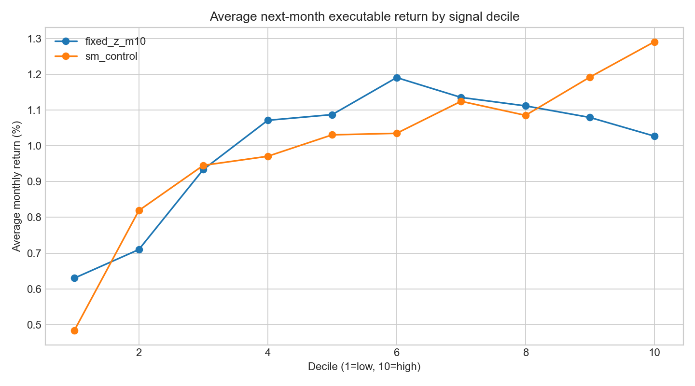

<!-- GENERATED FILE. EDIT THE CANONICAL KNOWLEDGE RECORD. -->

# CMM-Lite Standard Momentum and Fixed-z Study

!!! warning "Research-only"
    This page summarizes saved research evidence. It does not authorize LIVE, allocation, or deployment.

## TL;DR

> **Verdict:** DIAGNOSTIC_ONLY

> **Status:** `diagnostic`

> **Disposition:** `diagnostic`

> **Replication:** `directionally_replicated`

## Research question

Implement a PIT Standard Momentum control and constant-z economic diagnostics.

## Exact setup

| Field | Value |
| --- | --- |
| Signal family | cross_sectional_momentum |
| Universe | ["Russell 3000 Current & Past PIT proxy"] |
| Decision | Close_T |
| Fill | Open_T+1 |
| Primary cost layer | central_research |
| Last reviewed | 2026-08-19T21:21:31.856899+00:00 |

## Timing and overnight attribution

```text
information available: Close_T
primary executable fill: Open_T+1
```

If final `Close_T` data formed the signal, a hypothetical `Close_T` entry is diagnostic only unless a separate pre-close protocol was modeled. Comparing that diagnostic with `Open_(T+1)` and applying the compounded return identity shows whether the apparent edge occurred in the overnight gap. Missing attribution numbers mean **not tested**, not zero.


## Primary metrics

| Metric | Value |
| --- | ---: |
| Period | 1991-01 to 2026-06 |
| Universe | r3000_pit_proxy |
| Cost Layer | central_net |
| Cagr | -1.37% |
| Annualized Volatility | 27.04% |
| Sharpe | 0.086 |
| Maximum Drawdown | -79.82% |
| Turnover | 35.29% |

## Four separate verdicts

| Question | Conclusion |
| --- | --- |
| Source Replication | The Standard Momentum control tracks French Mom strongly but is a local proxy, not exact CRSP replication. |
| Predictive Value | Standard Momentum is positive; every nonzero fixed-z value underperforms it at the frozen discovery gate. |
| Economic Value | The selected fixed-z candidate has negative full-period central-cost CAGR and fails all gates. |
| Promotion | Diagnostic only; no deployment, PAPER, allocation, or scheduler authority. |

## Key findings

| Feature | Role | Direction | Status | Effect | Action |
| --- | --- | --- | --- | --- | --- |
| standard_momentum_12_1 | control | high minus low | implemented | 0.8930917728778446 | retain as the mandatory control |
| constant_z_softmax_momentum | diagnostic | fixed_z_m10 | diagnostic_only | -0.18235851504993142 | do not equate with learned stock-month-specific CMM |

## Visual evidence






## Limitations

- Equal-weight Norgate PIT proxy, not value-weighted CRSP replication.
- Exact NYSE breakpoints and PIT market capitalization are unavailable.
- Fixed z does not reproduce the 153-feature neural network.

## Next gates

- Independent CRSP value-weighted replication with NYSE breakpoints.
- Only after control acceptance, preregister a learned stock-month-specific z study.

## Sources

- `5702162.pdf`
- `Kenneth French Mom`

## Canonical artifacts

| Artifact | Pakal path |
| --- | --- |
| Concise Report | `C:\\Users\\User\\Documents\\workspace\\pakal\\pakal-research\\reports\\cmm_fixed_z_momentum_study\\REPORT.md` |
| Decision Log | `C:\\Users\\User\\Documents\\workspace\\pakal\\pakal-research\\reports\\cmm_fixed_z_momentum_study\\decision_log.jsonl` |
| Experiment Ledger | `C:\\Users\\User\\Documents\\workspace\\pakal\\pakal-research\\reports\\cmm_fixed_z_momentum_study\\experiment_ledger.jsonl` |
| Frozen Specification | `C:\\Users\\User\\Documents\\workspace\\pakal\\pakal-research\\reports\\cmm_fixed_z_momentum_study\\research_spec_frozen.json` |
| Full Report | `C:\\Users\\User\\Documents\\workspace\\pakal\\pakal-research\\reports\\cmm_fixed_z_momentum_study\\REPORT_FULL.md` |
| Hypothesis Registry | `C:\\Users\\User\\Documents\\workspace\\pakal\\pakal-research\\reports\\cmm_fixed_z_momentum_study\\hypothesis_registry.json` |
| Manifest | `C:\\Users\\User\\Documents\\workspace\\pakal\\pakal-research\\reports\\cmm_fixed_z_momentum_study\\run_manifest.json` |
| Notebook | `C:\\Users\\User\\Documents\\workspace\\pakal\\pakal-research\\cmm_fixed_z_momentum_study.ipynb` |
| Primary Charts | `["C:\\\\Users\\\\User\\\\Documents\\\\workspace\\\\pakal\\\\pakal-research\\\\reports\\\\cmm_fixed_z_momentum_study\\\\charts"]` |
| Primary Source Code | `["C:\\\\Users\\\\User\\\\Documents\\\\workspace\\\\pakal\\\\pakal-research\\\\cmm_fixed_z_momentum_study.py"]` |
| Primary Tables | `["C:\\\\Users\\\\User\\\\Documents\\\\workspace\\\\pakal\\\\pakal-research\\\\reports\\\\cmm_fixed_z_momentum_study\\\\tables"]` |
| Research State | `C:\\Users\\User\\Documents\\workspace\\pakal\\pakal-research\\reports\\cmm_fixed_z_momentum_study\\research_state.json` |
| Source Rule Map | `C:\\Users\\User\\Documents\\workspace\\pakal\\pakal-research\\reports\\cmm_fixed_z_momentum_study\\SOURCE_RULE_MAP.md` |
