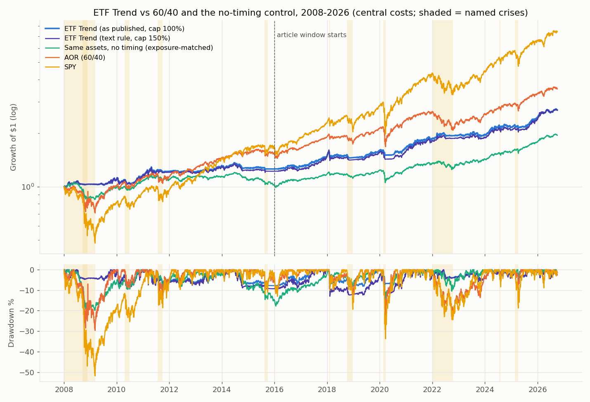
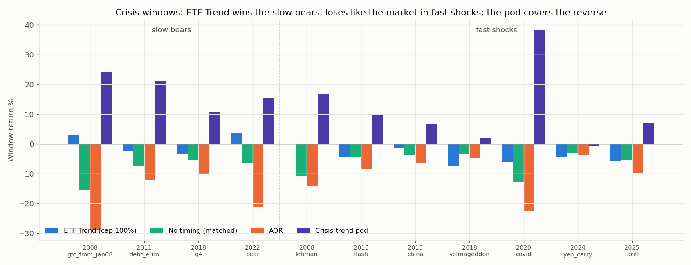

<!-- GENERATED FILE. EDIT THE CANONICAL KNOWLEDGE RECORD. -->

# Concretum 'Build Your Own ETF Trend Portfolio' (Donchian 6/9/12m ensemble, inverse-vol global equity + inflation sleeves, SHV cash): replication and defensive-side audit

!!! warning "Research-only"
    This page summarizes saved research evidence. It does not authorize LIVE, allocation, or deployment.

## TL;DR

> **Verdict:** REPRODUCED; DEFENSIVE ALLOCATION, NOT A HEDGE; REDUNDANT WITH THE BOOK. Rules reproduce the article's 2026-09-03 orders share-for-share and its headline numbers (with a 100% effective leverage cap: 7.6%/6.6% vol/-9.0% DD vs 7.7/6.8/-8.8; monthly corr 0.99). 2008-2026 out of the article window the defense holds: avg -0.7% in SPY<=-2% months vs -3.1% AOR; 2008 +3%, 2022 +4%. Timing adds defense beyond lower exposure (Holm p 0.014, placebo 100th pct). But it loses like the market in fast shocks after calm markets (Feb 2018 -7..-11%, Aug 2024 -5%) because inverse-vol sizing peaks just before them; hit rate on worst 5% SPY days 33%. Pre-2016 excess Sharpe 0.34-0.40 vs 0.55 for 60/40 SPY/IEF. Correlation 0.66 with Defense First and 0.71 with BOOK-A; adding 20% lowers BOOK-A Sharpe 1.13 -> 1.10, while 20% crisis pod raises it to 1.16.

> **Status:** `diagnostic`

> **Disposition:** `not_promoted_redundant_with_book`

> **Replication:** `reproduced`

## Research question

Reproduce the article's ETF Trend portfolio and test its defensive claim: does it cut losses when equities fall, where does that come from (lower exposure, timing, inflation sleeve, cash), is it a hedge, and does it add anything to the existing book and crisis-trend pod.

## Exact setup

| Field | Value |
| --- | --- |
| Signal family | time_series_trend_donchian_ensemble_vol_scaled |
| Universe | ["XLE FEZ VOO EEM EWJ \| DBA DBC DBE GLD SLV TIP \| SHV cash (VOO=SPY before 2010-09)"] |
| Decision | Donchian state and 63d vol at Wednesday Close_T |
| Fill | MOC at Close_(T+1) (Thursday); weekday 0-4 and daily signal tested |
| Primary cost layer | central_research |
| Last reviewed | 2026-10-02T00:00:00+03:00 |

## Timing and overnight attribution

```text
information available: Donchian state and 63d vol at Wednesday Close_T
primary executable fill: MOC at Close_(T+1) (Thursday); weekday 0-4 and daily signal tested
```

If final `Close_T` data formed the signal, a hypothetical `Close_T` entry is diagnostic only unless a separate pre-close protocol was modeled. Comparing that diagnostic with `Open_(T+1)` and applying the compounded return identity shows whether the apparent edge occurred in the overnight gap. Missing attribution numbers mean **not tested**, not zero.

| Attribution field | Value |
| --- | --- |
| Status | tested |
| Diagnostic Path | article monthly table and snapshot orders |
| Executable Path | stateful daily engine, MOC next session, 25% band, commission + 2 bps |
| Method | frozen spec v1/v1.1; T1/T2/T4 bootstrap with Holm; 500-draw circular-shift placebo |
| Headline Result | D0 vs exposure-matched static in down months +0.73 pp/month (Holm p 0.014); vs AOR +2.3 pp (p<0.001); Sharpe diff +0.24 (p 0.084) |
| Metrics | {"T2_p_holm": 0.0136, "T4_p_holm": 0.0844, "placebo_pct_down": 1.0} |
| Unavailable Reason | N/A |
| Artifact | pakal-research/reports/concretum_etf_trend_study/tables/tests.json |

## Primary metrics

| Metric | Value |
| --- | ---: |
| Period | 2008-01-03..2026-10-01 |
| Universe | article universe; text rule (150% cap) and reconciled 100% cap |
| Cost Layer | central_research (commission + 2 bps per side) |
| Cagr | 5.41% |
| Annualized Volatility | 7.26% |
| Sharpe | 0.569 |
| Maximum Drawdown | -12.97% |
| Turnover | 415.36% |

## Four separate verdicts

| Question | Conclusion |
| --- | --- |
| Source Replication | reproduced (orders, weights, correlations, headline stats with 100% effective cap) |
| Predictive Value | trend timing reduces down-month losses beyond exposure (T2 Holm p 0.014; placebo 100th pct) |
| Economic Value | standalone 60/40 replacement for a plain investor; no marginal value next to Defense First / BOOK-A |
| Promotion | none for the book; optional as an investor-level 60/40 replacement with the crisis pod (80/20) |

## Key findings

| Feature | Role | Direction | Status | Effect | Action |
| --- | --- | --- | --- | --- | --- |
| Donchian 6/9/12m ensemble with midline exit (k/3 scaling) | N/A | N/A | N/A | N/A | N/A |
| inverse 63d vol sizing with equal per-ETF risk budget | N/A | N/A | N/A | N/A | N/A |
| inflation-sensitive sleeve replacing bonds | N/A | N/A | N/A | N/A | N/A |
| 25% delta-to-target band | N/A | N/A | N/A | N/A | N/A |
| 150% leverage cap in the text | N/A | N/A | N/A | N/A | N/A |
| raw Sharpe 1.13 (CAGR/vol, no risk-free) | N/A | N/A | N/A | N/A | N/A |

## Visual evidence






## Limitations

- budget and band calibrated from one snapshot and one chart
- effective cap differs from the text
- VOO spliced with SPY pre-2010
- post-publication sample one month
- taxes ignored

## Next gates

- none for the book; if wanted as investor-level core, shadow the 100%-cap version with the crisis pod 80/20

## Sources

- `Concretum Research, Build Your Own ETF Trend Portfolio, Substack 2026-09-04 (paid; PDF in source/)`
- `pakal-research/reports/crisis_trend_pod_study (crisis windows, pod stream, book streams)`

## Canonical artifacts

| Artifact | Pakal path |
| --- | --- |
| Concise Report | `pakal-research/reports/concretum_etf_trend_study/REPORT.md` |
| Full Report | `pakal-research/reports/concretum_etf_trend_study/REPORT_FULL.md` |
| Notebook | `pakal-research/reports/concretum_etf_trend_study/concretum_etf_trend_study.ipynb` |
| Frozen Specification | `pakal-research/reports/concretum_etf_trend_study/research_spec_frozen.json` |
| Manifest | `pakal-research/reports/concretum_etf_trend_study/run_manifest.json` |
| Primary Source Code | `["pakal-research/concretum_etf_trend_study/cet_data.py", "pakal-research/concretum_etf_trend_study/cet_lib.py", "pakal-research/concretum_etf_trend_study/cet_run.py", "pakal-research/concretum_etf_trend_study/cet_book.py", "pakal-research/concretum_etf_trend_study/cet_charts.py", "pakal-research/concretum_etf_trend_study/test_cet_timing.py", "pakal-research/concretum_etf_trend_study/cet_build_artifacts.py"]` |
| Primary Tables | `["pakal-research/reports/concretum_etf_trend_study/tables/snapshot_order_replication.csv", "pakal-research/reports/concretum_etf_trend_study/tables/reproduction_article_window.csv", "pakal-research/reports/concretum_etf_trend_study/tables/main_periods.csv", "pakal-research/reports/concretum_etf_trend_study/tables/crisis_windows.csv", "pakal-research/reports/concretum_etf_trend_study/tables/tests.json", "pakal-research/reports/concretum_etf_trend_study/tables/gates.json", "pakal-research/reports/concretum_etf_trend_study/tables/book_integration.csv"]` |
| Primary Charts | `["pakal-research/reports/concretum_etf_trend_study/charts/equity_and_drawdown.png", "pakal-research/reports/concretum_etf_trend_study/charts/crisis_windows.png", "pakal-research/reports/concretum_etf_trend_study/charts/down_months_2008_2026.png", "pakal-research/reports/concretum_etf_trend_study/charts/exposure_stack.png", "pakal-research/reports/concretum_etf_trend_study/charts/decomposition.png", "pakal-research/reports/concretum_etf_trend_study/charts/placebo_timing.png"]` |
