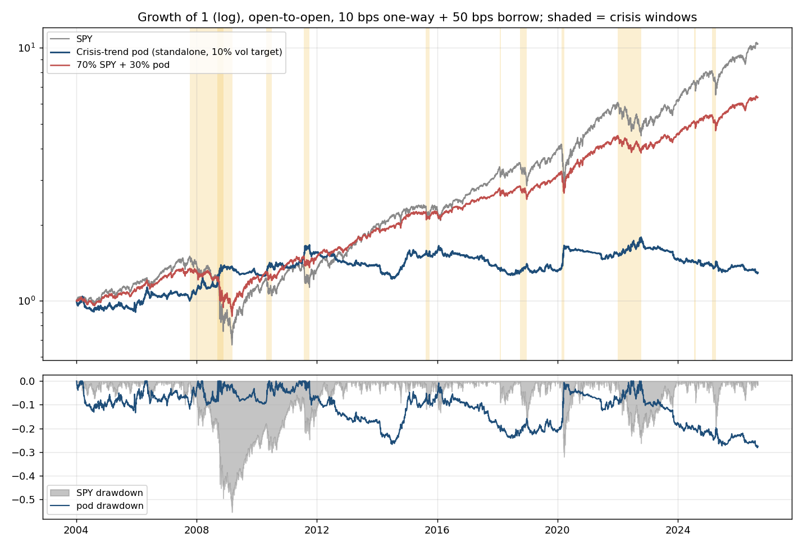
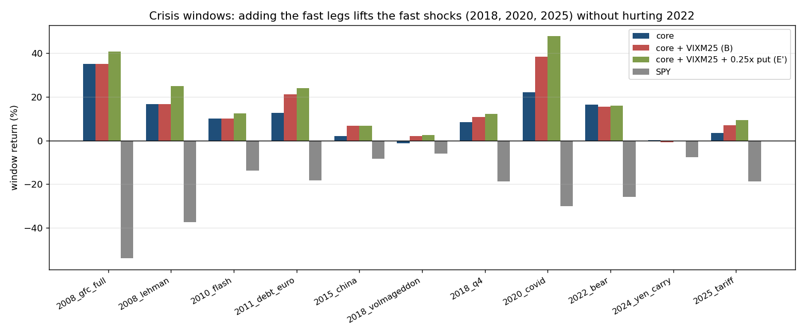

<!-- GENERATED FILE. EDIT THE CANONICAL KNOWLEDGE RECORD. -->

# Crisis-trend pod: asymmetric multi-asset time-series momentum core plus a VIXM-in-backwardation fast leg as a standalone tail-hedge sleeve

!!! warning "Research-only"
    This page summarizes saved research evidence. It does not authorize LIVE, allocation, or deployment.

## TL;DR

> **Verdict:** Forward hypothesis. The asymmetric crisis-trend pod (short risk assets only on negative own-trend, long safe havens only on positive own-trend, duration both ways, otherwise SHY) was positive in 10 of 11 crisis windows 2004-2026 (2008 +35%, 2020 +22%, 2022 +16%), with +1.62% mean and 93% hit on the worst 1% SPY days, at a non-crisis carry of -5.4%/yr vs SHY and a standalone CAGR of +1.15%. Cheaper than PPUT (-8.3%/yr non-crisis) and VXTH (-6.7%/yr) and broader than SG Trend (5/11). All history was seen while choosing the rule; freeze forward from 2026-09-02; no PAPER/LIVE/allocation. Extension 2026-09-03 (options/VIX allowed): adding 25% VIXM whenever VIX>VIX3M (2011+) raises CAGR to +1.73%, Sharpe to 0.21, worst-1% SPY-day payoff to +2.35%, fixes Volmageddon (+1.9%), 2018Q4 (+10.7%) and 2025 (+6.9%), costs 1 pp in 2022; recommended configuration. A 0.10x always-on SPX 5%-OTM put is optional (-0.4%/yr). Timing the put by trend state or contango and VXTH-style VIX calls were rejected.

> **Status:** `forward_hypothesis`

> **Disposition:** `forward_hypothesis_frozen_2026-09-02`

> **Replication:** `not_recorded`

## Research question

No machine-readable objective was recorded.

## Exact setup

| Field | Value |
| --- | --- |
| Signal family | asymmetric_cross_asset_time_series_momentum_tail_hedge |
| Universe | ["17 US-listed ETFs: SPY QQQ IWM EFA EEM TLT IEF LQD HYG GLD SLV DBC USO UUP FXE FXY FXF; cash SHY"] |
| Decision | After official Close_T; targets refreshed at the last close of each month |
| Fill | Open_(T+1); primary mark Open_(T+2) |
| Primary cost layer | central_research |
| Last reviewed | 2026-09-03 |

## Timing and overnight attribution

```text
information available: After official Close_T; targets refreshed at the last close of each month
primary executable fill: Open_(T+1); primary mark Open_(T+2)
```

If final `Close_T` data formed the signal, a hypothetical `Close_T` entry is diagnostic only unless a separate pre-close protocol was modeled. Comparing that diagnostic with `Open_(T+1)` and applying the compounded return identity shows whether the apparent edge occurred in the overnight gap. Missing attribution numbers mean **not tested**, not zero.


## Primary metrics

| Metric | Value |
| --- | ---: |
| Period | N/A |
| Universe | N/A |
| Cost Layer | N/A |
| Cagr | 1.15% |
| Annualized Volatility | N/A |
| Sharpe | 0.170 |
| Maximum Drawdown | -28.08% |
| Turnover | N/A |

## Key findings

| Feature | Role | Direction | Status | Effect | Action |
| --- | --- | --- | --- | --- | --- |
| Asymmetric direction constraint (never long risk assets) | pod mechanism | short EQ/credit/CMD/EUR on negative trend; long GLD/UUP/JPY/CHF on positive trend; TLT/IEF long-only | forward_hypothesis | {"crises_positive": "10/11", "noncrisis_carry": -0.05363901402510596, "worst1pct_mean": 0.016244275788510322} | Freeze the central rule; shadow forward with real fills; decide budget (10-30%) separately. |
| Fast leg: 25% VIXM when VIX>VIX3M on top of the core | reactive convexity module | long mid-term VIX futures ETF only in backwardation | forward_hypothesis | {"CAGR": 0.0173, "Sharpe": 0.2109, "bear2022": 0.154, "bootstrap_P_cagr_le0": 0.2175, "covid": 0.3829, "crises_positive": "10/11", "objective_drawdowns_positive": "7/7", "volmageddon": 0.0193, "worst1pct_mean": 0.0235} | Freeze with the core; consider VX months 4-7 futures instead of the ETF; forward shadow. |
| Symmetric multi-asset trend comparator | comparator | long/short by own trend | diagnostic | {"Sharpe": 0.41, "crises_positive": "5/11"} | Not a tail hedge on its own; consistent with SG Trend index behaviour. |
| VIX>VIX3M gated VIXM/VIXY comparators | comparator | long VIX futures products in backwardation only | diagnostic | {"VIXM_Sharpe": 0.32, "crises_positive": "6/8"} | Optional fast sub-sleeve only; costs 0.4-0.9%/yr carry when added to the pod. |
| Always-on SPX 5% OTM put (0.10-0.25x) and put timing gates | pre-positioned convexity module / timing | long puts | diagnostic_optional | {"cagr_cost_per_year_0.10x": -0.0038, "covid_0.10x": 0.2522, "gfc_0.10x": 0.3737, "median_monthly_cost_1x": -0.0036} | Optional 0.10x; gating by trend state or contango rejected (cost saved < payoff lost). |

## Visual evidence






## Limitations

- All periods were observed while the rule was chosen; maximum status forward_hypothesis.
- Eleven crisis windows; 2008 and 2020 dominate averages.
- No first-gap protection; 2018 Volmageddon and 2024 yen shock were flat-to-negative.
- ETF shorts require borrow; futures mapping has no contract for HYG/LQD.
- Norgate TOTALRETURN opens are research marks, not auction fills; no capacity evidence.
- External SG/Cboe series are close-to-close without costs.

## Next gates

- Freeze the central rule unchanged from 2026-09-02 and record forward shadow returns with real open fills.
- Measure borrow availability and fees for the 11 short names, or map to micro futures.
- Manager budget decision at 10-30% of the book; the pod is defined at 10% volatility so the decision is linear.

## Sources

- `{"publisher": "AQR", "title": "Tail Risk Hedging: Contrasting Put and Trend Strategies", "url": "https://www.aqr.com/insights/research/white-papers/tail-risk-hedging-contrasting-put-and-trend-strategies", "year": 2020}`
- `{"publisher": "Hurst, Ooi, Pedersen / JPM", "title": "A Century of Evidence on Trend-Following Investing", "url": "https://papers.ssrn.com/sol3/papers.cfm?abstract_id=2993026", "year": 2017}`
- `{"publisher": "Kaminski & Zhao, AlphaSimplex", "title": "Crisis or Correction? SG Trend in equity drawdowns", "url": "https://www.alphasimplex.com/assets/files/2025.04.07---crisis-or-correction---kaminski-and-zhao.pdf", "year": 2025}`
- `{"publisher": "Baltussen, Martens, van der Linden / FAJ", "title": "Centuries of evidence on portfolio protection", "url": "https://papers.ssrn.com/sol3/papers.cfm?abstract_id=5815464", "year": 2026}`
- `{"publisher": "Cboe", "title": "Cboe VXTH / PPUT / CLL index histories", "url": "https://cdn.cboe.com/api/global/us_indices/daily_prices/VXTH_History.csv", "year": 2026}`
- `{"publisher": "BarclayHedge", "title": "SG Trend / SG CTA / BTOP50 daily", "url": "https://portal.barclayhedge.com/", "year": 2026}`
- `{"publisher": "AQR data library", "title": "Time Series Momentum factors, monthly", "url": "https://images.aqr.com/-/media/AQR/Documents/Insights/Data-Sets/Time-Series-Momentum-Factors-Monthly.xlsx", "year": 2026}`
- `{"publisher": "Zarattini, Mele, Aziz / SSRN", "title": "The Volatility Edge: A Dual Approach for VIX ETNs Trading", "url": "https://papers.ssrn.com/sol3/papers.cfm?abstract_id=5316487", "year": 2025}`
- `{"publisher": "Quantpedia", "title": "Hedging Tail Risk with Robust VIXY Models", "url": "https://quantpedia.com/hedging-tail-risk-with-robust-vixy-models/", "year": 2025}`

## Canonical artifacts

| Artifact | Pakal path |
| --- | --- |
| Concise Report | `pakal-research/reports/crisis_trend_pod_study/REPORT.md` |
| Full Report | `pakal-research/reports/crisis_trend_pod_study/REPORT_FULL.md` |
| Notebook | `pakal-research/crisis_trend_pod_study.ipynb` |
| Frozen Specification | `pakal-research/reports/crisis_trend_pod_study/research_spec.json` |
| Manifest | `pakal-research/reports/crisis_trend_pod_study/run_manifest.json` |
| Primary Source Code | `["pakal-research/crisis_trend_pod_study.py", "pakal-research/build_crisis_trend_pod_artifacts.py", "pakal-research/reports/crisis_trend_pod_study/convexity_final.py", "pakal-research/reports/crisis_trend_pod_study/pitfall_diagnostics.py"]` |
| Primary Tables | `["pakal-research/reports/crisis_trend_pod_study/tables/variant_summary.csv", "pakal-research/reports/crisis_trend_pod_study/tables/external_benchmark_crisis_windows.csv", "pakal-research/reports/crisis_trend_pod_study/tables/central_overlay_budget.csv", "pakal-research/reports/crisis_trend_pod_study/tables/central_attribution.csv", "pakal-research/reports/crisis_trend_pod_study/tables/convexity_final_candidates.csv", "pakal-research/reports/crisis_trend_pod_study/tables/convexity_objective_drawdowns.csv"]` |
| Primary Charts | `["pakal-research/reports/crisis_trend_pod_study/charts/equity_drawdown.png", "pakal-research/reports/crisis_trend_pod_study/charts/crisis_windows.png", "pakal-research/reports/crisis_trend_pod_study/charts/overlay_budget.png", "pakal-research/reports/crisis_trend_pod_study/charts/convexity_crisis_windows.png"]` |
