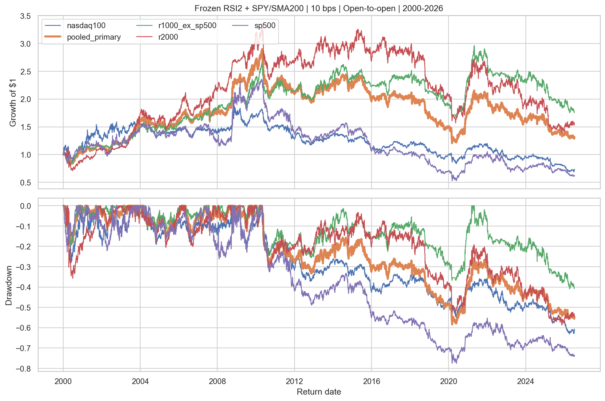
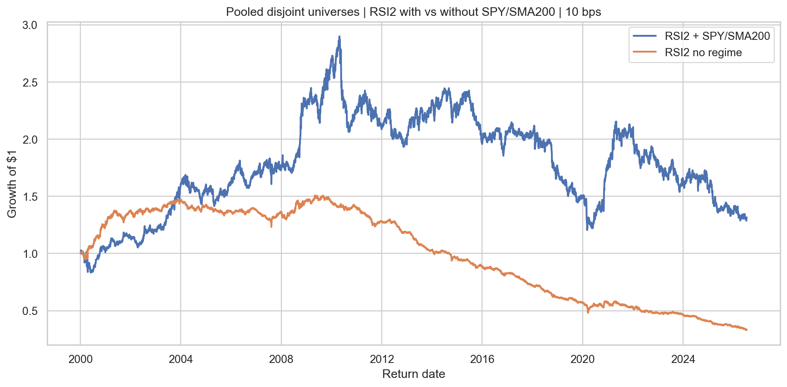

<!-- GENERATED FILE. EDIT THE CANONICAL KNOWLEDGE RECORD. -->

# Cross-sectional RSI2 with benchmark SMA200 directional regime

!!! warning "Research-only"
    This page summarizes saved research evidence. It does not authorize LIVE, allocation, or deployment.

## TL;DR

> **Verdict:** כלל RSI2/SMA200 הקפוא לא יצר כלכלה נטו יציבה מספיק בתקופת האישור בשלושת העולמות הבלתי־חופפים.

> **Status:** `diagnostic`

> **Disposition:** `not_recorded`

> **Replication:** `not_recorded`

## Research question

Test whether RSI2 plus a SPY SMA200 one-sided regime creates robust executable next-open alpha.

## Exact setup

| Field | Value |
| --- | --- |
| Signal family | mean_reversion |
| Universe | ["S&P 500 PIT", "Russell 1000 ex S&P 500 PIT", "Russell 2000 PIT", "Nasdaq-100 PIT"] |
| Decision | Close_T |
| Fill | Open_T+1 |
| Primary cost layer | central_research |
| Last reviewed | 2026-08-11T14:50:50.311545+03:00 |

## Timing and overnight attribution

```text
information available: Close_T
primary executable fill: Open_T+1
```

If final `Close_T` data formed the signal, a hypothetical `Close_T` entry is diagnostic only unless a separate pre-close protocol was modeled. Comparing that diagnostic with `Open_(T+1)` and applying the compounded return identity shows whether the apparent edge occurred in the overnight gap. Missing attribution numbers mean **not tested**, not zero.


## Primary metrics

| Metric | Value |
| --- | ---: |
| Period | confirmation |
| Universe | pooled_primary |
| Cost Layer | central_research |
| Cagr | -4.98% |
| Annualized Volatility | 14.14% |
| Sharpe | -0.291 |
| Maximum Drawdown | -40.28% |
| Turnover | 20447.63% |

## Key findings

| Feature | Role | Direction | Status | Effect | Action |
| --- | --- | --- | --- | --- | --- |
| Wilder RSI2 cross-sectional tail | entry signal and rank | buy lowest decile and short highest decile | diagnostic | -0.0498152441339108 | follow promotion-gate verdict |
| SPY Close versus SMA200 | directional exposure regime | long only above and short only below | diagnostic | N/A | do not wire live without a full research pass and short-execution evidence |

## Visual evidence






## Limitations

- No borrow, locates, recalls, financing, or dividends-in-lieu.
- No historical point-in-time sector classifications.
- No opening-auction spread, volume, queue, or partial-fill evidence.
- CAPITALSPECIAL excludes ordinary dividends.

## Next gates

- If and only if frozen gates pass, run a forward shadow with actual borrow and opening-auction observations.

## Sources

- `user-rsi2-sma200-followup`
- `cross-sectional-rsi-parent-study`

## Canonical artifacts

| Artifact | Pakal path |
| --- | --- |
| Concise Report | `C:\\Users\\User\\Documents\\workspace\\pakal\\pakal-research\\reports\\cross_sectional_rsi2_sma200_regime_followup\\REPORT.md` |
| Full Report | `C:\\Users\\User\\Documents\\workspace\\pakal\\pakal-research\\reports\\cross_sectional_rsi2_sma200_regime_followup\\REPORT_FULL.md` |
| Notebook | `C:\\Users\\User\\Documents\\workspace\\pakal\\pakal-research\\cross_sectional_rsi2_sma200_regime_followup.ipynb` |
| Frozen Specification | `C:\\Users\\User\\Documents\\workspace\\pakal\\pakal-research\\reports\\cross_sectional_rsi2_sma200_regime_followup\\research_spec_frozen.json` |
| Manifest | `C:\\Users\\User\\Documents\\workspace\\pakal\\pakal-research\\reports\\cross_sectional_rsi2_sma200_regime_followup\\run_manifest.json` |
| Primary Source Code | `["C:\\\\Users\\\\User\\\\Documents\\\\workspace\\\\pakal\\\\pakal-research\\\\cross_sectional_rsi2_sma200_regime_followup.py"]` |
| Primary Tables | `["C:\\\\Users\\\\User\\\\Documents\\\\workspace\\\\pakal\\\\pakal-research\\\\reports\\\\cross_sectional_rsi2_sma200_regime_followup\\\\tables\\\\primary_metrics.csv", "C:\\\\Users\\\\User\\\\Documents\\\\workspace\\\\pakal\\\\pakal-research\\\\reports\\\\cross_sectional_rsi2_sma200_regime_followup\\\\tables\\\\promotion_gates.csv"]` |
| Primary Charts | `["C:\\\\Users\\\\User\\\\Documents\\\\workspace\\\\pakal\\\\pakal-research\\\\reports\\\\cross_sectional_rsi2_sma200_regime_followup\\\\charts\\\\primary_equity_drawdown.png", "C:\\\\Users\\\\User\\\\Documents\\\\workspace\\\\pakal\\\\pakal-research\\\\reports\\\\cross_sectional_rsi2_sma200_regime_followup\\\\charts\\\\primary_vs_no_regime.png"]` |
