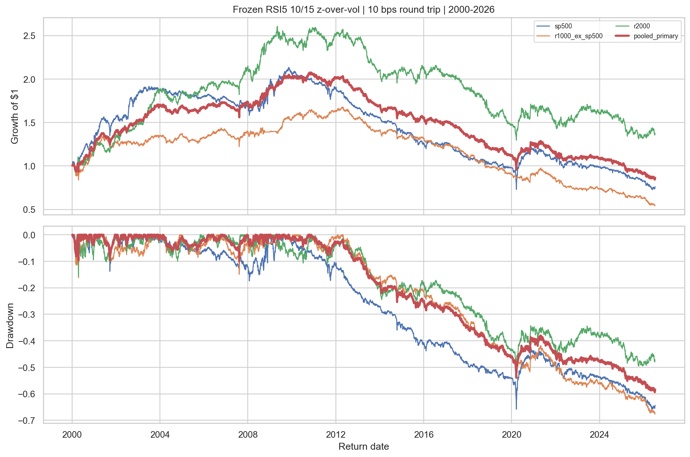
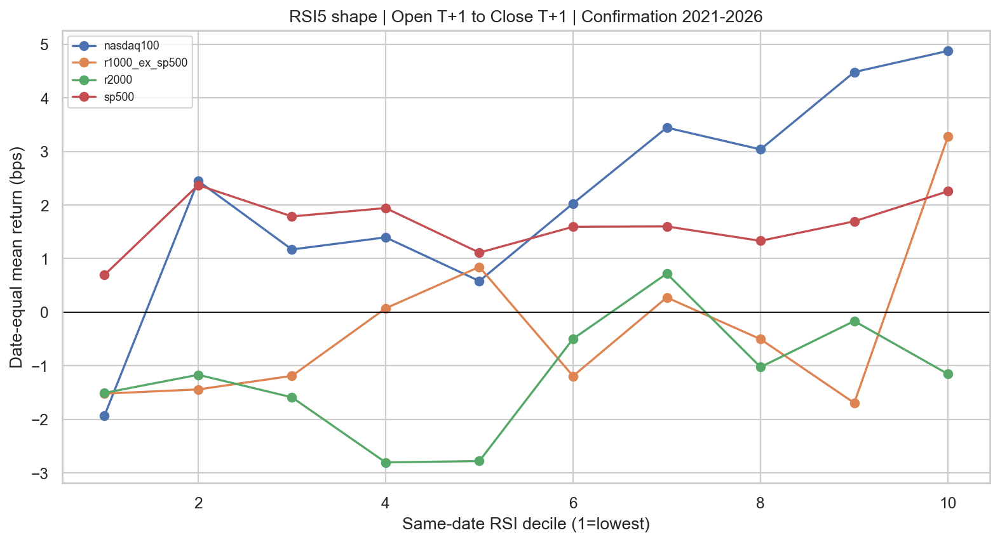

<!-- GENERATED FILE. EDIT THE CANONICAL KNOWLEDGE RECORD. -->

# Cross-Sectional RSI Mean-Reversion Across PIT US Equity Universes

!!! warning "Research-only"
    This page summarizes saved research evidence. It does not authorize LIVE, allocation, or deployment.

## TL;DR

> **Verdict:** Cross-sectional RSI did not show sufficiently consistent confirmation evidence across the disjoint universes; retain only as a diagnostic feature.

> **Status:** `diagnostic`

> **Disposition:** `not_recorded`

> **Replication:** `not_recorded`

## Research question

Test whether relative RSI extremes produce a causal and cost-surviving next-open long-short edge across distinct PIT US equity universes.

## Exact setup

| Field | Value |
| --- | --- |
| Signal family | mean_reversion |
| Universe | ["S&P 500 PIT", "Russell 1000 ex S&P 500 PIT", "Russell 2000 PIT", "Nasdaq-100 PIT"] |
| Decision | Close_T |
| Fill | Open_T+1 |
| Primary cost layer | central_research |
| Last reviewed | 2026-08-11T10:33:12.317732+03:00 |

## Timing and overnight attribution

```text
information available: Close_T
primary executable fill: Open_T+1
```

If final `Close_T` data formed the signal, a hypothetical `Close_T` entry is diagnostic only unless a separate pre-close protocol was modeled. Comparing that diagnostic with `Open_(T+1)` and applying the compounded return identity shows whether the apparent edge occurred in the overnight gap. Missing attribution numbers mean **not tested**, not zero.


## Primary metrics

| Metric | Value |
| --- | ---: |
| Period | confirmation_2021_2026 |
| Universe | equal-weight pool of S&P 500, Russell 1000 ex-S&P 500, and Russell 2000 PIT sleeves |
| Cost Layer | central_research |
| Cagr | -6.67% |
| Annualized Volatility | 7.51% |
| Sharpe | -0.881 |
| Maximum Drawdown | -34.50% |
| Turnover | 16520.09% |

## Key findings

| Feature | Role | Direction | Status | Effect | Action |
| --- | --- | --- | --- | --- | --- |
| RSI5 same-date percentile tails | entry signal and cross-sectional rank | long low RSI and short high RSI | diagnostic | -0.0666801150867186 | do_not_wire_live; follow the promotion-gate verdict |
| prior-only RSI cross-sectional dispersion gate | entry filter | trade only when current IQR exceeds the prior 252-session median IQR | diagnostic | N/A | freeze only if it improves unseen periods without rescuing the primary |

## Visual evidence






## Limitations

- Original paper unavailable; this is a hypothesis study, not a literal replication.
- Historical PIT sectors unavailable.
- Borrow, locates, recalls, dividends-in-lieu, financing, and forced buy-ins excluded.
- Opening-auction liquidity and empirical impact unavailable.
- CAPITALSPECIAL excludes ordinary dividends.

## Next gates

- Run an append-only frozen RSI5 10/15 forward shadow with actual borrow and opening-auction observations before any deployment-validation review.

## Sources

- `user-provided-rsi-cross-sectional-synthesis`
- `research_spec_frozen.json`

## Canonical artifacts

| Artifact | Pakal path |
| --- | --- |
| Concise Report | `pakal-research/reports/cross_sectional_rsi_mean_reversion_study/REPORT.md` |
| Full Report | `pakal-research/reports/cross_sectional_rsi_mean_reversion_study/REPORT_FULL.md` |
| Notebook | `pakal-research/cross_sectional_rsi_mean_reversion_study.ipynb` |
| Frozen Specification | `pakal-research/reports/cross_sectional_rsi_mean_reversion_study/research_spec_frozen.json` |
| Manifest | `pakal-research/reports/cross_sectional_rsi_mean_reversion_study/run_manifest.json` |
| Primary Source Code | `["pakal-research/cross_sectional_rsi_mean_reversion_study.py"]` |
| Primary Tables | `["pakal-research/reports/cross_sectional_rsi_mean_reversion_study/tables/primary_metrics.csv", "pakal-research/reports/cross_sectional_rsi_mean_reversion_study/tables/endpoint_ic.csv", "pakal-research/reports/cross_sectional_rsi_mean_reversion_study/tables/promotion_gates.csv"]` |
| Primary Charts | `["pakal-research/reports/cross_sectional_rsi_mean_reversion_study/charts/primary_equity_drawdown.png", "pakal-research/reports/cross_sectional_rsi_mean_reversion_study/charts/confirmation_decile_shape.png", "pakal-research/reports/cross_sectional_rsi_mean_reversion_study/charts/rolling_spy_correlation.png"]` |
