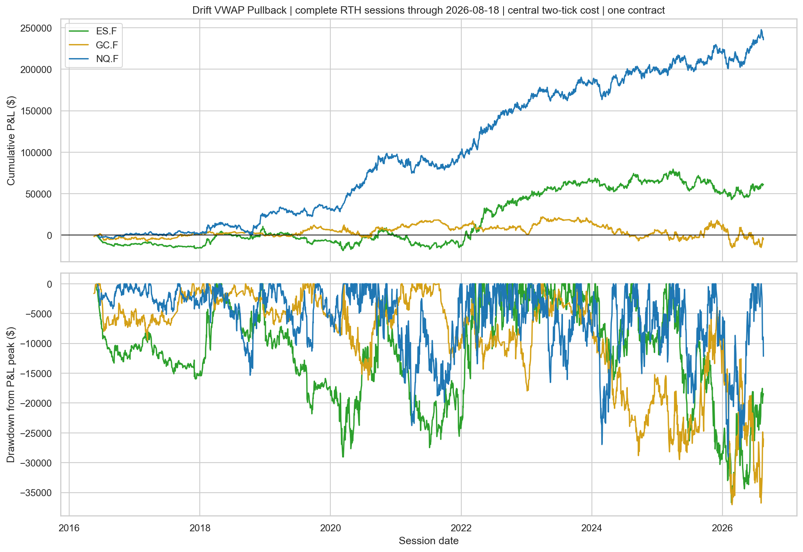
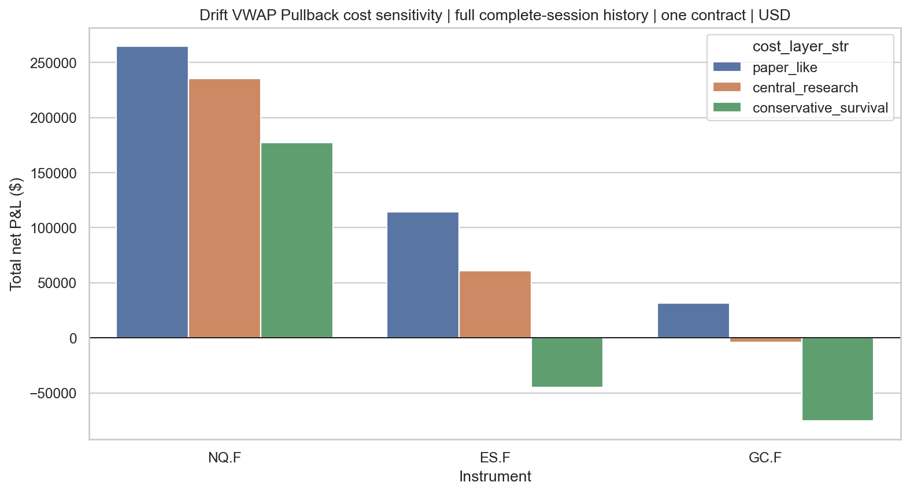

<!-- GENERATED FILE. EDIT THE CANONICAL KNOWLEDGE RECORD. -->

# Drift VWAP Pullback futures replication and transfer study

!!! warning "Research-only"
    This page summarizes saved research evidence. It does not authorize LIVE, allocation, or deployment.

## TL;DR

> **Verdict:** NQ reproduces source-like OOS win and payoff geometry and remains positive after stressed costs; ES and GC fail transfer robustness. NQ is forward-shadow only, not deployment-ready.

> **Status:** `research_candidate`

> **Disposition:** `candidate`

> **Replication:** `replicated`

## Research question

Test the literal NQ Drift VWAP Pullback rule with causal 15-minute regime and next-5-minute-open execution, then test frozen dollar-equivalent transfers to ES and GC.

## Exact setup

| Field | Value |
| --- | --- |
| Signal family | intraday_vwap_drift_continuation |
| Universe | ["NQ.F continuous futures literal replication", "ES.F continuous futures dollar-equivalent transfer", "GC.F continuous futures dollar-equivalent transfer"] |
| Decision | After each completed 15-minute bar close from 10:30 ET through 15:15 ET using only the completed session VWAP, prior VWAP, and exact 60-minute return. |
| Fill | Open of the five-minute bar immediately after the first completed opposite-color pullback bar; no entry after 15:30 ET and forced exit at the 15:55 ET open. |
| Primary cost layer | central_research |
| Last reviewed | 2026-08-19T21:00:00+00:00 |

## Timing and overnight attribution

```text
information available: After each completed 15-minute bar close from 10:30 ET through 15:15 ET using only the completed session VWAP, prior VWAP, and exact 60-minute return.
primary executable fill: Open of the five-minute bar immediately after the first completed opposite-color pullback bar; no entry after 15:30 ET and forced exit at the 15:55 ET open.
```

If final `Close_T` data formed the signal, a hypothetical `Close_T` entry is diagnostic only unless a separate pre-close protocol was modeled. Comparing that diagnostic with `Open_(T+1)` and applying the compounded return identity shows whether the apparent edge occurred in the overnight gap. Missing attribution numbers mean **not tested**, not zero.

| Attribution field | Value |
| --- | --- |
| Status | not_applicable |
| Diagnostic Path | No same-close diagnostic path was used. |
| Executable Path | Completed 15-minute regime to later completed five-minute trigger to next five-minute open. |
| Method | Stateful bar-by-bar futures simulation with explicit decision, signal, entry, and exit timestamps. |
| Headline Result | All headline results use the next five-minute open after the trigger; no close-to-next-day boundary exists. |
| Metrics | {"same_bar_entry_count": 0, "same_bar_stop_target_ambiguities_nq": 4} |
| Artifact | C:\\Users\\User\\Documents\\workspace\\pakal\\pakal-research\\reports\\drift_vwap_pullback_study\\tables\\trade_log.csv |

## Primary metrics

| Metric | Value |
| --- | ---: |
| Period | complete RTH sessions through 2026-08-18 |
| Universe | one NQ futures contract |
| Cost Layer | central_research_two_ticks_round_trip |
| Cagr | 23.68% |
| Annualized Volatility | 25.23% |
| Sharpe | 0.938 |
| Maximum Drawdown | -29.04% |
| Turnover | 58629.19% |

## Four separate verdicts

| Question | Conclusion |
| --- | --- |
| Source Replication | NQ replicated: the source-OOS proxy produced 63.01% gross wins, $869.56 average gross win, and -$1,377.69 average gross loss, close to the source claim. |
| Predictive Value | The frozen VWAP-drift-pullback rule has positive family-adjusted session-level expectancy on NQ; ES and GC do not pass the same gate. |
| Economic Value | NQ central-cost expectancy is $40.38 per trade and survives four ticks, but profit factor is only 1.09 and one-contract maximum drawdown is -$29,035. |
| Promotion | No promotion: the 10-session post-claim extension is negative and too small, while roll, empirical fills, and capacity are unresolved. |

## Key findings

| Feature | Role | Direction | Status | Effect | Action |
| --- | --- | --- | --- | --- | --- |
| literal NQ VWAP drift plus first pullback | alpha signal | trade in the direction of price, VWAP slope, and one-hour drift after the first counter-trend candle | research_candidate | $40.38 central-cost expectancy per trade over 5,835 trades; $28.22 in the source-OOS proxy | retain frozen NQ rule for forward shadow only |
| ES dollar-equivalent transfer | universe transfer | same signal and dollar stop-target geometry as NQ | rejected | $14.42 full-sample central expectancy but -$7.44 in the source-OOS proxy | reject; any rescue attempt requires a new study and untouched data |
| GC dollar-equivalent transfer | universe transfer | same signal and dollar stop-target geometry as NQ | rejected | -$1.16 full-sample central expectancy and -$21.75 in the source-OOS proxy | reject |

## Visual evidence






## Limitations

- The source is a private ChatGPT summary of a video transcript rather than audited source code or a paper.
- VWAP price convention and regime re-arm duration were absent from the source and required frozen executable proxies.
- The source optimization family and original transaction costs are unknown.
- Continuous-futures roll and adjustment methodology is undocumented.
- The post-claim extension contains only 10-12 sessions.
- No empirical broker fills, latency, partial fills, margin model, or capacity evidence.

## Next gates

- Run a frozen NQ forward shadow on an independent feed with explicit front-month contract and roll calendar.
- Capture commissions, spread, slippage, fill timestamps, and missed fills without changing thresholds.
- Accumulate a materially longer untouched post-2026-08-18 confirmation window before reconsidering promotion.

## Sources

- `https://chatgpt.com/c/6a860e00-0d60-83eb-9b01-7294837344f0`
- `C:\\Users\\User\\Documents\\workspace\\1_data\\futures_NQ.F_5m.parquet`
- `C:\\Users\\User\\Documents\\workspace\\1_data\\futures_NQ.F_15m.parquet`
- `C:\\Users\\User\\Documents\\workspace\\1_data\\futures_ES.F_5m.parquet`
- `C:\\Users\\User\\Documents\\workspace\\1_data\\futures_ES.F_15m.parquet`
- `C:\\Users\\User\\Documents\\workspace\\1_data\\futures_GC.F_5m.parquet`
- `C:\\Users\\User\\Documents\\workspace\\1_data\\futures_GC.F_15m.parquet`

## Canonical artifacts

| Artifact | Pakal path |
| --- | --- |
| Concise Report | `C:\\Users\\User\\Documents\\workspace\\pakal\\pakal-research\\reports\\drift_vwap_pullback_study\\REPORT.md` |
| Full Report | `C:\\Users\\User\\Documents\\workspace\\pakal\\pakal-research\\reports\\drift_vwap_pullback_study\\REPORT_FULL.md` |
| Notebook | `C:\\Users\\User\\Documents\\workspace\\pakal\\pakal-research\\drift_vwap_pullback_study.ipynb` |
| Frozen Specification | `C:\\Users\\User\\Documents\\workspace\\pakal\\pakal-research\\reports\\drift_vwap_pullback_study\\research_spec_frozen.json` |
| Manifest | `C:\\Users\\User\\Documents\\workspace\\pakal\\pakal-research\\reports\\drift_vwap_pullback_study\\run_manifest.json` |
| Research State | `C:\\Users\\User\\Documents\\workspace\\pakal\\pakal-research\\reports\\drift_vwap_pullback_study\\research_state.json` |
| Hypothesis Registry | `C:\\Users\\User\\Documents\\workspace\\pakal\\pakal-research\\reports\\drift_vwap_pullback_study\\hypothesis_registry.json` |
| Experiment Ledger | `C:\\Users\\User\\Documents\\workspace\\pakal\\pakal-research\\reports\\drift_vwap_pullback_study\\experiment_ledger.jsonl` |
| Decision Log | `C:\\Users\\User\\Documents\\workspace\\pakal\\pakal-research\\reports\\drift_vwap_pullback_study\\decision_log.jsonl` |
| Source Rule Map | `C:\\Users\\User\\Documents\\workspace\\pakal\\pakal-research\\reports\\drift_vwap_pullback_study\\SOURCE_RULE_MAP.md` |
| Primary Source Code | `["C:\\\\Users\\\\User\\\\Documents\\\\workspace\\\\pakal\\\\pakal-research\\\\drift_vwap_pullback_study.py", "C:\\\\Users\\\\User\\\\Documents\\\\workspace\\\\pakal\\\\pakal-research\\\\audit_drift_vwap_data.py"]` |
| Primary Tables | `["C:\\\\Users\\\\User\\\\Documents\\\\workspace\\\\pakal\\\\pakal-research\\\\reports\\\\drift_vwap_pullback_study\\\\tables\\\\performance_summary.csv", "C:\\\\Users\\\\User\\\\Documents\\\\workspace\\\\pakal\\\\pakal-research\\\\reports\\\\drift_vwap_pullback_study\\\\tables\\\\bootstrap_inference.csv", "C:\\\\Users\\\\User\\\\Documents\\\\workspace\\\\pakal\\\\pakal-research\\\\reports\\\\drift_vwap_pullback_study\\\\tables\\\\trade_log.csv"]` |
| Primary Charts | `["C:\\\\Users\\\\User\\\\Documents\\\\workspace\\\\pakal\\\\pakal-research\\\\reports\\\\drift_vwap_pullback_study\\\\charts\\\\central_equity_drawdown.png", "C:\\\\Users\\\\User\\\\Documents\\\\workspace\\\\pakal\\\\pakal-research\\\\reports\\\\drift_vwap_pullback_study\\\\charts\\\\cost_sensitivity.png", "C:\\\\Users\\\\User\\\\Documents\\\\workspace\\\\pakal\\\\pakal-research\\\\reports\\\\drift_vwap_pullback_study\\\\charts\\\\yearly_net_pnl_heatmap.png"]` |
