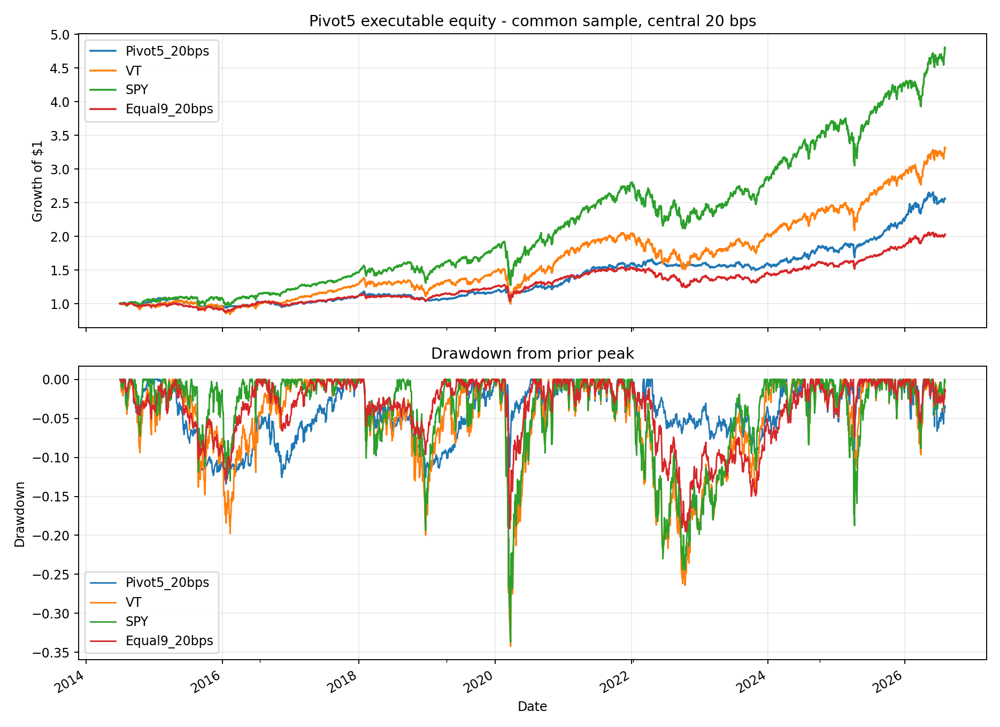
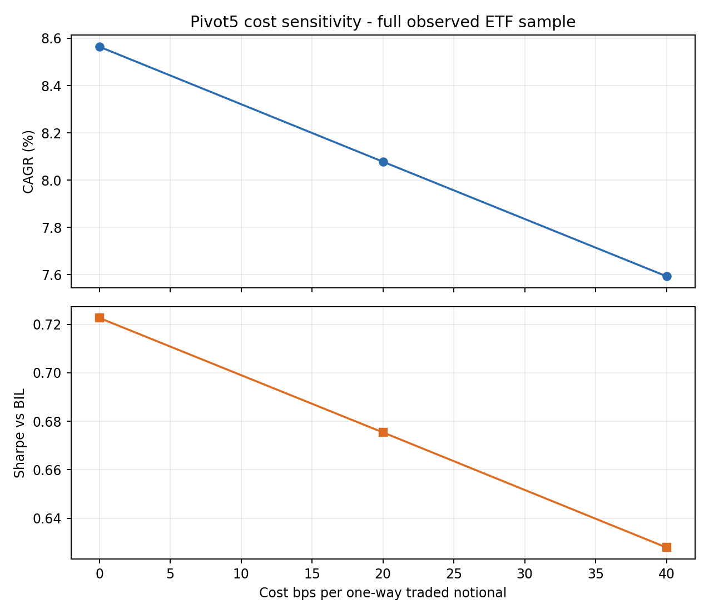

<!-- GENERATED FILE. EDIT THE CANONICAL KNOWLEDGE RECORD. -->

# Dual Momentum Pivot5 - exact observed ETF study

!!! warning "Research-only"
    This page summarizes saved research evidence. It does not authorize LIVE, allocation, or deployment.

## TL;DR

> **Verdict:** הכלל המילולי ראוי למעקב קדימה ללא שינוי, אך לא לאישור מסחר: המדגם המקומי קצר ומזוהם בבחירת המקור, ואין אישור נקי לאחר הפרסום.

> **Status:** `forward_hypothesis`

> **Disposition:** `not_recorded`

> **Replication:** `not_recorded`

## Research question

Test the literal nine-ETF Pivot5 rule with causal next-open execution and six frozen component changes.

## Exact setup

| Field | Value |
| --- | --- |
| Signal family | cross_asset_dual_momentum |
| Universe | ["SPY, VEA, EEM, TLT, IEF, BNDX, VNQ, DBC, GLD"] |
| Decision | Close_T after the completed month-end close |
| Fill | Open_T+1 |
| Primary cost layer | central_research |
| Last reviewed | 2026-08-07T13:54:52.366833+03:00 |

## Timing and overnight attribution

```text
information available: Close_T after the completed month-end close
primary executable fill: Open_T+1
```

If final `Close_T` data formed the signal, a hypothetical `Close_T` entry is diagnostic only unless a separate pre-close protocol was modeled. Comparing that diagnostic with `Open_(T+1)` and applying the compounded return identity shows whether the apparent edge occurred in the overnight gap. Missing attribution numbers mean **not tested**, not zero.


## Primary metrics

| Metric | Value |
| --- | ---: |
| Period | 2014-07-01 to 2026-08-06 |
| Universe | literal_observed_9 |
| Cost Layer | central_research |
| Cagr | 8.08% |
| Annualized Volatility | 9.48% |
| Sharpe | 0.675 |
| Maximum Drawdown | -13.42% |
| Turnover | 224.33% |

## Key findings

| Feature | Role | Direction | Status | Effect | Action |
| --- | --- | --- | --- | --- | --- |
| no_absolute_filter | controlled_challenger | improve_literal_baseline | diagnostic | {"confirmation_cagr_delta": 0.024298792189513252, "validation_cagr_delta": -0.0176498789968762} | do_not_promote |
| score_12m_only | controlled_challenger | improve_literal_baseline | diagnostic | {"confirmation_cagr_delta": 0.01305738514740673, "validation_cagr_delta": -0.03369551781194691} | do_not_promote |
| score_skip_1m | controlled_challenger | improve_literal_baseline | diagnostic | {"confirmation_cagr_delta": 0.007685126398889963, "validation_cagr_delta": -0.01060936196871487} | do_not_promote |
| top3_breadth | controlled_challenger | improve_literal_baseline | diagnostic | {"confirmation_cagr_delta": -0.0007596621142682558, "validation_cagr_delta": 0.021149654710546528} | do_not_promote |
| top7_breadth | controlled_challenger | improve_literal_baseline | diagnostic | {"confirmation_cagr_delta": -0.04838881547786644, "validation_cagr_delta": -0.033694065301369536} | do_not_promote |
| equal_inverse_vol_blend | controlled_challenger | improve_literal_baseline | diagnostic | {"confirmation_cagr_delta": -0.007891235924531115, "validation_cagr_delta": -0.00978404179907999} | do_not_promote |

## Visual evidence






## Limitations

- No disclosed proxy series for the source's 1991-2013 history.
- No untouched confirmation sample after publication.
- Daily adjusted opens are not observed auction fills.
- Capacity uses full-day ADV and hypothetical impact.
- Taxes are not modeled.

## Next gates

- Forward-track the frozen baseline and any fully passed challenger without changes.
- Collect observed opening spread, auction volume, fill, and partial-fill evidence.
- Request the source proxy map and exact cash/timing conventions before attempting a 35-year replication.

## Sources

- `C:/Users/User/Downloads/פואנטה.pdf`

## Canonical artifacts

| Artifact | Pakal path |
| --- | --- |
| Concise Report | `pakal-research/reports/dual_momentum_pivot5_signal_study/REPORT.md` |
| Full Report | `pakal-research/reports/dual_momentum_pivot5_signal_study/REPORT_FULL.md` |
| Notebook | `pakal-research/dual_momentum_pivot5_signal_study.ipynb` |
| Frozen Specification | `pakal-research/reports/dual_momentum_pivot5_signal_study/research_spec_frozen.json` |
| Manifest | `pakal-research/reports/dual_momentum_pivot5_signal_study/run_manifest.json` |
| Primary Source Code | `["pakal-research/dual_momentum_pivot5_signal_study.py"]` |
| Primary Tables | `["pakal-research/reports/dual_momentum_pivot5_signal_study/tables"]` |
| Primary Charts | `["pakal-research/reports/dual_momentum_pivot5_signal_study/charts"]` |
