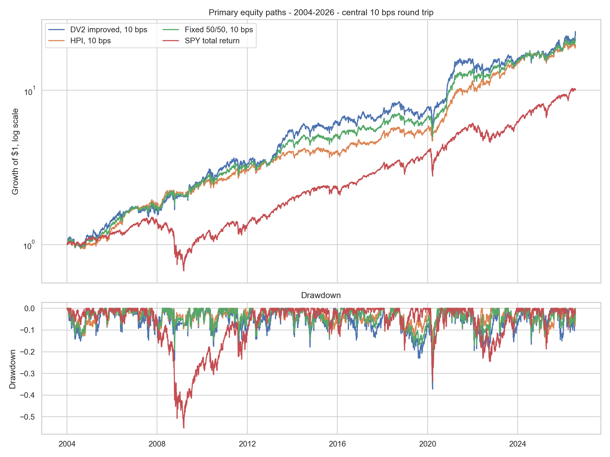
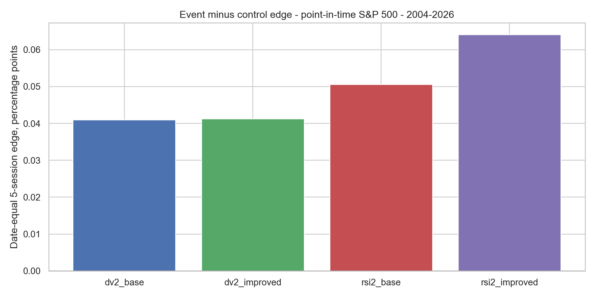

<!-- GENERATED FILE. EDIT THE CANONICAL KNOWLEDGE RECORD. -->

# DV2 and HPI Diversification Study

!!! warning "Research-only"
    This page summarizes saved research evidence. It does not authorize LIVE, allocation, or deployment.

## TL;DR

> **Verdict:** DV2 is not a deployment candidate. Its literal improved rule is classified by the frozen gates as diagnostic; the HPI blend is useful only if it improves path risk after costs, and still requires genuinely new data plus opening-auction fill evidence.

> **Status:** `diagnostic`

> **Disposition:** `not_recorded`

> **Replication:** `not_recorded`

## Research question

Determine whether the literal improved DV2 S&P 500 sleeve survives point-in-time membership, data-quality controls, date-level inference, causal next-open execution, 2/10/25 bps round-trip costs, and selected-order capacity stress, and whether it adds genuine diversification to the frozen HPI comparator rather than another highly correlated mean-reversion return stream.

## Exact setup

| Field | Value |
| --- | --- |
| Signal family | mean_reversion |
| Universe | ["S&P 500 Current & Past with point-in-time membership"] |
| Decision | Close_T |
| Fill | Open_T+1 |
| Primary cost layer | central_research |
| Last reviewed | 2026-07-25T23:39:51.050378+03:00 |

## Timing and overnight attribution

```text
information available: Close_T
primary executable fill: Open_T+1
```

If final `Close_T` data formed the signal, a hypothetical `Close_T` entry is diagnostic only unless a separate pre-close protocol was modeled. Comparing that diagnostic with `Open_(T+1)` and applying the compounded return identity shows whether the apparent edge occurred in the overnight gap. Missing attribution numbers mean **not tested**, not zero.


## Primary metrics

| Metric | Value |
| --- | ---: |
| Period | 2004-01-02 through 2026-07-24 |
| Universe | Point-in-time S&P 500 |
| Cost Layer | central_research_10_bps_round_trip |
| Cagr | 14.89% |
| Annualized Volatility | 20.60% |
| Sharpe | 0.777 |
| Maximum Drawdown | -37.22% |
| Turnover | 9487.73% |

## Key findings

| Feature | Role | Direction | Status | Effect | Action |
| --- | --- | --- | --- | --- | --- |
| DV2 below 10 | entry signal | lower is more oversold | diagnostic | 0.0004124580223873 | Keep frozen; require future untouched data before any promotion |
| NATR14 descending | cross-sectional rank | higher first | diagnostic | See component_variant_summary.csv | Retain only inside the frozen DV2 rule |
| Fixed 50/50 HPI plus DV2 | portfolio ensemble | risk smoothing | diagnostic | {"CAGR": 0.1448462901658171, "Sharpe": 0.8733006658313366, "maximum_drawdown": -0.2945254702046467} | Research-only; do not treat sleeves as independent alpha |

## Visual evidence






## Limitations

- All supplied PDFs expose results through 2026, so no current subperiod is genuinely untouched out-of-sample evidence.
- The exact QPI/HPI rule is absent from the supplied PDFs and is taken only from the separately frozen Pakal HPI artifact.
- The article and course alternate between Russell 3000 event-study language and S&P 500 executable code; the stateful replication is frozen to S&P 500.
- Norgate CAPITALSPECIAL supports split and capital-event continuity but is not a cash-dividend total-return stock series.
- The source does not resolve whether its displayed bps are one-way or round-trip.
- The source's pooled stock-day t-tests and random permutations understate shared-date and overlapping-horizon dependence.
- The source's Sortino code uses returns below 1 instead of negative returns and is not reproduced literally.
- Daily ADV is not opening-auction volume and cannot establish deployable capacity.
- The capacity curve is a transparent scenario, not an empirical calibration.
- Fixed initial-capital sleeve combinations and daily-rebalanced return blends answer different portfolio questions and will be reported separately.

## Next gates

- Collect genuinely unseen future observations without changing the rule
- Measure opening-auction spread, volume, queue, and partial fills
- Re-run selected-order capacity with empirical impact calibration

## Sources

- `{"location": "C:\\\\Users\\\\User\\\\Downloads\\\\dv22.pdf", "read_complete": true, "role": "Original DV2 indicator, event study, strategy, RSI2 comparison, cost sensitivity, and limitations", "sha256": "caa0d3830561b11b5d010e7589fb966a421207af5196ac3eab67f69c9433db66", "source_id": "quantitativo-different-indicator"}`
- `{"location": "C:\\\\Users\\\\User\\\\Downloads\\\\9. Diversification and Risk (1_2) _ Quantitativo.pdf", "read_complete": true, "role": "Course implementation of the improved DV2 stateful strategy", "sha256": "c919a32d61ec275b4b8b76e8f1c416fe2cb37e0d118c8c10f0928356484e18e0", "source_id": "quantitativo-diversification-risk-part-1"}`
- `{"location": "C:\\\\Users\\\\User\\\\Downloads\\\\10. Diversification and Risk (2_2) _ Quantitativo.pdf", "read_complete": true, "role": "QPI plus DVO portfolio weighting and Fama-French attribution method", "sha256": "f1b02e177f24d42a73226c06c49e801a491ec52b3d0a8d0865060f26e49007f8", "source_id": "quantitativo-diversification-risk-part-2"}`
- `{"location": "pakal-research/reports/qpi_cross_universe_ensemble/research_spec_frozen.json", "read_complete": true, "role": "Previously frozen causal HPI rule and validated S&P 500 matrix comparator; HPI uses legacy qpi technical identifiers", "sha256": "dcb327ed888ff51396255b0e604b9149696155f3d517956642238b3dea2e7020", "source_id": "frozen-hpi-comparator"}`

## Canonical artifacts

| Artifact | Pakal path |
| --- | --- |
| Concise Report | `pakal-research/reports/dv2_hpi_diversification_study/REPORT.md` |
| Full Report | `pakal-research/reports/dv2_hpi_diversification_study/REPORT_FULL.md` |
| Notebook | `pakal-research/dv2_hpi_diversification_study.ipynb` |
| Frozen Specification | `pakal-research/reports/dv2_hpi_diversification_study/research_spec_frozen.json` |
| Manifest | `pakal-research/reports/dv2_hpi_diversification_study/run_manifest.json` |
| Primary Source Code | `["pakal-research/dv2_hpi_diversification_study.py", "pakal-research/qpi_vectorized_portfolio_engine.py"]` |
| Primary Tables | `["pakal-research/reports/dv2_hpi_diversification_study/tables/component_variant_summary.csv", "pakal-research/reports/dv2_hpi_diversification_study/tables/ensemble_summary.csv"]` |
| Primary Charts | `["pakal-research/reports/dv2_hpi_diversification_study/charts/primary_equity_drawdown.png", "pakal-research/reports/dv2_hpi_diversification_study/charts/event_edge_by_rule.png"]` |
