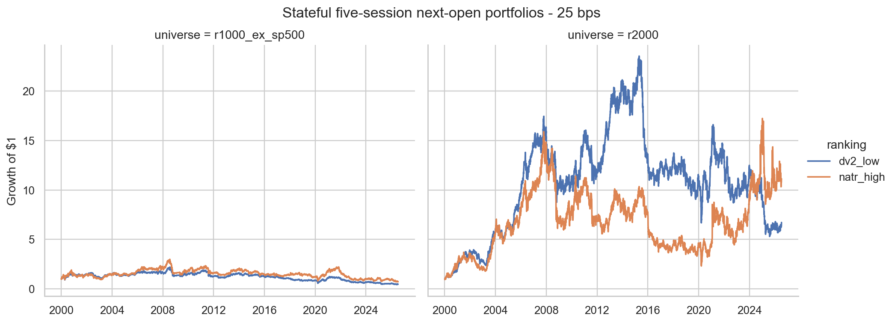
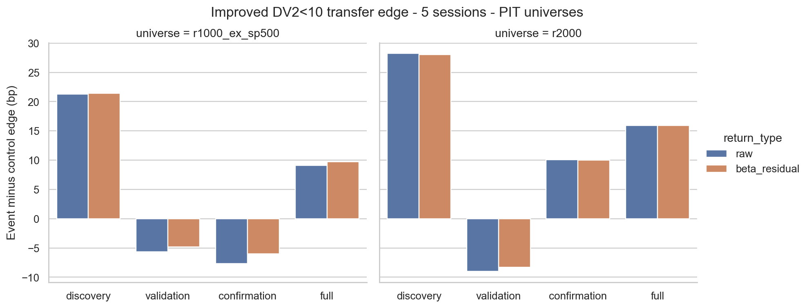

<!-- GENERATED FILE. EDIT THE CANONICAL KNOWLEDGE RECORD. -->

# DV2 + NATR Transfer and Residual-Alpha Validation

!!! warning "Research-only"
    This page summarizes saved research evidence. It does not authorize LIVE, allocation, or deployment.

## TL;DR

> **Verdict:** The frozen transfer failed 12 pass/kill gates. Stop treating DV2 + NATR as a strategy candidate; retain the result only as diagnostic mechanism evidence.

> **Status:** `diagnostic`

> **Disposition:** `not_recorded`

> **Replication:** `not_recorded`

## Research question

Falsify or retain, without retuning, the previously observed improved DV2 below 10 plus high-NATR14 rank by testing causal next-open raw and residual returns in two point-in-time Russell transfer universes and a binding ten-slot stateful portfolio.

## Exact setup

| Field | Value |
| --- | --- |
| Signal family | long_equity_mean_reversion |
| Universe | ["Russell 1000 ex same-date S&P 500", "Russell 2000"] |
| Decision | after Close_T |
| Fill | Open_T+1 entry; Open_T+6 fixed exit |
| Primary cost layer | central_research |
| Last reviewed | 2026-07-26T23:21:32.314112+03:00 |

## Timing and overnight attribution

```text
information available: after Close_T
primary executable fill: Open_T+1 entry; Open_T+6 fixed exit
```

If final `Close_T` data formed the signal, a hypothetical `Close_T` entry is diagnostic only unless a separate pre-close protocol was modeled. Comparing that diagnostic with `Open_(T+1)` and applying the compounded return identity shows whether the apparent edge occurred in the overnight gap. Missing attribution numbers mean **not tested**, not zero.


## Primary metrics

| Metric | Value |
| --- | ---: |
| Period | signal dates 2000-01-03 through 2026-07-10; stateful terminal path through 2026-07-24 |
| Universe | Russell 1000 ex same-date S&P 500 |
| Cost Layer | 10 bps round trip |
| Cagr | 5.86% |
| Annualized Volatility | 27.69% |
| Sharpe | 0.344 |
| Maximum Drawdown | -58.13% |
| Turnover | 9255.45% |

## Key findings

| Feature | Role | Direction | Status | Effect | Action |
| --- | --- | --- | --- | --- | --- |
| DV2 below 10 - r1000_ex_sp500 | entry signal | lower DV2 is more oversold | diagnostic | {"confirmation_beta_residual_edge_5d": -0.0006003448819842062} | Follow the pass/kill verdict; do not retune DV2 |
| NATR14 high rank - r1000_ex_sp500 | cross-sectional rank | higher first | diagnostic | {"confirmation_incremental_beta_residual_5d": -0.001727013123120874} | Forward-track unchanged only if every gate passes; otherwise archive |
| DV2 below 10 - r2000 | entry signal | lower DV2 is more oversold | diagnostic | {"confirmation_beta_residual_edge_5d": 0.0010039613882735444} | Follow the pass/kill verdict; do not retune DV2 |
| NATR14 high rank - r2000 | cross-sectional rank | higher first | diagnostic | {"confirmation_incremental_beta_residual_5d": -0.002766344932083761} | Forward-track unchanged only if every gate passes; otherwise archive |

## Visual evidence






## Limitations

- NATR14 was selected after viewing the S&P 500 study, so this is cross-universe transfer evidence rather than untouched discovery.
- Russell 1000 ex S&P 500 and Russell 2000 are disjoint from the original same-date S&P basket but share market history and may share names with each other over time.
- Installed Norgate classification access is current rather than point-in-time historical, so sector residualization is waived and cannot support a deployment claim.
- The database lacks CRSP share codes and exact historical market capitalization; universe membership is the vendor's point-in-time index definition.
- CAPITALSPECIAL supports continuous indicators and price returns but is not a cash-dividend total-return ledger.
- Flat 2, 10, and 25 bps costs are scenarios, not measured opening-auction fills.
- ADV63 is daily turnover rather than opening-auction volume; spread, queue, partial fills, and empirical impact remain unknown.
- Market-beta residual is a trailing one-factor estimate and does not prove sector-, style-, or multi-factor-neutral alpha.
- Endpoint labels overlap; only the stateful engine supports portfolio-level economic claims.
- Delistings or missing held prices use a conservative marked-value liquidation convention rather than observed auction recovery.
- The stateful holding period is frozen at five sessions; there is no exit-parameter search and no claim that five is optimal.
- The final research status cannot exceed forward_hypothesis in this run.

## Next gates

- Archive DV2 + NATR as a strategy candidate
- Do not add filters to rescue the failed transfer

## Sources

- `{"location": "C:\\\\Users\\\\User\\\\Downloads\\\\dv22.pdf", "read_complete": true, "role": "Literal DV2 formula, threshold, source strategy, NATR ranking direction, and source limitations", "sha256": "caa0d3830561b11b5d010e7589fb966a421207af5196ac3eab67f69c9433db66", "source_id": "quantitativo-different-indicator"}`
- `{"location": "C:\\\\Users\\\\User\\\\Downloads\\\\9. Diversification and Risk (1_2) _ Quantitativo.pdf", "read_complete": true, "role": "Improved DV2 eligibility, ten-slot portfolio translation, and next-open execution reference", "sha256": "c919a32d61ec275b4b8b76e8f1c416fe2cb37e0d118c8c10f0928356484e18e0", "source_id": "quantitativo-diversification-risk-part-1"}`
- `{"location": "C:\\\\Users\\\\User\\\\Downloads\\\\10. Diversification and Risk (2_2) _ Quantitativo.pdf", "read_complete": true, "role": "Diversification, residual attribution, and feature-combination methodology", "sha256": "f1b02e177f24d42a73226c06c49e801a491ec52b3d0a8d0865060f26e49007f8", "source_id": "quantitativo-diversification-risk-part-2"}`
- `{"location": "pakal-research/reports/dv2_signal_feature_research/research_spec_frozen.json", "read_complete": true, "role": "Previously viewed S&P 500 search accounting, timing, feature directions, and status cap", "sha256": "7ad232a36646377ca1050fd9e55c68cc6127920040de0e9014b9962ef45a0dde", "source_id": "prior-dv2-feature-specification"}`
- `{"location": "pakal-research/reports/dv2_signal_feature_research/REPORT.md", "read_complete": true, "role": "Post-hoc selection evidence identifying high NATR14 as the strongest coherent but unpromoted DV2 companion", "sha256": "f01ee4f0923a94c2b1a8bf7504b3da9651271426990f4d3e07f691f2329fa7f4", "source_id": "prior-dv2-feature-verdict"}`
- `{"location": "current Codex task in C:\\\\Users\\\\User\\\\Documents\\\\workspace\\\\pakal", "read_complete": true, "role": "Approval to run the frozen cross-universe, residual-alpha, stateful, cost, and capacity sequence", "source_id": "user-approved-transfer-plan"}`

## Canonical artifacts

| Artifact | Pakal path |
| --- | --- |
| Concise Report | `pakal-research/reports/dv2_natr_transfer_residual_validation/REPORT.md` |
| Full Report | `pakal-research/reports/dv2_natr_transfer_residual_validation/REPORT_FULL.md` |
| Notebook | `pakal-research/dv2_natr_transfer_residual_validation.ipynb` |
| Frozen Specification | `pakal-research/reports/dv2_natr_transfer_residual_validation/research_spec_frozen.json` |
| Manifest | `pakal-research/reports/dv2_natr_transfer_residual_validation/run_manifest.json` |
| Primary Source Code | `["pakal-research/dv2_natr_transfer_residual_validation.py"]` |
| Primary Tables | `["pakal-research/reports/dv2_natr_transfer_residual_validation/tables/promotion_gates.csv", "pakal-research/reports/dv2_natr_transfer_residual_validation/tables/stateful_summary.csv", "pakal-research/reports/dv2_natr_transfer_residual_validation/tables/baseline_edges.csv"]` |
| Primary Charts | `["pakal-research/reports/dv2_natr_transfer_residual_validation/charts/baseline_residual_edge.png", "pakal-research/reports/dv2_natr_transfer_residual_validation/charts/stateful_equity_25bps.png", "pakal-research/reports/dv2_natr_transfer_residual_validation/charts/natr_quintile_transfer.png"]` |
