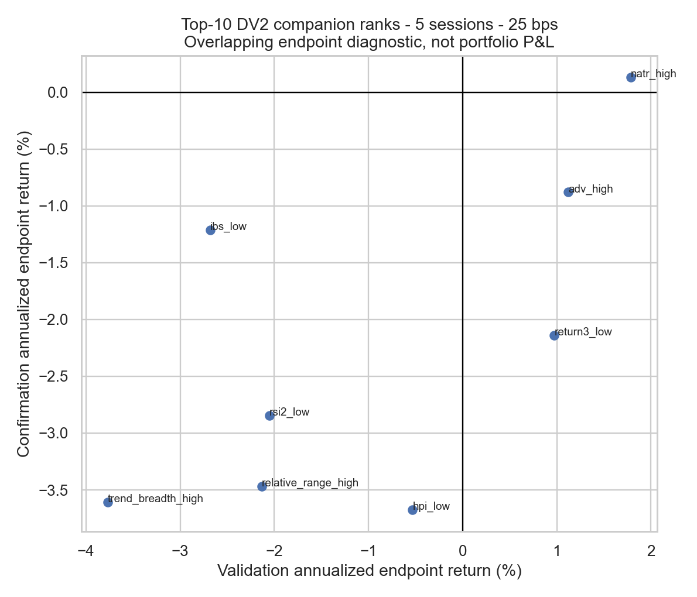
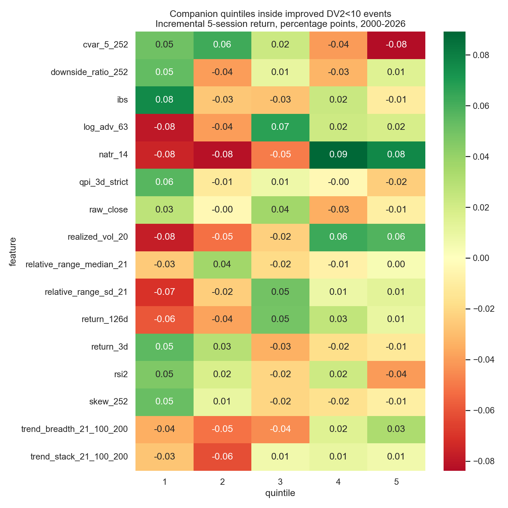

<!-- GENERATED FILE. EDIT THE CANONICAL KNOWLEDGE RECORD. -->

# DV2 Signal and Companion-Feature Research

!!! warning "Research-only"
    This page summarizes saved research evidence. It does not authorize LIVE, allocation, or deployment.

## TL;DR

> **Verdict:** DV2 status is diagnostic. Companion features passing every frozen gate: none. No live implementation is authorized.

> **Status:** `diagnostic`

> **Disposition:** `not_recorded`

> **Replication:** `not_recorded`

## Research question

Determine whether continuous and lower-tail DV2 contains stable causal next-open forward-return information, and identify which predeclared volatility, stretch, trend, tail-risk, liquidity, price, and market-regime features strengthen, weaken, or merely duplicate that information.

## Exact setup

| Field | Value |
| --- | --- |
| Signal family | long_equity_mean_reversion |
| Universe | ["S&P 500 Current & Past with point-in-time membership"] |
| Decision | after Close_T |
| Fill | Open_T+1 |
| Primary cost layer | central_research |
| Last reviewed | 2026-07-26T00:34:29.932434+03:00 |

## Timing and overnight attribution

```text
information available: after Close_T
primary executable fill: Open_T+1
```

If final `Close_T` data formed the signal, a hypothetical `Close_T` entry is diagnostic only unless a separate pre-close protocol was modeled. Comparing that diagnostic with `Open_(T+1)` and applying the compounded return identity shows whether the apparent edge occurred in the overnight gap. Missing attribution numbers mean **not tested**, not zero.


## Primary metrics

| Metric | Value |
| --- | ---: |
| Period | 2004-01-02 through 2026-07-24 downstream anchor |
| Universe | Point-in-time S&P 500 |
| Cost Layer | 10 bps round-trip downstream stateful anchor |
| Cagr | 14.89% |
| Annualized Volatility | 20.60% |
| Sharpe | 0.777 |
| Maximum Drawdown | -37.22% |
| Turnover | 9487.73% |

## Key findings

| Feature | Role | Direction | Status | Effect | Action |
| --- | --- | --- | --- | --- | --- |
| natr_14 | conditional rank/filter | favorable same-date quintile 5 | diagnostic | {"confirmation_incremental_5d": 0.0009385213733284, "full_incremental_5d": 0.0007643796737052, "validation_incremental_5d": 0.0008371088165436} | retain as diagnostic; do not add to a strategy |
| relative_range_sd_21 | diagnostic interaction | favorable same-date quintile 5 | diagnostic | {"confirmation_incremental_5d": -0.0003763409950346, "full_incremental_5d": 0.0001295393244466, "validation_incremental_5d": -0.0003366099727751} | retain as diagnostic; do not add to a strategy |
| relative_range_median_21 | conditional rank/filter | favorable same-date quintile 5 | diagnostic | {"confirmation_incremental_5d": -9.301834700041276e-05, "full_incremental_5d": 3.659545303951813e-05, "validation_incremental_5d": -9.070172946478673e-06} | retain as diagnostic; do not add to a strategy |
| ibs | conditional rank/filter | favorable same-date quintile 1 | diagnostic | {"confirmation_incremental_5d": 0.0010896127144056, "full_incremental_5d": 0.0007578160814086, "validation_incremental_5d": 0.0009117202100785} | retain as diagnostic; do not add to a strategy |
| rsi2 | conditional rank/filter | favorable same-date quintile 1 | diagnostic | {"confirmation_incremental_5d": -0.0002043499566822, "full_incremental_5d": 0.0004624631393868, "validation_incremental_5d": 0.000335816239466} | retain as diagnostic; do not add to a strategy |
| qpi_3d_strict | conditional rank/filter | favorable same-date quintile 1 | diagnostic | {"confirmation_incremental_5d": -0.000452137544313, "full_incremental_5d": 0.0005653771850971, "validation_incremental_5d": 0.0008665994407582} | retain as diagnostic; do not add to a strategy |
| return_3d | conditional rank/filter | favorable same-date quintile 1 | diagnostic | {"confirmation_incremental_5d": -0.0009670132860544, "full_incremental_5d": 0.0005494699479272, "validation_incremental_5d": 0.0014685789318819} | retain as diagnostic; do not add to a strategy |
| realized_vol_20 | diagnostic interaction | favorable same-date quintile 5 | diagnostic | {"confirmation_incremental_5d": 0.0014742357181356, "full_incremental_5d": 0.0005763348414028, "validation_incremental_5d": 0.000968213288178} | retain as diagnostic; do not add to a strategy |
| skew_252 | diagnostic interaction | favorable same-date quintile 5 | diagnostic | {"confirmation_incremental_5d": 0.000259399313334, "full_incremental_5d": -9.464994935644951e-05, "validation_incremental_5d": -0.0004231372670164} | retain as diagnostic; do not add to a strategy |
| downside_ratio_252 | diagnostic interaction | favorable same-date quintile 5 | diagnostic | {"confirmation_incremental_5d": -0.0007217757650615, "full_incremental_5d": 0.0001483846423546, "validation_incremental_5d": 0.0008341522728653} | retain as diagnostic; do not add to a strategy |
| cvar_5_252 | diagnostic interaction | favorable same-date quintile 5 | diagnostic | {"confirmation_incremental_5d": -0.0014801398432062, "full_incremental_5d": -0.0008383899616239, "validation_incremental_5d": -0.0007357202297157} | retain as diagnostic; do not add to a strategy |
| trend_breadth_21_100_200 | conditional rank/filter | favorable same-date quintile 5 | diagnostic | {"confirmation_incremental_5d": 0.0001723125206919, "full_incremental_5d": 0.0003289503681859, "validation_incremental_5d": 4.30453589220042e-05} | retain as diagnostic; do not add to a strategy |
| trend_stack_21_100_200 | diagnostic interaction | favorable same-date quintile 5 | diagnostic | {"confirmation_incremental_5d": 0.0006164485050924, "full_incremental_5d": 6.587611521526793e-05, "validation_incremental_5d": -0.000208470396025} | retain as diagnostic; do not add to a strategy |
| return_126d | diagnostic interaction | favorable same-date quintile 5 | diagnostic | {"confirmation_incremental_5d": 0.0011200065858213, "full_incremental_5d": 9.677198518715152e-05, "validation_incremental_5d": 6.21814143685336e-05} | retain as diagnostic; do not add to a strategy |
| log_adv_63 | conditional rank/filter | favorable same-date quintile 5 | diagnostic | {"confirmation_incremental_5d": 0.0005170744274729, "full_incremental_5d": 0.0001861122256915, "validation_incremental_5d": 0.0005161781277365} | retain as diagnostic; do not add to a strategy |
| raw_close | diagnostic interaction | favorable same-date quintile 5 | diagnostic | {"confirmation_incremental_5d": -0.0001280055526697, "full_incremental_5d": -9.410002508851264e-05, "validation_incremental_5d": -3.374193442249163e-05} | retain as diagnostic; do not add to a strategy |
| benchmark_market_regime | predeclared market-state conditioner | stronger DV2 edge when benchmark is below SMA200 | diagnostic | {"confirmation_market_down_edge_5d": 0.0002931127663644, "full_market_down_edge_5d": 0.0026169926323862, "full_market_up_edge_5d": 0.0002047139705285, "validation_market_down_edge_5d": 0.0035712473788344} | retain as a mechanism diagnostic; do not add a market-state filter without genuinely new confirmation |

## Visual evidence






## Limitations

- The source and prior Pakal DV2 strategy results were seen through 2026, so no current period is untouched out-of-sample evidence.
- The companion HPI/NATR feature family was previously researched, so overlapping findings are replication or diagnostics.
- The primary panel is S&P 500 only; exact historical market capitalization and independent basket validation are absent.
- CAPITALSPECIAL is used for indicator continuity but is not a cash-dividend total-return stock series.
- Fixed-horizon endpoint paths overlap and do not represent a stateful portfolio with binding slots or cash.
- Flat 2/10/25 bps costs are diagnostics, not calibrated opening-auction fills.
- Opening-auction spread, volume, queue, partial fills, and empirical impact remain unresolved.
- CVaR is computed only on improved DV2 below 10 event rows and is unavailable outside that conditional population.
- Feature quintiles and interaction cells are descriptive unless they pass the stated incremental and multiplicity gates.

## Next gates

- Freeze any surviving companion as one explicit stateful rule
- Collect genuinely new observations without changing definitions
- Measure opening-auction spread, volume, partial fills, and impact
- Validate the frozen feature in an independent PIT basket

## Sources

- `{"location": "C:\\\\Users\\\\User\\\\Downloads\\\\dv22.pdf", "read_complete": true, "role": "Literal DV2 formula, threshold, comparison indicators, source strategy, and limitations", "sha256": "caa0d3830561b11b5d010e7589fb966a421207af5196ac3eab67f69c9433db66", "source_id": "quantitativo-different-indicator"}`
- `{"location": "C:\\\\Users\\\\User\\\\Downloads\\\\9. Diversification and Risk (1_2) _ Quantitativo.pdf", "read_complete": true, "role": "Improved DV2 eligibility rule and causal stateful implementation reference", "sha256": "c919a32d61ec275b4b8b76e8f1c416fe2cb37e0d118c8c10f0928356484e18e0", "source_id": "quantitativo-diversification-risk-part-1"}`
- `{"location": "C:\\\\Users\\\\User\\\\Downloads\\\\10. Diversification and Risk (2_2) _ Quantitativo.pdf", "read_complete": true, "role": "Feature-combination and diversification methodology", "sha256": "f1b02e177f24d42a73226c06c49e801a491ec52b3d0a8d0865060f26e49007f8", "source_id": "quantitativo-diversification-risk-part-2"}`
- `{"location": "pakal-research/reports/qpi_feature_research/data/observations_sp500.parquet", "read_complete": true, "role": "Previously built feature-definition reference only; its QPI-event eligibility filter makes it unsuitable as the DV2 observation universe", "sha256": "c14aa8a7a5c5abe3cac419e3b5e243e8a1d4b5680a1a38463a5662e79a09f142", "source_id": "pakal-feature-definition-reference"}`
- `{"location": "pakal-research/reports/dv2_hpi_diversification_study/research_spec_frozen.json", "read_complete": true, "role": "Previously seen downstream stateful portfolio, cost, overlap, and capacity anchor; not feature-selection evidence", "sha256": "3cf5f09442fd12ee114d1c6757de96576d431e900fa21a2c72c4374258245579", "source_id": "prior-dv2-strategy-anchor"}`

## Canonical artifacts

| Artifact | Pakal path |
| --- | --- |
| Concise Report | `pakal-research/reports/dv2_signal_feature_research/REPORT.md` |
| Full Report | `pakal-research/reports/dv2_signal_feature_research/REPORT_FULL.md` |
| Notebook | `pakal-research/dv2_signal_feature_research.ipynb` |
| Frozen Specification | `pakal-research/reports/dv2_signal_feature_research/research_spec_frozen.json` |
| Manifest | `pakal-research/reports/dv2_signal_feature_research/run_manifest.json` |
| Primary Source Code | `["pakal-research/dv2_signal_feature_research.py", "pakal-research/dv2_hpi_diversification_study.py"]` |
| Primary Tables | `["pakal-research/reports/dv2_signal_feature_research/tables/feature_decisions.csv", "pakal-research/reports/dv2_signal_feature_research/tables/companion_quintiles.csv", "pakal-research/reports/dv2_signal_feature_research/tables/endpoint_rank_sweep.csv"]` |
| Primary Charts | `["pakal-research/reports/dv2_signal_feature_research/charts/dv2_decile_curves.png", "pakal-research/reports/dv2_signal_feature_research/charts/companion_quintile_incremental.png", "pakal-research/reports/dv2_signal_feature_research/charts/endpoint_validation_confirmation.png"]` |
