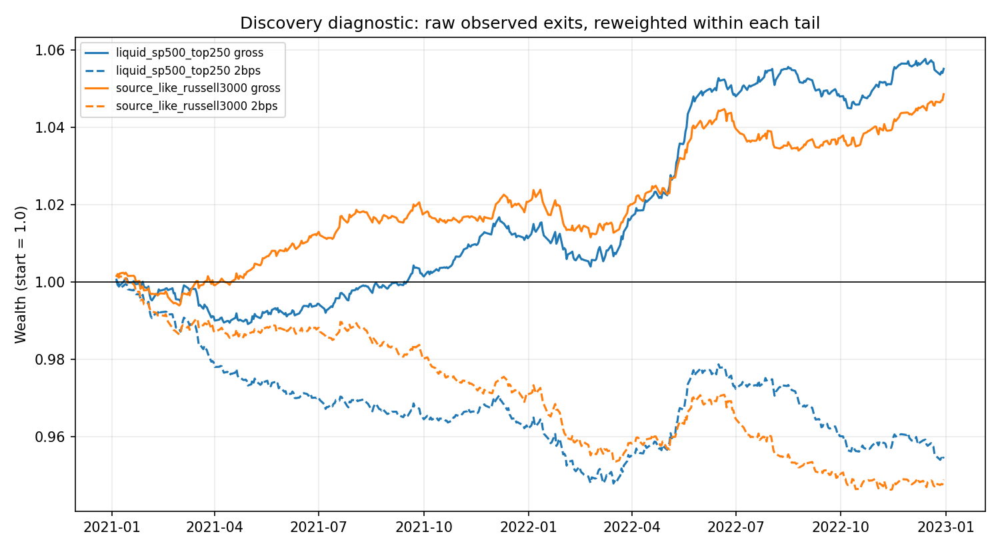
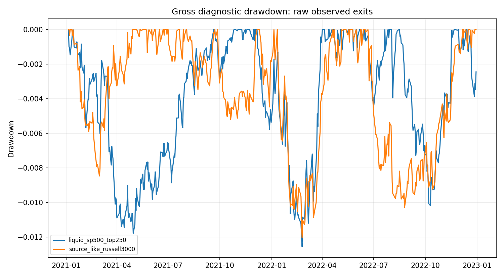

<!-- GENERATED FILE. EDIT THE CANONICAL KNOWLEDGE RECORD. -->

# End-of-Day Reversal on Later Point-in-Time US Equity Samples

!!! warning "Research-only"
    This page summarizes saved research evidence. It does not authorize LIVE, allocation, or deployment.

## TL;DR

> **Verdict:** DIRECTIONALLY_REPLICATED_BUT_ECONOMICALLY_REJECTED: later point-in-time samples preserve the predicted sign, but the edge is smaller than the paper, partly official-close concentrated, incomplete-tail diagnostic rather than executable, and negative at 2 bps round trip per position.

> **Status:** `diagnostic`

> **Disposition:** `rejected`

> **Replication:** `directionally_replicated`

## Research question

Test whether the paper-defined cross-sectional reversal from 15:30 to the close is directionally present in later point-in-time US equity proxies and whether raw fixed-tail economics survive explicit round-trip costs.

## Exact setup

| Field | Value |
| --- | --- |
| Signal family | cross_sectional_intraday_reversal |
| Universe | ["Point-in-time Russell 3000 members with raw exact-prior-session close at least USD 5 and at least 126 prior valid Norgate daily observations through T-1", "Each normal session's 250 highest lagged-ADV63 point-in-time S&P 500 members after the same raw USD 5 screen"] |
| Decision | ROD3 uses the completed 14:59 one-minute close in the liquid layer, or the completed 14:45-left-edge 15-minute bar close in the broad layer, divided by exact prior-session adjusted official close; cross-sectional winsorization and ranking are frozen before 15:30. |
| Fill | Diagnostic same-session entry at the open of the 15:30 bar and exit at 15:55 proxy, exact 15:59 in the liquid layer or 15:45-left-edge 15-minute close in the broad layer, and official condition-6 daily close as an auction proxy; no overnight exposure. |
| Primary cost layer | central_research |
| Last reviewed | 2026-08-29T10:56:04+00:00 |

## Timing and overnight attribution

```text
information available: ROD3 uses the completed 14:59 one-minute close in the liquid layer, or the completed 14:45-left-edge 15-minute bar close in the broad layer, divided by exact prior-session adjusted official close; cross-sectional winsorization and ranking are frozen before 15:30.
primary executable fill: Diagnostic same-session entry at the open of the 15:30 bar and exit at 15:55 proxy, exact 15:59 in the liquid layer or 15:45-left-edge 15-minute close in the broad layer, and official condition-6 daily close as an auction proxy; no overnight exposure.
```

If final `Close_T` data formed the signal, a hypothetical `Close_T` entry is diagnostic only unless a separate pre-close protocol was modeled. Comparing that diagnostic with `Open_(T+1)` and applying the compounded return identity shows whether the apparent edge occurred in the overnight gap. Missing attribution numbers mean **not tested**, not zero.


## Primary metrics

| Metric | Value |
| --- | ---: |
| Period | discovery 2021-01-04 through 2022-12-30; 500 result sessions from 2021-01-05 |
| Universe | Liquid point-in-time S&P 500 top-250 by lagged ADV63 |
| Cost Layer | central_research 10 bps round trip per selected stock position |
| Cagr | -20.15% |
| Annualized Volatility | 1.42% |
| Sharpe | -15.809 |
| Maximum Drawdown | -35.99% |
| Turnover | 200.00% |

## Four separate verdicts

| Question | Conclusion |
| --- | --- |
| Source Replication | Directionally replicated only; vendor, universe, weighting, dates, and terminal-price conventions differ from CRSP/TAQ. |
| Predictive Value | Diagnostic negative IC and positive bottom-minus-top spread, with weak-to-moderate inference and limited year stability. |
| Economic Value | Rejected: both layers turn negative at the frozen optimistic 2 bps round-trip-per-position tier and fail 10 bps by a wide margin. |
| Promotion | No promotion. Validation and confirmation remain unopened; no PAPER, LIVE, broker, scheduler, release, or allocation authority. |

## Key findings

| Feature | Role | Direction | Status | Effect | Action |
| --- | --- | --- | --- | --- | --- |
| ROD3 cross-sectional rank | source-literal signal | Lower ROD3 predicts higher 15:30-to-official-close relative return. | diagnostic | {"broad_hac_t": 1.9619435686865656, "broad_mean_ic": -0.008790746625003672, "broad_winsorized_spread_bps": 1.5518171262481013, "liquid_hac_t": 2.356645712821128, "liquid_mean_ic": -0.02883812283494249, "liquid_winsorized_spread_bps": 2.0703058351199446} | Retain as a microstructure diagnostic only; do not trade or tune on the seen discovery sample. |
| Official-close endpoint increment | execution and auction diagnostic | The spread is larger at the official close than at the last continuous-trading proxy. | diagnostic | {"broad_hac_t": 7.271403145379424, "broad_increment_bps": 0.6793367862474543, "liquid_hac_t": 7.896587508887837, "liquid_increment_bps": 0.3774723121157454} | Require causal MOC protocol, auction data, quotes, and broker fills before treating the official close as executable. |

## Visual evidence






## Limitations

- Alpaca SIP bars and condition-6 daily close are not executable broker quotes or verified auction fills.
- The source-like layer lacks CRSP share codes and the paper's NYSE market-cap breakpoint and uses Norgate daily history as a causal proxy for 126 TAQ days.
- The broad 15-minute terminal is the close of the 15:45-left-edge bar and is not an exact 15:59 print.
- Selected-tail exits were complete on only 61.2% of liquid days and 1.2% of broad days; raw P&L reweights observed exits and is diagnostic only.
- Borrow availability, locate cost, recalls, short-sale restrictions, taxes, queue position, partial fills, and market impact are unavailable.
- Only 2021-2022 discovery was viewed; validation and confirmation remain intentionally unopened.

## Next gates

- Only if better data are available, freeze a new TAQ/quote/auction protocol with explicit missing-exit and MOC fill rules before viewing new dates.
- Collect point-in-time borrow availability, fees, recalls, auction participation, spreads, and broker fills for a prospective implementation study.
- Do not tune buckets, entry, exit, universe, or weighting on the already-seen 2021-2022 discovery sample.

## Sources

- `{"path": "C:/Users/User/Downloads/ssrn-5039009.pdf", "read_complete": true, "role": "Literal paper rules, mechanisms, and reported results", "sha256": "68DEF611EFB6D416E237134F85E0DE21D90041A654E500A3E0488E66156B64CD", "source_id": "ssrn_5039009", "title": "End-of-Day Reversal", "unresolved_gap": "The paper does not fully specify tie handling, Newey-West lag, transaction costs, executable fills, borrow, or official-close equivalence."}`
- `{"path": "https://docs.alpaca.markets/us/reference/stockbars", "read_complete": true, "role": "Adjusted SIP intraday endpoints and daily official-close proxy", "source_id": "alpaca_sip_historical_bars", "title": "Alpaca Historical Stock Bars", "unresolved_gap": "Public consolidated bars are not quotes, auction depth, or broker fills."}`
- `{"path": "local Norgate database", "read_complete": true, "role": "Point-in-time membership, raw exact-prior close, and lagged ADV63", "source_id": "norgate_local_us_equities", "title": "Local Norgate Data US Equities", "unresolved_gap": "No CRSP share codes or point-in-time market capitalization."}`

## Canonical artifacts

| Artifact | Pakal path |
| --- | --- |
| Concise Report | `pakal-research/reports/end_of_day_reversal_signal_study/REPORT.md` |
| Full Report | `pakal-research/reports/end_of_day_reversal_signal_study/REPORT_FULL.md` |
| Notebook | `pakal-research/end_of_day_reversal_signal_study.ipynb` |
| Frozen Specification | `pakal-research/reports/end_of_day_reversal_signal_study/research_spec_frozen.json` |
| Manifest | `pakal-research/reports/end_of_day_reversal_signal_study/run_manifest.json` |
| Primary Source Code | `["pakal-research/end_of_day_reversal_signal_study.py", "pakal-research/end_of_day_reversal_broad_layer.py", "pakal-research/end_of_day_reversal_analysis.py"]` |
| Primary Tables | `["pakal-research/reports/end_of_day_reversal_signal_study/tables/baseline_summary.csv", "pakal-research/reports/end_of_day_reversal_signal_study/tables/cost_sensitivity.csv", "pakal-research/reports/end_of_day_reversal_signal_study/tables/tail_coverage_audit.csv", "pakal-research/reports/end_of_day_reversal_signal_study/tables/market_relationship.csv"]` |
| Primary Charts | `["pakal-research/reports/end_of_day_reversal_signal_study/charts/equity_cost_comparison.png", "pakal-research/reports/end_of_day_reversal_signal_study/charts/gross_drawdown.png", "pakal-research/reports/end_of_day_reversal_signal_study/charts/quintile_monotonicity.png", "pakal-research/reports/end_of_day_reversal_signal_study/charts/rolling_market_correlation.png"]` |
| Research State | `pakal-research/reports/end_of_day_reversal_signal_study/research_state.json` |
| Hypothesis Registry | `pakal-research/reports/end_of_day_reversal_signal_study/hypothesis_registry.json` |
| Experiment Ledger | `pakal-research/reports/end_of_day_reversal_signal_study/experiment_ledger.jsonl` |
| Decision Log | `pakal-research/reports/end_of_day_reversal_signal_study/decision_log.jsonl` |
| Source Rule Map | `pakal-research/reports/end_of_day_reversal_signal_study/SOURCE_RULE_MAP.md` |
