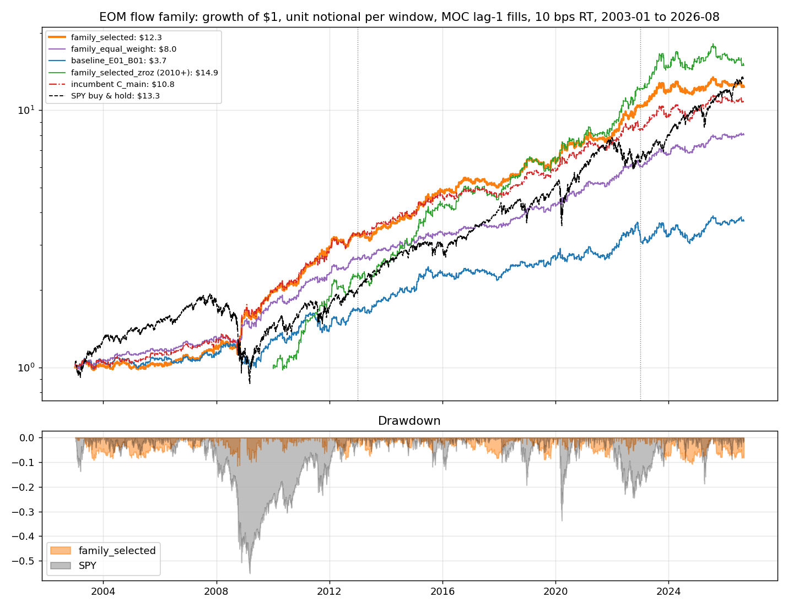
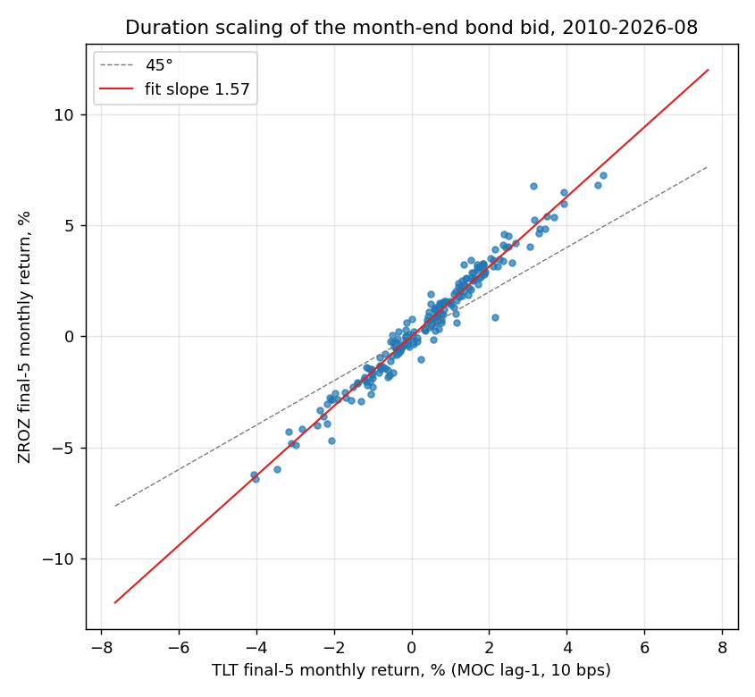

<!-- GENERATED FILE. EDIT THE CANONICAL KNOWLEDGE RECORD. -->

# EOM Flow Family: every turn-of-month sleeve from Valuelytica, Beyond Passive Investing, Quantitativo/Harvey and Robot James on one bench

!!! warning "Research-only"
    This page summarizes saved research evidence. It does not authorize LIVE, allocation, or deployment.

## TL;DR

> **Verdict:** RESEARCH CANDIDATE. One robust core: the end-of-month 'hold what the rebalancers must buy' trade (TLT by default, SPY when bonds led the month) in five formulations from three authors, Sharpe 0.8-1.0 at 10 bps MOC, q <= 0.04 vs unconditional TLT in 2003-2022, four of five holding in 2023-2026. The beginning-of-month tier is weak and unstable (short TLT failed 2023-2026; only long-SPY-if-SPY-led held). ZROZ/EDV are TLT x 1.5 (corr 0.98, no Sharpe gain), Bitcoin and the mid-month short are rejected. The frozen family (E07 + B02) earned 1.17/1.28/0.54/1.12 and does not beat C_main out of sample; the predeclared equal-weight basket earned 1.21/1.16/1.10/1.17 with no negative year. Keep C_main as the executed paper line; shadow-log the family lines.

> **Status:** `research_candidate`

> **Disposition:** `candidate`

> **Replication:** `directionally_replicated`

## Research question

Rebuild all 25 turn-of-month sleeves claimed across nine articles by three independent authors (plus Robot James) on one data set, one MOC-lag1 timing convention, one cost ladder and one chronological split; measure standalone and marginal value; test duration substitution (ZROZ/EDV) and Bitcoin; assemble a frozen family portfolio and compare it with the incumbent C_main.

## Exact setup

| Field | Value |
| --- | --- |
| Signal family | calendar_cross_asset_rebalance_flow |
| Universe | ["SPY/TLT with IEF as the pressure proxy; VTI loaded but not used in sleeves; ZROZ, EDV, GBTC, BITO where available"] |
| Decision | Calendar known in advance; pressure at the dtme=7 close; first-half SPY-minus-TLT at session min(15, N-6); BOM sleeves use the previous month's session-15 spread, pressure and bucket |
| Fill | Primary MOC at dtme=6, dtme=1 and session 5 with signals lagged one session (executable_moc_lag1); conservative Open_d to Open_(d+1); diagnostic Close-to-Close with same-close signals |
| Primary cost layer | central_research |
| Last reviewed | 2026-09-12T14:30:00+03:00 |

## Timing and overnight attribution

```text
information available: Calendar known in advance; pressure at the dtme=7 close; first-half SPY-minus-TLT at session min(15, N-6); BOM sleeves use the previous month's session-15 spread, pressure and bucket
primary executable fill: Primary MOC at dtme=6, dtme=1 and session 5 with signals lagged one session (executable_moc_lag1); conservative Open_d to Open_(d+1); diagnostic Close-to-Close with same-close signals
```

If final `Close_T` data formed the signal, a hypothetical `Close_T` entry is diagnostic only unless a separate pre-close protocol was modeled. Comparing that diagnostic with `Open_(T+1)` and applying the compounded return identity shows whether the apparent edge occurred in the overnight gap. Missing attribution numbers mean **not tested**, not zero.

| Attribution field | Value |
| --- | --- |
| Status | tested |
| Diagnostic Path | paper_close_close, lag-0 decisions |
| Executable Path | executable_moc_lag1 and executable_open_open |
| Method | all 25 sleeves evaluated under all three engines; family portfolios under all three engines and four cost tiers |
| Headline Result | family_selected full Sharpe 1.32 paper 0 bps / 1.12 MOC lag-1 10 bps / 0.83 next-open 10 bps; equal weight 1.43 / 1.17 / 0.94 |
| Metrics | {"family_equal_weight_moc_lag1_10bps": 1.17, "family_equal_weight_open_open_10bps": 0.94, "family_selected_moc_lag1_10bps": 1.12, "family_selected_open_open_10bps": 0.83} |
| Unavailable Reason | N/A |
| Artifact | tables/family_portfolio_metrics.csv |

## Primary metrics

| Metric | Value |
| --- | ---: |
| Period | full 2003-01-01 to 2026-08-31 (discovery 2003-2012, validation 2013-2022, confirmation 2023-2026-08) |
| Universe | SPY/TLT unit notional per window, family_selected = E07 + B02, executable_moc_lag1 |
| Cost Layer | central_research |
| Cagr | 11.40% |
| Annualized Volatility | 10.00% |
| Sharpe | 1.120 |
| Maximum Drawdown | -12.00% |
| Turnover | 3900.00% |

## Four separate verdicts

| Question | Conclusion |
| --- | --- |
| Source Replication | directionally replicated: every author's sleeve is positive gross; claimed Sharpe ratios are 0.2-0.5 higher than the MOC-lag1 10 bps figures because they are gross, same-close and single-period |
| Predictive Value | confirmed for the conditioned EOM cluster (E07/E08/E10/E11/E05); weak for the BOM window; none for duration substitution beyond leverage; rejected for Bitcoin and mid-month short |
| Economic Value | positive at 10 and 25 bps with MOC fills for the EOM cluster and both family portfolios; roughly halved at next-open fills |
| Promotion | shadow_log_only; incumbent C_main remains the executed paper line |

## Key findings

| Feature | Role | Direction | Status | Effect | Action |
| --- | --- | --- | --- | --- | --- |
| EOM conditioned cluster: E07 bucket / E08 sign / E10 BPI capped / E11 first-half laggard / E05 laggard sessions 16-EOM | signal | positive | research_candidate | Sharpe 0.80-0.96 full; +16 to +36 bps/month over unconditional TLT in 2003-2022 | core of any deployment; already inside C_main |
| E01 unconditional TLT final 5 (and E02 sessions 16-EOM, E03 ZROZ, E04 EDV) | signal | positive | diagnostic | Sharpe 0.58-0.60 full, positive in every period | baseline only; conditioning dominates |
| BOM short TLT (B01) and conditioned variants (B02, B03, B08, B09) | signal | positive in dev, flat to negative in 2023-2026 | diagnostic | Sharpe 0.29-0.60 full; -0.07 to +0.42 in 2023-2026 | hold only inside an equal-weight basket or drop |
| B07 long SPY first 5 if SPY led last month's first 15 (Valuelytica P2) | signal | positive | diagnostic | Sharpe 0.63/0.52/0.77/0.60; +35 bps/month in 2023-2026 | best BOM sleeve; the SPY-led condition adds nothing over unconditional SPY in dev (q 0.51) |
| ZROZ / EDV in place of TLT | sizing | scales | rejected | beta 1.57 / 1.45 on TLT, correlation 0.98-0.99, Sharpe 0.84 vs 0.87 | use TLT plus margin if more exposure is wanted |
| Bitcoin final-5 (GBTC 2015+, BITO 2021+) | signal | mixed | rejected | GBTC final-5 Sharpe 0.35 (DD -76%), BITO -0.12; GBTC strongest days are sessions 1-5 | reject |
| M01 short TLT sessions 1-15 (Valuelytica long-short) | signal | none | rejected | Sharpe 0.00 full, -0.38 discovery | reject |

## Visual evidence






## Limitations

- All authors saw 2003-2022 and most saw 2023-2025; the confirmation period is untouched only by this study.
- The MOC lag-1 engine assumes closing-auction fills at the official close; real fills were not measured.
- The equal-weight basket's clean confirmation is a predeclared alternative, not the selected rule; it must not be promoted on that basis.
- Borrow on the short legs, financing, taxes and impact are excluded.
- GBTC premium/discount before 2024 contaminates the Bitcoin diagnostic; BTCE.DE was not available.
- A first draft measured the pressure at dtme=8; the focused test caught it and the run was corrected before reporting.

## Next gates

- Shadow-log family_selected, family_equal_weight and E08 alongside the executed C_main paper line for 6-12 months using eom_flow_family_signal.py.
- Measure MOC fills versus official closes for SPY and TLT at trial size.
- Predeclare the EOM-only simplification (E07 or E08 alone) as the fallback if the BOM tier keeps failing.
- Re-test the BOM equity leg (B07) against unconditional SPY first-5 after the trial period.

## Sources

- `Valuelytica: EOM Stock-Bond Reversal Strategy (2025-11-14), Continuation-Extension (2025-11-21), EOMCS Extension (2025-11-28), End-of-month effect in Bitcoin (2025-12-27), The Hidden Calendar Pattern in Bonds (2026-03-15), End of month effect in Bonds on Steroids (2026-04-25), EOM Effect in Zero Coupon Bonds (2026-08-01)`
- `Beyond Passive Investing: Two Calendar Effects at the Month Boundary (2026-04-05)`
- `Quantitativo: The Unintended Consequences of Rebalancing (2025-07-14), replicating Harvey, Mazzoleni, Melone`
- `Robot James: three dead simple edges in macro etfs (2026-04-13); a simple, crazy-effective, calendar effect trade in macro etfs (2026-09-10)`

## Canonical artifacts

| Artifact | Pakal path |
| --- | --- |
| Concise Report | `pakal-research/reports/eom_flow_family_study/REPORT.md` |
| Full Report | `pakal-research/reports/eom_flow_family_study/REPORT_FULL.md` |
| Notebook | `pakal-research/reports/eom_flow_family_study/eom_flow_family_study.ipynb` |
| Frozen Specification | `pakal-research/reports/eom_flow_family_study/research_spec_frozen.json` |
| Manifest | `pakal-research/reports/eom_flow_family_study/run_manifest.json` |
| Primary Source Code | `["pakal-research/eom_flow_family_study.py", "pakal-research/eom_flow_family_signal.py", "tests/test_eom_flow_family_study.py"]` |
| Primary Tables | `["pakal-research/reports/eom_flow_family_study/tables/sleeve_standalone_metrics.csv", "pakal-research/reports/eom_flow_family_study/tables/head_to_head_marginal_value.csv", "pakal-research/reports/eom_flow_family_study/tables/family_portfolio_metrics.csv", "pakal-research/reports/eom_flow_family_study/tables/family_gates.csv", "pakal-research/reports/eom_flow_family_study/tables/duration_scaling.csv"]` |
| Primary Charts | `["pakal-research/reports/eom_flow_family_study/charts/sleeve_sharpe_heatmap.png", "pakal-research/reports/eom_flow_family_study/charts/head_to_head_marginal_value.png", "pakal-research/reports/eom_flow_family_study/charts/family_equity_vs_incumbent_and_spy.png", "pakal-research/reports/eom_flow_family_study/charts/duration_scaling_zroz_vs_tlt.png"]` |
| Research State | `pakal-research/reports/eom_flow_family_study/research_state.json` |
| Hypothesis Registry | `pakal-research/reports/eom_flow_family_study/hypothesis_registry.json` |
| Experiment Ledger | `pakal-research/reports/eom_flow_family_study/experiment_ledger.jsonl` |
| Decision Log | `pakal-research/reports/eom_flow_family_study/decision_log.jsonl` |
| Source Rule Map | `pakal-research/reports/eom_flow_family_study/SOURCE_RULE_MAP.md` |
