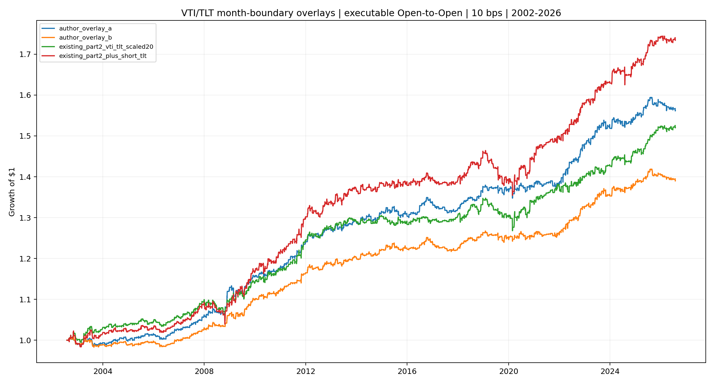
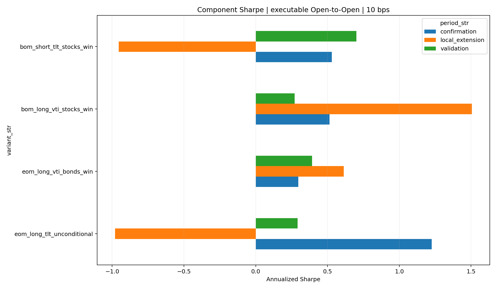

<!-- GENERATED FILE. EDIT THE CANONICAL KNOWLEDGE RECORD. -->

# EOM Month-Boundary Quant Extension

!!! warning "Research-only"
    This page summarizes saved research evidence. It does not authorize LIVE, allocation, or deployment.

## TL;DR

> **Verdict:** The author's gross historical overlay reproduces closely, but the conditioned short-TLT increment is not stable and reverses after June 2025. Do not add the overlay or short sleeve to Part 2.

> **Status:** `diagnostic`

> **Disposition:** `not_recorded`

> **Replication:** `not_recorded`

## Research question

Test whether the new VTI/TLT three-sleeve month-boundary overlay and conditioned short-TLT component improve the existing EOM Part 2 research control under executable timing and explicit costs.

## Exact setup

| Field | Value |
| --- | --- |
| Signal family | calendar_mean_reversion |
| Universe | ["Fixed VTI/TLT pair on strict common Norgate sessions"] |
| Decision | First-15 state after session-15 Close |
| Fill | Primary evidence at next eligible Open; paper Close-to-Close results are diagnostic |
| Primary cost layer | central_research |
| Last reviewed | 2026-08-08T16:30:00+03:00 |

## Timing and overnight attribution

```text
information available: First-15 state after session-15 Close
primary executable fill: Primary evidence at next eligible Open; paper Close-to-Close results are diagnostic
```

If final `Close_T` data formed the signal, a hypothetical `Close_T` entry is diagnostic only unless a separate pre-close protocol was modeled. Comparing that diagnostic with `Open_(T+1)` and applying the compounded return identity shows whether the apparent edge occurred in the overnight gap. Missing attribution numbers mean **not tested**, not zero.


## Primary metrics

| Metric | Value |
| --- | ---: |
| Period | 2002-08-01 through 2025-06-30 |
| Universe | VTI/TLT |
| Cost Layer | 10 bps round trip |
| Cagr | 2.02% |
| Annualized Volatility | 1.89% |
| Sharpe | 1.066 |
| Maximum Drawdown | -2.80% |
| Turnover | 959.04% |

## Key findings

| Feature | Role | Direction | Status | Effect | Action |
| --- | --- | --- | --- | --- | --- |
| Unconditional final-five TLT | entry signal | positive through June 2025, negative in July 2025-July 2026 | diagnostic | Executable confirmation mean about +76 bps per month, local extension about -27 bps | retain as a structural lead only |
| Stocks-win conditioned first-five short TLT | entry signal | positive historical increment, sharply negative post-paper increment | rejected | +28 bps validation, +22 bps confirmation, -58 bps per signal month in local extension | do not add to Part 2 |
| Capped 10% long-VTI plus 10% short-TLT BOM pair | ensemble construction | improves validation and source confirmation Sharpe, weakens local extension | forward_hypothesis | 10 bps Sharpe 0.62 validation, 1.37 confirmation, 0.79 extension versus control 0.46, 1.22, 1.40 | freeze only for future observation |

## Visual evidence






## Limitations

- The source period through June 2025 is in-sample to the author.
- The post-paper extension contains only 13 months.
- MOC submission and auction basis are unspecified.
- Borrow and financing are excluded for standalone short TLT.
- Adjusted Open and Close are not realized fills.

## Next gates

- Prospectively track only the existing Part 2 control and capped BOM pair on new months.
- Measure actual opening or MOC fills and TLT short implementation costs before any promotion.

## Sources

- `C:/Users/User/Downloads/המשך של EOM.pdf`
- `pakal-research/reports/eom_stock_bond_attribution_study`
- `pakal-research/reports/eom_part2_improvement_sweep`

## Canonical artifacts

| Artifact | Pakal path |
| --- | --- |
| Concise Report | `pakal-research/reports/eom_month_boundary_quant_extension/REPORT.md` |
| Full Report | `pakal-research/reports/eom_month_boundary_quant_extension/REPORT_FULL.md` |
| Notebook | `pakal-research/reports/eom_month_boundary_quant_extension/eom_month_boundary_quant_extension.ipynb` |
| Frozen Specification | `pakal-research/reports/eom_month_boundary_quant_extension/research_spec_frozen.json` |
| Manifest | `pakal-research/reports/eom_month_boundary_quant_extension/run_manifest.json` |
| Primary Source Code | `["pakal-research/eom_month_boundary_quant_extension.py"]` |
| Primary Tables | `["pakal-research/reports/eom_month_boundary_quant_extension/tables/performance_metrics.csv", "pakal-research/reports/eom_month_boundary_quant_extension/tables/paired_monthly_inference.csv", "pakal-research/reports/eom_month_boundary_quant_extension/tables/monthly_event_returns.csv"]` |
| Primary Charts | `["pakal-research/reports/eom_month_boundary_quant_extension/charts/primary_equity_curves.png", "pakal-research/reports/eom_month_boundary_quant_extension/charts/component_sharpe_by_period.png", "pakal-research/reports/eom_month_boundary_quant_extension/charts/paper_vs_executable_timing.png"]` |
