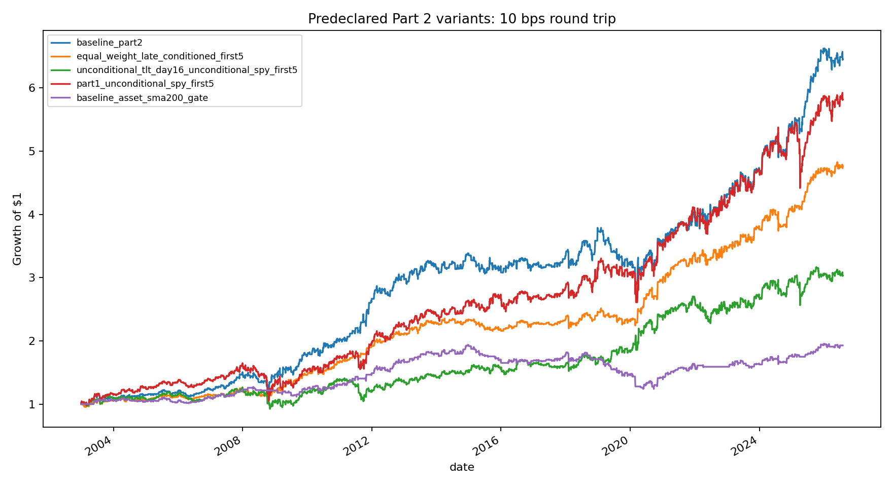
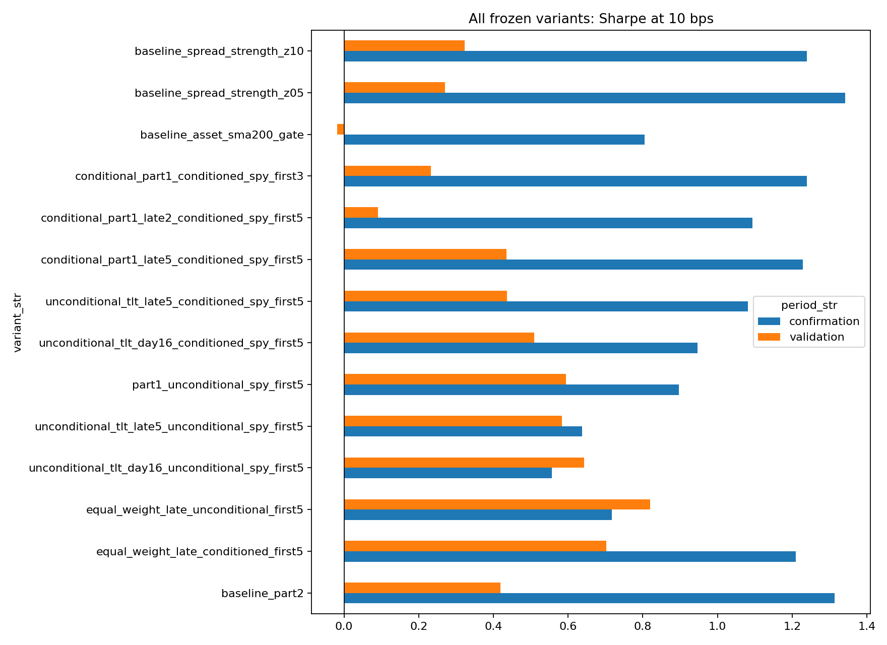

<!-- GENERATED FILE. EDIT THE CANONICAL KNOWLEDGE RECORD. -->

# EOM Part 2 Controlled Improvement Sweep

!!! warning "Research-only"
    This page summarizes saved research evidence. It does not authorize LIVE, allocation, or deployment.

## TL;DR

> **Verdict:** NO CHALLENGER PASSED ALL FROZEN GATES. Retain baseline_part2 unchanged as the research control; track the equal-weight late-month conditioned-SPY row only as a defensive comparator.

> **Status:** `diagnostic`

> **Disposition:** `not_recorded`

> **Replication:** `not_recorded`

## Research question

Determine whether any of 13 frozen mechanism-based challengers improves or simplifies the Part 2 SPY/TLT bundle in both validation and confirmation after identical next-open timing, costs, drawdown, turnover, and multiplicity gates.

## Exact setup

| Field | Value |
| --- | --- |
| Signal family | calendar_cross_asset_reversal |
| Universe | ["Fixed SPY/TLT pair on strict common observed sessions"] |
| Decision | First-15 state is known after session-15 Close. SMA200 at Open_T uses Close_T-1 and earlier data. Spread-strength state at session-16 Open uses volatility through session-15 Close. |
| Fill | Norgate TOTALRETURN adjusted Open_T to Open_T+1 proxy; no same-close fill |
| Primary cost layer | central_research |
| Last reviewed | 2026-08-07T09:45:00+03:00 |

## Timing and overnight attribution

```text
information available: First-15 state is known after session-15 Close. SMA200 at Open_T uses Close_T-1 and earlier data. Spread-strength state at session-16 Open uses volatility through session-15 Close.
primary executable fill: Norgate TOTALRETURN adjusted Open_T to Open_T+1 proxy; no same-close fill
```

If final `Close_T` data formed the signal, a hypothetical `Close_T` entry is diagnostic only unless a separate pre-close protocol was modeled. Comparing that diagnostic with `Open_(T+1)` and applying the compounded return identity shows whether the apparent edge occurred in the overnight gap. Missing attribution numbers mean **not tested**, not zero.


## Primary metrics

| Metric | Value |
| --- | ---: |
| Period | 2013-01-01 through 2022-12-31 validation |
| Universe | Fixed SPY/TLT pair |
| Cost Layer | central_research_10_bps_round_trip |
| Cagr | 3.82% |
| Annualized Volatility | 10.19% |
| Sharpe | 0.419 |
| Maximum Drawdown | -25.69% |
| Turnover | 3980.00% |

## Key findings

| Feature | Role | Direction | Status | Effect | Action |
| --- | --- | --- | --- | --- | --- |
| Equal-weight SPY/TLT late-month exposure plus conditioned SPY first-five | defensive simplification comparator | Improved validation Sharpe and drawdown but reduced confirmation CAGR and Sharpe | diagnostic_defensive_comparator | {"annual_turnover": 31.9, "confirmation_CAGR_delta": -0.0264, "confirmation_Sharpe": 1.209, "confirmation_Sharpe_delta": -0.104, "validation_Sharpe": 0.703, "validation_Sharpe_delta": 0.283, "validation_max_drawdown": -0.108} | Track prospectively as a defensive comparator; do not replace the baseline |
| Remove the prior-SPY-winner condition and own SPY unconditionally for the first five sessions | Part 2 condition-removal test | Improved validation and weakened confirmation | rejected | {"confirmation_Sharpe_delta": -0.417, "confirmation_mean_monthly_difference": -0.00144, "validation_Sharpe_delta": 0.175, "validation_bh_q_value": 0.279, "validation_mean_monthly_difference": 0.00214, "validation_nominal_p_value": 0.0235} | Reject; retain the original Part 2 condition |
| Exact-last-five and final-two Part 1 timing | late-month timing sensitivity | Narrower windows did not improve the bundle | rejected | {"last2_confirmation_Sharpe": 1.094, "last2_validation_Sharpe": 0.091, "last5_confirmation_Sharpe": 1.228, "last5_validation_Sharpe": 0.434} | Do not narrow the baseline window |
| Asset-specific prior-close SMA200 gate | defensive trend overlay | Reduced exposure but destroyed validation performance | rejected | {"confirmation_Sharpe": 0.804, "validation_CAGR": -0.0042, "validation_Sharpe": -0.018, "validation_max_drawdown": -0.36} | Reject and do not reopen this overlay on the same sample |
| Normalized first-15 spread-strength gates | signal-strength eligibility and turnover control | Lower turnover and drawdown but inconsistent return improvement | forward_hypothesis_only | {"z05_confirmation_Sharpe": 1.341, "z05_turnover": 25.2, "z05_validation_Sharpe": 0.27, "z10_confirmation_Sharpe": 1.239, "z10_turnover": 12.2, "z10_validation_Sharpe": 0.323} | Do not replace baseline; if revisited, freeze one threshold prospectively |

## Visual evidence






## Limitations

- The baseline and all source-period evidence were known before the sweep.
- Confirmation contains only 43 months and is not untouched local evidence.
- Adjusted Opens are execution proxies, not measured auction fills.
- Cost tiers exclude taxes and empirical market impact.
- The fixed ETF pair does not establish futures or cross-market portability.

## Next gates

- Freeze baseline_part2 and equal_weight_late_conditioned_first5 as the only two prospective tracker rows.
- Record actual or paper opening fills, spreads, and partial fills without changing rules.
- Do not reopen the timing, SMA200, or spread-strength grid on the same history.

## Sources

- `pakal-research/reports/eom_stock_bond_attribution_study`
- `pakal-research/eom_part2_improvement_sweep_spec_frozen.json`
- `frozen Norgate SPY/TLT daily artifact`

## Canonical artifacts

| Artifact | Pakal path |
| --- | --- |
| Concise Report | `pakal-research/reports/eom_part2_improvement_sweep/REPORT.md` |
| Full Report | `pakal-research/reports/eom_part2_improvement_sweep/REPORT_FULL.md` |
| Notebook | `pakal-research/reports/eom_part2_improvement_sweep/eom_part2_improvement_sweep.ipynb` |
| Frozen Specification | `pakal-research/reports/eom_part2_improvement_sweep/research_spec_frozen.json` |
| Manifest | `pakal-research/reports/eom_part2_improvement_sweep/run_manifest.json` |
| Primary Source Code | `["pakal-research/eom_part2_improvement_sweep.py"]` |
| Primary Tables | `["pakal-research/reports/eom_part2_improvement_sweep/tables/performance_metrics.csv", "pakal-research/reports/eom_part2_improvement_sweep/tables/paired_monthly_inference.csv", "pakal-research/reports/eom_part2_improvement_sweep/tables/promotion_gates.csv"]` |
| Primary Charts | `["pakal-research/reports/eom_part2_improvement_sweep/charts/predeclared_equity_curves.png", "pakal-research/reports/eom_part2_improvement_sweep/charts/variant_sharpe_validation_confirmation.png", "pakal-research/reports/eom_part2_improvement_sweep/charts/sharpe_delta_vs_baseline.png"]` |
