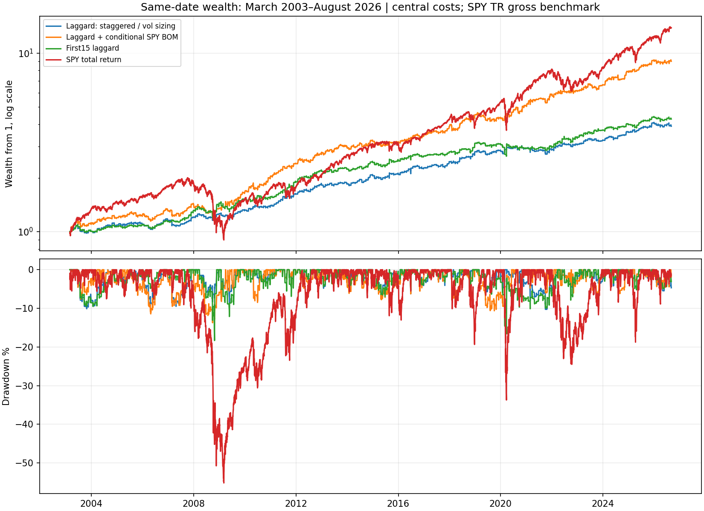
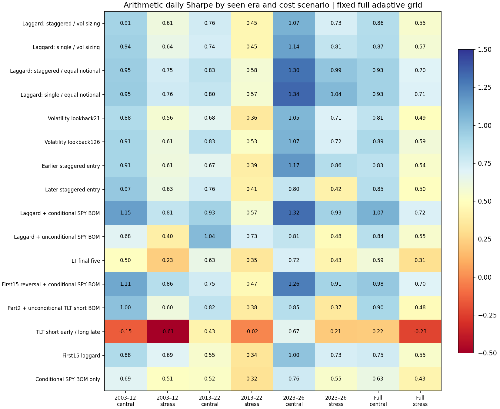

<!-- GENERATED FILE. EDIT THE CANONICAL KNOWLEDGE RECORD. -->

# Month-boundary rebalancing: faithful replication and small-account economics

!!! warning "Research-only"
    This page summarizes saved research evidence. It does not authorize LIVE, allocation, or deployment.

## TL;DR

> **Verdict:** Concretum source closely reproduced; causal costed long-only core survives descriptive robustness. Conditional BOM addition remains forward hypothesis. No broker readiness proved.

> **Status:** `forward_hypothesis`

> **Disposition:** `promising_component`

> **Replication:** `directionally_replicated`

## Research question

Do source-specific rebalancing constructions survive fixed-unit accounting and realistic costs, and which independently useful components remain after auditing all ten supplied sources?

## Exact setup

| Field | Value |
| --- | --- |
| Signal family | calendar_rebalancing_flows |
| Universe | ["Fixed source SPY/TLT ETFs; source-selected assets", "TLT/ZROZ/EDV common2011-2025", "TMF adjusted-unit diagnostic2016-2025", "Actual BTCE.DE EUR/XETR2021-Aug2026"] |
| Decision | Completed prior close s; laggard and volatility through s only |
| Fill | Scheduled next-session MOC on EOM-6/-5/-4, fixed previous-close quantities; exitEOMMOC. Open alternatives same exit. |
| Primary cost layer | central_research |
| Last reviewed | 2026-09-12T10:01:32.102225+00:00 |

## Timing and overnight attribution

```text
information available: Completed prior close s; laggard and volatility through s only
primary executable fill: Scheduled next-session MOC on EOM-6/-5/-4, fixed previous-close quantities; exitEOMMOC. Open alternatives same exit.
```

If final `Close_T` data formed the signal, a hypothetical `Close_T` entry is diagnostic only unless a separate pre-close protocol was modeled. Comparing that diagnostic with `Open_(T+1)` and applying the compounded return identity shows whether the apparent edge occurred in the overnight gap. Missing attribution numbers mean **not tested**, not zero.

| Attribution field | Value |
| --- | --- |
| Status | tested |
| Diagnostic Path | Scheduled entry close to EOMclose (source signals already lagged) |
| Executable Path | Following session open to sameEOMclose; also decision-next-open portfolio alternative |
| Method | Exact compounded gross adjusted-price per-tranche decomposition, separate from costed raw-share portfolio replay |
| Headline Result | Core remains5.57%CAGR/Sharpe.845 with delayedopen vs5.97%/.865MOC; no claim of auction fills |
| Metrics | {"maximum_compounding_residual": 2.220446049250313e-16, "tranches": 3384} |
| Artifact | C:/Users/User/Documents/workspace/pakal/pakal-research/reports/eom_rebalancing_deep_validation_study/diagnostics/same_exit_per_trade.csv |

## Primary metrics

| Metric | Value |
| --- | ---: |
| Period | 2003-03-03 to2026-08-31;5913sessions |
| Universe | SPY/TLT |
| Cost Layer | central_research |
| Cagr | 5.97% |
| Annualized Volatility | 6.99% |
| Sharpe | 0.865 |
| Maximum Drawdown | -10.26% |
| Turnover | 2711.64% |

## Four separate verdicts

| Question | Conclusion |
| --- | --- |
| Source Replication | Concretum numerical direction closely reproduced; other sources partial or unresolved; Bitcoin exceptional claim not reproduced |
| Predictive Value | Laggard outperforms matched agnostic historically; all public/local history already seen |
| Economic Value | Causal central/stress core positive across3eras; smallcash economics modest, floors material |
| Promotion | Forward hypothesis only; source-independent future evidence and actual PAPER route proof absent |

## Key findings

| Feature | Role | Direction | Status | Effect | Action |
| --- | --- | --- | --- | --- | --- |
| Monthly SPY/TLT laggard | selection | See measured effect; no assumed positive direction | forward_hypothesis | Aligned-minus-agnostic monthly+0.292pp,95%CI[0.149,0.444]pp; descriptive | Freeze primary forward comparator |
| Three entries and volatility sizing | portfolio_construction | See measured effect; no assumed positive direction | diagnostic | Single/equal routes increase return with higher drawdown; no clear staggered Sharpe improvement | Treat as risk/cost choice, not distinct alpha |
| Conditional early-month SPY | entry_filter | See measured effect; no assumed positive direction | forward_hypothesis | Combined CAGR9.82%,Sharpe1.074; increment versus unconditional only0.026pp/month andCIcrosses0 | Separate forward shadow comparator; no claim filter proven |
| Long duration and early bond short | exposure | See measured effect; no assumed positive direction | diagnostic | ZROZ/EDV monthlycorr~.99; betas1.56/1.42; short negative in2016-2020 | Do not classify duration as independent alpha; exclude short from primary protocol |
| Actual BTCE.DE filtered final five | entry_filter | See measured effect; no assumed positive direction | diagnostic | Source causalCAGR16.15%,Sharpe.86;2025-Aug2026total-18.91%; sourceexceptionalratio not reproduced | No PAPER promotion of Bitcoin route from these results |
| Integer shares and selected-ticket liquidity | sizing | See measured effect; no assumed positive direction | diagnostic | 10k/20%sourcecore centralCAGR.882%,MDD2.043%; all9cash scenarios pass; capacity uncalibrated | Verify actual odd-lot routing, costs and data snapshots |

## Visual evidence






## Limitations

- All completed historical eras already exposed
- Current corrected vendor history rather than historical snapshots
- Sandy unexpected2012 closures: report sensitivity excludingOctober2012
- No exact Bloomberg custom-roll data for academic futures; proxy failure not falsification
- German ETP differs from24/7Bitcoin and US ETPs
- SyntheticTLT5 source formula absent
- No verified live fills
- Source BTCE21cells include18unassessable period evaluations; no silentfill
- 101newcells excludes unknown overlapping historic searches
- Old family accounting/timing defects prevent inheriting its candidate gates
- InitialE0001codeblob unavailable; current47cell replay exact, originalhash retained
- MalformedD1002 event archived intact and replaced by explicitlydatedD1004 canonical record
- Odd-lot/auction/PAPER route not verified
- Stock trade proceeds posted immediately, not a settled-trade cash ledger; dividends cash after five observed sessions is approximation, not actual payable dates. Verify settledcash and paymentdates before operation.
- Smallaccount era rows repeat fullsample ordercount and liquidity maxima; return/cash/exposure metrics are era-specific. Fullsample headlines unaffected.

## Next gates

- Primary frozen Concretum observed on new fullmonths; no parameter changes
- Shadow singleentry and conditionalBOM without reallocating based on short results
- Verify isolated PAPER order route, oddlots, ACK/fill/reconciliation and actual costs before operational use

## Sources

- `{"content_id": "sha256:a0a4a075a1c863b86e6a44a5898a3f20ee0a0a9c5e703097001c4aa8f035d584", "location": "C:\\\\Users\\\\User\\\\Downloads\\\\How to Generate Alpha From Rebalancing Flows.pdf", "pages": 13, "read_complete": true, "role": "source_literal", "source_id": "S01"}`
- `{"content_id": "sha256:95989c57a2fe8eae1b1049214bafbfa8417e85b0e36c683c5918f3255675b02c", "location": "C:\\\\Users\\\\User\\\\Downloads\\\\EOM Effect in Zero Coupon Bonds.pdf", "pages": 10, "read_complete": true, "role": "source_literal", "source_id": "S02"}`
- `{"content_id": "sha256:1a229da8dde6819790b0d57fe61698a7098b08bff310688550235c0fe94ba69a", "location": "C:\\\\Users\\\\User\\\\Downloads\\\\The Unintended Consequences of Rebalancing.pdf", "pages": 18, "read_complete": true, "role": "source_literal", "source_id": "S03"}`
- `{"content_id": "sha256:b1afe7bc2695d81171abe6a80cdd2dc80956e44a7ff230b01c90acea9a35fe50", "location": "C:\\\\Users\\\\User\\\\Downloads\\\\Two Calendar Effects at the Month Boundary.pdf", "pages": 15, "read_complete": true, "role": "source_literal", "source_id": "S04"}`
- `{"content_id": "sha256:befe20239e2a2e471228ddcda7f1b1d4c177b1e08c5b74b2693725da31722c8d", "location": "C:\\\\Users\\\\User\\\\Downloads\\\\Continuation-Extension of EOM Stock-Bond-Reversal Strategy.pdf", "pages": 9, "read_complete": true, "role": "source_literal", "source_id": "S05"}`
- `{"content_id": "sha256:e163579ba7f5fe95fd2eba344a222de0d0abaab0861ce41e0e961f5ebb7977f2", "location": "C:\\\\Users\\\\User\\\\Downloads\\\\EOMCS Extension of EOM Stock-Bond Reversal Strategy.pdf", "pages": 8, "read_complete": true, "role": "source_literal", "source_id": "S06"}`
- `{"content_id": "sha256:8d93ccdb8519bce1a14c9514b75d7b82dc0b4ad0d473f1a0f9a4052cf4b1fd05", "location": "C:\\\\Users\\\\User\\\\Downloads\\\\End-of-month effect in Bitcoin.pdf", "pages": 11, "read_complete": true, "role": "source_literal", "source_id": "S07"}`
- `{"content_id": "sha256:6a9a782396f4abe72bc17f21a6aec94cf396d889f2c6bedfcb1daf3f0ded9cb1", "location": "C:\\\\Users\\\\User\\\\Downloads\\\\End of month effect in Bonds on Steroids.pdf", "pages": 8, "read_complete": true, "role": "source_literal", "source_id": "S08"}`
- `{"content_id": "sha256:6115d52ce2d3c5651b0ed30f0b1e0da55a5515c61a2ce933d8fda6fd1517b57c", "location": "C:\\\\Users\\\\User\\\\Downloads\\\\EOM Stock-Bond Reversal Strategy.pdf", "pages": 13, "read_complete": true, "role": "source_literal", "source_id": "S09"}`
- `{"content_id": "sha256:77cc757808d6b75db85429a9c3ba9f5b0d3c855ba15ec1de93fc46a7a108629c", "location": "C:\\\\Users\\\\User\\\\Downloads\\\\The Hidden Calendar Pattern in Bonds.pdf", "pages": 9, "read_complete": true, "role": "source_literal", "source_id": "S10"}`

## Canonical artifacts

| Artifact | Pakal path |
| --- | --- |
| Concise Report | `C:/Users/User/Documents/workspace/pakal/pakal-research/reports/eom_rebalancing_deep_validation_study/REPORT.md` |
| Full Report | `C:/Users/User/Documents/workspace/pakal/pakal-research/reports/eom_rebalancing_deep_validation_study/REPORT_FULL.md` |
| Notebook | `C:/Users/User/Documents/workspace/pakal/pakal-research/reports/eom_rebalancing_deep_validation_study/eom_rebalancing_deep_validation_study.ipynb` |
| Frozen Specification | `C:/Users/User/Documents/workspace/pakal/pakal-research/reports/eom_rebalancing_deep_validation_study/research_spec_frozen.json` |
| Manifest | `C:/Users/User/Documents/workspace/pakal/pakal-research/reports/eom_rebalancing_deep_validation_study/run_manifest.json` |
| Research State | `C:/Users/User/Documents/workspace/pakal/pakal-research/reports/eom_rebalancing_deep_validation_study/research_state.json` |
| Hypothesis Registry | `C:/Users/User/Documents/workspace/pakal/pakal-research/reports/eom_rebalancing_deep_validation_study/hypothesis_registry.json` |
| Experiment Ledger | `C:/Users/User/Documents/workspace/pakal/pakal-research/reports/eom_rebalancing_deep_validation_study/experiment_ledger.jsonl` |
| Decision Log | `C:/Users/User/Documents/workspace/pakal/pakal-research/reports/eom_rebalancing_deep_validation_study/decision_log.jsonl` |
| Source Rule Map | `C:/Users/User/Documents/workspace/pakal/pakal-research/reports/eom_rebalancing_deep_validation_study/SOURCE_RULE_MAP.md` |
| Source Coverage | `C:/Users/User/Documents/workspace/pakal/pakal-research/reports/eom_rebalancing_deep_validation_study/SOURCE_COVERAGE.md` |
| Paper Review Plan | `C:/Users/User/Documents/workspace/pakal/pakal-research/reports/eom_rebalancing_deep_validation_study/PAPER_REVIEW_PLAN.md` |
| Primary Source Code | `["C:/Users/User/Documents/workspace/pakal/pakal-research/eom_rebalancing_deep_validation_study.py", "C:/Users/User/Documents/workspace/pakal/pakal-research/eom_tranche_accounting.py", "C:/Users/User/Documents/workspace/pakal/pakal-research/eom_small_account_feasibility.py", "C:/Users/User/Documents/workspace/pakal/pakal-research/eom_btce_source_reproduction.py", "C:/Users/User/Documents/workspace/pakal/pakal-research/eom_duration_source_reconciliation.py", "C:/Users/User/Documents/workspace/pakal/pakal-research/eom_deep_diagnostics.py"]` |
| Primary Tables | `["C:/Users/User/Documents/workspace/pakal/pakal-research/reports/eom_rebalancing_deep_validation_study/tables/baseline_metrics.csv", "C:/Users/User/Documents/workspace/pakal/pakal-research/reports/eom_rebalancing_deep_validation_study/tables/adaptive_metrics.csv", "C:/Users/User/Documents/workspace/pakal/pakal-research/reports/eom_rebalancing_deep_validation_study/small_account/metrics.csv", "C:/Users/User/Documents/workspace/pakal/pakal-research/reports/eom_rebalancing_deep_validation_study/diagnostics/same_date_metrics.csv", "C:/Users/User/Documents/workspace/pakal/pakal-research/reports/eom_rebalancing_deep_validation_study/btce/metrics.csv", "C:/Users/User/Documents/workspace/pakal/pakal-research/reports/eom_rebalancing_deep_validation_study/duration/tables/metrics.csv"]` |
| Primary Charts | `["C:/Users/User/Documents/workspace/pakal/pakal-research/reports/eom_rebalancing_deep_validation_study/diagnostics/equity_drawdown.png", "C:/Users/User/Documents/workspace/pakal/pakal-research/reports/eom_rebalancing_deep_validation_study/diagnostics/era_cost_heatmap.png", "C:/Users/User/Documents/workspace/pakal/pakal-research/reports/eom_rebalancing_deep_validation_study/diagnostics/paired_effect_intervals.png", "C:/Users/User/Documents/workspace/pakal/pakal-research/reports/eom_rebalancing_deep_validation_study/diagnostics/rolling_correlation.png"]` |
