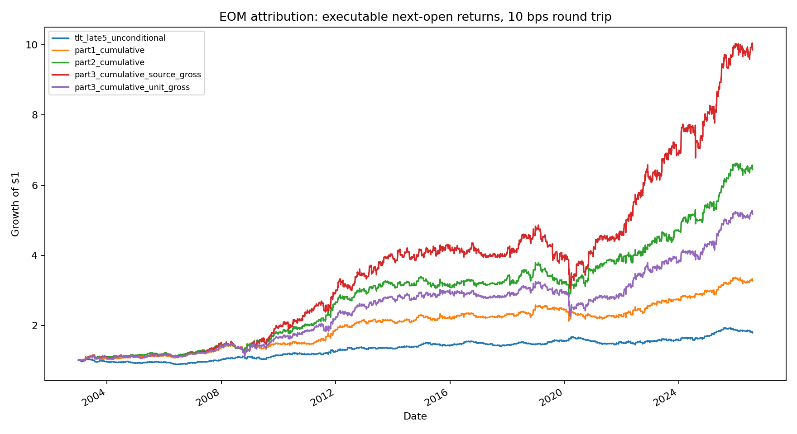
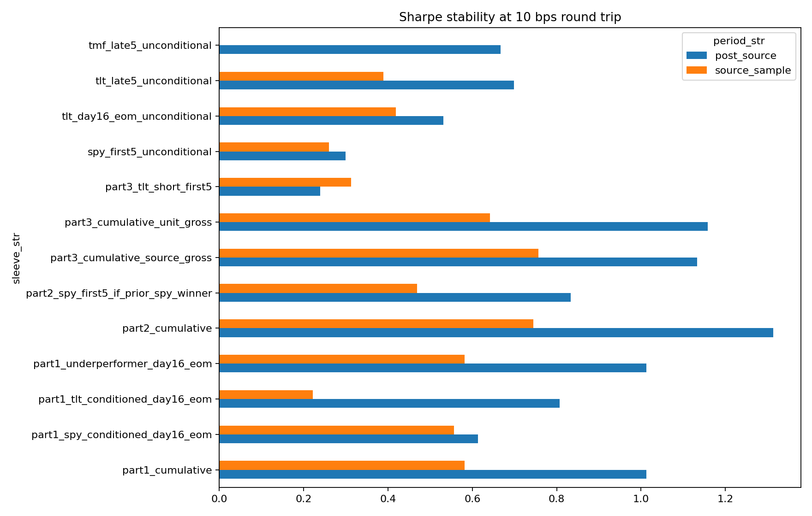

<!-- GENERATED FILE. EDIT THE CANONICAL KNOWLEDGE RECORD. -->

# End-of-Month Stock-Bond Rule Attribution

!!! warning "Research-only"
    This page summarizes saved research evidence. It does not authorize LIVE, allocation, or deployment.

## TL;DR

> **Verdict:** RESEARCH CANDIDATE - BUNDLE ONLY: Parts 1 and 2 remain positive after 10 bps and post-2022, but the conditions fail incremental and multiplicity-adjusted gates. Part 3 adds exposure and drawdown without a stable Sharpe improvement. No live or forward wiring.

> **Status:** `research_candidate`

> **Disposition:** `not_recorded`

> **Replication:** `not_recorded`

## Research question

Determine whether the conditional SPY/TLT rules add incremental executable return beyond standalone month-position effects, and whether cumulative Parts 1, 2, and 3 survive next-open timing, costs, post-2022 evidence, and leverage normalization.

## Exact setup

| Field | Value |
| --- | --- |
| Signal family | calendar_cross_asset_reversal |
| Universe | ["Fixed SPY/TLT pair on strict common observed Norgate sessions", "TMF standalone leverage wrapper"] |
| Decision | First-15 adjusted Close returns are known after session-15 Close; late-month positions begin at session-16 Open. Prior-month state is known before the next month's first Open. |
| Fill | Total-return adjusted Open_T to Open_T+1 executable proxy; no same-close fills |
| Primary cost layer | central_research |
| Last reviewed | 2026-08-06T18:21:00+03:00 |

## Timing and overnight attribution

```text
information available: First-15 adjusted Close returns are known after session-15 Close; late-month positions begin at session-16 Open. Prior-month state is known before the next month's first Open.
primary executable fill: Total-return adjusted Open_T to Open_T+1 executable proxy; no same-close fills
```

If final `Close_T` data formed the signal, a hypothetical `Close_T` entry is diagnostic only unless a separate pre-close protocol was modeled. Comparing that diagnostic with `Open_(T+1)` and applying the compounded return identity shows whether the apparent edge occurred in the overnight gap. Missing attribution numbers mean **not tested**, not zero.


## Primary metrics

| Metric | Value |
| --- | ---: |
| Period | 2003-01-01 through 2022-12-31 |
| Universe | Fixed SPY/TLT pair on strict common observed sessions |
| Cost Layer | central_research_10_bps_round_trip |
| Cagr | 7.60% |
| Annualized Volatility | 10.58% |
| Sharpe | 0.745 |
| Maximum Drawdown | -25.69% |
| Turnover | 3894.00% |

## Key findings

| Feature | Role | Direction | Status | Effect | Action |
| --- | --- | --- | --- | --- | --- |
| First-15 SPY-minus-TLT relative return | late-month reversal selector | Higher SPY-minus-TLT first-15 return predicts lower later SPY-minus-TLT return | diagnostic_directional_only | {"full_bh_q_value": 0.0671, "post_source_p_value": 0.0448, "post_source_spearman": -0.3076, "source_p_value": 0.0808, "source_spearman": -0.1129} | Keep frozen for a new prospective test; do not claim the selector is validated |
| Conditional underperformer choice | Part 1 asset switch | Positive incremental return versus equal-weight SPY/TLT late-month exposure | failed_incremental_gate | {"post_source_increment_bps_per_month": 24.1, "post_source_p_value": 0.1185, "source_increment_bps_per_month": 14.2, "source_p_value": 0.1604} | Treat Part 1 as a profitable calendar bundle, not validated switching alpha |
| Prior-SPY-winner first-five SPY continuation | Part 2 exposure filter | First-five SPY return is higher after a prior SPY win | failed_incremental_gate | {"post_source_difference_bps": 110.2, "post_source_p_value": 0.1414, "source_difference_bps": 45.7, "source_p_value": 0.2346} | Retain only inside the bundle pending a prospective classifier test |
| Unconditional short TLT first five | Part 3 additive sleeve | Positive standalone return but weak Sharpe | rejected_as_improvement | {"part2_post_source_Sharpe": 1.314, "part2_source_Sharpe": 0.745, "part3_post_source_Sharpe": 1.133, "part3_source_gross_Sharpe": 0.757, "post_source_Sharpe_10bps": 0.239, "source_Sharpe_10bps": 0.313} | Reject Part 3 as an improvement |
| TLT exact last-five seasonality | standalone calendar control | Positive source and post-source return | research_lead | {"bond_sample_10bps_Sharpe": 0.47, "bond_sample_gross_Sharpe": 0.673, "post_source_Sharpe_10bps": 0.699, "source_Sharpe_10bps": 0.389} | Keep as a standalone structural lead; next test should isolate final two sessions with auction data |

## Visual evidence






## Limitations

- The source articles omit exact fills and contain timing conflicts.
- Adjusted opens are not verified opening-auction fills.
- Base costs omit financing, short borrow, taxes, and empirical impact.
- The post-source sample contains only 43 monthly observations.
- The exact BTCE.DE, ES/TY, and synthetic TLT5 implementations were not reproduced.
- Prior source claims and local month-end diagnostics contaminate pristine-discovery status.

## Next gates

- Freeze Part 2 and collect genuinely prospective monthly observations without changing rules.
- Test whether the Part 1 switch beats equal-weight and single-asset calendar controls with exact opening-auction fills.
- Measure TLT final-two-session auction spread, depth, and impact separately from the broader last-five window.
- Run a separate instrument-faithful BTCE.DE study only if exact European data and calendar are available.
- Use exact ES/TY continuous futures, rolls, timestamps, and financing for any rebalancing paper parity claim.

## Sources

- `EOM - STOCK BOND REV 1.pdf`
- `EOM - STOCK BOND REV 2.pdf`
- `EOM - STOCK BOND REV 3.pdf`
- `Quantitativo-REBALACNING.pdf`
- `EOM - BONDS ON STERIOIDS.pdf`
- `EOM - BONDS.pdf`
- `EOM - BTC.pdf`
- `supplied Quantitativo comment export`
- `local Norgate Data database`

## Canonical artifacts

| Artifact | Pakal path |
| --- | --- |
| Concise Report | `pakal-research/reports/eom_stock_bond_attribution_study/REPORT.md` |
| Full Report | `pakal-research/reports/eom_stock_bond_attribution_study/REPORT_FULL.md` |
| Notebook | `pakal-research/reports/eom_stock_bond_attribution_study/eom_stock_bond_attribution_study.ipynb` |
| Frozen Specification | `pakal-research/reports/eom_stock_bond_attribution_study/research_spec_frozen.json` |
| Source Rule Map | `pakal-research/reports/eom_stock_bond_attribution_study/SOURCE_RULE_MAP.md` |
| Summary | `pakal-research/reports/eom_stock_bond_attribution_study/summary.json` |
| Manifest | `pakal-research/reports/eom_stock_bond_attribution_study/run_manifest.json` |
| Tables | `pakal-research/reports/eom_stock_bond_attribution_study/tables/` |
| Charts | `pakal-research/reports/eom_stock_bond_attribution_study/charts/` |
| Data | `pakal-research/reports/eom_stock_bond_attribution_study/data/` |
| Primary Source Code | `["pakal-research/eom_stock_bond_attribution_study.py"]` |
| Primary Tables | `["pakal-research/reports/eom_stock_bond_attribution_study/tables/primary_results_10bps.csv", "pakal-research/reports/eom_stock_bond_attribution_study/tables/feature_tests.csv", "pakal-research/reports/eom_stock_bond_attribution_study/tables/monthly_block_bootstrap.csv"]` |
| Primary Charts | `["pakal-research/reports/eom_stock_bond_attribution_study/charts/equity_curve_10bps.png", "pakal-research/reports/eom_stock_bond_attribution_study/charts/subperiod_sharpe_10bps.png", "pakal-research/reports/eom_stock_bond_attribution_study/charts/tlt_month_position.png"]` |
