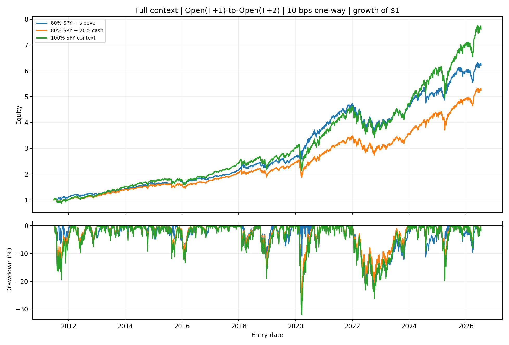
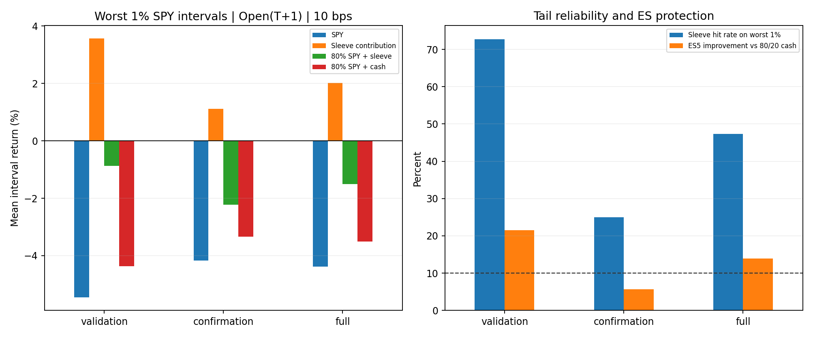

<!-- GENERATED FILE. EDIT THE CANONICAL KNOWLEDGE RECORD. -->

# EVRP Crisis-Only Tail-Hedge Sleeve Study

!!! warning "Research-only"
    This page summarizes saved research evidence. It does not authorize LIVE, allocation, or deployment.

## TL;DR

> **Verdict:** הפיינליסט נכשל לפחות ב־gate אחד תחת Open_(T+1); מסלול MOC דיאגנוסטי או Close_(T+1) אינו רשאי להציל אותו. ה־gates שנכשלו: es_improvement_confirmation, max_drawdown_not_worse_confirmation. התוצאה היא `diagnostic` ו־`rejected`.

> **Status:** `diagnostic`

> **Disposition:** `rejected`

> **Replication:** `timing_conflicted`

## Research question

Find whether a simple crisis-only long-VIXY sleeve triggered by an EVRP-style daily state provides robust net protection on severe SPY losses and named crises under causal Open_(T+1) execution, rather than maximizing ordinary CAGR.

## Exact setup

| Field | Value |
| --- | --- |
| Signal family | term_structure_inversion_stateful_long_VIXY_tail_hedge |
| Universe | ["One aggregate US equity session with complete SPY, VIXY, VIX, and VIX3M fields"] |
| Decision | After final daily Close_T fields are known |
| Fill | VIXY Open_(T+1), held to the next declared open rebalance |
| Primary cost layer | central_research |
| Last reviewed | 2026-09-01T00:11:16.101059+00:00 |

## Timing and overnight attribution

```text
information available: After final daily Close_T fields are known
primary executable fill: VIXY Open_(T+1), held to the next declared open rebalance
```

If final `Close_T` data formed the signal, a hypothetical `Close_T` entry is diagnostic only unless a separate pre-close protocol was modeled. Comparing that diagnostic with `Open_(T+1)` and applying the compounded return identity shows whether the apparent edge occurred in the overnight gap. Missing attribution numbers mean **not tested**, not zero.

| Attribution field | Value |
| --- | --- |
| Status | tested |
| Diagnostic Path | Close_T to Close_(T+1); lookahead-conflicted diagnostic |
| Executable Path | Open_(T+1) to Open_(T+2) |
| Method | Three timing paths, three one-way cost layers, plus A/B/C/D gap-intraday decomposition |
| Headline Result | Open_(T+1) determined the verdict; same-close and next-close could not rescue it. |
| Metrics | {"Close_T1_source_lag": {"delta_vs_open_tail_cumulative": -0.120543658876, "overlay_es_improvement": 0.149333005224, "worst_1pct_sleeve_cumulative_return": 0.984705670607}, "Open_T1_primary": {"delta_vs_open_tail_cumulative": 0.0, "overlay_es_improvement": 0.138710510127, "worst_1pct_sleeve_cumulative_return": 1.10524932948}, "same_close_diagnostic": {"delta_vs_open_tail_cumulative": 0.109112078491, "overlay_es_improvement": 0.173473753194, "worst_1pct_sleeve_cumulative_return": 1.21436140797}} |
| Artifact | tables/timing_cost_attribution.csv |

## Primary metrics

| Metric | Value |
| --- | ---: |
| Period | 2011-06-24 through 2026-07-17 full context |
| Universe | SPY/VIXY plus VIX/VIX3M daily proxies |
| Cost Layer | central_research |
| Cagr | 12.93% |
| Annualized Volatility | 11.83% |
| Sharpe | 1.087 |
| Maximum Drawdown | -23.66% |
| Turnover | 253.29% |

## Four separate verdicts

| Question | Conclusion |
| --- | --- |
| Source Replication | Exact 15:45 MOC and synthetic pre-2011 source history were unavailable; replication status is timing_conflicted. |
| Predictive Value | Chronological validation and confirmation tested tail-state economics; validation=passed, confirmation=failed. |
| Economic Value | הפיינליסט נכשל לפחות ב־gate אחד תחת Open_(T+1); מסלול MOC דיאגנוסטי או Close_(T+1) אינו רשאי להציל אותו. ה־gates שנכשלו: es_improvement_confirmation, max_drawdown_not_worse_confirmation. התוצאה היא `diagnostic` ו־`rejected`. |
| Promotion | Rejected under the frozen historical gates; no PAPER/LIVE promotion. |

## Key findings

| Feature | Role | Direction | Status | Effect | Action |
| --- | --- | --- | --- | --- | --- |
| Finalist term_only__fixed_20pct | frozen crisis-only signal and stateful VIXY target | Long VIXY only when VIX_T > VIX3M_T (inverted volatility term structure). | frozen_gates_failed | {"confirmation_worst_1pct_tail_mean": 0.0111836851148, "full_active_fraction": 0.0776750330251, "validation_worst_1pct_tail_mean": 0.035618917851} | אין לפתוח ריטיון נוסף על ההיסטוריה. חזרה למחקר דורשת מנגנון חדש שקופא מראש ונבחן רק על מידע עתידי. |
| Close_T to Open_(T+1) timing boundary | causal execution translation and failure-mode attribution | Any Close_T-to-next-open protection is inaccessible to the daily signal. | tested_primary_cannot_be_rescued | {"Close_T1_source_lag": {"delta_vs_open_tail_cumulative": -0.120543658876, "overlay_es_improvement": 0.149333005224, "worst_1pct_sleeve_cumulative_return": 0.984705670607}, "Open_T1_primary": {"delta_vs_open_tail_cumulative": 0.0, "overlay_es_improvement": 0.138710510127, "worst_1pct_sleeve_cumulative_return": 1.10524932948}, "same_close_diagnostic": {"delta_vs_open_tail_cumulative": 0.109112078491, "overlay_es_improvement": 0.173473753194, "worst_1pct_sleeve_cumulative_return": 1.21436140797}} | Do not label same-close diagnostics executable; collect true 15:45 and auction-fill evidence separately. |
| Standalone sleeve versus SPY relationship | hedge exposure interpretation | Conditional crisis exposure; unconditional correlation includes many zero-weight days. | descriptive | {"daily_spy_beta": -0.2320308984545316, "daily_spy_correlation": -0.4728159596370318, "monthly_spy_correlation": -0.4710625967626072, "overlay_daily_spy_beta": 0.5693918352204391} | Use tail and crisis metrics, not low unconditional correlation, as the decision criterion. |

## Visual evidence






## Limitations

- The primary Open_(T+1) translation misses the Close_T-to-Open_(T+1) gap and is not a literal source execution.
- Daily closes cannot reproduce the 15:45 signal; same-close use of Close_T is lookahead-conflicted.
- The study begins in 2011 and cannot test 2008; the source's synthetic pre-launch VIXY history is unavailable.
- VIXY is a rolling leveraged volatility-product proxy, not spot VIX and not the source's exact VIXLONG/VXX construction.
- The VIX/VIX3M input is a saved Yahoo research artifact rather than an official CBOE vintage snapshot.
- EVRP3's full sample and parameter grid saw data through July 2025, so the internal validation periods are not pristine external holdouts.
- No interest on cash, leverage financing, taxes, empirical opening spread, auction fill, impact, or capacity model is included.
- EVRP3 exposed results through July 2025, so historical gate passage cannot earn research_candidate status.
- Passing historical evidence requires 3 genuinely future independent crises or 20 future SPY-tail intervals after 2026-09-01 before research-candidate review.

## Next gates

- Observe the unchanged frozen rule after 2026-09-01 until 3 independent future crises or 20 future SPY-tail intervals are available.
- Collect 15:45 SPY/VIX/VIX3M signal snapshots and VIXY opening-auction quotes, fills, spread, impact, and partial-fill evidence.
- Do not retune the historical rule or use same-close/next-close diagnostics to rescue Open_(T+1).

## Sources

- `{"path": "C:/Users/User/Downloads/evrp2 (1).pdf", "read_complete": true, "role": "primary_author_literal_signal_and_1545_MOC_automation_description", "sha256": "E68CD6A70B2350CA4E0D6EB2313FEC467CE9AD0B768100B71E6766642E56AB1B", "source_id": "evrp2_automation_article", "title": "evrp2_automation_article", "unresolved_gap": "Exact 15:45 MOC parity and exact source investable history are unavailable."}`
- `{"path": "C:/Users/User/Downloads/evRp3.pdf", "read_complete": true, "role": "secondary_long_only_robustness_and_one_day_lag_analysis", "sha256": "9CAE4EDD43314FA84106E6930EB6C53A52C1BBA945AB3C40DC8B0E0869387642", "source_id": "evrp3_quantpedia_long_only_analysis", "title": "evrp3_quantpedia_long_only_analysis", "unresolved_gap": "Exact 15:45 MOC parity and exact source investable history are unavailable."}`
- `{"path": "C:/Users/User/Downloads/ssrn-5316487 (2).pdf", "read_complete": true, "role": "primary_paper_literal_strategy_and_reported_backtest", "sha256": "E04E77BA8EA16E58D69B9AFADAD8E8B4C2EB47EC2E7FAA8E136CA62B7B2B9222", "source_id": "ssrn_5316487_volatility_edge", "title": "ssrn_5316487_volatility_edge", "unresolved_gap": "Exact 15:45 MOC parity and exact source investable history are unavailable."}`
- `{"path": "C:/Users/User/Downloads/evrp1).pdf", "read_complete": true, "role": "duplicate_primary_paper_body_with_cover_and_back_page", "sha256": "7058077AC89A94850662DA49DD8A7B4D76D3367532EBAFA60C1313746B0E3B96", "source_id": "sfi_duplicate_wrapper", "title": "sfi_duplicate_wrapper", "unresolved_gap": "Exact 15:45 MOC parity and exact source investable history are unavailable."}`

## Canonical artifacts

| Artifact | Pakal path |
| --- | --- |
| Concise Report | `pakal-research/reports/evrp_crisis_tail_hedge_study/REPORT.md` |
| Decision Log | `pakal-research/reports/evrp_crisis_tail_hedge_study/decision_log.jsonl` |
| Experiment Ledger | `pakal-research/reports/evrp_crisis_tail_hedge_study/experiment_ledger.jsonl` |
| Frozen Specification | `pakal-research/reports/evrp_crisis_tail_hedge_study/research_spec_frozen.json` |
| Full Report | `pakal-research/reports/evrp_crisis_tail_hedge_study/REPORT_FULL.md` |
| Hypothesis Registry | `pakal-research/reports/evrp_crisis_tail_hedge_study/hypothesis_registry.json` |
| Manifest | `pakal-research/reports/evrp_crisis_tail_hedge_study/run_manifest.json` |
| Notebook | `pakal-research/evrp_crisis_tail_hedge_study.ipynb` |
| Primary Charts | `["pakal-research/reports/evrp_crisis_tail_hedge_study/charts/equity_drawdown_open_t1_10bps.png", "pakal-research/reports/evrp_crisis_tail_hedge_study/charts/tail_payoff_validation_confirmation.png", "pakal-research/reports/evrp_crisis_tail_hedge_study/charts/crisis_window_evidence_open_t1_10bps.png", "pakal-research/reports/evrp_crisis_tail_hedge_study/charts/timing_cost_attribution.png", "pakal-research/reports/evrp_crisis_tail_hedge_study/charts/rolling126_spy_correlation.png"]` |
| Primary Source Code | `["pakal-research/evrp_crisis_tail_hedge_study.py", "pakal-research/build_evrp_crisis_tail_hedge_artifacts.py"]` |
| Primary Tables | `["pakal-research/reports/evrp_crisis_tail_hedge_study/tables/gate_evaluation.csv", "pakal-research/reports/evrp_crisis_tail_hedge_study/tables/candidate_selection.csv", "pakal-research/reports/evrp_crisis_tail_hedge_study/tables/chart_tail_payoff.csv", "pakal-research/reports/evrp_crisis_tail_hedge_study/tables/chart_crisis_evidence.csv", "pakal-research/reports/evrp_crisis_tail_hedge_study/tables/timing_cost_attribution.csv", "pakal-research/reports/evrp_crisis_tail_hedge_study/tables/market_relationship.csv"]` |
| Research State | `pakal-research/reports/evrp_crisis_tail_hedge_study/research_state.json` |
| Source Rule Map | `pakal-research/reports/evrp_crisis_tail_hedge_study/SOURCE_RULE_MAP.md` |
