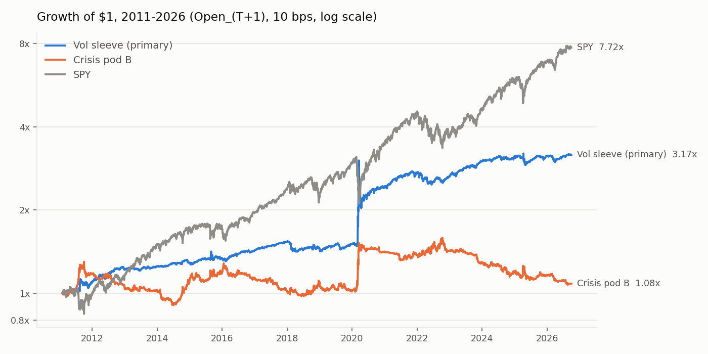
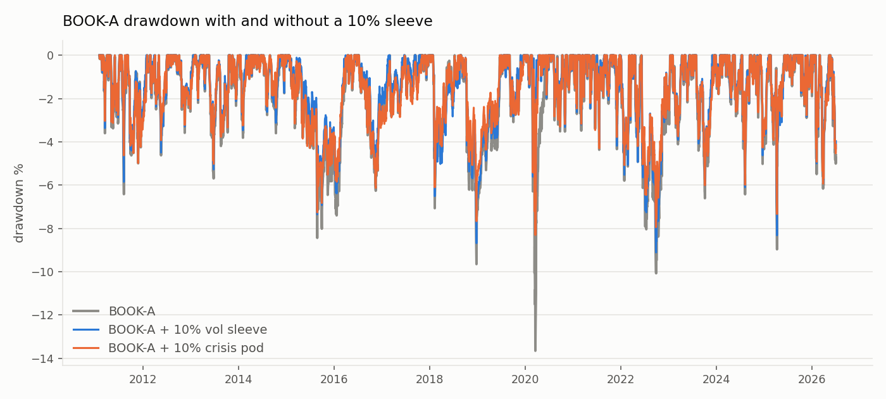

<!-- GENERATED FILE. EDIT THE CANONICAL KNOWLEDGE RECORD. -->

# eVRP + VIX term-structure + VIX-sizing volatility sleeve (Aziz/Zarattini, Concretum 2026-06-14): full-strategy replication as crisis hedge and diversifying sleeve

!!! warning "Research-only"
    This page summarizes saved research evidence. It does not authorize LIVE, allocation, or deployment.

## TL;DR

> **Verdict:** NOT A CRISIS HEDGE; DIVERSIFYING SLEEVE CANDIDATE (forward hypothesis). Full eVRP + VIX/VIX3M + VIX-sizing strategy (short a -0.5x VIX-futures product ~92% of days, long VIXY ~3%, cash ~5%) on 2011-02..2026-09, Open_(T+1), 10 bps: CAGR 7.7%, Sharpe 0.63, MDD -32.8%, corr SPY 0.04. Positive in 2 of 8 post-2011 crisis windows (COVID +36.6%, Euro 2011 +4.0%); lost in Volmageddon (-1.0%), Q4 2018, China 2015, 2022 (-8.3%), yen carry (-3.0%) and tariffs 2025 (-2.3%). It sidestepped Volmageddon and April 2025 through the 'cash when premium positive but curve inverted' state, by a 0.28-point VIX/VIX3M margin in Feb 2018; the long-vol leg fired late in April 2025 and in March 2020 produced the worst days (-17.9%, -14.7%). Gates: hedge H1/H2 fail, H3 passes; sleeve D1-D3 pass. Adding 10% improves Sharpe in BOOK-A (1.23->1.29), BOOK-B (1.68->1.75) and BOOK-C (1.22->1.27) with shallower MDD, and keeps more return than 10% of the crisis pod; ex-COVID the improvement shrinks but stays (BOOK-A 1.30->1.34). Concretum notebook sizing (x2 on SVXY) matches the paper's yearly table best (corr 0.95; 11.7%/yr 2012-2025 vs paper 10.5%) and earns 11.9% CAGR, but with corr SPY 0.26 and -12% in 2022. Post-publication (Jun 2025-Sep 2026) +6.6%. Research only; no PAPER/LIVE/allocation.

> **Status:** `forward_hypothesis`

> **Disposition:** `diversifying_sleeve_candidate_not_hedge`

> **Replication:** `not_recorded`

## Research question

No machine-readable objective was recorded.

## Exact setup

| Field | Value |
| --- | --- |
| Signal family | volatility_risk_premium_short_vol_with_term_structure_switch |
| Universe | ["SVXY-like -0.5x short VIX futures (synthetic from VIXY), VIXY; signals SPY, $VIX, $VIX3M; cash SHY"] |
| Decision | After official Close_T (source: 15:45 snapshot, not reproducible from daily data) |
| Fill | Open_(T+1) primary; Close_(T+1) MOC and same-close diagnostic reported |
| Primary cost layer | central_research |
| Last reviewed | 2026-10-02T13:38:07+00:00 |

## Timing and overnight attribution

```text
information available: After official Close_T (source: 15:45 snapshot, not reproducible from daily data)
primary executable fill: Open_(T+1) primary; Close_(T+1) MOC and same-close diagnostic reported
```

If final `Close_T` data formed the signal, a hypothetical `Close_T` entry is diagnostic only unless a separate pre-close protocol was modeled. Comparing that diagnostic with `Open_(T+1)` and applying the compounded return identity shows whether the apparent edge occurred in the overnight gap. Missing attribution numbers mean **not tested**, not zero.


## Primary metrics

| Metric | Value |
| --- | ---: |
| Period | N/A |
| Universe | N/A |
| Cost Layer | N/A |
| Cagr | 7.65% |
| Annualized Volatility | N/A |
| Sharpe | 0.632 |
| Maximum Drawdown | -32.84% |
| Turnover | N/A |

## Key findings

| Feature | Role | Direction | Status | Effect | Action |
| --- | --- | --- | --- | --- | --- |

## Visual evidence






## Limitations

- Paper data (2008-May 2025) overlaps almost the whole test window; only Jun 2025-Sep 2026 is post-publication.
- No 2008: no investable VIX ETP in Norgate before 2011, and the paper's 2008 (+87%) is its largest year.
- Book streams come from crisis_trend_pod_study; BOOK-B contains the NDX-VXN reconstruction with the known split look-ahead and covers only 2019-06..2022-12.
- Cash earns SHY (lost ~4% inside 2022); a T-bill sweep would be slightly better.
- Volmageddon avoidance rests on a 0.28-point VIX/VIX3M margin (luck, not demonstrated edge).

## Next gates

- 12-month forward shadow of S4 P at Open_(T+1) next to the crisis pod, logged daily
- If shadowed: true 15:45 signal + MOC capture to measure the X0/X2 gap
- Decide sizing convention (P vs Concretum x2) before any shadow starts; do not tune on history

## Sources

- `SSRN 5316487 (Aziz, Zarattini et al., The Volatility Edge, 2025-06-23)`
- `Concretum Research, Automating a Volatility Strategy (2026-06-14)`
- `pakal-research/reports/crisis_trend_pod_study`
- `pakal-research/reports/evrp_crisis_tail_hedge_study`

## Canonical artifacts

| Artifact | Pakal path |
| --- | --- |
| Concise Report | `pakal-research/reports/evrp_dual_signal_vol_sleeve_study/REPORT.md` |
| Full Report | `pakal-research/reports/evrp_dual_signal_vol_sleeve_study/REPORT_FULL.md` |
| Notebook | `pakal-research/evrp_dual_signal_vol_sleeve_study.ipynb` |
| Frozen Specification | `pakal-research/reports/evrp_dual_signal_vol_sleeve_study/research_spec_frozen.json` |
| Manifest | `pakal-research/reports/evrp_dual_signal_vol_sleeve_study/run_manifest.json` |
| Primary Source Code | `["pakal-research/evrp_dual_signal_vol_sleeve_study.py", "pakal-research/build_evrp_dual_signal_vol_sleeve_artifacts.py", "tests/test_evrp_dual_signal_vol_sleeve_study.py"]` |
| Primary Tables | `["pakal-research/reports/evrp_dual_signal_vol_sleeve_study/tables/grid_all_cells.csv", "pakal-research/reports/evrp_dual_signal_vol_sleeve_study/tables/comparators.csv", "pakal-research/reports/evrp_dual_signal_vol_sleeve_study/tables/book_integration.csv", "pakal-research/reports/evrp_dual_signal_vol_sleeve_study/tables/calendar_years.csv", "pakal-research/reports/evrp_dual_signal_vol_sleeve_study/tables/gate_evaluation.json"]` |
| Primary Charts | `["pakal-research/reports/evrp_dual_signal_vol_sleeve_study/charts/equity_growth.png", "pakal-research/reports/evrp_dual_signal_vol_sleeve_study/charts/crisis_windows.png", "pakal-research/reports/evrp_dual_signal_vol_sleeve_study/charts/calendar_years_vs_paper.png", "pakal-research/reports/evrp_dual_signal_vol_sleeve_study/charts/book_a_drawdown.png"]` |
