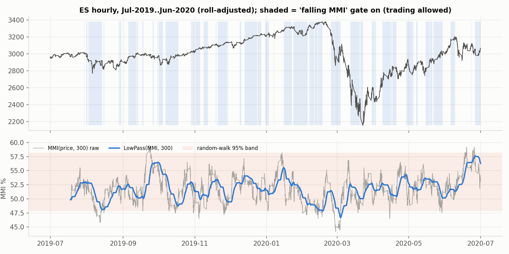
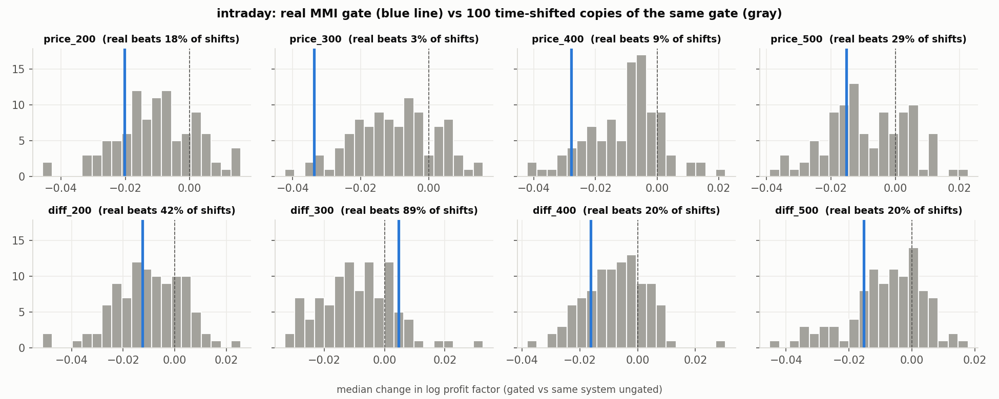

<!-- GENERATED FILE. EDIT THE CANONICAL KNOWLEDGE RECORD. -->

# Market Meanness Index (financial-hacker.com, jcl 2015): trend-regime filter for 900-style peak/valley trend systems - math audit and post-publication replication

!!! warning "Research-only"
    This page summarizes saved research evidence. It does not authorize LIVE, allocation, or deployment.

## TL;DR

> **Verdict:** REJECTED. The 75% rule is correct, but MMI(returns) is exactly 50 + 100*arccos(rho1)/(2*pi) of the lag-1 autocorrelation (sampling sd 2.2 pts at N=300 vs 0.8 pts per 0.05 of rho) and MMI(price) is ~50-53% for any random walk with or without drift; on ES/NQ/GC/BTC it is indistinguishable from shuffled returns. Post-publication replication 2017-2026 on 840 intraday trend systems (10 filters x M15/H1/H4 x ES/NQ/GC/BTC, literal Zorro ports, detrended, gross): the MMI(price) gate lowers median profit factor by 1.5-3.4%, improves 32-43% of systems, ranks at the 3rd-29th percentile of 100 time-shifted copies of itself (Holm p 1.0), carries no conditional information (Holm p 1.0), and cuts the share of profitable systems from 67.0% to 51.4% (source claimed +2..+9 pts). No MMI family passes the reality check (p 0.26 gross); the only gross pass is an unfiltered BTC 15m trend system that fails at central cost. Daily ETFs (700 systems) and $SPX 1930+ show the same null with sign flips across MMI windows. Cost-adjusted ensemble gains (+0.04..+0.15 Sharpe) equal those of shifted gates: they come from ~57% fewer trades, not timing.

> **Status:** `diagnostic`

> **Disposition:** `rejected`

> **Replication:** `not_reproducible`

## Research question

Test whether the MMI (share of consecutive pairs reverting toward the window median; trade only while LowPass(MMI) is falling) identifies trend regimes and improves trend-following systems, as claimed for 2010-2015 (success rate +2..+9 pts everywhere, best system passes White's Reality Check at p 0.02).

## Exact setup

| Field | Value |
| --- | --- |
| Signal family | regime_filter_serial_correlation_median_reversion |
| Universe | ["ES, NQ, GC 15-minute continuous futures (roll-adjusted) 2017-06-01..2026-08-19; BTC/USDT 15m 2018-09-01..2026-09-30; M15/H1/H4", "SPY QQQ IWM EFA EEM TLT IEF GLD SLV USO DBC FXE FXY VNQ daily (inception+2y..2026-10-02); $SPX 1930..2026 diagnostic"] |
| Decision | filter, MMI and gate from bars completed at Close_t |
| Fill | Open_(t+1) of the same timeframe ($SPX diagnostic: Close_(t+1)) |
| Primary cost layer | paper_like |
| Last reviewed | 2026-10-04T03:10:00+03:00 |

## Timing and overnight attribution

```text
information available: filter, MMI and gate from bars completed at Close_t
primary executable fill: Open_(t+1) of the same timeframe ($SPX diagnostic: Close_(t+1))
```

If final `Close_T` data formed the signal, a hypothetical `Close_T` entry is diagnostic only unless a separate pre-close protocol was modeled. Comparing that diagnostic with `Open_(T+1)` and applying the compounded return identity shows whether the apparent edge occurred in the overnight gap. Missing attribution numbers mean **not tested**, not zero.

| Attribution field | Value |
| --- | --- |
| Status | tested |
| Diagnostic Path | math simulations and real-vs-shuffled MMI distributions |
| Executable Path | gated peak/valley engine, next-open fills, gross detrended (source convention) plus central/conservative costs |
| Method | frozen spec v1; paired delta log PF; 100 circular-shift placebo gates per gate x cell with Holm across 4 gates; conditional edge of ungated systems; White Reality Check (studentized, stationary bootstrap B=1000); 20-shift placebo for cost-adjusted ensembles |
| Headline Result | MMI(price) median PF change -1.5..-3.4%, placebo percentile 3-29%, Holm p 1.0; success rate 67.0% -> 51.4% |
| Metrics | {"close_fill_median_pf_ratio_price": 0.974, "h1_price_median_dlogpf_max": -0.0153, "h1_price_median_dlogpf_min": -0.0337, "h1_price_p_holm_min": 1.0, "h2_price_p_holm_min": 1.0, "open_fill_median_pf_ratio_price": 0.975, "rc_p_base_central": 0.303, "rc_p_base_gross": 0.007, "rc_p_mmi_only_price_gross": 0.258, "success_rate_base": 0.67, "success_rate_mmi_price": 0.514} |
| Unavailable Reason | N/A |
| Artifact | pakal-research/reports/fh_market_meanness_index_study/tables/intraday_timing_attribution.csv |

## Primary metrics

| Metric | Value |
| --- | ---: |
| Period | 2017-06-01..2026-08-19 (BTC 2018-09-01..2026-09-30) |
| Universe | equal-weight book of all eligible intraday peak/valley systems (12 cells), MMI(price) gated, 4 windows equal-weighted |
| Cost Layer | paper_like (gross, detrended; source convention) |
| Cagr | 1.66% |
| Annualized Volatility | 5.97% |
| Sharpe | 0.276 |
| Maximum Drawdown | -8.66% |
| Turnover | 27750.37% |

## Four separate verdicts

| Question | Conclusion |
| --- | --- |
| Source Replication | not reproducible out of sample; success-rate claim reversed (-15.7 pts); three reader replications in the comments (2017, 2019) also failed |
| Predictive Value | none: real gate below median of time-shifted placebo; conditional edge ~0 sd (slightly negative for N=400/500) |
| Economic Value | none beyond trading less (placebo gates give the same cost saving) |
| Promotion | none; do not use as a trend filter; no shadow |

## Key findings

| Feature | Role | Direction | Status | Effect | Action |
| --- | --- | --- | --- | --- | --- |
| MMI of returns | regime | none | rejected | 0.8 pts per 0.05 lag-1 autocorrelation vs 2.2 pts sampling sd (N=300) | do not use as a regime input |
| MMI of prices | regime | none | rejected | 50-53% for any random walk incl. drift; momentum rho 0.3 -> -0.7 pts | do not use as a trend detector |
| falling(LowPass(MMI(price),N)) gate on 840 intraday trend systems | filter | negative | rejected | median PF -1.5..-3.4%; profitable share 67.0% -> 51.4% | reject; do not re-test variants on the same panels |
| falling MMI gate on price differences | filter | none | rejected | median PF -1.6..+0.5% | reject |
| cost saving of a 50%-duty trade gate | turnover_control | positive | diagnostic | ensemble Sharpe +0.04..+0.15 at central cost (shifted gates +0.01..+0.11) | use slower filters if turnover is the issue |
| BTC 15m peak/valley trend (LinearReg 100), unfiltered | signal | positive | diagnostic | gross detrended Sharpe ~1.1 (t 3.9) | not tradable at 5 bps per side; no follow-up |

## Visual evidence






## Limitations

- EUR/USD and silver intraday unavailable; ES/NQ/GC/BTC substituted
- source window 2010-2015 not rebuildable intraday
- Zorro 'most robust' parameter selection approximated by a neighbourhood-PF rule
- price() proxied by OHLC4; Laguerre alpha 4/Period
- roll detection misses small zero-rate rolls

## Next gates

- none; do not re-test MMI variants (level thresholds, other smoothers) on the same panels

## Sources

- `https://financial-hacker.com/the-market-meanness-index/ (2015-09-21, addendum 2022) with 139 comments`
- `https://financial-hacker.com/boosting-systems-by-trade-filtering/ (2015-09-28) with 34 comments`
- `https://financial-hacker.com/trend-delusion-or-reality/ (2015-09-04)`

## Canonical artifacts

| Artifact | Pakal path |
| --- | --- |
| Concise Report | `pakal-research/reports/fh_market_meanness_index_study/REPORT.md` |
| Full Report | `pakal-research/reports/fh_market_meanness_index_study/REPORT_FULL.md` |
| Notebook | `pakal-research/reports/fh_market_meanness_index_study/fh_market_meanness_index_study.ipynb` |
| Frozen Specification | `pakal-research/reports/fh_market_meanness_index_study/research_spec_frozen.json` |
| Manifest | `pakal-research/reports/fh_market_meanness_index_study/run_manifest.json` |
| Primary Source Code | `["pakal-research/fh_market_meanness_index/mmi_lib.py", "pakal-research/fh_market_meanness_index/mmi_data.py", "pakal-research/fh_market_meanness_index/mmi_sim.py", "pakal-research/fh_market_meanness_index/mmi_run_cells.py", "pakal-research/fh_market_meanness_index/mmi_analyze.py", "pakal-research/fh_market_meanness_index/mmi_econ_placebo.py", "pakal-research/fh_market_meanness_index/mmi_charts.py", "pakal-research/fh_market_meanness_index/test_mmi_timing.py", "pakal-research/fh_market_meanness_index/mmi_build_artifacts.py", "pakal-research/fh_market_meanness_index/mmi_lineage.py"]` |
| Primary Tables | `["pakal-research/reports/fh_market_meanness_index_study/tables/math_mmi_simulations.csv", "pakal-research/reports/fh_market_meanness_index_study/tables/math_real_vs_surrogate.csv", "pakal-research/reports/fh_market_meanness_index_study/tables/intraday_h1_h2_placebo.csv", "pakal-research/reports/fh_market_meanness_index_study/tables/intraday_success_rate.csv", "pakal-research/reports/fh_market_meanness_index_study/tables/intraday_reality_check.csv", "pakal-research/reports/fh_market_meanness_index_study/tables/intraday_econ_placebo.csv", "pakal-research/reports/fh_market_meanness_index_study/tables/daily_h1_h2_placebo.csv", "pakal-research/reports/fh_market_meanness_index_study/tables/spx_h1_h2_placebo.csv", "pakal-research/reports/fh_market_meanness_index_study/tables/intraday_timing_attribution.csv"]` |
| Primary Charts | `["pakal-research/reports/fh_market_meanness_index_study/charts/math_what_mmi_measures.png", "pakal-research/reports/fh_market_meanness_index_study/charts/real_vs_shuffled_mmi.png", "pakal-research/reports/fh_market_meanness_index_study/charts/intraday_h1_placebo.png", "pakal-research/reports/fh_market_meanness_index_study/charts/intraday_success_rate.png", "pakal-research/reports/fh_market_meanness_index_study/charts/intraday_reality_check.png", "pakal-research/reports/fh_market_meanness_index_study/charts/es_h1_mmi_gate_example.png"]` |
| Research State | `pakal-research/reports/fh_market_meanness_index_study/research_state.json` |
| Hypothesis Registry | `pakal-research/reports/fh_market_meanness_index_study/hypothesis_registry.json` |
| Experiment Ledger | `pakal-research/reports/fh_market_meanness_index_study/experiment_ledger.jsonl` |
| Decision Log | `pakal-research/reports/fh_market_meanness_index_study/decision_log.jsonl` |
| Source Rule Map | `pakal-research/reports/fh_market_meanness_index_study/SOURCE_RULE_MAP.md` |
