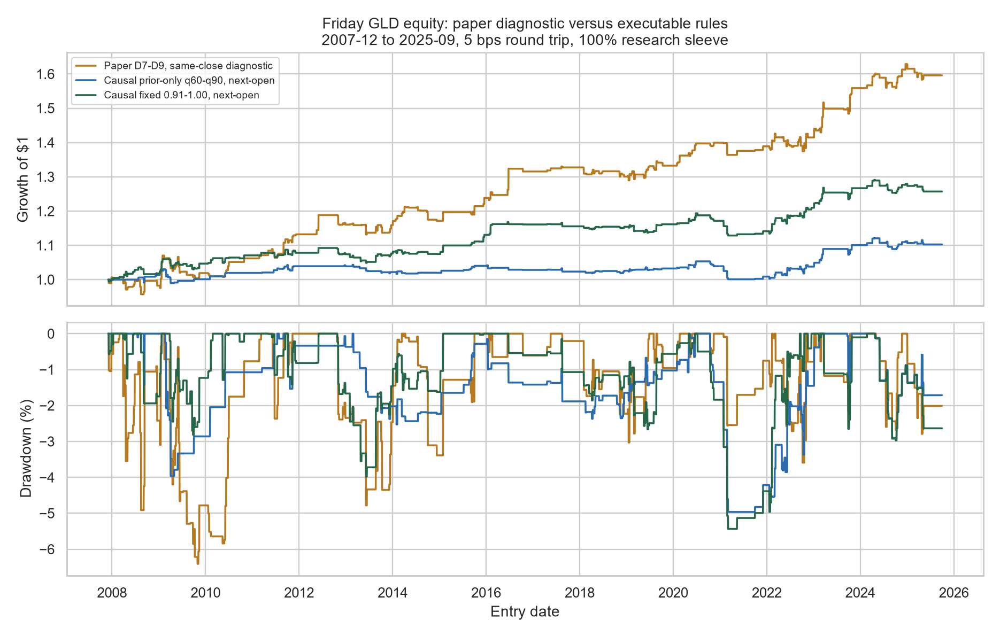
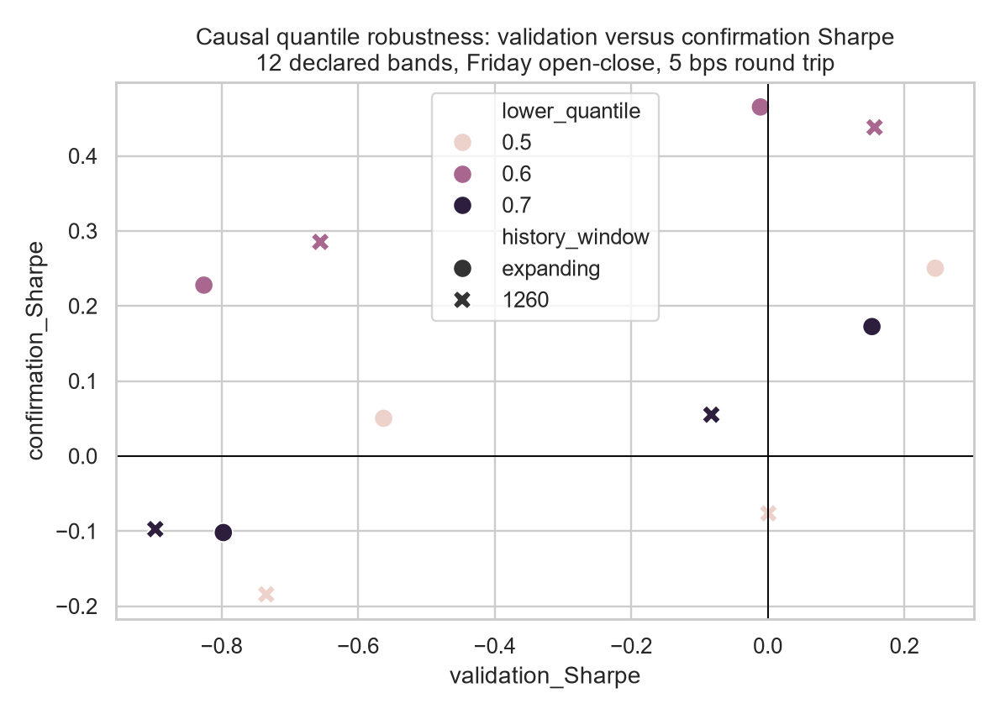

<!-- GENERATED FILE. EDIT THE CANONICAL KNOWLEDGE RECORD. -->

# The Friday Gold Trade: causal replication and conditional-edge audit

!!! warning "Research-only"
    This page summarizes saved research evidence. It does not authorize LIVE, allocation, or deployment.

## TL;DR

> **Verdict:** The frozen prior-only q60-q90 primary did not validate after next-open execution and 5 bps costs, but the separately predeclared, source-stated fixed 0.91-1.00 band remained positive and correction-significant. Keep that fixed band as an unchanged forward hypothesis only; do not implement the paper's full-history-decile or same-close backtest.

> **Status:** `forward_hypothesis`

> **Disposition:** `not_recorded`

> **Replication:** `not_recorded`

## Research question

Test whether the paper's D7-D9 Thursday VIX/VIX3M filter survives prior-only boundaries, Friday-open execution, costs, and robustness.

## Exact setup

| Field | Value |
| --- | --- |
| Signal family | calendar_conditional_safe_haven_flow |
| Universe | ["GLD primary fixed ETF", "IAU transfer", "VTI control"] |
| Decision | After Thursday Close_T |
| Fill | Executable primary Open_(T+1) to scheduled Close_(T+1); paper same-close result is diagnostic |
| Primary cost layer | central_research |
| Last reviewed | 2026-08-08T17:29:08.8215903+03:00 |

## Timing and overnight attribution

```text
information available: After Thursday Close_T
primary executable fill: Executable primary Open_(T+1) to scheduled Close_(T+1); paper same-close result is diagnostic
```

If final `Close_T` data formed the signal, a hypothetical `Close_T` entry is diagnostic only unless a separate pre-close protocol was modeled. Comparing that diagnostic with `Open_(T+1)` and applying the compounded return identity shows whether the apparent edge occurred in the overnight gap. Missing attribution numbers mean **not tested**, not zero.


## Primary metrics

| Metric | Value |
| --- | ---: |
| Period | 2007-12-01 through 2025-09-30 |
| Universe | GLD fixed ETF |
| Cost Layer | central_research |
| Cagr | 0.55% |
| Annualized Volatility | 1.94% |
| Sharpe | 0.292 |
| Maximum Drawdown | -4.96% |
| Turnover | 2078.93% |

## Key findings

| Feature | Role | Direction | Status | Effect | Action |
| --- | --- | --- | --- | --- | --- |
| Paper D7-D9 full-history decile and same-close entry | entry filter and diagnostic baseline | positive but lookahead-contaminated | diagnostic | {"CAGR": 0.026618847637553733, "Sharpe": 0.638587212311311, "mean_net_trade": 0.001852687807063145} | Do not implement; retain only as the paper-parity diagnostic. |
| Prior-only q60-q90 VIX/VIX3M band | causal entry filter | positive but weak after Friday-open execution | diagnostic | {"CAGR": 0.005501334999409968, "Sharpe": 0.29190914830861836, "mean_net_trade": 0.0005459768241742454} | Reject as the primary rule; do not retune its percentile after seeing results. |
| Fixed 0.91 <= VIX/VIX3M < 1.00 band | causal entry filter | positive at Friday-open execution | forward_hypothesis | {"CAGR": 0.012932913143943292, "Sharpe": 0.5333287050267014, "mean_net_trade": 0.0008735207351636596} | Freeze unchanged and shadow until at least 65 post-publication trades exist. |
| IAU transfer | same-mechanism transfer diagnostic | same direction as GLD | diagnostic | {"mean_gross_trade": 0.001049041593154728} | Retain as corroboration only; do not create a second sleeve. |
| VIX level by 20-session ratio direction | diagnostic interaction | non-monotonic and cell-dependent | diagnostic | {"cell_count": 6, "minimum_cell_trades": 1} | Do not add another filter; freeze any apparent cell as future-only research. |

## Visual evidence






## Limitations

- Full-history deciles and Thursday-close entry contaminate the paper diagnostic.
- All historical validation periods are known to the source; post-publication N is underpowered.
- Yahoo Finance is mutable; only the hashed local cache is reproducible for this run.
- Exact MOC and opening-auction fill behavior is unavailable.
- Cross-sectional IC, PIT membership, and stock-size effects are not applicable to one fixed ETF.

## Next gates

- Freeze the fixed 0.91-1.00 band unchanged for 65 post-publication trades.
- Record timestamped Thursday signals and actual Friday entry/exit auction fills, spreads, partial fills, and auction participation.
- Do not reopen percentile, VIX-level, trend, or interaction optimization on the same sample.

## Sources

- `{"date": "2026-03-22", "location": "C:/Users/User/Downloads/The Friday Gold Trade A Conditional Edge.pdf", "sha256": "7c2e1078924a97ec0e9198ce7920a09ec92508f336343b9b627df374da702b12", "title": "The Friday Gold Trade: A Conditional Edge"}`

## Canonical artifacts

| Artifact | Pakal path |
| --- | --- |
| Concise Report | `pakal-research/reports/friday_gold_conditional_edge/REPORT.md` |
| Frozen Specification | `pakal-research/reports/friday_gold_conditional_edge/research_spec_frozen.json` |
| Full Report | `pakal-research/reports/friday_gold_conditional_edge/REPORT_FULL.md` |
| Manifest | `pakal-research/reports/friday_gold_conditional_edge/run_manifest.json` |
| Notebook | `pakal-research/friday_gold_conditional_edge_study.ipynb` |
| Primary Charts | `["pakal-research/reports/friday_gold_conditional_edge/charts/equity_drawdown_paper_vs_causal.png", "pakal-research/reports/friday_gold_conditional_edge/charts/decile_profile_by_timing.png", "pakal-research/reports/friday_gold_conditional_edge/charts/validation_confirmation_robustness.png"]` |
| Primary Source Code | `["pakal-research/friday_gold_conditional_edge_study.py"]` |
| Primary Tables | `["pakal-research/reports/friday_gold_conditional_edge/tables/baseline_summary.csv", "pakal-research/reports/friday_gold_conditional_edge/tables/robustness_grid.csv", "pakal-research/reports/friday_gold_conditional_edge/tables/capacity_summary.csv"]` |
