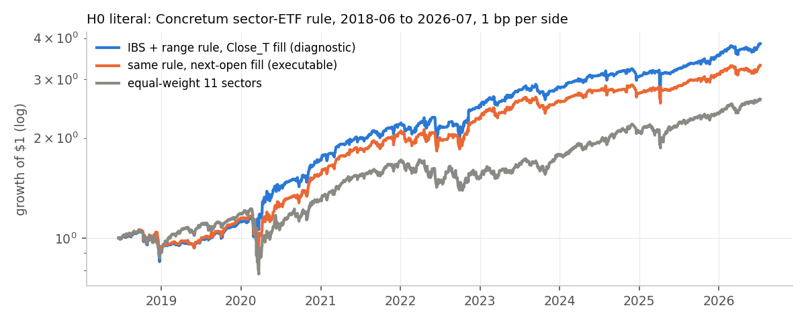
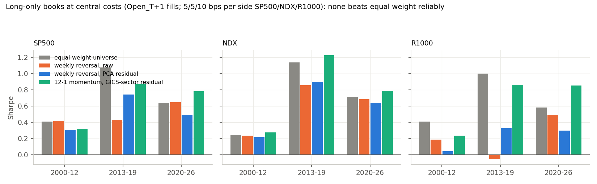

<!-- GENERATED FILE. EDIT THE CANONICAL KNOWLEDGE RECORD. -->

# Industry/factor residual reversal and momentum (GICS vs sector ETF vs statistical peers vs PCA) on S&P 500, NDX, R1000

!!! warning "Research-only"
    This page summarizes saved research evidence. It does not authorize LIVE, allocation, or deployment.

## TL;DR

> **Verdict:** Residual (industry/factor-relative) short-term reversal does not beat raw reversal in US large caps 2000-2026 (wins only 2013-19); weekly reversal is mostly industry-level; IBS edge is overnight and decayed; no long-only book beats EW after costs in both holdouts; nothing improves G3. H0 Concretum sector-ETF rule directionally replicated.

> **Status:** `diagnostic`

> **Disposition:** `rejected`

> **Replication:** `directionally_replicated`

## Research question

Does removing the market / sector / industry / common-factor component from US stock returns make short-horizon reversal (and 12-1 momentum) stronger and more tradable, which residual definition (GICS level vs sector ETF vs data-driven peers) works best, and does a long-only residual sleeve survive costs as a stand-alone strategy and as a component of the G3 book, on S&P 500, Nasdaq 100 and Russell 1000?

## Exact setup

| Field | Value |
| --- | --- |
| Signal family | mean_reversion |
| Universe | ["S&P 500 PIT", "Nasdaq 100 PIT", "Russell 1000 PIT", "11 SPDR sector ETFs (H0, P-F)"] |
| Decision | Close_T |
| Fill | Open_T+1 (Close_T MOC fills diagnostic only) |
| Primary cost layer | central_research |
| Last reviewed | 2026-09-28T23:45:44+03:00 |

## Timing and overnight attribution

```text
information available: Close_T
primary executable fill: Open_T+1 (Close_T MOC fills diagnostic only)
```

If final `Close_T` data formed the signal, a hypothetical `Close_T` entry is diagnostic only unless a separate pre-close protocol was modeled. Comparing that diagnostic with `Open_(T+1)` and applying the compounded return identity shows whether the apparent edge occurred in the overnight gap. Missing attribution numbers mean **not tested**, not zero.

| Attribution field | Value |
| --- | --- |
| Status | tested |
| Diagnostic Path | Close_T -> Open_T+1 (on1), Close_T -> Close_T+1 |
| Executable Path | Open_T+1 -> Close_T+1, Open_T+1 -> Open_T+2 / +6 / +22 |
| Method | per-target rank IC and IBS-decile demeaned returns; books with Close_T vs Open_T+1 fills |
| Headline Result | Next-day reversal is mostly overnight (REV1 IC 4.0% Close->Open vs 1.6% open->open, S&P 500 2000-12); IBS<0.1 overnight excess fell from ~+10 to ~+3 bps; MOC fills lift books only modestly |
| Metrics | {"ibs01_on1_bps_sp500": {"2000-12": 9.9, "2013-19": 4.3, "2020-26": 3.1}, "rev1_ic_on1_sp500_2000_12": 0.0403, "rev1_ic_oo1_sp500_2000_12": 0.0159} |
| Artifact | pakal-research/reports/gics_residual_reversal_momentum_study/charts/ibs_overnight_decay.png |

## Primary metrics

| Metric | Value |
| --- | ---: |
| Period | validation 2013-01-02..2019-12-31 (frozen S&P 500 candidate PA\|D0_raw\|N20) |
| Universe | S&P 500 PIT |
| Cost Layer | central_research (5 bps/side) |
| Cagr | 5.71% |
| Annualized Volatility | 15.91% |
| Sharpe | 0.429 |
| Maximum Drawdown | -34.35% |
| Turnover | ~190% of NAV per weekly rebalance per tranche (5 tranches) |

## Four separate verdicts

| Question | Conclusion |
| --- | --- |
| Source Replication | directionally_replicated (Close 18.2%/1.18 vs source 18.5%/1.33; EW benchmark exact; next-open 16.1%/1.06; 1999-2018 0.79 vs EW 0.51) |
| Predictive Value | residual vs raw reversal: small gain in 2013-19 only; negative in 2000-12 (REV5) and 2020-26 (all); the industry component of the 5-day move reverts in all periods |
| Economic Value | no long-only reversal book beats EW after 5-10 bps/side; weekly turnover ~190% of NAV (~5%/yr cost at 5 bps) |
| Promotion | none; optional forward paper test of VIX-gated weekly sector-ETF reversal with MOC fills |

## Key findings

| Feature | Role | Direction | Status | Effect | Action |
| --- | --- | --- | --- | --- | --- |
| residual definition (D1-D8) for REV1/REV5 | signal | residual minus raw IC | rejected | +0.1..0.2 IC pts 2013-19; -0.2..-1.0 in 2000-12 (REV5) and 2020-26 | do not residualise for large-cap weekly reversal |
| industry component of the 5-day move (IND5) | signal | reverts | supported_diagnostic | IC 1.5-2.5% (2000-12, 2020-26), 0.3-1.1% (2013-19) | forward paper test via sector ETFs only |
| VIX above its 1-year median | regime | stronger reversal | supported | REV5 (PCA) IC ~0.7-1.3% vs 0.2-0.6% | use as a gate in any future reversal test |
| news proxy (abnormal turnover / overnight gap) | filter | news moves do not revert | partially_supported | news_only REV5 IC ~0 vs 1.5-1.7 (2000-12) | keep as a hygiene filter |
| IBS x residual x relative range (user design) | signal | low IBS -> overnight bounce | rejected | IBS<0.1 +10..22 bps overnight (2000-12) -> +3..4 bps (2020-26); residual adds 1-2 bps; RR>1 on 94% of stock-days | reject for single stocks |
| GICS-sector residual 12-1 momentum | signal | momentum | rejected | best in 2013-19 (NDX Sharpe 1.23), not in 2020-26; lowers G3 at 15% | no; G3 already holds Nasdaq momentum |

## Visual evidence






## Limitations

- GICS last-known, not PIT (PIT controls show little effect)
- no 15:45 snapshot; Close_T fills diagnostic
- news proxies only
- delisting returns truncated
- search overrun (1007 ledger evaluations vs 332 originally declared) approved by the owner 2026-09-28

## Next gates

- optional forward paper test: VIX-gated weekly sector/industry-ETF reversal with MOC fills (post-hoc idea)

## Sources

- `{"content_id": "sha256:356f9d4d2ed3be49cc0476d670d736e0fe21f50c73a87a174fe93685999044d0", "location": "0_papers/Articles/concretum_articles/2026-07-03_profiting-from-sector-dispersion.pdf", "read_complete": true, "role": "literal_signal_and_methodology", "source_id": "S1"}`
- `{"content_id": "sha256:0d633e4c50f361b30560d542fb3308b029a592d9e0f76c0e3e7d51e195f57f84", "location": "0_papers/Articles/concretum_articles/2026-07-11_a-mean-reversion-model-for-us-sectors.pdf", "read_complete": true, "role": "literal_baseline_H0", "source_id": "S2"}`
- `{"location": "user chat design note 2026-09-28 (cross-sectional residual x IBS x relative range)", "read_complete": true, "role": "user_proposed_hypotheses", "source_id": "S3"}`
- `{"location": "user chat framing 2026-09-28", "read_complete": true, "role": "central_claim", "source_id": "S5"}`

## Canonical artifacts

| Artifact | Pakal path |
| --- | --- |
| Concise Report | `pakal-research/reports/gics_residual_reversal_momentum_study/REPORT.md` |
| Full Report | `pakal-research/reports/gics_residual_reversal_momentum_study/REPORT_FULL.md` |
| Notebook | `pakal-research/reports/gics_residual_reversal_momentum_study/gics_residual_reversal_momentum_study.ipynb` |
| Frozen Specification | `pakal-research/reports/gics_residual_reversal_momentum_study/research_spec_frozen.json` |
| Manifest | `pakal-research/reports/gics_residual_reversal_momentum_study/run_manifest.json` |
| Primary Source Code | `["pakal-research/gics_residual_research/grr_build_full_report.py", "pakal-research/gics_residual_research/grr_build_manifest.py", "pakal-research/gics_residual_research/grr_build_notebook.py", "pakal-research/gics_residual_research/grr_charts.py", "pakal-research/gics_residual_research/grr_engine.py", "pakal-research/gics_residual_research/grr_eval.py", "pakal-research/gics_residual_research/grr_h0_literal.py", "pakal-research/gics_residual_research/grr_lib.py", "pakal-research/gics_residual_research/grr_record.py", "pakal-research/gics_residual_research/grr_stage0_data.py", "pakal-research/gics_residual_research/grr_stage1_diag.py", "pakal-research/gics_residual_research/grr_stage1_residuals.py", "pakal-research/gics_residual_research/grr_stage2_atlas.py", "pakal-research/gics_residual_research/grr_stage3_conditioning.py", "pakal-research/gics_residual_research/grr_stage3b_h8.py", "pakal-research/gics_residual_research/grr_stage4_books.py", "pakal-research/gics_residual_research/grr_stage4b_industry.py", "pakal-research/gics_residual_research/grr_write_record.py", "pakal-research/gics_residual_research/test_grr_timing.py"]` |
| Primary Tables | `["pakal-research/reports/gics_residual_reversal_momentum_study/tables/f1_ladder_discovery.csv", "pakal-research/reports/gics_residual_reversal_momentum_study/tables/f1_ladder_validation.csv", "pakal-research/reports/gics_residual_reversal_momentum_study/tables/f1_ladder_confirmation.csv", "pakal-research/reports/gics_residual_reversal_momentum_study/tables/h1_residual_vs_raw_by_period.csv", "pakal-research/reports/gics_residual_reversal_momentum_study/tables/eval_validation.csv", "pakal-research/reports/gics_residual_reversal_momentum_study/tables/eval_confirmation.csv", "pakal-research/reports/gics_residual_reversal_momentum_study/tables/h0_literal_baseline.csv"]` |
| Primary Charts | `["pakal-research/reports/gics_residual_reversal_momentum_study/charts/books_sharpe_by_period.png", "pakal-research/reports/gics_residual_reversal_momentum_study/charts/h0_sector_etf_equity.png", "pakal-research/reports/gics_residual_reversal_momentum_study/charts/ibs_overnight_decay.png", "pakal-research/reports/gics_residual_reversal_momentum_study/charts/industry_vs_stock_reversal.png", "pakal-research/reports/gics_residual_reversal_momentum_study/charts/ladder_residual_vs_raw.png", "pakal-research/reports/gics_residual_reversal_momentum_study/charts/vix_regime.png"]` |
| Research State | `pakal-research/reports/gics_residual_reversal_momentum_study/research_state.json` |
| Hypothesis Registry | `pakal-research/reports/gics_residual_reversal_momentum_study/hypothesis_registry.json` |
| Experiment Ledger | `pakal-research/reports/gics_residual_reversal_momentum_study/experiment_ledger.jsonl` |
| Decision Log | `pakal-research/reports/gics_residual_reversal_momentum_study/decision_log.jsonl` |
| Source Rule Map | `pakal-research/reports/gics_residual_reversal_momentum_study/SOURCE_RULE_MAP.md` |
