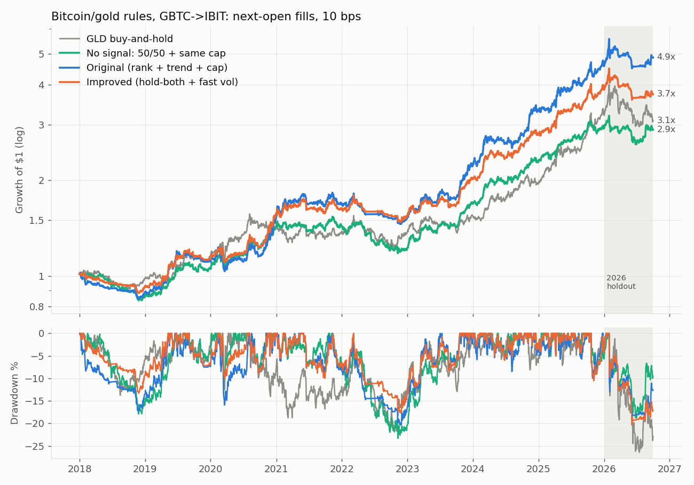
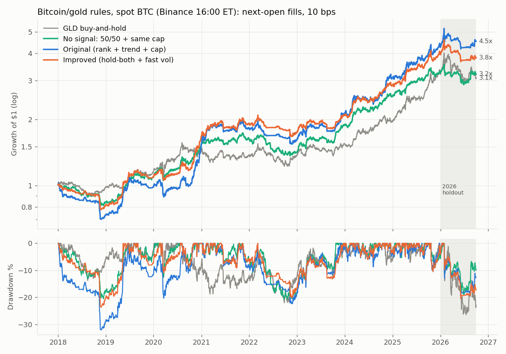

<!-- GENERATED FILE. EDIT THE CANONICAL KNOWLEDGE RECORD. -->

# GQResearch 'Dual Momentum Without the Dual' audit: Bitcoin/gold trend filter + per-asset 20% vol cap

!!! warning "Research-only"
    This page summarizes saved research evidence. It does not authorize LIVE, allocation, or deployment.

## TL;DR

> **Verdict:** DIAGNOSTIC - risk transformation, not alpha. The source reproduces closely (original 21.8%/1.34 raw/-19% vs 20.4%/1.28/-21%). Hold-both beats winner-take-all on 30-32 of 32 schedules in-sample but with lower CAGR (18.4% vs 21.0% executable) and only 55-80% bootstrap wins (claimed 96%); the faster vol estimator adds nothing. On spot BTC the original does not beat a static 50/50 with the same cap. The 'tighter cap is better' result is a raw-Sharpe artefact. In the Jan-Sep 2026 holdout the improved rule lost 3.1% while the original gained 6.6%. Pre-registered rule failed (a) and (b).

> **Status:** `diagnostic`

> **Disposition:** `rejected`

> **Replication:** `reproduced_with_material_caveats`

## Research question

Reproduce the article's Bitcoin/gold dual-momentum decomposition, test its 'improved' hold-both + max(21,63)d vol rule, and add the missing control: a static 50/50 with the same cap.

## Exact setup

| Field | Value |
| --- | --- |
| Signal family | cross_asset_absolute_momentum_vol_capped |
| Universe | ["BTC leg (GBTC->IBIT splice; Binance spot 16:00 ET), GLD, BIL cash"] |
| Decision | signal at Close_T on weekly Monday decision closes (32 schedules swept); vol cap recomputed every Close_T |
| Fill | Open_(T+1) primary; Close_(T+1) and paper Close_T as robustness |
| Primary cost layer | central_research |
| Last reviewed | 2026-10-01T00:00:00+03:00 |

## Timing and overnight attribution

```text
information available: signal at Close_T on weekly Monday decision closes (32 schedules swept); vol cap recomputed every Close_T
primary executable fill: Open_(T+1) primary; Close_(T+1) and paper Close_T as robustness
```

If final `Close_T` data formed the signal, a hypothetical `Close_T` entry is diagnostic only unless a separate pre-close protocol was modeled. Comparing that diagnostic with `Open_(T+1)` and applying the compounded return identity shows whether the apparent edge occurred in the overnight gap. Missing attribution numbers mean **not tested**, not zero.

| Attribution field | Value |
| --- | --- |
| Status | tested |
| Diagnostic Path | paper Close_T fills (article convention) |
| Executable Path | stateful daily engine, Open_(T+1), 10 bps per unit one-way turnover |
| Method | frozen spec v1, 866 engine runs, primary family H1-H6 paired block bootstrap with Holm |
| Headline Result | improved vs original P=0.55 (splice) / 0.80 (spot); improved vs static capped P=0.82 / 0.49 |
| Metrics | {"H2_p_a_gt_b_splice": 0.5501, "H5_p_a_gt_b_spot": 0.4931} |
| Unavailable Reason | N/A |
| Artifact | pakal-research/reports/gqr_dual_momentum_audit/tables/bootstrap_family.csv |

## Primary metrics

| Metric | Value |
| --- | ---: |
| Period | 2018-01-02..2025-12-31 |
| Universe | GBTC->IBIT, GLD, BIL; improved rule (hold-both 21/42/63, max(21,63)d vol, 20% per-asset cap) |
| Cost Layer | central_research (10 bps one-way) |
| Cagr | 18.42% |
| Annualized Volatility | 12.73% |
| Sharpe | 1.203 |
| Maximum Drawdown | -17.62% |
| Turnover | 945.32% |

## Four separate verdicts

| Question | Conclusion |
| --- | --- |
| Source Replication | reproduced (paper fills); vol estimator claim not reproduced |
| Predictive Value | trend filter reduces drawdown; incremental Sharpe over a capped static mix not significant |
| Economic Value | per-asset vol cap is the value; signal choice is noise-level |
| Promotion | none; optional shadow log of original / improved / static capped |

## Key findings

| Feature | Role | Direction | Status | Effect | Action |
| --- | --- | --- | --- | --- | --- |
| relative ranking between two assets | N/A | N/A | N/A | N/A | N/A |
| absolute 21/42/63d trend filter (hold-both) | N/A | N/A | N/A | N/A | N/A |
| per-asset 20% vol cap | N/A | N/A | N/A | N/A | N/A |
| max(21d,63d) vol estimator | N/A | N/A | N/A | N/A | N/A |
| raw Sharpe without risk-free | N/A | N/A | N/A | N/A | N/A |

## Visual evidence






## Limitations

- rebalance weekday, cap scope and lag unspecified by source
- fifth article rule row unreadable (assumed static 50/50)
- spot BTC is an index proxy before 2024
- holdout only 187 sessions
- taxes ignored

## Next gates

- optional monthly shadow log of original / improved / static capped through 2027

## Sources

- `GQResearch, Dual Momentum Without the Dual, Substack 2026-09-09`
- `Valuelytica, Golden Dual-Momentum Rotation`
- `Vojtko & Dujava, Quantpedia, Dual Momentum Allocation Between Physical Gold and Bitcoin`
- `pakal-research/reports/bitcoin_gold_dual_momentum_signal_study (prior internal study)`

## Canonical artifacts

| Artifact | Pakal path |
| --- | --- |
| Concise Report | `pakal-research/reports/gqr_dual_momentum_audit/REPORT.md` |
| Full Report | `pakal-research/reports/gqr_dual_momentum_audit/REPORT_FULL.md` |
| Notebook | `pakal-research/reports/gqr_dual_momentum_audit/gqr_dual_momentum_audit.ipynb` |
| Frozen Specification | `pakal-research/reports/gqr_dual_momentum_audit/research_spec_frozen.json` |
| Manifest | `pakal-research/reports/gqr_dual_momentum_audit/run_manifest.json` |
| Primary Source Code | `["pakal-research/gqr_dual_momentum_audit/gdm_data.py", "pakal-research/gqr_dual_momentum_audit/gdm_lib.py", "pakal-research/gqr_dual_momentum_audit/gdm_run.py", "pakal-research/gqr_dual_momentum_audit/gdm_charts.py", "pakal-research/gqr_dual_momentum_audit/test_gdm_timing.py", "pakal-research/gqr_dual_momentum_audit/gdm_build_artifacts.py"]` |
| Primary Tables | `["pakal-research/reports/gqr_dual_momentum_audit/tables/reproduction_paper.csv", "pakal-research/reports/gqr_dual_momentum_audit/tables/main_periods.csv", "pakal-research/reports/gqr_dual_momentum_audit/tables/bootstrap_family.csv", "pakal-research/reports/gqr_dual_momentum_audit/tables/schedule_sweep.csv", "pakal-research/reports/gqr_dual_momentum_audit/tables/cap_grid.csv"]` |
| Primary Charts | `["pakal-research/reports/gqr_dual_momentum_audit/charts/equity_drawdown_splice.png", "pakal-research/reports/gqr_dual_momentum_audit/charts/equity_drawdown_spot.png", "pakal-research/reports/gqr_dual_momentum_audit/charts/schedule_sweep.png", "pakal-research/reports/gqr_dual_momentum_audit/charts/cap_raw_vs_excess.png", "pakal-research/reports/gqr_dual_momentum_audit/charts/holdout_2026.png"]` |
