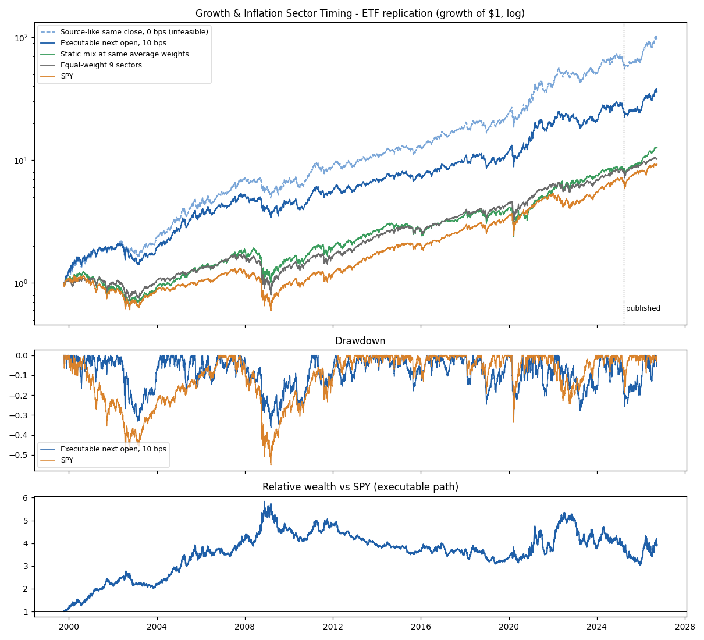
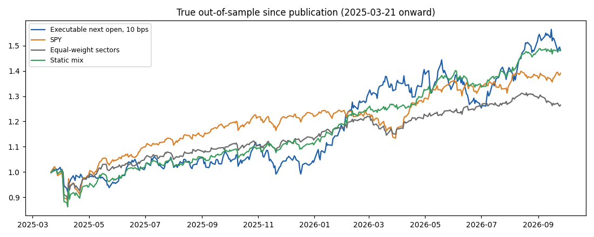

<!-- GENERATED FILE. EDIT THE CANONICAL KNOWLEDGE RECORD. -->

# Growth and Inflation Sector Timing Model (Varadi 2025) - replication, causal translation, long-history and selection-bias tests

!!! warning "Research-only"
    This page summarizes saved research evidence. It does not authorize LIVE, allocation, or deployment.

## TL;DR

> **Verdict:** Source-like path matches the article volatility and drawdown; the executable path beats SPY over 1999-2026 only because of 1999-2008 and has trailed SPY since Nov 2008. The literal map works on 1927-1989 French industries it never saw (p=0.005), but walk-forward map selection fails and the frozen G1 gate fails; diagnostic only.

> **Status:** `diagnostic`

> **Disposition:** `idea_partially_supported_published_version_overstated`

> **Replication:** `replicated`

## Research question

Determine whether the daily four-quadrant growth/inflation sector rotation reproduces, survives next-open execution and costs, and reflects a repeatable mechanism rather than an in-sample map choice.

## Exact setup

| Field | Value |
| --- | --- |
| Signal family | macro_regime_rotation |
| Universe | ["Fixed sector SPDRs XLB XLE XLF XLI XLK XLP XLU XLV XLY plus SPY (Norgate TR)", "Ken French 12 industries daily VW 1926-2026 (9 mapped)"] |
| Decision | After final daily Close_T (all trailing windows end at T) |
| Fill | Primary Open_T+1; diagnostic same Close_T; delay Close_T+1 |
| Primary cost layer | central_research |
| Last reviewed | 2026-09-28T12:02:54+00:00 |

## Timing and overnight attribution

```text
information available: After final daily Close_T (all trailing windows end at T)
primary executable fill: Primary Open_T+1; diagnostic same Close_T; delay Close_T+1
```

If final `Close_T` data formed the signal, a hypothetical `Close_T` entry is diagnostic only unless a separate pre-close protocol was modeled. Comparing that diagnostic with `Open_(T+1)` and applying the compounded return identity shows whether the apparent edge occurred in the overnight gap. Missing attribution numbers mean **not tested**, not zero.

| Attribution field | Value |
| --- | --- |
| Status | completed |
| Diagnostic Path | Close_T same-close fill, 0 bps |
| Executable Path | Open_T+1 stateful, 0/10/20/25 bps |
| Method | Two independent engines (vectorised and stateful) agree exactly |
| Headline Result | Same close -> next open costs 2.2 CAGR points at 0 bps (18.5% -> 16.3%); 10 bps round trip costs ~2 more points at 17.3 switches/year |
| Metrics | {"diagnostic_CAGR": 0.1853780385725587, "next_close_10bps_CAGR": 0.1426949798207157, "next_open_0bps_CAGR": 0.1625397051366837, "next_open_10bps_CAGR": 0.1425704997431893} |
| Unavailable Reason | N/A |
| Artifact | pakal-research/reports/growth_inflation_sector_timing_study/tables/performance_by_period.csv |

## Primary metrics

| Metric | Value |
| --- | ---: |
| Period | 1999-10-11 through 2026-09-25 |
| Universe | Sector SPDRs, one-at-a-time |
| Cost Layer | central_research_10bps_round_trip |
| Cagr | 14.26% |
| Annualized Volatility | 21.04% |
| Sharpe | 0.739 |
| Maximum Drawdown | -36.38% |
| Turnover | N/A |

## Four separate verdicts

| Question | Conclusion |
| --- | --- |
| Source Replication | replicated (same-close vol 20.9% vs 20.8%, max DD -32.6% vs -32.6%; CAGR 18.2% vs 21.6% because 1990s proxy years unavailable) |
| Predictive Value | Regime timing is non-random (circular-shift p 0.001 ETF, 0.005 French pre-1990); sector-implied inflation indicator is mostly coincident with a small post-hoc CPI lead |
| Economic Value | Executable 10 bps CAGR 14.3% / Sharpe 0.74 vs SPY 8.6% / 0.53, but since 2008 Sharpe 0.60 vs 0.64 |
| Promotion | no-go: G1 (1/3 subperiods) and G4 (walk-forward map selection) failed |

## Key findings

| Feature | Role | Direction | Status | Effect | Action |
| --- | --- | --- | --- | --- | --- |
| GIST-01 sector-implied inflation ratio vs 200d median | signal | positive/negative inflation-beta sector baskets | diagnostic | CPI next-3m HAC t 3.1 raw, 2.9 after controlling prior CPI change (post-hoc); no breakeven lead | treat as coincident inflation gauge, not a forecast |
| GIST-02 literal four-quadrant daily map | portfolio_construction | XLE/XLK/XLV/XLP | diagnostic | 14.3% CAGR, Sharpe 0.74 vs SPY 0.53 (10 bps next open) | no trading; optional frozen shadow |
| GIST-03 literal map on French 1927-1989 | out_of_sample_test | same map, industry proxies, 1-day delay | supportive | Sharpe 0.77 vs market 0.61 | cite as the main evidence for the concept |
| GIST-04 walk-forward map selection | process_test | yearly argmax conditional mean | rejected | Sharpe 0.73 vs market 0.78 (1940-2026) | do not auto-select sectors per regime |
| GIST-05 lower evaluation frequency | turnover_control | month-end/weekly/confirm/hysteresis | promising_component | month-end Sharpe 0.82 with 3.7 switches/yr | if shadowed, include month-end unchanged |

## Visual evidence






## Limitations

- 1990-1998 source proxy years not reproducible
- French industries are non-tradable proxies without opens
- all ETF windows to 2024 are source-exposed; only 18 post-publication months are new
- current-vintage FRED
- Sharpe without risk-free deduction
- one labelled post-hoc regression

## Next gates

- frozen shadow of daily and month-end variants without parameter changes
- opening-auction liquidity data
- transfer to non-US sector universes (e.g. MSCI Europe sectors)

## Sources

- `https://cssanalytics.wordpress.com/2025/03/20/the-growth-and-inflation-sector-timing-model/`
- `https://allocatesmartly.com/david-varadis-growth-and-inflation-sector-timing-a-wildcard-strategy/`
- `Kenneth R. French data library (12 industry portfolios daily; F-F factors daily)`

## Canonical artifacts

| Artifact | Pakal path |
| --- | --- |
| Concise Report | `pakal-research/reports/growth_inflation_sector_timing_study/REPORT.md` |
| Full Report | `pakal-research/reports/growth_inflation_sector_timing_study/REPORT_FULL.md` |
| Notebook | `pakal-research/growth_inflation_sector_timing_study.ipynb` |
| Frozen Specification | `pakal-research/reports/growth_inflation_sector_timing_study/research_spec_frozen.json` |
| Manifest | `pakal-research/reports/growth_inflation_sector_timing_study/run_manifest.json` |
| Primary Source Code | `["pakal-research/growth_inflation_sector_timing_study.py", "tests/test_growth_inflation_sector_timing_study.py"]` |
| Primary Tables | `["pakal-research/reports/growth_inflation_sector_timing_study/tables/performance_by_period.csv", "pakal-research/reports/growth_inflation_sector_timing_study/tables/french_performance_by_period.csv", "pakal-research/reports/growth_inflation_sector_timing_study/tables/map_search_summary.csv", "pakal-research/reports/growth_inflation_sector_timing_study/tables/circular_shift_null.csv", "pakal-research/reports/growth_inflation_sector_timing_study/tables/leading_indicator_tests.csv", "pakal-research/reports/growth_inflation_sector_timing_study/tables/promotion_gate.csv"]` |
| Primary Charts | `["pakal-research/reports/growth_inflation_sector_timing_study/charts/equity_drawdown_relative.png", "pakal-research/reports/growth_inflation_sector_timing_study/charts/french_long_history.png", "pakal-research/reports/growth_inflation_sector_timing_study/charts/selection_bias_controls.png", "pakal-research/reports/growth_inflation_sector_timing_study/charts/robustness_variants.png", "pakal-research/reports/growth_inflation_sector_timing_study/charts/regime_conditional_heatmaps.png", "pakal-research/reports/growth_inflation_sector_timing_study/charts/post_publication_oos.png"]` |
| Research State | `pakal-research/reports/growth_inflation_sector_timing_study/research_state.json` |
| Hypothesis Registry | `pakal-research/reports/growth_inflation_sector_timing_study/hypothesis_registry.json` |
| Experiment Ledger | `pakal-research/reports/growth_inflation_sector_timing_study/experiment_ledger.jsonl` |
| Decision Log | `pakal-research/reports/growth_inflation_sector_timing_study/decision_log.jsonl` |
| Source Rule Map | `pakal-research/reports/growth_inflation_sector_timing_study/SOURCE_RULE_MAP.md` |
