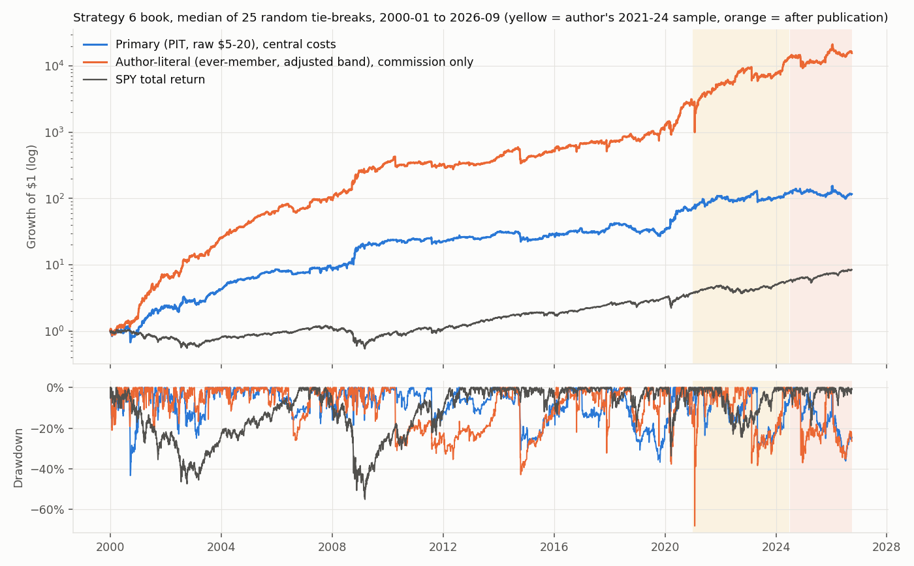
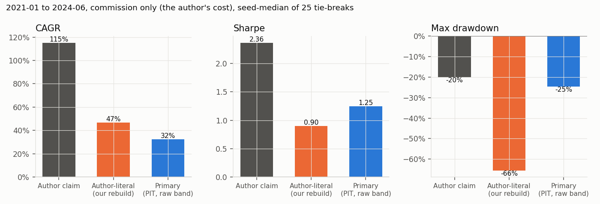

<!-- GENERATED FILE. EDIT THE CANONICAL KNOWLEDGE RECORD. -->

# Hunt Gather Trade Strategy 6 ATR mean-reversion audit

!!! warning "Research-only"
    This page summarizes saved research evidence. It does not authorize LIVE, allocation, or deployment.

## TL;DR

> **Verdict:** Claim not reproduced. The combined book earned nothing after publication (central Sharpe -0.10, CAGR -6%) and 67% of its 2000-2026 growth came from 2000-2010. The long side is simply buying volatile dips with a deep limit; the oversold condition adds nothing (t -0.45). The short side - sell into a second-day spike of an already overbought $5-20 stock and cover at the next open - is a real intraday fade (+1.6 pp per trade vs a same-day control, t 6.8, positive in every slice), but it is small (~4% average exposure), depends on fills near the day's high, loses strength on a broader look-ahead-free universe and carries squeeze trades of -90% to -170%. Do not trade the book; keep the short-side fade as a forward hypothesis.

> **Status:** `diagnostic`

> **Disposition:** `diagnostic`

> **Replication:** `not_reproducible`

## Research question

Determine whether the Hunt Gather Trade Strategy 6 ATR mean-reversion book ($5-20 US stocks, ATR5 > 5%, close beyond Min/Max(Open, prior close, EMA5) by an ATR multiple, ATR-offset day-limit entry, ATR target, turnover and time exits, 4 long x 15% plus 2 short x 20%) reproduces its 2021-2024 claim (115%/yr, Sharpe 2.36, MaxDD -20%), whether the signal adds return beyond the limit-order mechanics, and whether it held on unseen 2000-2020 history and after publication.

## Exact setup

| Field | Value |
| --- | --- |
| Signal family | short_term_atr_mean_reversion |
| Universe | ["Russell 3000 Current & Past with point-in-time membership on Close_T (Norgate), raw close $5-20 (primary)", "Same symbols, ever-member, adjusted-close band (author-literal variant)"] |
| Decision | Close_T |
| Fill | day limit during T+1 (C_T -/+ k*ATR5_T, 0.1% of C_T penetration); exit rule at each close -> next open; ATR target limit from the bar after entry |
| Primary cost layer | central_research |
| Last reviewed | 2026-09-28T21:05:00+00:00 |

## Timing and overnight attribution

```text
information available: Close_T
primary executable fill: day limit during T+1 (C_T -/+ k*ATR5_T, 0.1% of C_T penetration); exit rule at each close -> next open; ATR target limit from the bar after entry
```

If final `Close_T` data formed the signal, a hypothetical `Close_T` entry is diagnostic only unless a separate pre-close protocol was modeled. Comparing that diagnostic with `Open_(T+1)` and applying the compounded return identity shows whether the apparent edge occurred in the overnight gap. Missing attribution numbers mean **not tested**, not zero.

| Attribution field | Value |
| --- | --- |
| Status | tested |
| Diagnostic Path | Close_T (signal close) to the declared exit |
| Executable Path | limit fill during T+1 to the same exit |
| Method | Per-trade decomposition: signal close -> fill, fill -> entry-day close, entry close -> next open; signal vs same-day limit-only control fills |
| Headline Result | Short fills sit 16% above the signal close; the edge accrues from the fill to the entry-day close (+1.7 pp) and not overnight (-0.06 pp). Long fills earn +0.8 pp fill-to-close and +0.35 pp overnight, the same as control fills in shape. |
| Metrics | {"long_signal_entry_close_to_next_open_pp": 0.35, "long_signal_fill_to_entry_close_pp": 0.819, "long_trade_gross_pp": 1.369, "short_signal_entry_close_to_next_open_pp": -0.062, "short_signal_fill_to_entry_close_pp": 1.664, "short_trade_gross_pp": 2.115} |
| Unavailable Reason | N/A |
| Artifact | pakal-research/reports/hgt_strategy6_atr_mean_reversion_audit/tables/trade_return_decomposition.csv |

## Primary metrics

| Metric | Value |
| --- | ---: |
| Period | 2000-01-03 to 2026-09-25 |
| Universe | Russell 3000 PIT, raw $5-20 |
| Cost Layer | central_research (commission $0.005/share + 10 bps per side + 10% annual short borrow) |
| Cagr | 19.00% |
| Annualized Volatility | 24.50% |
| Sharpe | 0.841 |
| Maximum Drawdown | -40.70% |
| Turnover | about 196 trades a year, 1.7-session average hold, 20% average gross exposure |

## Four separate verdicts

| Question | Conclusion |
| --- | --- |
| Source Replication | not_reproducible: author-literal (ever-member, adjusted $5-20 band, commission only) 2021-01..2024-06 seed-median CAGR 46.7%, Sharpe 0.90 (p10 -0.29), MaxDD -65.5% vs 115% / 2.36 / -20%. Primary PIT/raw 32.2% / 1.25 / -24.6%. No neighborhood setting reaches the claimed Sharpe; the expected best of 100,000 tries is 1.91. |
| Predictive Value | Long oversold condition: no value beyond the limit (signal minus control -0.06 pp, HAC t -0.45, BH q 0.65). Short overbought condition: +1.57 pp per trade, t 6.8, BH q < 1e-6; 2000-10 +1.2, 2011-20 +2.0, 2021-24 +2.0, post-publication +1.5 pp (t 1.8). |
| Economic Value | Combined primary at central costs: 2000-26 CAGR 19.0%, Sharpe 0.84, MaxDD -40.7%; post-publication -6.4% / -0.10. Short-only anchor book at central costs: 11.2% / 0.92 / -25.5% full, 6.7% / 0.47 after publication, 0.33 at 50% borrow, 0.40 at 1% fill penetration. |
| Promotion | Fails the frozen promotion rule (post-publication central Sharpe >= 0.8 required). Diagnostic. The short-side fade is recorded as a forward hypothesis only; no capital. |

## Key findings

| Feature | Role | Direction | Status | Effect | Action |
| --- | --- | --- | --- | --- | --- |
| close below Min(Open, prior close, EMA5) - 0.75*ATR5 (oversold) | entry signal (long) | none beyond the limit mechanics | rejected | -0.06 pp per trade vs same-day limit-only control | do not use |
| close above Max(Open, prior close, EMA5) + 1.0*ATR5, then short at C + 2*ATR5 next day (overbought spike fade) | entry signal (short) | second-day spike fades by the close | forward_hypothesis | +1.57 pp per trade vs control; short-only book Sharpe 0.92 full, 0.47 after publication (central) | freeze_as_forward_hypothesis; any live test needs real limit orders, locate checks and a squeeze stop |
| ATR-offset day limit entry | entry execution | fills near intraday extremes | diagnostic | short book full Sharpe 0.92 -> 0.61 -> 0.38 at 0.1% -> 1% -> 2% required penetration | always stress penetration depth for limit books on small caps |
| ever-member universe and split-adjusted price band | universe | look-ahead / construction bias | diagnostic | adjusted band admits stocks trading at $1-2 or $65 raw (GME, AMC Jan 2021 shorts: -174%, -154%); ever-member adds 24-54% of fills including future members | use raw price bands and point-in-time membership |

## Visual evidence






## Limitations

- Russell 3000 PIT is a proxy for the author's S&P 500 + Russell 2000 + NDX lists.
- RealTest conventions (BarsHeld base, same-bar exits, tie order, missing MaxPositions) are undocumented; variants and 25 random tie-breaks bound them.
- Daily bars cannot show queue position; limit fills at intraday extremes are optimistic even with 0.1% penetration.
- Borrow availability is not observable; fees are stressed, locates are not.
- No author equity series; only headline metrics compared.
- The short-side robustness checks (H5) were run after seeing all periods.

## Next gates

- Only if the user asks: paper-test the short fade with real day-limit orders and locate checks, logging fill rate at the limit vs the daily high and borrow availability, before any capital.
- Test a squeeze stop and a stricter liquidity floor on the short leg on future data only.

## Sources

- `https://newsletter.huntgathertrade.com/p/strategy-6-a-lean-mean-reverting (sha256 46134ad4b90733d5acb5b46cc072fd1af8db26c8a909733150df69dbc21d22b7)`

## Canonical artifacts

| Artifact | Pakal path |
| --- | --- |
| Concise Report | `pakal-research/reports/hgt_strategy6_atr_mean_reversion_audit/REPORT.md` |
| Full Report | `pakal-research/reports/hgt_strategy6_atr_mean_reversion_audit/REPORT_FULL.md` |
| Notebook | `pakal-research/hgt_strategy6_atr_mean_reversion_audit.ipynb` |
| Frozen Specification | `pakal-research/reports/hgt_strategy6_atr_mean_reversion_audit/research_spec_frozen.json` |
| Manifest | `pakal-research/reports/hgt_strategy6_atr_mean_reversion_audit/run_manifest.json` |
| Primary Source Code | `["pakal-research/hgt_strategy6_audit.py", "pakal-research/hgt_strategy6_run.py", "pakal-research/hgt_strategy6_posthoc.py"]` |
| Primary Tables | `["pakal-research/reports/hgt_strategy6_atr_mean_reversion_audit/tables/combined_variant_period_summary.csv", "pakal-research/reports/hgt_strategy6_atr_mean_reversion_audit/tables/side_family_period_summary.csv", "pakal-research/reports/hgt_strategy6_atr_mean_reversion_audit/tables/event_mechanism_tests.csv", "pakal-research/reports/hgt_strategy6_atr_mean_reversion_audit/tables/posthoc_short_books.csv"]` |
| Primary Charts | `["pakal-research/reports/hgt_strategy6_atr_mean_reversion_audit/charts/equity_drawdown.png", "pakal-research/reports/hgt_strategy6_atr_mean_reversion_audit/charts/claim_vs_reproduction.png", "pakal-research/reports/hgt_strategy6_atr_mean_reversion_audit/charts/signal_minus_control_by_year.png", "pakal-research/reports/hgt_strategy6_atr_mean_reversion_audit/charts/short_side_realism.png"]` |
| Research State | `pakal-research/reports/hgt_strategy6_atr_mean_reversion_audit/research_state.json` |
| Hypothesis Registry | `pakal-research/reports/hgt_strategy6_atr_mean_reversion_audit/hypothesis_registry.json` |
| Experiment Ledger | `pakal-research/reports/hgt_strategy6_atr_mean_reversion_audit/experiment_ledger.jsonl` |
| Decision Log | `pakal-research/reports/hgt_strategy6_atr_mean_reversion_audit/decision_log.jsonl` |
| Source Rule Map | `pakal-research/reports/hgt_strategy6_atr_mean_reversion_audit/SOURCE_RULE_MAP.md` |
